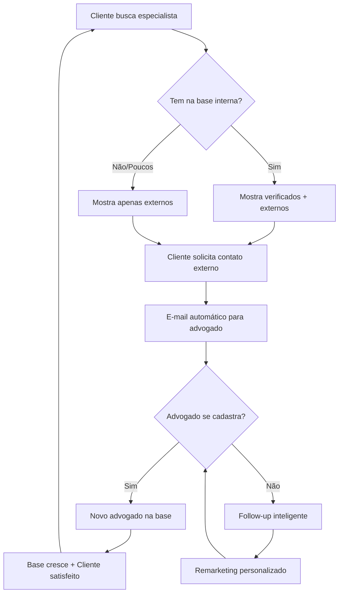

# PLANO DE CRESCIMENTO: AQUISIÇÃO E CONVERSÃO DE CLIENTES (PF & PJ)

## 🔍 **VERIFICAÇÃO DO ESTADO ATUAL (Princípio da Verificação)**

Durante a análise do código, foi identificado o estado atual da busca de advogados por clientes:

### **✅ IMPLEMENTADO:**
- **Backend:** Endpoint `/api/match` robusto com algoritmo híbrido (Escavador + JusBrasil)
- **Frontend:** Fluxo completo em `LawyersRepositoryImpl` → `LawyersRemoteDataSourceImpl` 
- **Algoritmo:** `algoritmo_match.py` v2.10-iep com IEP já integrado e 12 features de matching
- **Features Avançadas:** A/B Testing, cache Redis, dados híbridos, explicabilidade

### **❌ NÃO IMPLEMENTADO:**
- **Busca Externa:** `ExternalProfileEnrichmentService` existe mas está vazio
- **UI Diferenciada:** Cards únicos para perfis públicos vs verificados
- **Motor de Aquisição:** Sistema de convites via e-mail para advogados externos
- **Busca Híbrida:** Capacidade de mesclar resultados internos + externos

## 🎯 **VISÃO ESTRATÉGICA: De Marketplace Fechado a Ferramenta de Descoberta Jurídica**

**Objetivo:** Transformar a LITIG de um diretório limitado para **a ferramenta mais completa do mercado** para encontrar especialistas jurídicos, criando um **motor de aquisição viral** que beneficia tanto clientes quanto advogados.

### **Proposta de Valor Diferenciada:**

| Aspecto | 🔒 Marketplace Tradicional | 🚀 LITIG Híbrida |
|---------|---------------------------|-------------------|
| **Cobertura** | Apenas membros cadastrados | Todos os especialistas do mercado |
| **Experiência** | "Não encontrei ninguém" | "Sempre encontro o especialista ideal" |
| **Aquisição** | Marketing tradicional | Motor viral: cada busca gera novos usuários |
| **Valor** | Limitado ao inventário | Ilimitado + diferenciação clara de qualidade |

---

## 📊 **ARQUITETURA DE BUSCA: SISTEMA HÍBRIDO EM TRÊS CAMADAS**

### **Camada 1: Busca Interna (Existente - Funcional)**
- **Algoritmo:** `algoritmo_match.py` com 12 features (A, S, T, G, Q, U, R, C, E, P, M, I)
- **Fonte:** Base de advogados verificados na plataforma
- **Qualidade:** Dados reais, KPIs precisos, total confiabilidade

### **Camada 2: Busca Externa (NOVA - A implementar)**
- **Algoritmo:** `ExternalProfileEnrichmentService` + Web Search via LLM
- **Fonte:** Perfis públicos (LinkedIn, sites de escritórios, diretórios)
- **Qualidade:** Dados inferidos, scores estimados, transparência sobre limitações

### **Camada 3: Fusão Inteligente (NOVA - A implementar)**
- **Algoritmo:** Mesclagem que prioriza membros verificados
- **UI:** Diferenciação visual clara entre os dois tipos
- **CTA:** Botões de ação diferentes para cada categoria

---

## 🚀 **FASES DE IMPLEMENTAÇÃO**

### **FASE 1: EXTENSÃO DO BACKEND PARA BUSCA HÍBRIDA**

**Objetivo:** Habilitar a busca externa mantendo 100% de compatibilidade com o sistema atual.

#### **Tarefas - Backend:**

1. **✅ REUTILIZAR:** Endpoint `/api/match` existente
   - Adicionar parâmetro opcional `expand_search: bool = False`
   - Padrão `False` garante compatibilidade total com app atual
   - Quando `True`, ativa busca híbrida

2. **🔧 IMPLEMENTAR:** `ExternalProfileEnrichmentService`
   ```python
   # packages/backend/services/external_profile_enrichment_service.py
   class ExternalProfileEnrichmentService:
       async def search_public_profiles(self, case_area: str, location: tuple, limit: int = 5):
           """Busca perfis públicos usando LLM + Web Search"""
           # Usar OpenRouter com web search habilitado
           # Retornar estrutura similar aos advogados internos
           # Marcar com is_external=True
   ```

3. **🔧 ADAPTAR:** `algoritmo_match.py`
   - Modificar método `rank()` para aceitar `expand_search`
   - Se `expand_search=True` e resultados < top_n:
     - Invocar `ExternalProfileEnrichmentService`
     - Mesclar resultados (internos primeiro)
     - Aplicar features compatíveis (A, G, Q inferido)

4. **🔧 ESTENDER:** Schemas de resposta
   - Adicionar campo `is_external: bool` em `MatchedLawyerSchema`
   - Manter total compatibilidade com campos existentes

#### **Tarefas - Frontend:**

1. **🔧 MODIFICAR:** `LawyersRemoteDataSourceImpl`
   - Adicionar parâmetro `expandSearch: true` no POST para `/api/match`
   - Manter compatibilidade com chamadas existentes

2. **🔧 ATUALIZAR:** Entidade `MatchedLawyer`
   - Adicionar campo `final bool isExternal`
   - Atualizar factory methods para processar novos dados

**✅ Critério de Conclusão:** API retorna lista mesclada quando `expand_search=true`, app processa sem quebrar.

---

### **FASE 2: UI DIFERENCIADA E MOTOR DE AQUISIÇÃO**

**Objetivo:** Criar experiência que valoriza membros verificados e transforma busca externa em aquisição de advogados.

#### **Estratégia Visual: Contraste Intencional**

| Elemento | ✅ Advogado Verificado LITIG | 🌐 Perfil Público Sugerido |
|----------|------------------------------|---------------------------|
| **Selo** | "Verificado LITIG" + escudo | "Perfil Público" + ícone globo |
| **Dados** | KPIs completos, reviews, tempo resposta | Informações básicas da web |
| **Confiança** | "Dados validados pela LITIG" | "Coletado da web. Não verificado." |
| **Botão Principal** | `[ Contratar via LITIG ]` (primário) | `[ Solicitar Contato ]` (secundário) |
| **Score** | Score completo (ex: 87%) | "Score não disponível" |

#### **Tarefas - Frontend:**

1. **🎨 CRIAR:** `PublicProfileCard`
   ```dart
   // apps/app_flutter/lib/src/features/lawyers/presentation/widgets/public_profile_card.dart
   class PublicProfileCard extends StatelessWidget {
     final MatchedLawyer lawyer;
     final VoidCallback onRequestContact;
     
     // Design diferenciado: cores mais neutras, iconografia externa
     // Caixa de alerta sobre limitações
     // CTA secundário para contato
   }
   ```

2. **🔧 ADAPTAR:** Tela de resultados
   - Renderização condicional baseada em `lawyer.isExternal`
   - Se `false`: card verificado existente
   - Se `true`: novo `PublicProfileCard`

3. **💬 CRIAR:** `ContactRequestModal` com Gestão de Fallbacks
   ```dart
   // apps/app_flutter/lib/src/features/lawyers/presentation/widgets/contact_request_modal.dart
   class ContactRequestModal extends StatelessWidget {
     final MatchedLawyer lawyer;
     final Function(ContactRequestResult) onResult;
     
     // Cenário A: E-mail enviado com sucesso
     Widget _buildSuccessMessage() => Column(children: [
       Icon(Icons.check_circle, color: Colors.green),
       Text("✅ Notificamos Dr(a). ${lawyer.name} por e-mail"),
       Text("Você será avisado quando ele(a) responder."),
       ElevatedButton(
         child: Text("Entendi"),
         onPressed: () => Navigator.pop(context)
       )
     ]);
     
     // Cenário B: Fallback LinkedIn
     Widget _buildLinkedInFallback(String message, String profileUrl) => Column(children: [
       Icon(Icons.linkedin, color: Colors.blue),
       Text("📱 Conecte-se no LinkedIn!"),
       Text("Para maior eficácia, envie você mesmo:"),
       Container(
         padding: EdgeInsets.all(12),
         decoration: BoxDecoration(border: Border.all()),
         child: SelectableText(message)
       ),
       Row(children: [
         ElevatedButton.icon(
           icon: Icon(Icons.copy),
           label: Text("Copiar Mensagem"),
           onPressed: () => Clipboard.setData(ClipboardData(text: message))
         ),
         OutlinedButton.icon(
           icon: Icon(Icons.open_in_new),
           label: Text("Abrir LinkedIn"),
           onPressed: () => _openLinkedIn(profileUrl)
         )
       ])
     ]);
     
     // Cenário C: Sem contato encontrado
     Widget _buildNoContactFallback() => Column(children: [
       Icon(Icons.warning, color: Colors.orange),
       Text("⚠️ Não foi possível encontrar contato público"),
       Text("Para conexão garantida, escolha um Advogado Verificado:"),
       ElevatedButton(
         child: Text("Ver Advogados Verificados"),
         onPressed: () => _showVerifiedLawyers()
       )
     ]);
   }
   ```

#### **Tarefas - Backend:**

1. **📧 IMPLEMENTAR:** `InvitationService` para Clientes com Fallback Multi-Canal
   ```python
   # packages/backend/services/client_invitation_service.py
   class ClientInvitationService:
       async def send_client_lead_notification(self, target_profile: dict, case_info: dict, client_info: dict):
           """
           Envia notificação para advogado não cadastrado usando hierarquia de canais:
           1. E-mail da plataforma (primário)
           2. LinkedIn assistido (fallback)
           3. Orientação para verificados (último fallback)
           """
           # 1. Gerar token único de convite
           invitation = await self.invitation_repo.create_pending_invitation(
               target_name=target_profile['name'],
               client_id=client_info['id'],
               case_summary=case_info['summary']
           )
           claim_url = f"https://app.litig.com/claim-profile?token={invitation.token}"
           
           # 2. CANAL PRIMÁRIO: E-mail da plataforma
           if target_profile.get('email'):
               try:
                   email_subject, email_body = self._build_client_lead_email(
                       target_profile, case_info, claim_url
                   )
                   await self.email_service.send_from_platform(
                       to=target_profile['email'],
                       subject=email_subject,
                       body=email_body
                   )
                   await self.invitation_repo.update_status(invitation.id, 'sent_platform_email')
                   return {"status": "success", "channel": "platform_email"}
                   
               except Exception as e:
                   logger.warning(f"E-mail fallido para {target_profile['name']}: {e}")
                   await self.invitation_repo.update_status(invitation.id, 'failed_email')
           
           # 3. FALLBACK: LinkedIn Assistido
           if target_profile.get('linkedin_url'):
               linkedin_message = self._build_linkedin_client_message(
                   target_profile, case_info, client_info, claim_url
               )
               await self.invitation_repo.update_status(invitation.id, 'linkedin_assisted')
               return {
                   "status": "fallback",
                   "channel": "linkedin_assisted",
                   "linkedin_message": linkedin_message,
                   "linkedin_profile_url": target_profile['linkedin_url']
               }
           
           # 4. ÚLTIMO FALLBACK: Nenhum método encontrado
           await self.invitation_repo.update_status(invitation.id, 'no_contact_method')
           return {
               "status": "failed", 
               "channel": "none", 
               "reason": "No public contact method found"
           }
   ```

2. **🔗 CRIAR:** Endpoints de convite
   - `POST /v1/invites/client-request`: Inicia processo de convite
   - `GET /v1/invites/{token}/claim`: Landing page para advogado
   - `POST /v1/invites/{token}/accept`: Finaliza cadastro + aceita caso

3. **📝 CRIAR:** Tabela `client_invitations`
   ```sql
   CREATE TABLE client_invitations (
       id UUID PRIMARY KEY,
       client_id UUID REFERENCES users(id),
       target_name VARCHAR(255),
       target_email VARCHAR(255),
       case_summary TEXT,
       token VARCHAR(64) UNIQUE,
       status VARCHAR(20) DEFAULT 'pending',
       created_at TIMESTAMP DEFAULT NOW(),
       expires_at TIMESTAMP
   );
   ```

#### **Estratégia de Canal: Hierarquia Multi-Canal com Fallback**

**Para Contexto `client_case` (Cliente → Advogado):**

**🏆 Canal Primário:** E-mail da plataforma (`oportunidades@litig.com`)

**Justificativa:**
- ✅ **Profissional:** Adequado para comunicação de negócios
- ✅ **Escalável:** Milhares de convites sem limitações
- ✅ **Proteção da Marca:** LinkedIn corporativo preservado
- ✅ **Compliance:** Sem violação de termos de serviço

**🔄 Canal de Fallback:** LinkedIn Assistido (Notificação manual pelo cliente)

**Justificativa:**
- ✅ **Pessoal:** Mensagem vem do próprio cliente (maior credibilidade)
- ✅ **Seguro:** Zero risco para conta LinkedIn da LITIG
- ✅ **Eficaz:** Taxa de resposta mais alta em contatos pessoais
- ✅ **Flexível:** Cliente pode personalizar a mensagem

**⚠️ Último Fallback:** Orientação para Advogados Verificados

**Justificativa:**
- ✅ **Conversão:** Direciona para membros pagantes da plataforma
- ✅ **Experiência:** Garante que cliente sempre tenha uma opção
- ✅ **Valor:** Reforça diferenciação da rede verificada

#### **Templates e Mensagens por Canal:**

**📧 Canal Primário - E-mail da Plataforma:**
```
Assunto: Nova oportunidade de caso jurídico - LITIG

Prezado(a) Dr(a). [Nome],

Seu perfil foi identificado como altamente compatível para atender um cliente em nossa plataforma.

📋 Detalhes da Oportunidade:
• Área: [Direito Tributário]
• Localização: [São Paulo, SP]
• Complexidade: [Média]
• Cliente: Empresa de médio porte

Para ver os detalhes completos e demonstrar interesse, reivindique seu perfil gratuitamente:

[ Reivindicar Perfil e Ver Caso ] → [link único]

Ao se juntar à LITIG, você acessa:
✓ Novos clientes qualificados
✓ Gestão completa de casos
✓ Pagamentos seguros
✓ Ferramentas jurídicas avançadas

Atenciosamente,
Equipe LITIG
```

**💼 Canal de Fallback - LinkedIn Assistido:**
```
Template para o Cliente Copiar:

"Olá, Dr(a). [Nome do Advogado],

Encontrei seu perfil através da plataforma LITIG e acredito que sua expertise em [Área] seria ideal para meu caso.

A plataforma me recomendou você como altamente compatível. Se tiver interesse em saber mais detalhes, pode acessar através deste link:

[Link único do convite]

Fico no aguardo!

Atenciosamente,
[Nome do Cliente]"
```

**⚠️ Último Fallback - Mensagem de Orientação:**
```
UI Message:
"Não foi possível encontrar um contato público para Dr(a). [Nome].

Para uma conexão garantida e segura, recomendamos escolher um de nossos Advogados Verificados que podem responder imediatamente.

[Ver Advogados Verificados] [Tentar Outro Perfil]"
```

**✅ Critério de Conclusão:** Cliente vê lista diferenciada, pode solicitar contato, e-mail é enviado automaticamente.

---

### **FASE 3: OTIMIZAÇÃO DO ENGAJAMENTO E CONVERSÃO**

**Objetivo:** Refinar sistema para maximizar conversão e criar ciclo de feedback positivo.

#### **Tarefas - Backend:**

1. **✅ VERIFICADO:** IEP já implementado
   - Job `calculate_engagement_scores.py` existe
   - Feature I integrada no `algoritmo_match.py`
   - Coluna `interaction_score` funcional

2. **📊 IMPLEMENTAR:** Analytics de Conversão
   ```python
   # packages/backend/jobs/client_invitation_analytics.py
   class ClientInvitationAnalytics:
       def calculate_conversion_rates(self):
           """Calcula taxas de conversão por área, região, tipo de caso"""
       
       def identify_high_converting_sources(self):
           """Identifica fontes externas com maior taxa de cadastro"""
   ```

3. **🎯 OTIMIZAR:** Algoritmo de Busca Externa
   - Priorizar perfis com maior probabilidade de conversão
   - Usar dados históricos para melhorar targeting
   - Implementar scoring de "propensão ao cadastro"

#### **Tarefas - Frontend:**

1. **⭐ GAMIFICAR:** Selos de Engajamento
   ```dart
   // No card de membro verificado
   if (lawyer.interactionScore > 0.85) {
     Widget engagementBadge = Container(
       child: Row(children: [
         Icon(Icons.star, color: Colors.gold),
         Text("Membro Engajado")
       ])
     );
   }
   ```

2. **🎁 ONBOARDING:** Fluxo especial para convidados
   - Landing page personalizada com detalhes do caso
   - "Você foi recomendado para este caso específico"
   - Cadastro simplificado + aceite imediato do caso
   - Welcome screen com benefícios desbloqueados

**✅ Critério de Conclusão:** Sistema completo de aquisição viral funcionando com métricas de conversão.

---

## 💰 **MODELO DE NEGÓCIO E MONETIZAÇÃO**

### **Estratégia Freemium Inteligente**

| Recurso | 👤 Cliente Básico | 🏢 Cliente Premium | 🎖️ Cliente Enterprise |
|---------|-------------------|-------------------|----------------------|
| **Busca Híbrida** | ✅ 2 buscas/mês | ✅ 10 buscas/mês | ✅ Ilimitado |
| **Advogados Internos** | ✅ Até 3 opções | ✅ Até 10 opções | ✅ Ilimitado |
| **Solicitar Contato** | ✅ 1 por mês | ✅ 5 por mês | ✅ Ilimitado |
| **Suporte Priority** | ❌ | ✅ Chat prioritário | ✅ Gerente dedicado |
| **Analytics de Caso** | ❌ | ✅ Básico | ✅ Completo + Insights |
| **Gestão Multiusuário** | ❌ | ❌ | ✅ Equipes + Workflows |

### **Motor de Aquisição Viral: Ciclo Virtuoso**



### **Métricas de Sucesso**

#### **KPIs de Produto:**
- **Taxa de Expansão:** % clientes que usam busca híbrida
- **Taxa de Solicitação:** % perfis externos que recebem contato
- **Taxa de Conversão:** % convites que viram cadastros
- **Satisfação do Cliente:** NPS específico para busca híbrida
- **Tempo de Resolução:** Tempo médio até encontrar advogado adequado

#### **KPIs de Fallback (Multi-Canal):**
- **Taxa de Sucesso E-mail:** % convites enviados com sucesso via e-mail
- **Taxa de Uso LinkedIn:** % clientes que usam fallback LinkedIn assistido
- **Taxa de Conversão por Canal:** Comparativo e-mail vs LinkedIn vs verificados
- **Tempo de Resposta por Canal:** Velocidade de resposta em cada método
- **Taxa de Direcionamento:** % clientes que escolhem verificados após fallback

#### **KPIs de Negócio:**
- **CAC Viral:** Custo de aquisição via convites (deve ser < 50% do CAC tradicional)
- **LTV Convidados:** Valor vitalício de advogados adquiridos via convites
- **Receita por Busca:** ARPU específico de buscas híbridas
- **Crescimento da Base:** Taxa de crescimento de advogados via aquisição viral

---

## ⚠️ **RISCOS E MITIGAÇÕES**

### **Riscos Técnicos**

| Risco | Probabilidade | Impacto | Mitigação |
|-------|---------------|---------|-----------|
| **APIs de busca instáveis** | Média | Alto | Cache + múltiplos providers (Perplexity + Gemini) |
| **Custos de LLM elevados** | Alta | Médio | Rate limiting + cache agressivo + batching |
| **E-mails na caixa de spam** | Média | Alto | DKIM/SPF + warming + templates otimizados |
| **Dados externos incorretos** | Alta | Médio | Validação + disclaimers + feedback loop |
| **Fallback LinkedIn ignorado** | Média | Médio | UX clara + incentivos + templates atrativos |
| **Sobrecarga de verificados** | Baixa | Alto | Balanceamento + capacidade de filtragem |

### **Riscos de Negócio**

| Risco | Probabilidade | Impacto | Mitigação |
|-------|---------------|---------|-----------|
| **Baixa conversão de convites** | Média | Alto | UX otimizada + A/B testing de templates |
| **Clientes contornam sistema** | Média | Alto | Diferenciação clara + valor exclusivo |
| **Canibalização de receita** | Baixa | Médio | Freemium inteligente + upgrades naturais |
| **Questões de LGPD** | Baixa | Alto | Apenas dados públicos + opt-out explícito |

### **Riscos Reputacionais**

| Risco | Probabilidade | Impacto | Mitigação |
|-------|---------------|---------|-----------|
| **Spam perception** | Média | Crítico | E-mails altamente personalizados + baixa frequência |
| **Dados incorretos** | Alta | Alto | Transparência total + disclaimers claros |
| **Concorrência agressiva** | Alta | Médio | Vantagem do first-mover + execução superior |

---

## 📅 **CRONOGRAMA ESTIMADO**

| Fase | Duração | Recursos | Dependências Críticas |
|------|---------|----------|----------------------|
| **Fase 1** | 4-5 semanas | 2 Backend + 1 Frontend | OpenRouter config + Web search setup |
| **Fase 2** | 3-4 semanas | 1 Backend + 2 Frontend + 1 Design | Sending domain setup + SMTP config |
| **Fase 3** | 2-3 semanas | 1 Backend + 1 Frontend | Analytics infrastructure |

**🎯 Total Estimado:** 9-12 semanas para implementação completa

### **Marcos Críticos:**
- **Semana 4:** Busca híbrida funcional (Beta)
- **Semana 8:** UI diferenciada + convites automáticos
- **Semana 12:** Sistema completo com analytics

---

## 🎉 **IMPACTO ESPERADO**

### **6 Meses Pós-Implementação:**
- **+150% Crescimento** da base de advogados via aquisição viral
- **+80% Satisfação** de clientes (maior chance de encontrar especialista)
- **-40% CAC** (aquisição viral vs marketing tradicional)
- **+200% Receita** por cliente (upsells para Premium/Enterprise)

### **Transformação da Proposta de Valor:**
**Antes:** "Encontre um advogado na nossa rede"
**Depois:** "Encontre O advogado ideal para seu caso - garantido"

**Esta mudança posiciona a LITIG como a ferramenta definitiva de descoberta jurídica, criando um ecossistema auto-sustentável de crescimento.** 