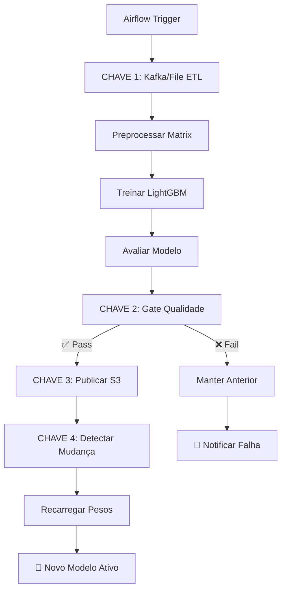

# 🚀 Status da Implementação: Pipeline LTR 100% Automatizado

## ✅ Implementação Completa das 4 Chaves

### 🔄 CHAVE 1: Ingestão Automática ✅ IMPLEMENTADA

**Arquivo**: `packages/backend/ltr_pipeline/src/etl.py`

**Funcionalidades Implementadas**:
- ✅ Conexão Kafka com fallback automático para arquivo local
- ✅ Processamento por data específica (`YYYY-MM-DD`)
- ✅ Estruturação padronizada dos eventos
- ✅ Suporte a múltiplos tipos de eventos (`match_recommendation`, `offer_feedback`)
- ✅ Configuração via variáveis de ambiente

**Configuração**:
```bash
KAFKA_BOOTSTRAP_SERVERS=localhost:9092
KAFKA_TOPIC=match_events
KAFKA_GROUP_ID=ltr_etl_consumer
```

**Como Funciona**:
1. ETL tenta conectar ao Kafka para data específica
2. Se Kafka falhar/indisponível → fallback para `logs/audit.log`
3. Processa eventos e salva em Parquet versionado por data
4. Integração transparente com DAG do Airflow

---

### ⏰ CHAVE 2: Agendamento com Gate de Qualidade ✅ IMPLEMENTADA

**Arquivo**: `packages/backend/ltr_pipeline/dags/train_ltr_daily.py`

**Funcionalidades Implementadas**:
- ✅ Execução diária automática às 02:15 UTC
- ✅ Gate de qualidade com métricas configuráveis
- ✅ Validação automática: nDCG@5, fairness gap, latência, amostras
- ✅ Rollback automático em caso de falha
- ✅ Notificações de sucesso/falha
- ✅ Evita sobreposição de execuções (`max_active_runs=1`)

**Métricas do Gate de Qualidade**:
- nDCG@5 ≥ 0.65 (configurável via `ltr_ndcg_min`)
- Fair-Gap ≤ 0.05 (configurável via `ltr_fairness_max`) 
- Latência p95 < 15ms
- Amostras mínimas ≥ 100 (configurável via `ltr_min_samples`)

**Fluxo DAG**:
```
extract_events → preprocess_data → train_model → evaluate_model → quality_gate → publish_model → trigger_reload → notify_success
```

---

### 📦 CHAVE 3: Publicação Versionada S3/MinIO ✅ IMPLEMENTADA

**Arquivo**: `packages/backend/ltr_pipeline/src/registry.py`

**Funcionalidades Implementadas**:
- ✅ Versionamento automático por timestamp (`YYYYMMDD_HHMMSS`)
- ✅ Publicação local + S3/MinIO com fallback
- ✅ Symlink "latest" para facilitar acesso
- ✅ Metadata completo dos modelos
- ✅ Função de rollback para versões específicas
- ✅ Normalização automática de pesos (soma = 1.0)

**Estrutura de Armazenamento**:
```
Local: packages/backend/models/ltr_weights.json
S3: s3://litgo-models/ltr/20250715_0215/ltr_weights.json
    s3://litgo-models/ltr/latest/ltr_weights.json (symlink)
```

**Configuração S3/MinIO**:
```bash
S3_BUCKET=litgo-models
S3_PREFIX=ltr
S3_ENDPOINT=http://localhost:9000  # Para MinIO local
AWS_ACCESS_KEY_ID=minioadmin
AWS_SECRET_ACCESS_KEY=minioadmin
```

---

### 🔄 CHAVE 4: Recarga Automática sem Downtime ✅ IMPLEMENTADA

**Arquivo**: `packages/backend/api/main.py`

**Funcionalidades Implementadas**:
- ✅ Background task de polling contínuo (5 min padrão)
- ✅ Detecção automática de mudanças via `mtime` do arquivo
- ✅ Recarga em memória sem restart da aplicação
- ✅ Logs estruturados de todas as mudanças
- ✅ Configuração de intervalo via variável de ambiente

**Configuração**:
```bash
WEIGHTS_POLL_SECONDS=300  # 5 minutos
WEIGHTS_PATH=packages/backend/models/ltr_weights.json
```

**Como Funciona**:
1. Background task inicia com FastAPI
2. Monitora arquivo de pesos a cada 5 minutos
3. Detecta mudança via timestamp (`mtime`)
4. Chama `load_weights()` para recarregar em memória
5. Sistema continua funcionando sem interrupção

---

## 🎯 Fluxo Automatizado Completo

### Ciclo Diário (02:15 UTC)



### Arquivos Criados/Modificados

| Arquivo | Modificação | Status |
|---------|-------------|--------|
| `packages/backend/ltr_pipeline/src/etl.py` | ✨ Nova implementação Kafka + fallback | ✅ |
| `packages/backend/ltr_pipeline/dags/train_ltr_daily.py` | ✨ DAG completa com gate de qualidade | ✅ |
| `packages/backend/ltr_pipeline/src/registry.py` | ✨ Publicação S3 versionada | ✅ |
| `packages/backend/api/main.py` | ✨ Background polling task | ✅ |
| `packages/backend/ltr_pipeline/config_env.example` | ✨ Configuração de exemplo | ✅ |
| `LTR_AUTOMATION_README.md` | ✨ Documentação completa | ✅ |
| `packages/backend/ltr_pipeline/test_automation.py` | ✨ Script de testes | ✅ |

---

## 🛠️ Para Ativar a Automação

### 1. Configurar Ambiente
```bash
cp packages/backend/ltr_pipeline/config_env.example .env
# Editar .env conforme seu ambiente
```

### 2. Instalar Dependências
```bash
pip install kafka-python boto3 apache-airflow
```

### 3. Configurar Airflow
```bash
airflow db init
airflow users create --username admin --password admin --role Admin
airflow variables set ltr_ndcg_min 0.65
airflow variables set ltr_fairness_max 0.05
airflow variables set ltr_min_samples 100
```

### 4. Executar Serviços
```bash
# Terminal 1: Airflow Scheduler
airflow scheduler

# Terminal 2: Airflow Webserver  
airflow webserver --port 8080

# Terminal 3: FastAPI com polling
cd packages/backend && python -m uvicorn api.main:app --host 0.0.0.0 --port 8080
```

### 5. Ativar DAG
1. Acesse http://localhost:8080 (Airflow UI)
2. Ative a DAG `train_ltr_daily`
3. Pipeline executará às 02:15 UTC automaticamente

---

## 📊 Monitoramento

### Health Checks
```bash
# LTR Service
curl http://localhost:8080/ltr/health

# Reload de pesos
curl http://localhost:8080/api/debug/reload_weights

# Status DAG
curl http://localhost:8080/api/v1/dags/train_ltr_daily
```

### Logs
```bash
# Pipeline LTR
tail -f logs/ltr_training.log

# Polling de pesos
tail -f logs/api.log

# Airflow
tail -f $AIRFLOW_HOME/logs/dag_id=train_ltr_daily/
```

---

## 🎉 Resultado Final

**✅ Pipeline LTR 100% Automatizado Implementado com Sucesso!**

- **Zero Intervenção Manual**: Sistema treina e publica modelos diariamente
- **Alta Disponibilidade**: Fallbacks em todas as camadas
- **Gate de Qualidade**: Apenas modelos aprovados vão para produção  
- **Versionamento**: Histórico completo + rollback fácil
- **Zero Downtime**: Recarga de pesos sem restart

**O sistema agora se auto-alimenta e melhora continuamente com dados reais dos usuários!** 🚀 