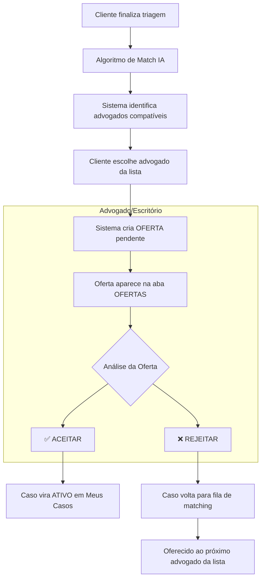

# 🎯 PLANO DE AÇÃO COMPLETO - Sistema Unificado de Ofertas

## 📋 Visão Geral

**Objetivo**: Transformar a aba "Ofertas" em um funil universal onde TODOS os perfis de captação (Escritório, Autônomo e Super Associado) recebem ofertas de casos da triagem que devem aceitar ou rejeitar explicitamente.

**Mudança Estratégica**: Eliminar a aceitação automática de casos e implementar um processo controlado de aceite/rejeição para melhor gestão de carga de trabalho e qualidade do atendimento.

**Novo Perfil - Super Associado**: Advogado que se registra como associado do escritório titular LITGO (ao invés de ser associado de outro escritório). Durante o registro, existe uma opção para sinalizar esta condição. Apenas Super-Associados precisam assinar contrato de associação e têm acesso ao sistema de ofertas como perfil de captação.

---

## 🎯 FLUXO REDESENHADO

### Fluxo Atual (Problemático):
```
Cliente → Triagem IA → Match → Caso Aparece Diretamente em "Meus Casos"
```

### Novo Fluxo (Proposto):
```
Cliente → Triagem IA → Match → Oferta Pendente → [Aceitar/Rejeitar] → Caso Ativo
```

### Diagrama Detalhado:


---

## 🚀 FASE 1: Sistema de Ofertas para Perfis Atuais

### 📊 BACKEND - Modificações Estruturais

#### 1. Nova Tabela no Banco de Dados

**Arquivo**: `packages/backend/models/case_offers.py`

```sql
CREATE TABLE case_offers (
    id UUID PRIMARY KEY DEFAULT uuid_generate_v4(),
    case_id UUID NOT NULL REFERENCES cases(id),
    lawyer_id UUID NOT NULL REFERENCES auth.users(id),
    status VARCHAR(20) NOT NULL DEFAULT 'pending',
    client_choice_order INTEGER NOT NULL,
    offer_details JSONB,
    expires_at TIMESTAMP WITH TIME ZONE,
    accepted_at TIMESTAMP WITH TIME ZONE,
    rejected_at TIMESTAMP WITH TIME ZONE,
    rejection_reason TEXT,
    created_at TIMESTAMP WITH TIME ZONE DEFAULT NOW(),
    updated_at TIMESTAMP WITH TIME ZONE DEFAULT NOW()
);

-- Índices para performance
CREATE INDEX idx_case_offers_lawyer_status ON case_offers(lawyer_id, status);
CREATE INDEX idx_case_offers_case_id ON case_offers(case_id);
CREATE INDEX idx_case_offers_expires_at ON case_offers(expires_at);

-- Constraint para evitar ofertas duplicadas
ALTER TABLE case_offers ADD CONSTRAINT unique_pending_offer 
UNIQUE (case_id, lawyer_id, status) 
WHERE status = 'pending';
```

#### 2. Novos Endpoints da API

**Arquivo**: `packages/backend/routes/offers.py`

```python
from fastapi import APIRouter, Depends, HTTPException, Query
from typing import List, Optional
from ..services.offer_service import OfferService
from ..schemas.offer_schemas import OfferOut, OfferStats, AcceptOfferRequest, RejectOfferRequest

router = APIRouter(prefix="/api/offers", tags=["offers"])

@router.get("/pending", response_model=List[OfferOut])
async def get_pending_offers(
    current_user = Depends(get_current_user),
    limit: int = Query(10, ge=1, le=50)
):
    """Busca ofertas pendentes para o advogado logado"""
    return await OfferService.get_pending_offers(current_user.id, limit)

@router.get("/stats", response_model=OfferStats)
async def get_offer_stats(current_user = Depends(get_current_user)):
    """Estatísticas de ofertas do advogado"""
    return await OfferService.get_offer_statistics(current_user.id)

@router.patch("/{offer_id}/accept")
async def accept_offer(
    offer_id: str,
    request: AcceptOfferRequest,
    current_user = Depends(get_current_user)
):
    """Aceita uma oferta de caso"""
    return await OfferService.accept_offer(offer_id, current_user.id, request)

@router.patch("/{offer_id}/reject")
async def reject_offer(
    offer_id: str,
    request: RejectOfferRequest,
    current_user = Depends(get_current_user)
):
    """Rejeita uma oferta de caso"""
    return await OfferService.reject_offer(offer_id, current_user.id, request)

@router.get("/history", response_model=List[OfferOut])
async def get_offer_history(
    current_user = Depends(get_current_user),
    status: Optional[str] = Query(None),
    limit: int = Query(20, ge=1, le=100)
):
    """Histórico de ofertas (aceitas, rejeitadas, expiradas)"""
    return await OfferService.get_offer_history(current_user.id, status, limit)
```

#### 3. Serviço de Lógica de Negócio

**Arquivo**: `packages/backend/services/offer_service.py`

```python
from typing import List, Optional
from datetime import datetime, timedelta
from ..models.case_offers import CaseOffer
from ..models.cases import Case
from ..services.notification_service import NotificationService
from ..services.match_service import MatchService

class OfferService:
    
    @staticmethod
    async def create_offer_from_match(case_id: str, lawyer_id: str, choice_order: int) -> CaseOffer:
        """Cria uma oferta após o cliente escolher um advogado"""
        
        # Buscar detalhes do caso
        case = await Case.get_by_id(case_id)
        if not case:
            raise ValueError("Caso não encontrado")
        
        # Calcular expiração (48h para aceitar)
        expires_at = datetime.utcnow() + timedelta(hours=48)
        
        # Criar oferta
        offer = CaseOffer(
            case_id=case_id,
            lawyer_id=lawyer_id,
            status='pending',
            client_choice_order=choice_order,
            offer_details={
                'case_summary': case.summary,
                'legal_area': case.legal_area,
                'urgency_level': case.urgency_level,
                'estimated_fee': case.estimated_fee,
                'client_location': case.client_location
            },
            expires_at=expires_at
        )
        
        await offer.save()
        
        # Enviar notificação
        await NotificationService.send_new_offer_notification(lawyer_id, offer)
        
        return offer
    
    @staticmethod
    async def get_pending_offers(lawyer_id: str, limit: int = 10) -> List[CaseOffer]:
        """Busca ofertas pendentes para um advogado"""
        return await CaseOffer.get_pending_by_lawyer(lawyer_id, limit)
    
    @staticmethod
    async def accept_offer(offer_id: str, lawyer_id: str, request) -> dict:
        """Aceita uma oferta e ativa o caso"""
        
        offer = await CaseOffer.get_by_id(offer_id)
        if not offer or offer.lawyer_id != lawyer_id:
            raise ValueError("Oferta não encontrada")
        
        if offer.status != 'pending':
            raise ValueError("Oferta não está pendente")
        
        if offer.expires_at < datetime.utcnow():
            raise ValueError("Oferta expirada")
        
        # Aceitar oferta
        offer.status = 'accepted'
        offer.accepted_at = datetime.utcnow()
        await offer.save()
        
        # Ativar caso
        case = await Case.get_by_id(offer.case_id)
        case.status = 'active'
        case.assigned_lawyer_id = lawyer_id
        case.assigned_at = datetime.utcnow()
        await case.save()
        
        # Rejeitar outras ofertas pendentes para o mesmo caso
        await CaseOffer.reject_other_pending_offers(offer.case_id, offer_id)
        
        # Notificar cliente
        await NotificationService.notify_client_lawyer_assigned(case.client_id, lawyer_id)
        
        return {"message": "Oferta aceita com sucesso", "case_id": case.id}
    
    @staticmethod
    async def reject_offer(offer_id: str, lawyer_id: str, request) -> dict:
        """Rejeita uma oferta e reativa o matching"""
        
        offer = await CaseOffer.get_by_id(offer_id)
        if not offer or offer.lawyer_id != lawyer_id:
            raise ValueError("Oferta não encontrada")
        
        if offer.status != 'pending':
            raise ValueError("Oferta não está pendente")
        
        # Rejeitar oferta
        offer.status = 'rejected'
        offer.rejected_at = datetime.utcnow()
        offer.rejection_reason = request.reason
        await offer.save()
        
        # Reativar matching para o próximo advogado da lista
        await MatchService.reactivate_matching_for_case(offer.case_id, exclude_lawyer_ids=[lawyer_id])
        
        return {"message": "Oferta rejeitada. Caso será oferecido ao próximo advogado."}
    
    @staticmethod
    async def get_offer_statistics(lawyer_id: str) -> dict:
        """Estatísticas de ofertas do advogado"""
        stats = await CaseOffer.get_stats_by_lawyer(lawyer_id)
        return {
            'total_offers': stats['total'],
            'accepted': stats['accepted'],
            'rejected': stats['rejected'],
            'expired': stats['expired'],
            'acceptance_rate': stats['accepted'] / stats['total'] if stats['total'] > 0 else 0,
            'avg_response_time_hours': stats['avg_response_time']
        }
```

#### 4. Modificação no Algoritmo de Match

**Arquivo**: `packages/backend/services/match_service.py`

```python
# Adicionar ao método find_and_notify_matches

async def process_client_choice(case_id: str, chosen_lawyer_id: str, choice_order: int):
    """Processa a escolha do cliente e cria a oferta"""
    
    # Verificar se o advogado ainda está disponível
    lawyer = await User.get_by_id(chosen_lawyer_id)
    if not lawyer or not await is_lawyer_available(lawyer):
        raise ValueError("Advogado não está mais disponível")
    
    # Criar oferta
    offer = await OfferService.create_offer_from_match(
        case_id=case_id,
        lawyer_id=chosen_lawyer_id,
        choice_order=choice_order
    )
    
    # Atualizar status do caso
    case = await Case.get_by_id(case_id)
    case.status = 'offer_pending'
    case.offer_sent_at = datetime.utcnow()
    await case.save()
    
    return offer
```

#### 5. Schemas de Dados

**Arquivo**: `packages/backend/schemas/offer_schemas.py`

```python
from pydantic import BaseModel, Field
from typing import Optional, Dict, Any
from datetime import datetime

class OfferOut(BaseModel):
    id: str
    case_id: str
    status: str
    offer_details: Dict[str, Any]
    expires_at: datetime
    created_at: datetime
    client_choice_order: int
    
    # Detalhes do caso
    case_summary: Optional[str] = None
    legal_area: Optional[str] = None
    urgency_level: Optional[str] = None
    estimated_fee: Optional[str] = None
    client_location: Optional[str] = None
    
    class Config:
        orm_mode = True

class AcceptOfferRequest(BaseModel):
    notes: Optional[str] = Field(None, max_length=500)
    estimated_start_date: Optional[datetime] = None

class RejectOfferRequest(BaseModel):
    reason: str = Field(..., max_length=200)
    detailed_reason: Optional[str] = Field(None, max_length=500)

class OfferStats(BaseModel):
    total_offers: int
    accepted: int
    rejected: int
    expired: int
    acceptance_rate: float
    avg_response_time_hours: float
```

---

### 📱 FRONTEND - Adaptações Estruturais

#### 1. Unificação da Navegação

**Arquivo**: `apps/app_flutter/lib/src/shared/widgets/organisms/main_tabs_shell.dart`

```dart
List<NavItem> _getNavItemsForRole(String userRole) {
  switch (userRole) {
    case 'lawyer_associated':
      return [
        NavItem(label: 'Painel', icon: LucideIcons.layoutDashboard, branchIndex: 0),
        NavItem(label: 'Casos', icon: LucideIcons.folder, branchIndex: 1),
        NavItem(label: 'Agenda', icon: LucideIcons.calendar, branchIndex: 2),
        NavItem(label: 'Ofertas', icon: LucideIcons.inbox, branchIndex: 3), // Delegação interna
        NavItem(label: 'Mensagens', icon: LucideIcons.messageSquare, branchIndex: 4),
        NavItem(label: 'Perfil', icon: LucideIcons.user, branchIndex: 5),
      ];
    case 'lawyer_individual':
    case 'lawyer_office':
      return [
        NavItem(label: 'Início', icon: LucideIcons.home, branchIndex: 6),
        NavItem(label: 'Ofertas', icon: LucideIcons.inbox, branchIndex: 7), // MUDANÇA: era "Parceiros"
        NavItem(label: 'Meus Casos', icon: LucideIcons.folder, branchIndex: 8), // MUDANÇA: era "Parcerias"
        NavItem(label: 'Mensagens', icon: LucideIcons.messageSquare, branchIndex: 9),
        NavItem(label: 'Perfil', icon: LucideIcons.user, branchIndex: 10),
      ];
    // ... resto do código
  }
}
```

#### 2. Redesign da OffersScreen

**Arquivo**: `apps/app_flutter/lib/src/features/offers/presentation/screens/offers_screen.dart`

```dart
class OffersScreen extends StatefulWidget {
  @override
  _OffersScreenState createState() => _OffersScreenState();
}

class _OffersScreenState extends State<OffersScreen> with TickerProviderStateMixin {
  late TabController _tabController;
  final OffersService _offersService = GetIt.instance<OffersService>();
  
  List<CaseOffer> pendingOffers = [];
  List<CaseOffer> historyOffers = [];
  OfferStats? stats;
  bool isLoading = true;

  @override
  void initState() {
    super.initState();
    _tabController = TabController(length: 3, vsync: this);
    _loadData();
  }

  Future<void> _loadData() async {
    setState(() => isLoading = true);
    try {
      final results = await Future.wait([
        _offersService.getPendingOffers(),
        _offersService.getOfferHistory(),
        _offersService.getOfferStats(),
      ]);
      
      setState(() {
        pendingOffers = results[0] as List<CaseOffer>;
        historyOffers = results[1] as List<CaseOffer>;
        stats = results[2] as OfferStats;
      });
    } catch (e) {
      ScaffoldMessenger.of(context).showSnackBar(
        SnackBar(content: Text('Erro ao carregar ofertas: $e')),
      );
    } finally {
      setState(() => isLoading = false);
    }
  }

  @override
  Widget build(BuildContext context) {
    return Scaffold(
      appBar: AppBar(
        title: Text('Ofertas de Casos'),
        actions: [
          IconButton(
            icon: Icon(Icons.refresh),
            onPressed: _loadData,
          ),
        ],
        bottom: TabBar(
          controller: _tabController,
          tabs: [
            Tab(text: 'Pendentes (${pendingOffers.length})'),
            Tab(text: 'Histórico'),
            Tab(text: 'Estatísticas'),
          ],
        ),
      ),
      body: isLoading
          ? Center(child: CircularProgressIndicator())
          : TabBarView(
              controller: _tabController,
              children: [
                _buildPendingTab(),
                _buildHistoryTab(),
                _buildStatsTab(),
              ],
            ),
    );
  }

  Widget _buildPendingTab() {
    if (pendingOffers.isEmpty) {
      return _buildEmptyState(
        icon: Icons.inbox_outlined,
        title: 'Nenhuma oferta pendente',
        subtitle: 'Quando novos clientes escolherem você, as ofertas aparecerão aqui.',
      );
    }

    return RefreshIndicator(
      onRefresh: _loadData,
      child: ListView.builder(
        padding: EdgeInsets.all(16),
        itemCount: pendingOffers.length,
        itemBuilder: (context, index) {
          final offer = pendingOffers[index];
          return CaseOfferCard(
            offer: offer,
            onAccept: () => _acceptOffer(offer),
            onReject: () => _rejectOffer(offer),
          );
        },
      ),
    );
  }

  Widget _buildEmptyState({
    required IconData icon,
    required String title,
    required String subtitle,
  }) {
    return Center(
      child: Column(
        mainAxisAlignment: MainAxisAlignment.center,
        children: [
          Icon(icon, size: 64, color: Colors.grey),
          SizedBox(height: 16),
          Text(title, style: Theme.of(context).textTheme.headlineSmall),
          SizedBox(height: 8),
          Text(
            subtitle,
            textAlign: TextAlign.center,
            style: Theme.of(context).textTheme.bodyMedium?.copyWith(color: Colors.grey),
          ),
        ],
      ),
    );
  }

  Future<void> _acceptOffer(CaseOffer offer) async {
    final result = await showDialog<bool>(
      context: context,
      builder: (context) => AcceptOfferDialog(offer: offer),
    );

    if (result == true) {
      try {
        await _offersService.acceptOffer(offer.id);
        ScaffoldMessenger.of(context).showSnackBar(
          SnackBar(content: Text('Oferta aceita! O caso foi adicionado aos seus casos ativos.')),
        );
        _loadData(); // Recarregar dados
      } catch (e) {
        ScaffoldMessenger.of(context).showSnackBar(
          SnackBar(content: Text('Erro ao aceitar oferta: $e')),
        );
      }
    }
  }

  Future<void> _rejectOffer(CaseOffer offer) async {
    final result = await showDialog<String>(
      context: context,
      builder: (context) => RejectOfferDialog(offer: offer),
    );

    if (result != null) {
      try {
        await _offersService.rejectOffer(offer.id, result);
        ScaffoldMessenger.of(context).showSnackBar(
          SnackBar(content: Text('Oferta rejeitada. O caso será oferecido ao próximo advogado.')),
        );
        _loadData(); // Recarregar dados
      } catch (e) {
        ScaffoldMessenger.of(context).showSnackBar(
          SnackBar(content: Text('Erro ao rejeitar oferta: $e')),
        );
      }
    }
  }
}
```

#### 3. Widget CaseOfferCard

**Arquivo**: `apps/app_flutter/lib/src/features/offers/presentation/widgets/case_offer_card.dart`

```dart
class CaseOfferCard extends StatelessWidget {
  final CaseOffer offer;
  final VoidCallback onAccept;
  final VoidCallback onReject;

  const CaseOfferCard({
    required this.offer,
    required this.onAccept,
    required this.onReject,
  });

  @override
  Widget build(BuildContext context) {
    final timeRemaining = offer.expiresAt.difference(DateTime.now());
    final isExpiringSoon = timeRemaining.inHours < 6;

    return Card(
      margin: EdgeInsets.only(bottom: 16),
      child: Padding(
        padding: EdgeInsets.all(16),
        child: Column(
          crossAxisAlignment: CrossAxisAlignment.start,
          children: [
            // Header com área e urgência
            Row(
              children: [
                Container(
                  padding: EdgeInsets.symmetric(horizontal: 8, vertical: 4),
                  decoration: BoxDecoration(
                    color: _getAreaColor(offer.legalArea),
                    borderRadius: BorderRadius.circular(12),
                  ),
                  child: Text(
                    offer.legalArea,
                    style: TextStyle(color: Colors.white, fontSize: 12),
                  ),
                ),
                SizedBox(width: 8),
                _buildUrgencyBadge(offer.urgencyLevel),
                Spacer(),
                _buildExpirationTimer(timeRemaining, isExpiringSoon),
              ],
            ),
            
            SizedBox(height: 12),
            
            // Resumo do caso
            Text(
              offer.caseSummary,
              style: Theme.of(context).textTheme.bodyLarge,
              maxLines: 3,
              overflow: TextOverflow.ellipsis,
            ),
            
            SizedBox(height: 12),
            
            // Informações adicionais
            Row(
              children: [
                Icon(Icons.location_on, size: 16, color: Colors.grey),
                SizedBox(width: 4),
                Text(offer.clientLocation, style: TextStyle(color: Colors.grey)),
                SizedBox(width: 16),
                Icon(Icons.attach_money, size: 16, color: Colors.grey),
                SizedBox(width: 4),
                Text(offer.estimatedFee ?? 'A combinar', style: TextStyle(color: Colors.grey)),
              ],
            ),
            
            SizedBox(height: 16),
            
            // Botões de ação
            Row(
              children: [
                Expanded(
                  child: OutlinedButton.icon(
                    onPressed: onReject,
                    icon: Icon(Icons.close, color: Colors.red),
                    label: Text('Recusar', style: TextStyle(color: Colors.red)),
                    style: OutlinedButton.styleFrom(
                      side: BorderSide(color: Colors.red),
                    ),
                  ),
                ),
                SizedBox(width: 12),
                Expanded(
                  child: ElevatedButton.icon(
                    onPressed: onAccept,
                    icon: Icon(Icons.check),
                    label: Text('Aceitar'),
                    style: ElevatedButton.styleFrom(
                      backgroundColor: Colors.green,
                    ),
                  ),
                ),
              ],
            ),
          ],
        ),
      ),
    );
  }

  Widget _buildUrgencyBadge(String urgency) {
    Color color;
    IconData icon;
    
    switch (urgency.toLowerCase()) {
      case 'alta':
        color = Colors.red;
        icon = Icons.priority_high;
        break;
      case 'média':
        color = Colors.orange;
        icon = Icons.schedule;
        break;
      default:
        color = Colors.green;
        icon = Icons.schedule;
    }

    return Container(
      padding: EdgeInsets.symmetric(horizontal: 6, vertical: 2),
      decoration: BoxDecoration(
        color: color.withOpacity(0.1),
        borderRadius: BorderRadius.circular(8),
        border: Border.all(color: color),
      ),
      child: Row(
        mainAxisSize: MainAxisSize.min,
        children: [
          Icon(icon, size: 12, color: color),
          SizedBox(width: 2),
          Text(urgency, style: TextStyle(color: color, fontSize: 10)),
        ],
      ),
    );
  }

  Widget _buildExpirationTimer(Duration timeRemaining, bool isExpiringSoon) {
    String text;
    Color color = isExpiringSoon ? Colors.red : Colors.grey;

    if (timeRemaining.isNegative) {
      text = 'Expirada';
      color = Colors.red;
    } else if (timeRemaining.inHours < 1) {
      text = '${timeRemaining.inMinutes}min restantes';
    } else {
      text = '${timeRemaining.inHours}h restantes';
    }

    return Container(
      padding: EdgeInsets.symmetric(horizontal: 6, vertical: 2),
      decoration: BoxDecoration(
        color: color.withOpacity(0.1),
        borderRadius: BorderRadius.circular(8),
      ),
      child: Text(
        text,
        style: TextStyle(color: color, fontSize: 10),
      ),
    );
  }

  Color _getAreaColor(String area) {
    switch (area.toLowerCase()) {
      case 'trabalhista':
        return Colors.blue;
      case 'civil':
        return Colors.green;
      case 'criminal':
        return Colors.red;
      case 'tributário':
        return Colors.purple;
      default:
        return Colors.grey;
    }
  }
}
```

#### 4. Serviço de Ofertas

**Arquivo**: `apps/app_flutter/lib/src/features/offers/data/offers_service.dart`

```dart
class OffersService {
  final Dio _dio;

  OffersService(this._dio);

  Future<List<CaseOffer>> getPendingOffers() async {
    try {
      final response = await _dio.get('/api/offers/pending');
      return (response.data as List)
          .map((json) => CaseOffer.fromJson(json))
          .toList();
    } catch (e) {
      throw Exception('Erro ao buscar ofertas pendentes: $e');
    }
  }

  Future<List<CaseOffer>> getOfferHistory({String? status}) async {
    try {
      final response = await _dio.get(
        '/api/offers/history',
        queryParameters: status != null ? {'status': status} : null,
      );
      return (response.data as List)
          .map((json) => CaseOffer.fromJson(json))
          .toList();
    } catch (e) {
      throw Exception('Erro ao buscar histórico de ofertas: $e');
    }
  }

  Future<OfferStats> getOfferStats() async {
    try {
      final response = await _dio.get('/api/offers/stats');
      return OfferStats.fromJson(response.data);
    } catch (e) {
      throw Exception('Erro ao buscar estatísticas: $e');
    }
  }

  Future<void> acceptOffer(String offerId, {String? notes}) async {
    try {
      await _dio.patch(
        '/api/offers/$offerId/accept',
        data: {'notes': notes},
      );
    } catch (e) {
      throw Exception('Erro ao aceitar oferta: $e');
    }
  }

  Future<void> rejectOffer(String offerId, String reason) async {
    try {
      await _dio.patch(
        '/api/offers/$offerId/reject',
        data: {'reason': reason},
      );
    } catch (e) {
      throw Exception('Erro ao rejeitar oferta: $e');
    }
  }
}
```

#### 5. Modelos de Dados

**Arquivo**: `apps/app_flutter/lib/src/features/offers/domain/entities/case_offer.dart`

```dart
class CaseOffer {
  final String id;
  final String caseId;
  final String status;
  final DateTime expiresAt;
  final DateTime createdAt;
  final int clientChoiceOrder;
  
  // Detalhes do caso
  final String caseSummary;
  final String legalArea;
  final String urgencyLevel;
  final String? estimatedFee;
  final String clientLocation;

  const CaseOffer({
    required this.id,
    required this.caseId,
    required this.status,
    required this.expiresAt,
    required this.createdAt,
    required this.clientChoiceOrder,
    required this.caseSummary,
    required this.legalArea,
    required this.urgencyLevel,
    this.estimatedFee,
    required this.clientLocation,
  });

  factory CaseOffer.fromJson(Map<String, dynamic> json) {
    return CaseOffer(
      id: json['id'],
      caseId: json['case_id'],
      status: json['status'],
      expiresAt: DateTime.parse(json['expires_at']),
      createdAt: DateTime.parse(json['created_at']),
      clientChoiceOrder: json['client_choice_order'],
      caseSummary: json['offer_details']['case_summary'] ?? '',
      legalArea: json['offer_details']['legal_area'] ?? '',
      urgencyLevel: json['offer_details']['urgency_level'] ?? '',
      estimatedFee: json['offer_details']['estimated_fee'],
      clientLocation: json['offer_details']['client_location'] ?? '',
    );
  }
}

class OfferStats {
  final int totalOffers;
  final int accepted;
  final int rejected;
  final int expired;
  final double acceptanceRate;
  final double avgResponseTimeHours;

  const OfferStats({
    required this.totalOffers,
    required this.accepted,
    required this.rejected,
    required this.expired,
    required this.acceptanceRate,
    required this.avgResponseTimeHours,
  });

  factory OfferStats.fromJson(Map<String, dynamic> json) {
    return OfferStats(
      totalOffers: json['total_offers'],
      accepted: json['accepted'],
      rejected: json['rejected'],
      expired: json['expired'],
      acceptanceRate: json['acceptance_rate'].toDouble(),
      avgResponseTimeHours: json['avg_response_time_hours'].toDouble(),
    );
  }
}
```

#### 6. Ajuste no Roteamento

**Arquivo**: `apps/app_flutter/lib/src/router/app_router.dart`

```dart
// Modificar o redirect para direcionar perfis de captação para ofertas
if (loggedIn && (isAuthenticating || isSplash)) {
  final userRole = authState.user.role;
  
  switch (userRole) {
    case 'lawyer_associated':
      return '/dashboard'; // Mantém como está
    case 'lawyer_individual':
    case 'lawyer_office':
      return '/offers'; // MUDANÇA: Direciona para ofertas
    default: // cliente
      return '/client-home';
  }
}

// Adicionar nova rota para ofertas
StatefulShellBranch(routes: [
  GoRoute(path: '/offers', builder: (context, state) => const OffersScreen())
]),
```

---

## ✈️ FASE 2: Introdução do Perfil "Super Associado"

### 📋 Esclarecimento sobre Super-Associado

**Definição**: O Super-Associado é um advogado que trabalha como associado do escritório titular da plataforma LITGO, diferente dos associados normais que trabalham para outros escritórios cadastrados na plataforma.

**Processo de Registro**:
1. Durante o registro como advogado associado, existe um campo/checkbox para sinalizar se o usuário é associado do escritório titular
2. Esta marcação define automaticamente o role como `lawyer_platform_associate`
3. **Apenas Super-Associados precisam de contrato de associação** (associados normais não precisam)
4. Super-Associados têm acesso ao mesmo sistema de ofertas que escritórios individuais

**Diferenças Técnicas**:
- **Associado Normal**: `lawyer_associated` → Associado de outro escritório
- **Super-Associado**: `lawyer_platform_associate` → Associado do escritório titular LITGO

**Diferenças Funcionais**:
- **Associado Normal**: Trabalha na aba "Casos" com delegação interna
- **Super-Associado**: Trabalha na aba "Ofertas" com captação direta de casos

### Backend - Expansão Mínima

#### 1. Novo Role no Sistema - Super Associado

**Conceito**: O Super-Associado é um advogado que trabalha como associado do escritório titular da plataforma (diferente dos associados normais que trabalham para outros escritórios). Durante o registro, existe uma opção para sinalizar que o usuário é associado do escritório titular.

**Arquivo**: `packages/backend/services/auth_service.py`

```python
# Adicionar novo role
VALID_LAWYER_ROLES = [
    'lawyer_individual',
    'lawyer_office', 
    'lawyer_associated',
    'lawyer_platform_associate'  # SUPER ASSOCIADO - Associado do escritório titular
]

async def register_lawyer_associated(
    user_data: dict, 
    is_platform_associate: bool = False
) -> dict:
    """Registra um advogado associado, com opção de ser Super-Associado"""
    
    # Definir role baseado na marcação
    role = 'lawyer_platform_associate' if is_platform_associate else 'lawyer_associated'
    
    # Criar usuário no Supabase
    user = supabase_client.auth.sign_up({
        "email": user_data['email'],
        "password": user_data['password'],
        "options": {
            "data": {
                "role": role,
                "full_name": user_data['full_name'],
                "is_platform_associate": is_platform_associate
            }
        }
    })
    
    # Criar perfil do advogado
    lawyer_profile = {
        "user_id": user.user.id,
        "oab_number": user_data['oab_number'],
        "state": user_data['state'],
        "is_platform_associate": is_platform_associate,
        "office_id": None if is_platform_associate else user_data.get('office_id'),
        "contract_required": is_platform_associate  # Apenas Super-Associado precisa de contrato
    }
    
    await LawyerProfile.create(lawyer_profile)
    
    # Se for Super-Associado, precisa assinar contrato de associação
    if is_platform_associate:
        await ContractService.generate_platform_association_contract(user.user.id)
    
    return {"user_id": user.user.id, "role": role}
```

#### 2. Inclusão no Algoritmo de Match

**Arquivo**: `packages/backend/services/match_service.py`

```python
# Modificar a query para incluir Super Associados
async def find_eligible_lawyers(case_requirements: dict) -> List[User]:
    """Busca advogados elegíveis para um caso"""
    
    # ANTES: Apenas individual e office
    # eligible_roles = ['lawyer_individual', 'lawyer_office']
    
    # DEPOIS: Incluir Super Associado
    eligible_roles = ['lawyer_individual', 'lawyer_office', 'lawyer_platform_associate']
    
    query = """
        SELECT u.*, lp.* 
        FROM auth.users u
        JOIN lawyer_profiles lp ON u.id = lp.user_id
        WHERE u.user_metadata->>'role' = ANY(%s)
        AND lp.is_available = true
        AND lp.areas_of_expertise && %s
        AND lp.current_cases < lp.max_cases
        ORDER BY lp.rating DESC, lp.cases_completed DESC
    """
    
    return await database.fetch_all(
        query, 
        [eligible_roles, case_requirements['legal_areas']]
    )
```

#### 3. Serviço de Contrato de Associação

**Arquivo**: `packages/backend/services/contract_service.py`

```python
class ContractService:
    
    @staticmethod
    async def generate_platform_association_contract(user_id: str) -> dict:
        """Gera contrato de associação para Super-Associado"""
        
        user = await User.get_by_id(user_id)
        if not user or user.role != 'lawyer_platform_associate':
            raise ValueError("Contrato apenas para Super-Associados")
        
        # Template do contrato
        contract_template = await ContractTemplate.get_by_type('platform_association')
        
        # Gerar contrato personalizado
        contract_data = {
            "user_id": user_id,
            "contract_type": "platform_association",
            "template_id": contract_template.id,
            "status": "pending_signature",
            "generated_at": datetime.utcnow(),
            "expires_at": datetime.utcnow() + timedelta(days=7),
            "terms": {
                "lawyer_name": user.full_name,
                "oab_number": user.lawyer_profile.oab_number,
                "platform_office": "LITGO - Escritório Titular",
                "fee_percentage": 30,  # 30% para plataforma
                "minimum_cases_month": 5,
                "availability_hours": "40h/semana"
            }
        }
        
        contract = await Contract.create(contract_data)
        
        # Enviar para assinatura digital
        await DocusignService.send_for_signature(contract.id, user.email)
        
        return contract.to_dict()
    
    @staticmethod
    async def handle_contract_signature(contract_id: str, signature_data: dict) -> bool:
        """Processa assinatura do contrato"""
        
        contract = await Contract.get_by_id(contract_id)
        if not contract:
            raise ValueError("Contrato não encontrado")
        
        # Atualizar status
        contract.status = 'signed'
        contract.signed_at = datetime.utcnow()
        contract.signature_data = signature_data
        await contract.save()
        
        # Ativar perfil do Super-Associado
        user = await User.get_by_id(contract.user_id)
        user.lawyer_profile.is_active = True
        user.lawyer_profile.contract_signed = True
        await user.lawyer_profile.save()
        
        # Notificar ativação
        await NotificationService.send_contract_signed_notification(contract.user_id)
        
        return True
```

### Frontend - Expansão Mínima

#### 1. Tela de Registro com Opção Super-Associado

**Arquivo**: `apps/app_flutter/lib/src/features/auth/presentation/screens/lawyer_registration_screen.dart`

```dart
class LawyerRegistrationScreen extends StatefulWidget {
  @override
  _LawyerRegistrationScreenState createState() => _LawyerRegistrationScreenState();
}

class _LawyerRegistrationScreenState extends State<LawyerRegistrationScreen> {
  final _formKey = GlobalKey<FormState>();
  String _selectedRole = 'lawyer_individual';
  bool _isPlatformAssociate = false; // NOVA OPÇÃO
  
  Widget _buildRoleSelection() {
    return Column(
      crossAxisAlignment: CrossAxisAlignment.start,
      children: [
        Text('Tipo de Cadastro', style: Theme.of(context).textTheme.titleMedium),
        SizedBox(height: 8),
        
        // Opções existentes
        RadioListTile<String>(
          title: Text('Advogado Individual'),
          value: 'lawyer_individual',
          groupValue: _selectedRole,
          onChanged: (value) => setState(() {
            _selectedRole = value!;
            _isPlatformAssociate = false; // Reset
          }),
        ),
        
        RadioListTile<String>(
          title: Text('Escritório de Advocacia'),
          value: 'lawyer_office',
          groupValue: _selectedRole,
          onChanged: (value) => setState(() {
            _selectedRole = value!;
            _isPlatformAssociate = false; // Reset
          }),
        ),
        
        RadioListTile<String>(
          title: Text('Advogado Associado'),
          value: 'lawyer_associated',
          groupValue: _selectedRole,
          onChanged: (value) => setState(() => _selectedRole = value!),
        ),
        
        // NOVA OPÇÃO: Super-Associado
        if (_selectedRole == 'lawyer_associated') ...[
          SizedBox(height: 16),
          Container(
            padding: EdgeInsets.all(16),
            decoration: BoxDecoration(
              border: Border.all(color: Colors.blue.withOpacity(0.3)),
              borderRadius: BorderRadius.circular(8),
              color: Colors.blue.withOpacity(0.05),
            ),
            child: Column(
              crossAxisAlignment: CrossAxisAlignment.start,
              children: [
                Text(
                  'Tipo de Associação',
                  style: Theme.of(context).textTheme.titleSmall,
                ),
                SizedBox(height: 8),
                
                CheckboxListTile(
                  title: Text('Sou associado do escritório titular LITGO'),
                  subtitle: Text(
                    'Super-Associados captam casos diretamente e precisam assinar contrato de associação',
                    style: TextStyle(fontSize: 12, color: Colors.grey[600]),
                  ),
                  value: _isPlatformAssociate,
                  onChanged: (value) => setState(() => _isPlatformAssociate = value!),
                  controlAffinity: ListTileControlAffinity.leading,
                ),
                
                if (_isPlatformAssociate) ...[
                  SizedBox(height: 8),
                  Container(
                    padding: EdgeInsets.all(12),
                    decoration: BoxDecoration(
                      color: Colors.orange.withOpacity(0.1),
                      borderRadius: BorderRadius.circular(6),
                    ),
                    child: Row(
                      children: [
                        Icon(Icons.info_outline, color: Colors.orange, size: 16),
                        SizedBox(width: 8),
                        Expanded(
                          child: Text(
                            'Será necessário assinar contrato de associação após o registro',
                            style: TextStyle(
                              fontSize: 12,
                              color: Colors.orange[800],
                            ),
                          ),
                        ),
                      ],
                    ),
                  ),
                ],
              ],
            ),
          ),
        ],
      ],
    );
  }
  
  Future<void> _submitRegistration() async {
    if (!_formKey.currentState!.validate()) return;
    
    try {
      final registrationData = {
        'email': _emailController.text,
        'password': _passwordController.text,
        'full_name': _nameController.text,
        'oab_number': _oabController.text,
        'state': _selectedState,
        'role': _selectedRole,
        'is_platform_associate': _isPlatformAssociate, // NOVA PROPRIEDADE
      };
      
      final result = await AuthService.registerLawyer(registrationData);
      
      if (_isPlatformAssociate) {
        // Redirecionar para tela de contrato
        Navigator.pushNamed(context, '/contract-signature', arguments: result['user_id']);
      } else {
        // Fluxo normal
        Navigator.pushNamedAndRemoveUntil(context, '/home', (route) => false);
      }
      
    } catch (e) {
      ScaffoldMessenger.of(context).showSnackBar(
        SnackBar(content: Text('Erro no registro: $e')),
      );
    }
  }
}
```

#### 2. Adicionar ao Sistema de Navegação

**Arquivo**: `apps/app_flutter/lib/src/shared/widgets/organisms/main_tabs_shell.dart`

```dart
List<NavItem> _getNavItemsForRole(String userRole) {
  switch (userRole) {
    // ... casos existentes ...
    
    case 'lawyer_platform_associate': // NOVO CASO
      return [
        NavItem(label: 'Início', icon: LucideIcons.home, branchIndex: 17),
        NavItem(label: 'Ofertas', icon: LucideIcons.inbox, branchIndex: 18), // USA MESMA TELA
        NavItem(label: 'Meus Casos', icon: LucideIcons.folder, branchIndex: 19),
        NavItem(label: 'Mensagens', icon: LucideIcons.messageSquare, branchIndex: 20),
        NavItem(label: 'Perfil', icon: LucideIcons.user, branchIndex: 21),
      ];
  }
}
```

#### 2. Adicionar ao Redirecionamento

**Arquivo**: `apps/app_flutter/lib/src/router/app_router.dart`

```dart
switch (userRole) {
  case 'lawyer_associated':
    return '/dashboard';
  case 'lawyer_individual':
  case 'lawyer_office':
  case 'lawyer_platform_associate': // ADICIONADO AQUI
    return '/offers'; // Todos vão para ofertas
  default:
    return '/client-home';
}
```

---

## 📊 Cronograma de Implementação

### Semana 1: Backend - Fundação
- **Dia 1-2**: Criar tabela `case_offers` e modelos
- **Dia 3-4**: Implementar endpoints de ofertas
- **Dia 4-5**: Modificar algoritmo de match para persistir ofertas

### Semana 2: Frontend - Interface
- **Dia 1-2**: Redesign da `OffersScreen` e componentes
- **Dia 3-4**: Implementar serviços e integração com API
- **Dia 5**: Ajustar navegação e roteamento

### Semana 3: Testes e Super Associado
- **Dia 1-2**: Testes completos do fluxo de ofertas
- **Dia 3-4**: Implementar perfil Super Associado
- **Dia 5**: Testes finais e documentação

---

## 🎯 Critérios de Sucesso

### Funcionalidades Essenciais
- ✅ Advogados recebem ofertas na aba "Ofertas"
- ✅ Podem aceitar ou rejeitar com feedback
- ✅ Casos rejeitados são reofertados automaticamente
- ✅ Interface clara com informações do caso
- ✅ Sistema de expiração de ofertas (48h)

### Métricas de Performance
- **Taxa de Aceitação**: > 70% das ofertas aceitas
- **Tempo de Resposta**: < 12h em média
- **Taxa de Expiração**: < 5% das ofertas
- **Satisfação do Cliente**: Redução no tempo de conexão com advogado

### Indicadores Técnicos
- **Performance da API**: < 200ms para endpoints de ofertas
- **Disponibilidade**: 99.9% uptime
- **Notificações**: 100% de entrega de notificações push

---

## 🚨 Riscos e Mitigações

### Riscos Identificados
1. **Muitas Rejeições**: Advogados podem rejeitar muitos casos
2. **Sobrecarga de Ofertas**: Advogados populares podem ficar sobrecarregados
3. **Experiência do Cliente**: Possível atraso na conexão

### Mitigações
1. **Sistema de Pontuação**: Penalizar rejeições excessivas
2. **Throttling Inteligente**: Limitar ofertas por advogado
3. **Fallback Automático**: Pool de advogados de backup
4. **Monitoramento**: Alertas para casos sem aceite em 24h

---

## 📋 Checklist de Implementação

### Backend
- [ ] Criar tabela `case_offers`
- [ ] Implementar `OfferService`
- [ ] Criar endpoints REST
- [ ] Modificar `MatchService`
- [ ] Implementar notificações
- [ ] Criar sistema de expiração
- [ ] Testes unitários
- [ ] Testes de integração

### Frontend
- [ ] Redesign `OffersScreen`
- [ ] Criar `CaseOfferCard`
- [ ] Implementar `OffersService`
- [ ] Atualizar navegação
- [ ] Ajustar roteamento
- [ ] Implementar dialogs de aceite/rejeição
- [ ] Testes de widget
- [ ] Testes de integração

### Super Associado
- [ ] Novo role no backend (`lawyer_platform_associate`)
- [ ] Campo `is_platform_associate` no registro
- [ ] Serviço de contrato de associação
- [ ] Inclusão no algoritmo de match
- [ ] Navegação no frontend
- [ ] Tela de registro com opção Super-Associado
- [ ] Tela de assinatura de contrato
- [ ] Fluxo de ativação após contrato assinado
- [ ] Testes específicos

---

## 📖 Documentação Adicional

### Para Desenvolvedores
- API Documentation (Swagger/OpenAPI)
- Guia de Contribuição
- Testes Automatizados

### Para Usuários
- Manual do Advogado
- FAQ sobre Ofertas
- Guia de Melhores Práticas

### Para Administradores
- Dashboard de Monitoramento
- Relatórios de Performance
- Ferramentas de Gestão de Ofertas

---

**Status**: 📋 Planejamento Completo - Pronto para Implementação
**Próximo Passo**: Aprovação e início da Fase 1 - Backend 