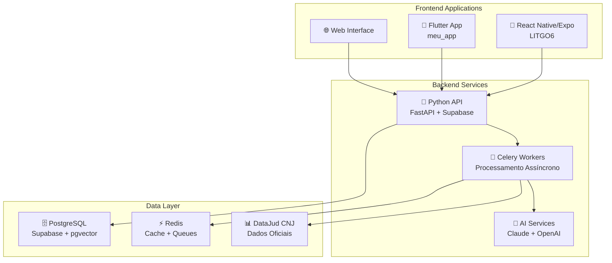
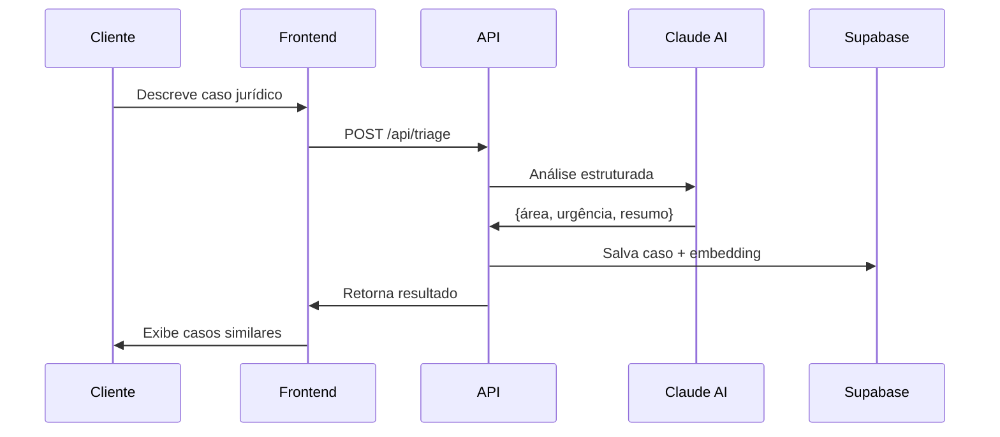
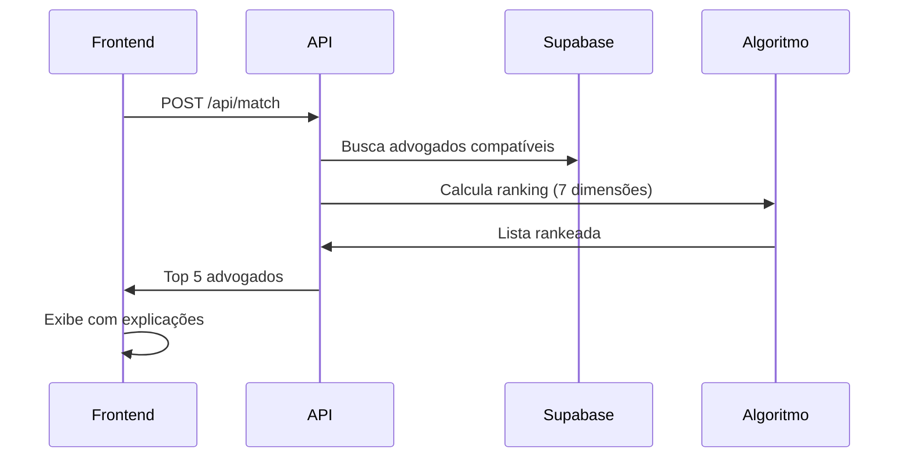

# 🏛️ LITIG - Sistema de Match Jurídico Inteligente

<div align="center">


[](https://github.com/NicholasJacob1990/LITIG/actions/workflows/ci.yml)
[](LICENSE)
[](https://python.org)
[](https://reactnative.dev)
[](https://flutter.dev)

**Conectando clientes a advogados especializados através de Inteligência Artificial**

[🚀 Demo](#demo) • [📖 Documentação](#documentação) • [🛠️ Instalação](#instalação) • [🤝 Contribuição](#contribuição)

</div>

## 🎯 Visão Geral

O **LITIG** é um ecossistema completo de tecnologia jurídica que utiliza Inteligência Artificial para conectar clientes a advogados especializados. O sistema analisa casos jurídicos em linguagem natural, extrai informações relevantes e realiza matches inteligentes baseados em múltiplos critérios.

### 🌟 Principais Funcionalidades

- **🤖 Triagem Inteligente**: Análise automatizada de casos usando Claude 3.5 Sonnet
- **🎯 Match Preciso**: Algoritmo proprietário com 7 dimensões de análise
- **⚖️ Dados Oficiais**: Integração com DataJud (CNJ) para taxas de sucesso reais
- **📱 Multi-plataforma**: React Native, Flutter e Web
- **🔐 Segurança**: Autenticação JWT e criptografia end-to-end
- **📊 Analytics**: Monitoramento em tempo real e métricas avançadas

## 🏗️ Arquitetura do Sistema

O LITIG é composto por três projetos principais que trabalham de forma integrada:



### 📦 Estrutura do Projeto

```
LITIG/
├── 📱 LITGO6/                    # React Native/Expo (Principal)
│   ├── app/                      # Expo Router - Navegação
│   ├── components/               # Componentes reutilizáveis
│   ├── backend/                  # API Python (FastAPI)
│   ├── supabase/                 # Migrações e configurações
│   └── .github/workflows/        # CI/CD Pipeline
├── 📱 meu_app/                   # Flutter (Alternativo)
│   ├── lib/                      # Código Flutter
│   ├── src/                      # Arquitetura Clean
│   └── test/                     # Testes unitários
├── 🧠 flutter_migration/         # Documentação de migração
└── 📚 docs/                      # Documentação geral
```

## 🚀 Instalação

### Pré-requisitos

- **Node.js** 18.x ou superior
- **Python** 3.11 ou superior  
- **Flutter** 3.22.0 ou superior
- **Docker** (opcional)
- **Git**

### 🔧 Configuração Rápida

```bash
# 1. Clone o repositório
git clone https://github.com/NicholasJacob1990/LITIG.git
cd LITIG

# 2. Configure o backend Python
cd LITGO6
cp env.example .env
python3 -m venv venv
source venv/bin/activate  # Linux/macOS
pip install -r backend/requirements.txt

# 3. Configure o frontend React Native
npm install

# 4. Configure o Flutter (opcional)
cd ../meu_app
flutter pub get

# 5. Inicie os serviços
# Backend API
cd ../LITGO6
source venv/bin/activate
uvicorn backend.main:app --reload

# Frontend React Native
npm start

# Flutter
cd ../meu_app
flutter run
```

Para configuração detalhada, consulte o [🔧 Guia de Configuração](LITGO6/ENVIRONMENT_SETUP.md).

## 🤖 Tecnologias Utilizadas

### Frontend
- **React Native 0.72+** com Expo SDK 49+
- **Flutter 3.22+** com Clean Architecture
- **TypeScript** para tipagem forte
- **NativeWind** (Tailwind CSS para React Native)
- **Expo Router** para navegação

### Backend
- **FastAPI** para API REST
- **Python 3.11+** com async/await
- **Supabase** (PostgreSQL + Auth + Storage)
- **pgvector** para busca semântica
- **Celery** para processamento assíncrono
- **Redis** para cache e filas

### Inteligência Artificial
- **Claude 3.5 Sonnet** (Anthropic) para triagem
- **OpenAI Embeddings** para vetorização
- **Algoritmo proprietário** de ranking multi-criterial
- **DataJud CNJ** para dados oficiais

### DevOps & Infraestrutura
- **GitHub Actions** para CI/CD
- **Docker** para containerização
- **Prometheus + Grafana** para monitoramento
- **Supabase** para banco de dados gerenciado

## 🔄 Fluxo de Funcionamento

### 1. Triagem Inteligente


### 2. Match de Advogados


## 📊 Métricas e KPIs

### Performance
- **Tempo de triagem**: < 3 segundos
- **Precisão do match**: > 85%
- **Disponibilidade**: 99.9% uptime
- **Latência da API**: < 200ms

### Negócio
- **Taxa de conversão**: Match → Contratação
- **Satisfação do cliente**: NPS > 8
- **Distribuição equitativa**: Gini < 0.3
- **Qualidade dos matches**: Feedback positivo > 90%

## 🔐 Segurança

- **Autenticação JWT** com refresh tokens
- **Rate limiting** (60 req/min por IP)
- **Criptografia end-to-end** para dados sensíveis
- **CORS** configurado para origens específicas
- **Validação rigorosa** com Pydantic schemas
- **Logs de auditoria** para todas as operações

## 📚 Documentação

### Documentação Técnica
- [🏗️ Arquitetura do Sistema](LITGO6/ARQUITETURA_SISTEMA.md)
- [🤖 Algoritmo de Match](LITGO6/docs/Algoritmo.md)
- [🔧 Configuração de Ambiente](LITGO6/ENVIRONMENT_SETUP.md)
- [📖 API Documentation](LITGO6/API_DOCUMENTATION.md)

### Documentação de Migração Flutter
- [📋 Sumário Executivo](flutter_migration/FLUTTER_EXECUTIVE_SUMMARY.md)
- [🔍 Comparação Técnica](flutter_migration/FLUTTER_COMPARACAO_TECNICA.md)
- [🛣️ Roadmap de Migração](flutter_migration/FLUTTER_ROADMAP.md)
- [💰 Análise Financeira](flutter_migration/FLUTTER_FINANCIAL_IMPLEMENTATION.md)

## 🧪 Testes

```bash
# Backend Python
cd LITGO6
source venv/bin/activate
pytest backend/tests/ -v --cov=backend

# Frontend React Native
cd LITGO6
npm test

# Flutter
cd meu_app
flutter test --coverage
```

## 🚀 Deploy

### Ambiente de Desenvolvimento
```bash
# Usando Docker Compose
cd LITGO6
docker-compose up -d
```

### Produção
O projeto utiliza **GitHub Actions** para CI/CD automatizado:
- ✅ Testes automatizados
- 🔍 Análise de código (ESLint, Pylint)
- 🔒 Scan de segurança (Snyk, Bandit)
- 🚀 Deploy automático para staging/produção

## 📈 Roadmap

### 🎯 Versão 1.0 (Atual)
- [x] Triagem inteligente com Claude AI
- [x] Match básico com algoritmo proprietário
- [x] Interface React Native
- [x] API Python com FastAPI
- [x] Integração Supabase

### 🚀 Versão 2.0 (Q2 2024)
- [ ] Migração completa para Flutter
- [ ] Chat em tempo real
- [ ] Videochamadas integradas
- [ ] Pagamentos via Stripe
- [ ] Dashboard analytics

### 🌟 Versão 3.0 (Q4 2024)
- [ ] AI explicável (XAI)
- [ ] Predição de resultados
- [ ] Marketplace de serviços
- [ ] App para advogados
- [ ] Integração com tribunais

## 🤝 Contribuição

Contribuições são sempre bem-vindas! Por favor, leia nosso [Guia de Contribuição](CONTRIBUTING.md) antes de submeter um PR.

### 🐛 Reportando Bugs
1. Verifique se o bug já foi reportado
2. Crie uma issue detalhada
3. Inclua steps para reproduzir
4. Adicione screenshots se aplicável

### 💡 Sugerindo Melhorias
1. Abra uma issue com a tag `enhancement`
2. Descreva a funcionalidade desejada
3. Explique por que seria útil
4. Considere implementar você mesmo!

## 📄 Licença

Este projeto está licenciado sob a [MIT License](LICENSE).

## 👥 Equipe

- **Nicholas Jacob** - *Desenvolvedor Principal* - [@NicholasJacob1990](https://github.com/NicholasJacob1990)

## 🙏 Agradecimentos

- **Anthropic** pelo Claude 3.5 Sonnet
- **OpenAI** pelas APIs de embeddings
- **Supabase** pela infraestrutura de dados
- **Expo** pela plataforma de desenvolvimento
- **Comunidade Flutter** pelas contribuições

---

<div align="center">

**[⬆ Voltar ao topo](#-litig---sistema-de-match-jurídico-inteligente)**

Made with ❤️ by [Nicholas Jacob](https://github.com/NicholasJacob1990)

</div> 