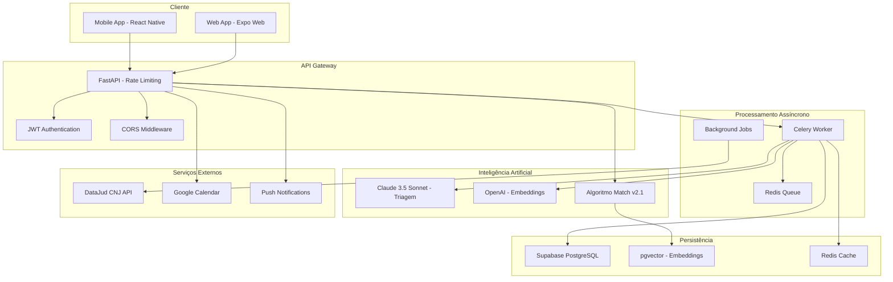
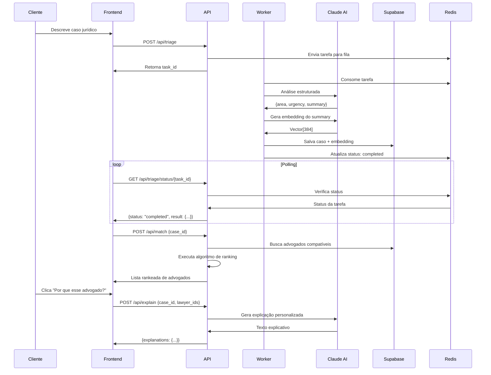
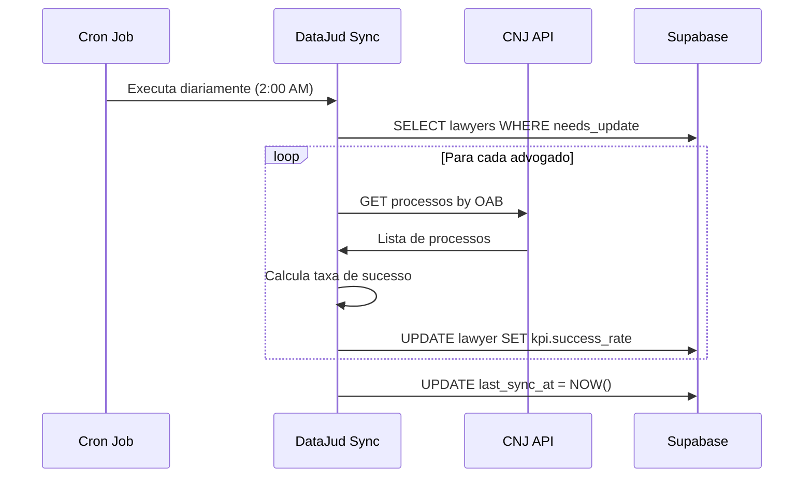
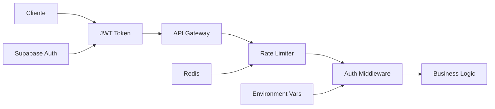

# 🏗️ Arquitetura do Sistema - LITGO5

## 🎯 Visão Geral Arquitetural

O LITGO5 é um sistema distribuído de match jurídico que utiliza inteligência artificial para conectar clientes a advogados especializados. A arquitetura segue padrões modernos de microserviços com processamento assíncrono e alta disponibilidade.

---

## 🌐 Diagrama de Arquitetura Geral



---

## 🔧 Componentes Principais

### 1. Frontend Layer

#### React Native/Expo App
```typescript
// Estrutura do Frontend
src/
├── app/                    # Expo Router - Navegação
│   ├── (auth)/            # Autenticação
│   ├── (tabs)/            # Navegação principal
│   ├── triagem.tsx        # Triagem inteligente
│   └── MatchesPage.tsx    # Resultados do match
├── components/            # Componentes reutilizáveis
│   ├── LawyerMatchCard.tsx
│   └── organisms/
├── hooks/                 # Custom hooks
│   ├── useTaskPolling.ts  # Polling de tarefas
│   └── usePushNotifications.ts
└── lib/                   # Utilitários
    ├── services/api.ts    # Comunicação com backend
    └── supabase.ts        # Cliente Supabase
```

**Tecnologias:**
- React Native 0.72+
- Expo SDK 49+
- TypeScript
- NativeWind (Tailwind CSS)
- Expo Router (navegação)

#### Funcionalidades Principais:
- **Triagem Inteligente**: Interface conversacional com IA
- **Match de Advogados**: Exibição de resultados rankeados
- **Explicações IA**: Botão "Por que esse advogado?"
- **Chat em Tempo Real**: Comunicação advogado-cliente
- **Calendário Integrado**: Google Calendar sync

---

### 2. Backend API Layer

#### FastAPI Application
```python
# Estrutura do Backend
backend/
├── main.py                # Aplicação principal
├── routes.py              # Endpoints da API
├── models.py              # DTOs Pydantic
├── services.py            # Lógica de negócio
├── auth.py                # Autenticação JWT
├── algoritmo_match.py     # Algoritmo de ranking
├── triage_service.py      # Serviço de triagem
├── explanation_service.py # Serviço de explicações
├── embedding_service.py   # Serviço de embeddings
├── celery_app.py          # Configuração Celery
├── tasks.py               # Tarefas assíncronas
└── jobs/
    └── datajud_sync.py    # Job de sincronização
```

**Tecnologias:**
- FastAPI 0.104+
- Python 3.10+
- Pydantic (validação)
- Supabase-py (cliente)
- Celery (processamento assíncrono)
- slowapi (rate limiting)

#### Endpoints Principais:
```http
POST /api/triage           # Triagem assíncrona
GET  /api/triage/status/{id} # Status da triagem
POST /api/match            # Match de advogados
POST /api/explain          # Explicações IA
POST /api/cases            # Criação de casos
```

---

### 3. Processamento Assíncrono

#### Celery Worker System
```python
# Configuração Celery
REDIS_URL = "redis://localhost:6379/0"
celery_app = Celery(
    "tasks",
    broker=REDIS_URL,
    backend=REDIS_URL,
    include=["backend.tasks"]
)

# Tarefa de Triagem
@celery_app.task(name="tasks.run_triage_async")
def run_triage_async_task(texto_cliente: str, coords: tuple = None):
    # 1. Análise com Claude
    triage_result = await triage_service.run_triage(texto_cliente)
    
    # 2. Geração de embedding
    embedding = await generate_embedding(triage_result["summary"])
    
    # 3. Persistência no banco
    case_id = save_case_to_database(triage_result, embedding)
    
    return {"case_id": case_id, "status": "completed"}
```

**Fluxo de Processamento:**
1. **Recepção**: API recebe requisição e despacha tarefa
2. **Triagem**: Worker processa com Claude AI
3. **Embedding**: Geração de vetor semântico
4. **Persistência**: Salva caso no banco de dados
5. **Notificação**: Frontend recebe status via polling

---

### 4. Inteligência Artificial

#### Sistema de IA Multi-Modal
```python
# Triagem com Claude
class TriageService:
    def __init__(self):
        self.client = anthropic.Anthropic(api_key=ANTHROPIC_API_KEY)
    
    async def run_triage(self, text: str) -> dict:
        # Tool calling para extração estruturada
        triage_tool = {
            "name": "extract_case_details",
            "input_schema": {
                "type": "object",
                "properties": {
                    "area": {"type": "string"},
                    "subarea": {"type": "string"}, 
                    "urgency_h": {"type": "integer"},
                    "summary": {"type": "string"}
                }
            }
        }
        
        message = self.client.messages.create(
            model="claude-3-5-sonnet-20240620",
            tools=[triage_tool],
            messages=[{"role": "user", "content": text}]
        )
        
        return extract_tool_result(message)

# Embeddings com OpenAI
async def generate_embedding(text: str) -> list[float]:
    response = openai.Embedding.create(
        model="text-embedding-3-small",
        input=text
    )
    return response["data"][0]["embedding"]
```

**Componentes de IA:**
- **Claude 3.5 Sonnet**: Triagem e explicações
- **OpenAI Embeddings**: Vetorização semântica
- **Algoritmo Proprietário**: Ranking multi-criterial
- **Fallback Regex**: Backup quando IA indisponível

---

### 5. Banco de Dados e Persistência

#### Supabase PostgreSQL com pgvector
```sql
-- Estrutura Principal
CREATE TABLE cases (
    id UUID PRIMARY KEY DEFAULT gen_random_uuid(),
    texto_cliente TEXT NOT NULL,
    area VARCHAR(50) NOT NULL,
    subarea VARCHAR(100),
    urgency_h INTEGER,
    coords POINT,
    embedding VECTOR(384),  -- pgvector para busca semântica
    status VARCHAR(20) DEFAULT 'triage_completed',
    created_at TIMESTAMPTZ DEFAULT NOW()
);

CREATE TABLE lawyers (
    id UUID PRIMARY KEY DEFAULT gen_random_uuid(),
    nome VARCHAR(255) NOT NULL,
    oab_number VARCHAR(20) UNIQUE,
    tags_expertise TEXT[],
    geo_latlon POINT,
    curriculo_json JSONB,
    casos_historicos_embeddings VECTOR(384)[],
    kpi JSONB,  -- KPIs dinâmicos
    last_offered_at TIMESTAMPTZ,
    created_at TIMESTAMPTZ DEFAULT NOW()
);

-- Índices para Performance
CREATE INDEX idx_cases_embedding ON cases 
USING ivfflat (embedding vector_cosine_ops) WITH (lists = 100);

CREATE INDEX idx_lawyers_area ON lawyers 
USING GIN (tags_expertise);

CREATE INDEX idx_lawyers_geo ON lawyers 
USING GIST (geo_latlon);
```

**Otimizações:**
- **Índice IVFFlat**: Busca vetorial eficiente
- **Índice GIN**: Arrays de especialidades
- **Índice GIST**: Consultas geoespaciais
- **JSONB**: Estruturas flexíveis para KPIs

---

### 6. Algoritmo de Match

#### Core Algorithm v2.1
```python
class MatchmakingAlgorithm:
    WEIGHTS = {
        "A": 0.30,  # Area Match
        "S": 0.25,  # Similarity  
        "T": 0.15,  # Taxa de sucesso
        "G": 0.10,  # Geolocalização
        "Q": 0.10,  # Qualificação
        "U": 0.05,  # Urgência
        "R": 0.05,  # Rating
    }
    
    def rank(self, case: Case, lawyers: List[Lawyer], top_n: int = 5):
        # 1. Calcular raw score
        for lawyer in lawyers:
            features = FeatureCalculator(case, lawyer).all()
            lawyer.scores = {
                "features": features,
                "raw": sum(self.WEIGHTS[k] * features[k] for k in self.WEIGHTS)
            }
        
        # 2. Epsilon clustering (±5%)
        best_raw = max(lw.scores["raw"] for lw in lawyers)
        elite = [lw for lw in lawyers if lw.scores["raw"] >= best_raw - 0.05]
        
        # 3. Aplicar equidade
        for lawyer in elite:
            equity = self.equity_weight(lawyer.kpi)
            lawyer.scores["fair"] = (0.7 * lawyer.scores["raw"] + 0.3 * equity)
        
        # 4. Ranking final
        elite.sort(key=lambda l: (-l.scores["fair"], l.last_offered_at))
        return elite[:top_n]
```

**Features do Algoritmo:**
- **7 Dimensões**: Análise multi-criterial
- **Epsilon Clustering**: Agrupa candidatos similares
- **Equidade**: Distribui casos entre advogados
- **Desempate Temporal**: Round-robin implícito

---

## 🔄 Fluxos de Dados

### 1. Fluxo de Triagem Completo



### 2. Fluxo de Sincronização DataJud



---

## 🔐 Segurança e Autenticação

### Arquitetura de Segurança



#### Implementação de Segurança:
```python
# Autenticação JWT
@router.post("/triage")
@limiter.limit("60/minute")
async def http_triage_case(
    payload: TriageRequest, 
    user: dict = Depends(get_current_user)
):
    # Validação automática do JWT
    # Rate limiting por IP
    # Validação de payload com Pydantic
    pass

# Middleware de autenticação
async def get_current_user(token: str = Depends(oauth2_scheme)):
    try:
        user_response = supabase.auth.get_user(token)
        if not user_response.user:
            raise HTTPException(401, "Token inválido")
        return user_response.user
    except AuthApiError:
        raise HTTPException(401, "Não autorizado")
```

**Camadas de Segurança:**
- **JWT Tokens**: Autenticação stateless
- **Rate Limiting**: 60 req/min por IP
- **CORS**: Origins específicas
- **Validação**: Pydantic schemas
- **Environment**: Secrets isolados

---

## 📊 Monitoramento e Observabilidade

### Logging Estruturado

```python
# Configuração de logs JSON
class JsonFormatter(logging.Formatter):
    def format(self, record: logging.LogRecord) -> str:
        return json.dumps({
            "timestamp": self.formatTime(record, self.datefmt),
            "level": record.levelname,
            "message": record.getMessage(),
            "context": record.args,
            "trace_id": getattr(record, 'trace_id', None)
        })

# Logs de auditoria
AUDIT_LOGGER.info("recommend", extra={
    "case": case.id,
    "lawyer": lawyer.id, 
    "fair_score": lawyer.scores["fair"],
    "user_id": user.id,
    "timestamp": time.time()
})
```

### Métricas Importantes

```python
# Métricas de Performance
METRICS = {
    "triage_duration_seconds": "Tempo de triagem com IA",
    "match_algorithm_duration": "Tempo do algoritmo de match", 
    "api_requests_total": "Total de requisições por endpoint",
    "api_errors_total": "Total de erros por tipo",
    "celery_task_duration": "Duração de tarefas Celery",
    "redis_queue_size": "Tamanho da fila Redis",
    "database_query_duration": "Tempo de queries no banco"
}
```

---

## 🚀 Deployment e Infraestrutura

### Containerização

```dockerfile
# Backend Dockerfile
FROM python:3.10-slim

WORKDIR /app
COPY requirements.txt .
RUN pip install --no-cache-dir -r requirements.txt

COPY . .
EXPOSE 8000

# Produção com Gunicorn
CMD ["gunicorn", "-w", "4", "-k", "uvicorn.workers.UvicornWorker", 
     "backend.main:app", "--bind", "0.0.0.0:8000"]
```

### Docker Compose

```yaml
# docker-compose.yml
version: '3.8'

services:
  redis:
    image: redis:alpine
    ports: ["6379:6379"]

  api:
    build: 
      context: .
      dockerfile: backend/Dockerfile
    ports: ["8000:8000"]
    env_file: [.env]
    depends_on: [redis]
    command: uvicorn backend.main:app --host 0.0.0.0 --reload

  worker:
    build:
      context: .
      dockerfile: backend/Dockerfile
    env_file: [.env]
    depends_on: [redis]
    command: celery -A backend.celery_app worker --loglevel=info

networks:
  default:
    name: litgo_network
```

### Ambientes de Deploy

#### Desenvolvimento
- **API**: `uvicorn --reload` (hot reload)
- **Worker**: `celery worker --loglevel=debug`
- **Redis**: `docker run redis:alpine`
- **Frontend**: `expo start` (Metro bundler)

#### Produção
- **API**: Render/Railway (auto-scaling)
- **Worker**: Background service (múltiplas instâncias)
- **Redis**: Redis Cloud/ElastiCache
- **Frontend**: Expo EAS Build + Deploy

---

## 🔄 Escalabilidade e Performance

### Estratégias de Escalabilidade

#### Horizontal Scaling
```python
# Múltiplos workers Celery
CELERY_WORKERS = {
    "triage_worker": {
        "queues": ["triage"],
        "concurrency": 4,
        "max_memory_per_child": 200000
    },
    "match_worker": {
        "queues": ["match"], 
        "concurrency": 8,
        "max_memory_per_child": 150000
    }
}

# Load balancing da API
API_INSTANCES = [
    "api-1.litgo.com",
    "api-2.litgo.com", 
    "api-3.litgo.com"
]
```

#### Otimizações de Performance
```python
# Cache de embeddings frequentes
@cached(ttl=3600)  # 1 hora
async def get_embedding_cached(text: str) -> List[float]:
    return await generate_embedding(text)

# Batch processing para matches
async def batch_calculate_matches(cases: List[Case]) -> Dict[str, List[Match]]:
    # Processa múltiplos casos simultaneamente
    tasks = [calculate_match(case) for case in cases]
    results = await asyncio.gather(*tasks)
    return dict(zip([c.id for c in cases], results))

# Database connection pooling
DATABASE_POOL = {
    "min_connections": 5,
    "max_connections": 20,
    "retry_attempts": 3,
    "retry_delay": 1.0
}
```

---

## 📈 Roadmap Arquitetural

### Fase 1: MVP Atual ✅
- API básica com triagem e match
- Processamento assíncrono
- Frontend funcional
- Algoritmo v2.1

### Fase 2: Otimização (Q1 2025)
- Cache Redis inteligente
- Métricas e monitoramento
- Testes de carga
- CI/CD automatizado

### Fase 3: Escala (Q2 2025)  
- Microserviços especializados
- Event sourcing
- CQRS para reads/writes
- Kubernetes deployment

### Fase 4: IA Avançada (Q3 2025)
- Fine-tuning de modelos
- A/B testing de algoritmos
- Recomendação proativa
- Análise preditiva

---

## 🔧 Troubleshooting Arquitetural

### Problemas Comuns

#### 1. Latência Alta na Triagem
```bash
# Diagnóstico
celery -A backend.celery_app inspect active
redis-cli monitor

# Soluções
- Aumentar workers Celery
- Otimizar prompts do Claude
- Implementar cache de respostas similares
```

#### 2. Sobrecarga do Banco
```sql
-- Diagnóstico
SELECT query, calls, total_time, mean_time 
FROM pg_stat_statements 
ORDER BY total_time DESC LIMIT 10;

-- Soluções
- Adicionar índices específicos
- Implementar read replicas
- Cache de queries frequentes
```

#### 3. Rate Limiting Excessivo
```python
# Configuração dinâmica
RATE_LIMITS = {
    "premium_users": "120/minute",
    "regular_users": "60/minute", 
    "trial_users": "30/minute"
}

@limiter.limit(lambda: get_user_rate_limit(request.user))
async def endpoint(...):
    pass
```

---

**Última atualização:** Janeiro 2025  
**Versão da Arquitetura:** 2.1  
**Próxima revisão:** Após implementação das correções críticas 