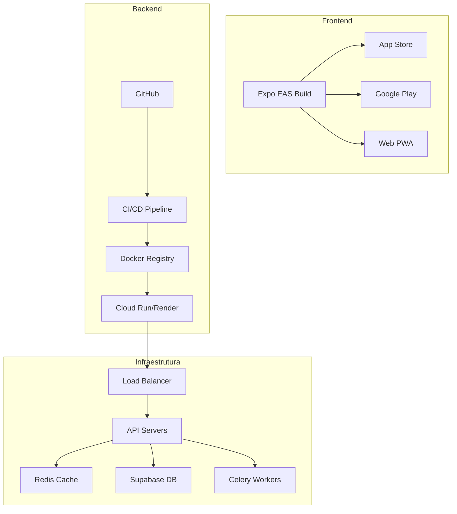

# 🚀 Deploy e Infraestrutura - LITGO5

## 🏗️ Arquitetura de Deploy



## 📱 Deploy Frontend (Expo)

### 1. Configuração EAS

```json
// eas.json
{
  "cli": {
    "version": ">= 5.0.0"
  },
  "build": {
    "development": {
      "developmentClient": true,
      "distribution": "internal",
      "ios": {
        "resourceClass": "m-medium"
      }
    },
    "preview": {
      "distribution": "internal",
      "env": {
        "EXPO_PUBLIC_API_URL": "https://staging-api.litgo.com"
      }
    },
    "production": {
      "env": {
        "EXPO_PUBLIC_API_URL": "https://api.litgo.com"
      },
      "ios": {
        "resourceClass": "m-large"
      },
      "android": {
        "resourceClass": "m-large"
      }
    }
  },
  "submit": {
    "production": {
      "ios": {
        "appleId": "tech@litgo.com",
        "ascAppId": "123456789"
      },
      "android": {
        "serviceAccountKeyPath": "./android-key.json"
      }
    }
  }
}
```

### 2. Build e Deploy

```bash
# Instalar EAS CLI
npm install -g eas-cli

# Login
eas login

# Build desenvolvimento
eas build --platform all --profile development

# Build produção
eas build --platform all --profile production

# Submit para lojas
eas submit --platform ios --profile production
eas submit --platform android --profile production
```

### 3. Over-the-Air Updates

```bash
# Publicar update OTA
eas update --branch production --message "Bug fixes"

# Update com canal específico
eas update --branch production --channel production
```

## ⚙️ Deploy Backend

### 1. Dockerfile Otimizado

```dockerfile
# Dockerfile
FROM python:3.10-slim as builder

# Dependências de build
RUN apt-get update && apt-get install -y \
    gcc \
    g++ \
    && rm -rf /var/lib/apt/lists/*

# Copiar requirements
WORKDIR /app
COPY requirements.txt .

# Instalar dependências
RUN pip install --user --no-cache-dir -r requirements.txt

# Stage final
FROM python:3.10-slim

# Copiar dependências instaladas
COPY --from=builder /root/.local /root/.local

# Copiar código
WORKDIR /app
COPY . .

# Variáveis de ambiente
ENV PATH=/root/.local/bin:$PATH
ENV PYTHONUNBUFFERED=1

# Healthcheck
HEALTHCHECK --interval=30s --timeout=3s --start-period=40s \
  CMD python -c "import requests; requests.get('http://localhost:8000/health')"

# Expor porta
EXPOSE 8000

# Comando
CMD ["gunicorn", "-w", "4", "-k", "uvicorn.workers.UvicornWorker", \
     "main:app", "--bind", "0.0.0.0:8000", "--timeout", "120"]
```

### 2. Docker Compose Produção

```yaml
# docker-compose.prod.yml
version: '3.8'

services:
  api:
    build: 
      context: ./backend
      dockerfile: Dockerfile
    environment:
      - ENVIRONMENT=production
      - DATABASE_URL=${DATABASE_URL}
      - REDIS_URL=redis://redis:6379/0
    ports:
      - "8000:8000"
    depends_on:
      - redis
    deploy:
      replicas: 3
      resources:
        limits:
          cpus: '1'
          memory: 1G
        reservations:
          cpus: '0.5'
          memory: 512M

  worker:
    build: 
      context: ./backend
      dockerfile: Dockerfile
    command: celery -A celery_app worker --loglevel=info
    environment:
      - ENVIRONMENT=production
      - DATABASE_URL=${DATABASE_URL}
      - REDIS_URL=redis://redis:6379/0
    depends_on:
      - redis
    deploy:
      replicas: 2

  redis:
    image: redis:7-alpine
    volumes:
      - redis_data:/data
    deploy:
      resources:
        limits:
          memory: 512M

  nginx:
    image: nginx:alpine
    ports:
      - "80:80"
      - "443:443"
    volumes:
      - ./nginx.conf:/etc/nginx/nginx.conf
      - ./ssl:/etc/nginx/ssl
    depends_on:
      - api

volumes:
  redis_data:
```

### 3. Deploy no Cloud Run

```bash
# Build e push para Google Container Registry
gcloud builds submit --tag gcr.io/litgo-project/litgo-api

# Deploy no Cloud Run
gcloud run deploy litgo-api \
  --image gcr.io/litgo-project/litgo-api \
  --platform managed \
  --region us-central1 \
  --allow-unauthenticated \
  --set-env-vars="ENVIRONMENT=production" \
  --min-instances=1 \
  --max-instances=10 \
  --memory=1Gi \
  --cpu=1
```

### 4. Deploy no Render

```yaml
# render.yaml
services:
  - type: web
    name: litgo-api
    env: docker
    dockerfilePath: ./backend/Dockerfile
    dockerContext: ./backend
    envVars:
      - key: ENVIRONMENT
        value: production
      - key: DATABASE_URL
        fromDatabase:
          name: litgo-db
          property: connectionString
    scaling:
      minInstances: 1
      maxInstances: 10
      targetMemoryPercent: 80
      targetCPUPercent: 80

  - type: worker
    name: litgo-worker
    env: docker
    dockerCommand: celery -A celery_app worker
    envVars:
      - key: REDIS_URL
        fromService:
          type: redis
          name: litgo-redis
          property: connectionString

  - type: redis
    name: litgo-redis
    plan: starter
    maxmemoryPolicy: allkeys-lru

databases:
  - name: litgo-db
    plan: starter
```

## 🔧 Configuração de Infraestrutura

### 1. Nginx Configuration

```nginx
# nginx.conf
upstream api {
    least_conn;
    server api:8000 max_fails=3 fail_timeout=30s;
}

server {
    listen 80;
    server_name api.litgo.com;
    return 301 https://$server_name$request_uri;
}

server {
    listen 443 ssl http2;
    server_name api.litgo.com;

    ssl_certificate /etc/nginx/ssl/cert.pem;
    ssl_certificate_key /etc/nginx/ssl/key.pem;

    # Security headers
    add_header X-Frame-Options "SAMEORIGIN" always;
    add_header X-Content-Type-Options "nosniff" always;
    add_header X-XSS-Protection "1; mode=block" always;

    # Rate limiting
    limit_req_zone $binary_remote_addr zone=api:10m rate=10r/s;
    limit_req zone=api burst=20 nodelay;

    location / {
        proxy_pass http://api;
        proxy_set_header Host $host;
        proxy_set_header X-Real-IP $remote_addr;
        proxy_set_header X-Forwarded-For $proxy_add_x_forwarded_for;
        proxy_set_header X-Forwarded-Proto $scheme;
        
        # Timeouts
        proxy_connect_timeout 60s;
        proxy_send_timeout 60s;
        proxy_read_timeout 60s;
    }

    # Health check endpoint
    location /health {
        access_log off;
        proxy_pass http://api/health;
    }
}
```

### 2. Monitoramento e Alertas

```yaml
# prometheus.yml
global:
  scrape_interval: 15s

scrape_configs:
  - job_name: 'litgo-api'
    static_configs:
      - targets: ['api:8000']
    metrics_path: '/metrics'

  - job_name: 'redis'
    static_configs:
      - targets: ['redis:6379']

# Alertas
rule_files:
  - 'alerts.yml'

# alerts.yml
groups:
  - name: litgo
    rules:
      - alert: HighErrorRate
        expr: rate(http_requests_total{status=~"5.."}[5m]) > 0.05
        for: 5m
        annotations:
          summary: "High error rate detected"

      - alert: HighLatency
        expr: histogram_quantile(0.95, http_request_duration_seconds_bucket) > 3
        for: 5m
        annotations:
          summary: "High API latency"
```

### 3. Backup e Disaster Recovery

```bash
#!/bin/bash
# backup.sh

# Backup Supabase
pg_dump $DATABASE_URL > backup_$(date +%Y%m%d_%H%M%S).sql

# Upload para S3
aws s3 cp backup_*.sql s3://litgo-backups/db/

# Backup Redis
redis-cli --rdb /tmp/redis_backup.rdb
aws s3 cp /tmp/redis_backup.rdb s3://litgo-backups/redis/

# Limpeza de backups antigos (manter 30 dias)
find s3://litgo-backups/ -mtime +30 -delete
```

## 📊 CI/CD Pipeline

### GitHub Actions Workflow

```yaml
# .github/workflows/deploy.yml
name: Deploy

on:
  push:
    branches: [main]

env:
  REGISTRY: gcr.io
  IMAGE_NAME: litgo-project/litgo-api

jobs:
  test:
    runs-on: ubuntu-latest
    steps:
      - uses: actions/checkout@v3
      
      - name: Set up Python
        uses: actions/setup-python@v4
        with:
          python-version: '3.10'
      
      - name: Install dependencies
        run: |
          cd backend
          pip install -r requirements.txt
          pip install pytest pytest-cov
      
      - name: Run tests
        run: |
          cd backend
          python -m pytest tests/ -v --cov

  build-and-deploy:
    needs: test
    runs-on: ubuntu-latest
    steps:
      - uses: actions/checkout@v3
      
      - name: Set up Cloud SDK
        uses: google-github-actions/setup-gcloud@v1
        with:
          service_account_key: ${{ secrets.GCP_SA_KEY }}
          project_id: ${{ secrets.GCP_PROJECT_ID }}
      
      - name: Build and push Docker image
        run: |
          gcloud auth configure-docker
          docker build -t $REGISTRY/$IMAGE_NAME:$GITHUB_SHA ./backend
          docker push $REGISTRY/$IMAGE_NAME:$GITHUB_SHA
      
      - name: Deploy to Cloud Run
        run: |
          gcloud run deploy litgo-api \
            --image $REGISTRY/$IMAGE_NAME:$GITHUB_SHA \
            --region us-central1 \
            --platform managed
```

## 🔒 Segurança em Produção

### 1. Secrets Management

```bash
# Google Secret Manager
gcloud secrets create db-url --data-file=db-url.txt
gcloud secrets create anthropic-key --data-file=anthropic-key.txt

# Usar no Cloud Run
gcloud run services update litgo-api \
  --set-secrets="DATABASE_URL=db-url:latest"
```

### 2. SSL/TLS Configuration

```bash
# Gerar certificados Let's Encrypt
certbot certonly --standalone -d api.litgo.com -d www.litgo.com

# Auto-renovação
0 0 * * * /usr/bin/certbot renew --quiet
```

### 3. Firewall Rules

```bash
# Permitir apenas CloudFlare IPs
for ip in $(curl https://www.cloudflare.com/ips-v4); do
  gcloud compute firewall-rules create allow-cf-$ip \
    --allow tcp:443 \
    --source-ranges $ip
done
```

## 📈 Escalabilidade

### Horizontal Pod Autoscaling

```yaml
# hpa.yaml
apiVersion: autoscaling/v2
kind: HorizontalPodAutoscaler
metadata:
  name: litgo-api-hpa
spec:
  scaleTargetRef:
    apiVersion: apps/v1
    kind: Deployment
    name: litgo-api
  minReplicas: 2
  maxReplicas: 10
  metrics:
  - type: Resource
    resource:
      name: cpu
      target:
        type: Utilization
        averageUtilization: 70
  - type: Resource
    resource:
      name: memory
      target:
        type: Utilization
        averageUtilization: 80
```

### Load Testing

```python
# locustfile.py
from locust import HttpUser, task, between

class LitgoLoadTest(HttpUser):
    wait_time = between(1, 3)
    
    @task(3)
    def triage(self):
        self.client.post("/api/triage", json={
            "texto_cliente": "Teste de carga",
            "coords": [-23.5505, -46.6333]
        })
    
    @task(1)
    def health_check(self):
        self.client.get("/health")
```

---

**Última atualização:** Janeiro 2025  
**Status:** Production-ready
