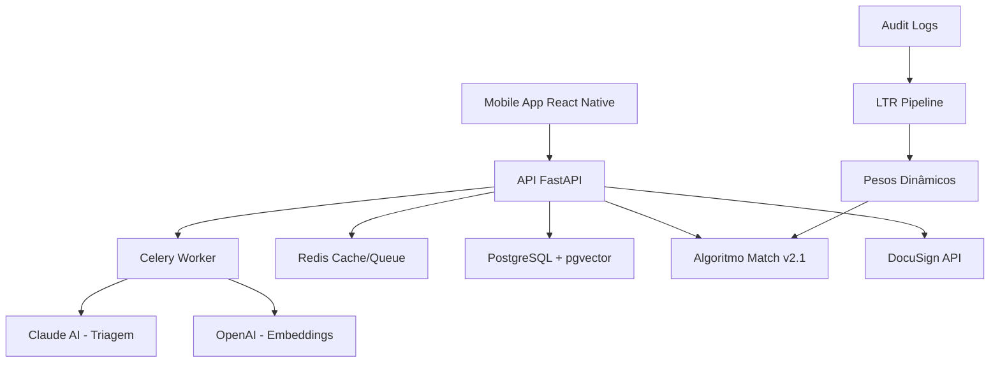

# 🚀 LITGO5 - Sistema de Match Jurídico Inteligente

## 🎯 Visão Geral

O **LITGO5** é uma plataforma inovadora que conecta clientes a advogados especializados através de inteligência artificial. Utilizando algoritmos avançados de matching e processamento de linguagem natural, oferecemos a solução mais eficiente para encontrar representação jurídica qualificada.

### ✨ Principais Funcionalidades

- **🤖 Triagem Inteligente**: Análise automática de casos com Claude AI
- **🎯 Match Preciso**: Algoritmo proprietário com 7 dimensões de análise
- **💡 Explicações IA**: Justificativas personalizadas para cada recomendação
- **⚡ Processamento Assíncrono**: Arquitetura escalável com filas Celery
- **📊 Learning-to-Rank**: Sistema de aprendizado contínuo via feedback
- **📝 Contratos Digitais**: Sistema completo com DocuSign
- **🔒 Segurança Avançada**: JWT, rate limiting e validação robusta

---

## 🏗️ Arquitetura do Sistema



### Stack Tecnológica

**Backend:**
- Python 3.10+ | FastAPI | Celery | Redis
- PostgreSQL + pgvector | Supabase
- Claude 3.5 Sonnet | OpenAI Embeddings
- DocuSign eSignature API | JWT Authentication

**Frontend:**
- React Native | Expo SDK 53+
- TypeScript | NativeWind
- Expo Router | Context API

**DevOps:**
- Docker + Docker Compose
- GitHub Actions | Render/Railway

---

## 🚀 Quick Start

### 1. Pré-requisitos
- Docker Desktop (obrigatório)
- Node.js 18+
- Git

### 2. Configuração Rápida

```bash
# Clone do repositório
git clone <repository-url>
cd LITGO5

# Configurar ambiente
cp env.example .env
# Editar .env com suas chaves de API
```

### 3. Executar com Docker (Recomendado)

```bash
# Abrir Docker Desktop primeiro
open -a Docker

# Aguardar Docker inicializar e executar
docker-compose up -d db redis api worker

# Verificar se API está funcionando
curl http://localhost:8080/
# Resposta: {"status":"ok","message":"Bem-vindo à API LITGO!"}

# Iniciar frontend
npm install
npm run dev
# Expo abrirá em http://localhost:8081
```

### 4. Portas dos Serviços
- **API FastAPI**: `http://localhost:8080`
- **Frontend Expo**: `http://localhost:8081`
- **PostgreSQL**: `localhost:54326`
- **Redis**: `localhost:6379`

---

## 🤖 Algoritmo de Match v2.1

### Features Calculadas (7 Dimensões)
- **A (Area Match)**: Correspondência de área jurídica (0-1)
- **S (Similarity)**: Similaridade de casos via embeddings (0-1)
- **T (Taxa de Êxito)**: Taxa de sucesso histórica (0-1)
- **G (Geografia)**: Proximidade geográfica (0-1)
- **Q (Qualificação)**: Experiência + títulos + publicações (0-1)
- **U (Urgência)**: Capacidade de resposta rápida (0-1)
- **R (Reviews)**: Avaliações dos clientes (0-1)

### Sistema de Pesos Dinâmicos (LTR)

O algoritmo utiliza **Learning-to-Rank** para otimizar automaticamente os pesos baseado no feedback real:

```python
# Pesos atuais (exemplo após treinamento)
{
    "A": 0.40,  # Área jurídica (mais importante)
    "S": 0.10,  # Similaridade de casos  
    "T": 0.20,  # Taxa de êxito
    "G": 0.05,  # Geografia
    "Q": 0.15,  # Qualificação
    "U": 0.05,  # Urgência
    "R": 0.05   # Reviews
}
```

### Recarregamento de Pesos
```bash
# Recarrega pesos sem reiniciar a aplicação
curl -X POST http://localhost:8080/api/internal/reload_weights
```

---

## 📊 Pipeline de Learning-to-Rank

### 1. Coleta de Dados
O sistema registra automaticamente:
- Recomendações feitas (`AUDIT_LOGGER`)
- Feedback dos usuários (aceite/recusa de ofertas)
- Resultados de contratos (ganho/perdido)

### 2. ETL e Treinamento
```bash
# ETL: Converte logs em dataset
python backend/jobs/ltr_export.py

# Treina modelo LightGBM Ranker
python backend/jobs/ltr_train.py

# Novos pesos salvos em backend/models/ltr_weights.json
```

### 3. Aplicação Automática
- Algoritmo carrega novos pesos dinamicamente
- Melhoria contínua da qualidade das recomendações
- Endpoint `/internal/reload_weights` para atualizações

---

## 🔥 Funcionalidades Principais

### 1. Triagem Inteligente
```typescript
// Triagem assíncrona com Claude AI
const response = await fetch('/api/triage', {
  method: 'POST',
  headers: { 'Authorization': 'Bearer <token>' },
  body: JSON.stringify({
    texto_cliente: "Fui demitido sem justa causa...",
    coords: [-23.5505, -46.6333]
  })
});
// Retorna: { task_id: "abc123", status: "accepted" }
```

### 2. Match de Advogados
```typescript
// Buscar advogados compatíveis
const matches = await fetch('/api/match', {
  method: 'POST',
  body: JSON.stringify({
    case_id: "case-123",
    k: 5
  })
});
// Retorna lista rankeada com scores detalhados
```

### 3. Explicações Personalizadas
```typescript
// Obter explicações IA para recomendações
const explanations = await fetch('/api/explain', {
  method: 'POST', 
  body: JSON.stringify({
    case_id: "case-123",
    lawyer_ids: ["lw-001", "lw-002"]
  })
});
// Retorna explicações humanizadas para cada advogado
```

---

## 📝 Sistema de Contratos Digitais

### Funcionalidades de Contratos

- **✍️ Assinatura Digital**: Integração completa com DocuSign
- **📄 Geração Automática**: Templates profissionais de contratos
- **🔄 Sincronização**: Status em tempo real entre plataforma e DocuSign
- **💼 Modelos de Honorários**: Êxito, fixo e por hora
- **📊 Auditoria Completa**: Rastreamento de todas as ações

### Configuração DocuSign

```bash
# Ativar DocuSign
USE_DOCUSIGN=true

# Configurações DocuSign
DOCUSIGN_BASE_URL=https://demo.docusign.net
DOCUSIGN_API_KEY=your_integration_key_here
DOCUSIGN_ACCOUNT_ID=your_account_id_here
DOCUSIGN_USER_ID=your_user_id_here
DOCUSIGN_PRIVATE_KEY=your_private_key_here
```

---

## 🧪 Testes e Qualidade

### Executar Testes

```bash
# Backend
cd backend
TESTING=true python -m pytest tests/ -v

# Frontend
npm run lint
npx tsc --noEmit

# Cobertura
python -m pytest tests/ --cov=backend --cov-report=html
```

### Monitoramento
- **Logs estruturados**: JSON em `logs/audit.log`
- **Métricas**: Prometheus em `/metrics`
- **Health Check**: GET `/`

---

## 📚 Documentação Completa

### 📖 Documentação Principal
- **[🤖 Algoritmo de Match](./Algoritmo/Algoritmo.md)** - Documentação do algoritmo v2.1
- **[📊 Pipeline LTR](./Algoritmo/LTR_Pipeline.md)** - Learning-to-Rank detalhado
- **[🏗️ Arquitetura Assíncrona](./Algoritmo/Async_architecture.md)** - Fluxos e componentes
- **[📡 Documentação da API](./API_DOCUMENTATION.md)** - Endpoints e schemas

### 🔧 Correções e Melhorias
- **[🚨 Correções Críticas](./CORRECOES_CRITICAS.md)** - Problemas identificados e soluções
- **[✅ Correções Aplicadas](./CORRECOES_APLICADAS.md)** - Histórico de correções
- **[📊 Status das Correções](./STATUS_CORRECOES.md)** - Acompanhamento de implementações

### 🧠 IA e Algoritmos
- **[🔍 Triagem com LLM](./Algoritmo/LLM-triage.md)** - Especificação da triagem inteligente
- **[💡 Explicações IA](./Algoritmo/LLM-explanation.md)** - Sistema de explicações
- **[📊 Job Jusbrasil](./Algoritmo/Jusbrasil_job.md)** - Sincronização de dados oficiais

---

## 📊 Status do Projeto

### ✅ Implementado e Funcionando
- [x] Backend FastAPI com endpoints principais
- [x] Frontend React Native/Expo funcional
- [x] Algoritmo de match v2.1 estável com LTR
- [x] Processamento assíncrono com Celery
- [x] Integração com Claude AI e OpenAI
- [x] PostgreSQL + pgvector + Redis
- [x] Sistema de autenticação JWT
- [x] Docker Compose funcional
- [x] Pipeline de Learning-to-Rank
- [x] Pesos dinâmicos do algoritmo

### 🔄 Em Progresso
- [ ] Correção de conflitos de rotas no Expo
- [ ] Atualização de dependências do Expo
- [ ] Implementação da API Jusbrasil real
- [ ] Cobertura completa de testes

### 🎯 Próximos Passos
- [ ] Deploy em produção (Render + EAS)
- [ ] Monitoramento e métricas avançadas
- [ ] Cache Redis inteligente
- [ ] CI/CD automatizado

---

## 🔧 Configuração de Ambiente

### Variáveis de Ambiente Essenciais

```bash
# APIs de IA
ANTHROPIC_API_KEY=sk-ant-api03-your-key
OPENAI_API_KEY=sk-your-openai-key

# Supabase
SUPABASE_URL=https://your-project.supabase.co
SUPABASE_SERVICE_KEY=your-service-role-key
EXPO_PUBLIC_SUPABASE_ANON_KEY=your-anon-key

# Redis (para Docker)
REDIS_URL=redis://redis:6379/0
CELERY_BROKER_URL=redis://redis:6379/0

# URLs da API
EXPO_PUBLIC_API_URL=http://localhost:8080/api
API_BASE_URL=http://localhost:8080
```

---

## 🚀 Deploy e Produção

### Backend (Render/Railway)

```bash
# Build Docker
docker build -t litgo-backend -f backend/Dockerfile .

# Deploy automático via GitHub
# 1. Conectar repositório GitHub
# 2. Configurar variáveis de ambiente
# 3. Deploy automático
```

### Frontend (Expo EAS)

```bash
# Configurar EAS
eas login
eas build:configure

# Build para produção
eas build --platform all

# Submit para stores
eas submit --platform all
```

---

## 🤝 Contribuindo

### Fluxo de Desenvolvimento

1. **Fork** do repositório
2. **Clone** sua fork: `git clone <sua-fork>`
3. **Branch** para feature: `git checkout -b feature/nova-funcionalidade`
4. **Desenvolver** seguindo os padrões do projeto
5. **Testar**: `npm run lint && pytest tests/`
6. **Commit**: `git commit -m "feat: adicionar nova funcionalidade"`
7. **Push**: `git push origin feature/nova-funcionalidade`
8. **Pull Request** com descrição detalhada

### Padrões de Commit
```bash
feat: nova funcionalidade
fix: correção de bug
docs: atualização de documentação
style: formatação de código
refactor: refatoração sem mudança de funcionalidade
test: adição ou correção de testes
chore: tarefas de manutenção
```

---

## 📞 Suporte e Comunidade

### Links Importantes
- **🐛 Issues**: [GitHub Issues](https://github.com/litgo/litgo5/issues)
- **💬 Discussões**: [GitHub Discussions](https://github.com/litgo/litgo5/discussions)
- **📖 Wiki**: [Documentação Técnica](https://github.com/litgo/litgo5/wiki)

---

## 📄 Licença

Este projeto está licenciado sob a **MIT License** - veja o arquivo [LICENSE](./LICENSE) para detalhes.

---

## 🙏 Agradecimentos

- **Anthropic** - Claude AI para triagem inteligente
- **OpenAI** - Embeddings e processamento de linguagem
- **Supabase** - Backend-as-a-Service e pgvector
- **Expo** - Plataforma de desenvolvimento React Native
- **FastAPI** - Framework web moderno para Python
- **Comunidade Open Source** - Bibliotecas e ferramentas incríveis

---

**🌟 Se este projeto foi útil, considere dar uma estrela!**

---

<div align="center">

**LITGO5** - *Conectando Justiça através da Tecnologia*

[](https://github.com/litgo/litgo5)
[](https://python.org)
[](https://reactnative.dev)
[](https://fastapi.tiangolo.com)
[](https://expo.dev)

</div> 