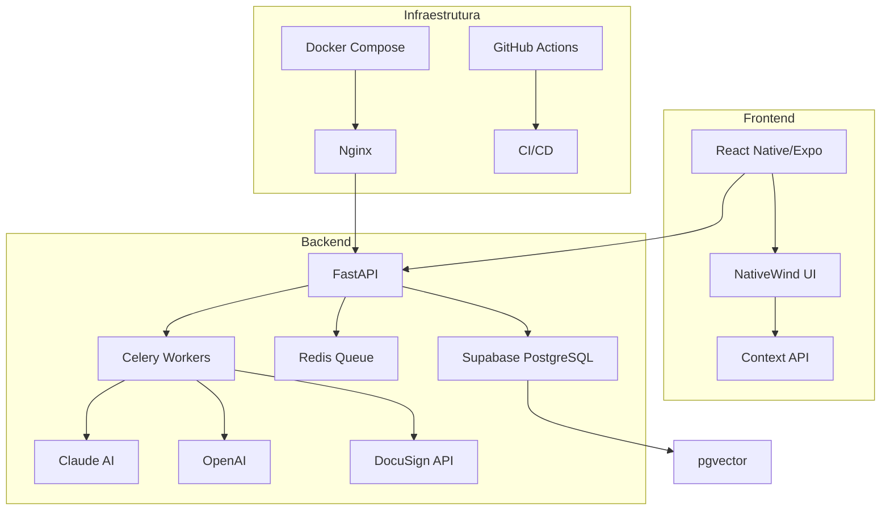

# 📱 LITGO5 - Documentação Técnica Completa

## 🎯 Visão Geral do Sistema

O **LITGO5** é uma plataforma de match jurídico inteligente que conecta clientes a advogados especializados através de algoritmos de IA e análise semântica. O sistema utiliza processamento de linguagem natural (LLM) para triagem de casos e um algoritmo proprietário v2.1 para ranking de advogados.

### 🏆 Características Principais

- **🤖 Triagem Inteligente com IA** - Claude 3.5 Sonnet analisa casos automaticamente
- **🎯 Algoritmo de Match v2.1** - 7 features ponderadas com equidade e clustering
- **📄 Contratos Digitais** - Integração DocuSign para assinatura eletrônica
- **📅 Agendamento Integrado** - Google Calendar para consultas
- **💬 Chat em Tempo Real** - Comunicação cliente-advogado
- **📊 Dashboard Analytics** - Métricas e KPIs em tempo real
- **🔐 Segurança JWT** - Autenticação via Supabase Auth
- **⚡ Processamento Assíncrono** - Celery + Redis para tarefas pesadas

---

## 🏗️ Arquitetura do Sistema

### Diagrama de Arquitetura



### Stack Tecnológica

#### Backend
- **Framework**: FastAPI 0.104+ (Python 3.10+)
- **Banco de Dados**: PostgreSQL 15+ com pgvector
- **Cache/Filas**: Redis 7.0+
- **Processamento**: Celery 5.3+
- **IA/LLM**: 
  - Anthropic Claude 3.5 Sonnet (triagem)
  - OpenAI GPT-4 (embeddings)
- **Integrações**:
  - DocuSign (contratos)
  - Google Calendar (agendamento)
  - Daily.co (videochamadas)

#### Frontend
- **Framework**: React Native + Expo SDK 50
- **Linguagem**: TypeScript 5.3+
- **Navegação**: Expo Router (file-based)
- **Estado**: Context API + Custom Hooks
- **UI**: NativeWind (Tailwind CSS)
- **Formulários**: React Hook Form + Zod

#### DevOps
- **Containerização**: Docker + Docker Compose
- **CI/CD**: GitHub Actions
- **Monitoramento**: Logs JSON estruturados
- **Deploy**: 
  - Backend: Render/Railway
  - Frontend: Expo EAS

---

## 🚀 Setup e Instalação

### Pré-requisitos

```bash
# Ferramentas necessárias
- Node.js 18+ LTS
- Python 3.10+
- Docker & Docker Compose
- Redis 7.0+
- PostgreSQL 15+
- Git
```

### 1. Clonagem e Configuração Inicial

```bash
# Clonar repositório
git clone https://github.com/litgo/litgo5.git
cd LITGO5

# Configurar variáveis de ambiente
cp env.example .env
# Editar .env com suas chaves
```

### 2. Configuração do Backend

```bash
# Criar ambiente virtual Python
cd backend
python -m venv venv
source venv/bin/activate  # Linux/Mac
# venv\Scripts\activate   # Windows

# Instalar dependências
pip install -r requirements.txt

# Executar migrações (se aplicável)
alembic upgrade head
```

### 3. Configuração do Frontend

```bash
# Voltar para raiz
cd ..

# Instalar dependências
npm install

# Instalar Expo CLI globalmente (se necessário)
npm install -g expo-cli
```

### 4. Executar com Docker (Recomendado)

```bash
# Build e execução
docker-compose up --build

# Ou em modo daemon
docker-compose up -d
```

### 5. Executar Manualmente

```bash
# Terminal 1: Redis
docker run -d -p 6379:6379 redis:alpine

# Terminal 2: Backend API
cd backend
uvicorn main:app --reload --port 8000

# Terminal 3: Celery Worker
cd backend
celery -A celery_app worker --loglevel=info

# Terminal 4: Frontend
npx expo start
```

---

## 🧠 Algoritmo de Match v2.1

### Features do Algoritmo

O algoritmo utiliza 7 features ponderadas:

| Feature | Peso | Descrição |
|---------|------|-----------|
| **A** | 30% | Area Match - Compatibilidade de área jurídica |
| **S** | 25% | Similarity - Similaridade semântica de casos |
| **T** | 15% | Taxa de Sucesso - Histórico de vitórias |
| **G** | 10% | Geolocalização - Proximidade física |
| **Q** | 10% | Qualificação - Títulos e experiência |
| **U** | 5% | Urgência - Capacidade de resposta rápida |
| **R** | 5% | Rating - Avaliações de clientes |

### Fluxo do Algoritmo

```python
# 1. Cálculo do Raw Score
raw_score = Σ(weight[i] * feature[i])

# 2. Epsilon Clustering (ε = 5%)
cluster = lawyers where score >= (best_score - ε)

# 3. Aplicação de Equidade (β = 30%)
equity = 1 - (cases_30d / capacity_monthly)
fair_score = (1-β) * raw_score + β * equity

# 4. Ranking Final
sort by fair_score DESC, last_offered_at ASC
```

---

## 📡 API REST

### Endpoints Principais

#### 1. Triagem Inteligente
```http
POST /api/triage
Authorization: Bearer {jwt_token}

{
  "texto_cliente": "Descrição do caso...",
  "coords": [-23.5505, -46.6333]
}

Response: {
  "task_id": "abc123",
  "status": "accepted"
}
```

#### 2. Status da Triagem
```http
GET /api/triage/status/{task_id}
Authorization: Bearer {jwt_token}

Response: {
  "status": "completed",
  "result": {
    "case_id": "case-123",
    "area": "Trabalhista",
    "urgency_h": 48
  }
}
```

#### 3. Match de Advogados
```http
POST /api/match
Authorization: Bearer {jwt_token}

{
  "case_id": "case-123",
  "k": 5
}

Response: {
  "matches": [
    {
      "lawyer_id": "lw-001",
      "nome": "Dr. João Silva",
      "fair": 0.95,
      "features": {...}
    }
  ]
}
```

#### 4. Explicações de Match
```http
POST /api/explain
Authorization: Bearer {jwt_token}

{
  "case_id": "case-123",
  "lawyer_ids": ["lw-001", "lw-002"]
}

Response: {
  "explanations": {
    "lw-001": "Recomendado por: 95% compatibilidade..."
  }
}
```

---

## 🔐 Segurança

### Autenticação JWT

```typescript
// Frontend - Obter token
const { data } = await supabase.auth.signInWithPassword({
  email: 'user@example.com',
  password: 'password'
});

// Usar token nas requisições
fetch('/api/endpoint', {
  headers: {
    'Authorization': `Bearer ${data.session.access_token}`
  }
});
```

### Middleware de Segurança

```python
# Backend - Validar JWT
@app.middleware("http")
async def validate_token(request: Request, call_next):
    token = request.headers.get("Authorization")
    if not token or not verify_jwt(token):
        return JSONResponse({"error": "Unauthorized"}, 401)
    return await call_next(request)
```

### Rate Limiting

- `/api/triage`: 60 requests/minute
- `/api/explain`: 30 requests/minute
- `/api/match`: 60 requests/minute

---

## 📊 Banco de Dados

### Schema Principal

```sql
-- Tabela de casos
CREATE TABLE cases (
    id UUID PRIMARY KEY,
    client_id UUID REFERENCES profiles(id),
    area VARCHAR(100),
    subarea VARCHAR(100),
    urgency_h INTEGER,
    summary TEXT,
    embedding vector(384),
    created_at TIMESTAMP DEFAULT NOW()
);

-- Tabela de advogados
CREATE TABLE lawyers (
    id UUID PRIMARY KEY,
    user_id UUID REFERENCES profiles(id),
    oab VARCHAR(20),
    areas_expertise TEXT[],
    geo_point GEOGRAPHY(POINT),
    kpi JSONB,
    embedding vector(384)
);

-- Tabela de matches
CREATE TABLE matches (
    id UUID PRIMARY KEY,
    case_id UUID REFERENCES cases(id),
    lawyer_id UUID REFERENCES lawyers(id),
    score FLOAT,
    status VARCHAR(50),
    created_at TIMESTAMP DEFAULT NOW()
);
```

### Índices Otimizados

```sql
-- Índice para busca vetorial
CREATE INDEX idx_lawyers_embedding ON lawyers 
USING ivfflat (embedding vector_cosine_ops);

-- Índice geoespacial
CREATE INDEX idx_lawyers_location ON lawyers 
USING GIST (geo_point);

-- Índice para áreas de expertise
CREATE INDEX idx_lawyers_areas ON lawyers 
USING GIN (areas_expertise);
```

---

## 🧪 Testes

### Executar Testes

```bash
# Backend
cd backend
python -m pytest tests/ -v --cov=backend

# Frontend
npm test

# E2E
npm run test:e2e
```

### Estrutura de Testes

```
tests/
├── unit/
│   ├── test_algorithm.py
│   ├── test_triage.py
│   └── test_auth.py
├── integration/
│   ├── test_api.py
│   └── test_database.py
└── e2e/
    └── test_user_flow.py
```

---

## 📈 Monitoramento e Logs

### Logs Estruturados

```json
{
  "timestamp": "2025-01-15T10:30:00Z",
  "level": "INFO",
  "service": "api",
  "message": "Triagem processada",
  "context": {
    "user_id": "user-123",
    "case_id": "case-456",
    "duration_ms": 2500,
    "llm_model": "claude-3-5-sonnet"
  }
}
```

### Métricas Importantes

- **Latência de Triagem**: < 3s (P95)
- **Taxa de Sucesso**: > 99%
- **Uptime API**: > 99.9%
- **Uso de LLM**: Tokens/request

---

## 🚀 Deploy

### Backend (Render/Railway)

```dockerfile
# Dockerfile
FROM python:3.10-slim
WORKDIR /app
COPY requirements.txt .
RUN pip install --no-cache-dir -r requirements.txt
COPY . .
CMD ["gunicorn", "-w", "4", "-k", "uvicorn.workers.UvicornWorker", 
     "main:app", "--bind", "0.0.0.0:8000"]
```

### Frontend (Expo EAS)

```json
// eas.json
{
  "build": {
    "production": {
      "env": {
        "EXPO_PUBLIC_API_URL": "https://api.litgo.com"
      }
    }
  }
}
```

---

## 🐛 Troubleshooting

### Problemas Comuns

#### 1. Redis Connection Error
```bash
# Verificar Redis
redis-cli ping

# Reiniciar Redis
docker restart redis
```

#### 2. LLM Rate Limit
```python
# Implementar retry com backoff
@retry(wait=wait_exponential(multiplier=1, min=4, max=10))
async def call_claude_api():
    # código da chamada
```

#### 3. Database Connection
```bash
# Verificar conexão
psql $DATABASE_URL -c "SELECT 1"

# Verificar pgvector
psql $DATABASE_URL -c "SELECT * FROM pg_extension WHERE extname='vector'"
```

---

## 📚 Recursos Adicionais

### Documentação Relacionada
- [Algoritmo de Match](./Algoritmo/Algoritmo.md)
- [API Documentation](./API_DOCUMENTATION.md)
- [Guia de Desenvolvimento](./GUIA_DESENVOLVIMENTO.md)
- [Arquitetura do Sistema](./ARQUITETURA_SISTEMA.md)

### Links Úteis
- [FastAPI Docs](https://fastapi.tiangolo.com)
- [Expo Documentation](https://docs.expo.dev)
- [Supabase Docs](https://supabase.com/docs)
- [DocuSign API](https://developers.docusign.com)

---

**Última atualização:** Janeiro 2025  
**Versão:** 2.1-stable  
**Mantido por:** Equipe LITGO5

O coração do LITGO é um sistema de match híbrido que combina:
1.  **Análise Semântica**: Triagem de casos via LLMs (Claude 3.5) e busca de similaridade com vetores de embedding (OpenAI `text-embedding-3-small`).
2.  **Features Estruturadas**: Um conjunto de 7 features (A, S, T, G, Q, U, R) que medem desde a adequação da área de atuação até a reputação e disponibilidade do advogado.
3.  **Ranking Ponderado com Equidade**: Um score final que combina as features e aplica um fator de equidade para garantir a distribuição justa de oportunidades.
4.  **Learning-to-Rank (LTR)**: Um pipeline de machine learning que analisa o feedback dos usuários (ofertas aceitas, contratos concluídos) para re-treinar e otimizar os pesos das features, garantindo que o algoritmo melhore continuamente.

#### Observabilidade
O sistema é instrumentado para observabilidade usando o stack Prometheus + Grafana. O backend expõe um endpoint `/metrics` com métricas de latência, volume de requisições, e saúde das tarefas assíncronas.