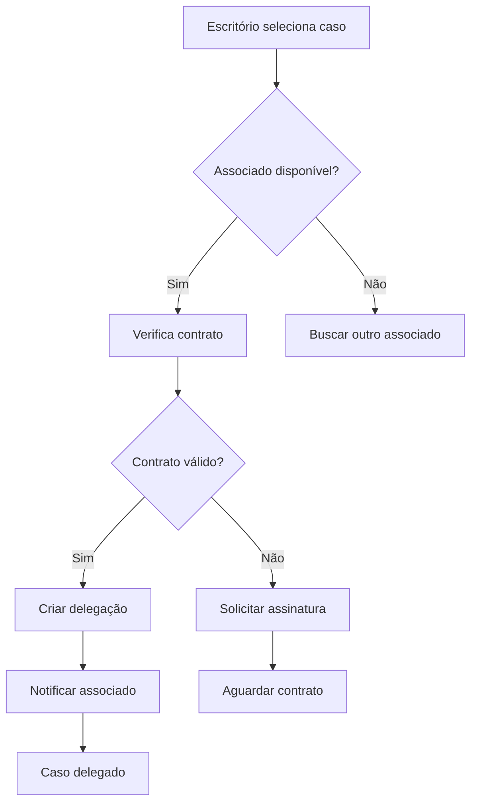
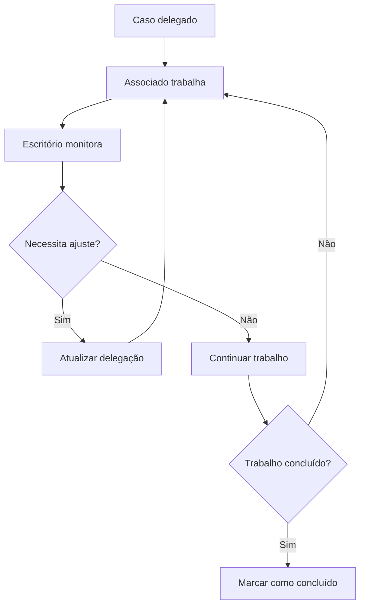
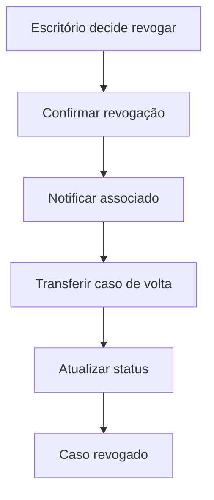

# 📋 Cards para Associados e Delegação de Casos

**Data**: Janeiro 2025  
**Sistema**: LITIG-1  
**Status**: Implementado  

---

## 🎯 **Objetivo**

Documentar a implementação dos cards específicos para **delegação interna** de casos entre **escritórios de advocacia** e seus **advogados associados**.

---

## 🏗️ **Arquitetura de Delegação**

### **Fluxo Hierárquico Único**
```
🏢 ESCRITÓRIO DE ADVOCACIA (Sócio/Principal)
    ↓ (delega casos)
👤 ADVOGADO ASSOCIADO
```

### **Regras de Delegação**
- ✅ **Apenas escritórios** podem delegar casos
- ✅ **Apenas para seus próprios associados**
- ✅ **Delegação é hierárquica** (superior → subordinado)
- ❌ **Associados NÃO podem** delegar para outros
- ❌ **Associados NÃO podem** delegar de volta para escritório
- ❌ **Advogados autônomos** não participam da delegação interna
- ❌ **Superassociados** não delegam (apenas contratam como clientes)

---

## 📱 **Cards Implementados**

### **1. AssociateLawyerCard**

**Arquivo**: `/lib/src/features/lawyers/presentation/widgets/associate_lawyer_card.dart`

#### **Funcionalidades**
- Badge especial identificando o advogado como **"Associado"**
- Informações do **escritório de origem**
- Botão **"Delegar"** (em vez de "Contratar")
- **Validação de contrato** antes da delegação
- **Indicadores de status contratual**:
  - 🔵 **Associado Ativo** (sem contrato necessário)
  - 🟠 **Aguardando Contrato** (contrato pendente)
  - 🟢 **Contrato Assinado** (pronto para delegação)

#### **Uso**
```dart
AssociateLawyerCard(
  lawyer: matchedLawyer,
  isAssociate: true,
  contractRequired: true,
  contractSigned: false,
  firmName: "Escritório Silva & Associados",
  onDelegate: () => _delegateCase(),
  caseId: "case_123",
)
```

#### **Componentes Visuais**
- **Avatar** com badge de associado
- **Bordas coloridas** por status contratual
- **Seção de status** contratual expandível
- **Botões diferenciados** para delegação

### **2. DelegatedCaseCard**

**Arquivo**: `/lib/src/features/cases/presentation/widgets/delegated_case_card.dart`

#### **Funcionalidades**
- Badge **"Caso Delegado"** com cores específicas
- **Informações completas da delegação**:
  - Quem delegou (advogado principal)
  - Para quem foi delegado (associado)
  - Data da delegação
  - Observações da delegação
- **Indicadores de prazo** e urgência
- **Botões de controle**:
  - **Agenda do caso** - Acesso direto à agenda específica do caso
  - Atualizar delegação
  - Revogar delegação
- **Status específicos** para casos delegados

#### **Uso**
```dart
DelegatedCaseCard(
  caseId: "case_123",
  title: "Revisão Contratual",
  delegatedLawyer: associado,
  supervisingLawyer: socio,
  delegationDate: "15/01/2025",
  isUrgent: true,
  deadline: DateTime(2025, 01, 30),
  delegationNotes: "Foco nas cláusulas de rescisão",
  onUpdate: () => _updateDelegation(),
  onRevoke: () => _revokeDelegation(),
  showAgendaButton: true, // NOVO: Inclui botão de agenda
)
```

#### **Status de Delegação**
- 🟠 **Pending/Aguardando** - Delegação criada, aguardando aceite
- 🔵 **Active/Ativo** - Associado trabalhando no caso
- 🟢 **Completed/Concluído** - Trabalho finalizado
- 🔴 **Revoked/Revogado** - Delegação cancelada

---

## 👥 **Perfis de Usuário**

### **Escritórios de Advocacia**
- **Visualizam**: AssociateLawyerCard para selecionar associados
- **Podem**: Delegar casos para seus associados
- **Controlam**: DelegatedCaseCard para monitorar delegações
- **Permissões**: Revogar delegações a qualquer momento

### **Advogados Associados**
- **Recebem**: Casos delegados via sistema interno
- **Visualizam**: Casos como DelegatedCaseCard (visão do associado)
- **Não podem**: Delegar casos para outros
- **Trabalham**: Sob supervisão do escritório

### **Outros Perfis**
- **Advogados Autônomos**: Não participam da delegação interna
- **Superassociados**: Apenas contratam como clientes, não delegam
- **Clientes**: Não têm acesso aos cards de delegação

---

## 🔐 **Controle de Acesso**

### **Permissões por Perfil**
```typescript
// Escritório de Advocacia
permissions: {
  canDelegate: true,
  canRevokeDelegation: true,
  canViewAssociates: true,
  canManageContracts: true
}

// Advogado Associado
permissions: {
  canDelegate: false,
  canRevokeDelegation: false,
  canViewAssociates: false,
  canReceiveDelegations: true
}
```

### **Validações de Segurança**
- Verificação de **hierarquia** (escritório → associado)
- Validação de **contrato ativo** entre as partes
- Confirmação de **permissões** antes de delegar
- **Auditoria** de todas as delegações realizadas

---

## 🎨 **Design System**

### **Cores por Status**
```dart
// Status de Associação
associateActive: AppColors.primaryBlue,     // 🔵
contractPending: AppColors.warning,         // 🟠
contractSigned: AppColors.success,          // 🟢

// Status de Delegação
delegationPending: Colors.orange.shade600,  // 🟠
delegationActive: Colors.blue.shade600,     // 🔵
delegationCompleted: Colors.green.shade600, // 🟢
delegationRevoked: Colors.red.shade600,     // 🔴
```

### **Iconografia**
```dart
// Ícones específicos
associate: LucideIcons.users,           // Associado
delegation: LucideIcons.gitBranchPlus,  // Delegação
contract: LucideIcons.fileSignature,    // Contrato
revoke: LucideIcons.userMinus,          // Revogar
agenda: LucideIcons.calendar,           // Agenda do caso
```

---

## 🔄 **Fluxo de Trabalho**

### **1. Delegação de Caso**


### **2. Acompanhamento**


### **3. Revogação**


---

## 📊 **Métricas e Auditoria**

### **Dados Coletados**
- **Número de delegações** por escritório
- **Tempo médio** de conclusão por associado
- **Taxa de revogação** de delegações
- **Produtividade** dos associados
- **Satisfação** com o trabalho delegado

### **Relatórios Disponíveis**
- Dashboard de delegações ativas
- Histórico de performance dos associados
- Análise de carga de trabalho
- Relatório de contratos pendentes

---

## 🚀 **Implementação Técnica**

### **Arquivos Criados**
```
/lib/src/features/lawyers/presentation/widgets/
├── associate_lawyer_card.dart          # Card para seleção de associados
└── lawyer_match_card.dart              # Card original (sem alterações)

/lib/src/features/cases/presentation/widgets/
├── delegated_case_card.dart            # Card para casos delegados
├── case_card.dart                      # Card atualizado com botão agenda
└── internal_delegation_form.dart       # Formulário existente
```

### **Dependências**
- `cached_network_image` - Para avatars
- `lucide_icons` - Para iconografia
- `go_router` - Para navegação
- Sistema de cores `AppColors` existente

### **Integração com Backend**
- Campo `is_platform_associate` na tabela `lawyers`
- Campos `contract_required` e `contract_signed`
- Sistema de auditoria para delegações
- API endpoints para delegação CRUD

---

## ✅ **Status de Implementação**

### **Concluído**
- ✅ AssociateLawyerCard criado e funcional
- ✅ DelegatedCaseCard criado e funcional
- ✅ **Botão de agenda implementado** em todos os cards de casos
- ✅ Validações de contrato implementadas
- ✅ Sistema de cores e iconografia definido
- ✅ Fluxos de delegação documentados

### **Pendente**
- ⏳ Integração com backend para contratos
- ⏳ Testes automatizados dos componentes
- ⏳ Implementação de notificações
- ⏳ Dashboard de métricas de delegação

---

## 📅 **Funcionalidade de Agenda**

### **Integração com Sistema de Agenda**
Todos os cards de casos (incluindo casos delegados) agora incluem:

- **Botão "Agenda"** com ícone de calendário
- **Navegação direta** para `/case-detail/{caseId}/agenda`
- **Integração** via Unipile SDK com Google Calendar e Outlook (API já disponível)
- **Cor específica** para o botão agenda: `AppColors.success` (verde)

### **Implementação no Código**
```dart
// Em todos os cards de casos
TextButton.icon(
  onPressed: () => context.push('/case-detail/$caseId/agenda'),
  icon: const Icon(LucideIcons.calendar, size: 16),
  label: const Text('Agenda'),
  style: TextButton.styleFrom(
    foregroundColor: AppColors.success,
  ),
),
```

---

## 🔮 **Próximos Passos**

1. **Implementar backend** para gestão de contratos
2. **Criar notificações** para delegações
3. **Desenvolver dashboard** de acompanhamento
4. **Implementar testes** automatizados
5. **Adicionar métricas** de performance
6. **Integrar agenda** com sistema de notificações
7. **Criar documentação** de usuário

---

**📝 Documento elaborado por: Sistema de Análise LITIG-1**  
**📅 Data: Janeiro 2025**  
**🔄 Versão: 1.0**  
**🎯 Status: Documentação Completa**