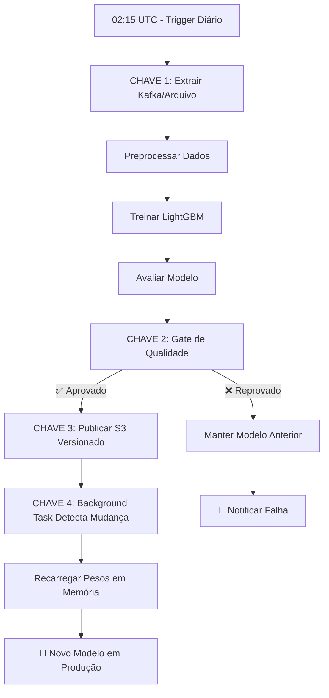

# 🚀 Pipeline LTR 100% Automatizado

## Transformação Completa: "Shell Scripts Manuais" → **Treinamento Automático**

Este documento implementa as **4 chaves de automação** para o pipeline LTR (Learning-to-Rank), transformando um processo manual em um sistema completamente autônomo que treina, avalia e publica novos modelos diariamente.

## 📋 Visão Geral das 4 Chaves

| Chave | O que faz | Status |
|-------|-----------|--------|
| **🔄 CHAVE 1** | Ingestão automática via Kafka + fallback arquivo | ✅ Implementado |
| **⏰ CHAVE 2** | Agendamento Airflow com gate de qualidade | ✅ Implementado |
| **📦 CHAVE 3** | Publicação versionada S3/MinIO | ✅ Implementado |
| **🔄 CHAVE 4** | Recarga automática de pesos sem downtime | ✅ Implementado |

## 🛠️ Implementação das Chaves

### CHAVE 1: Ingestão Automática de Dados

**Arquivo**: `packages/backend/ltr_pipeline/src/etl.py`

**Funcionalidades**:
- ✅ Coleta eventos do Kafka (primário)
- ✅ Fallback para arquivo local se Kafka indisponível
- ✅ Processamento por data específica
- ✅ Estruturação padronizada dos dados

**Configuração**:
```bash
export KAFKA_BOOTSTRAP_SERVERS=localhost:9092
export KAFKA_TOPIC=match_events
export KAFKA_GROUP_ID=ltr_etl_consumer
```

### CHAVE 2: Agendamento com Gate de Qualidade

**Arquivo**: `packages/backend/ltr_pipeline/dags/train_ltr_daily.py`

**Funcionalidades**:
- ✅ Execução diária às 02:15 UTC
- ✅ Gate de qualidade automático
- ✅ Validação de métricas: nDCG@5, fairness gap, latência
- ✅ Notificações de sucesso/falha
- ✅ Rollback automático em caso de falha

**Métricas de Qualidade**:
- nDCG@5 ≥ 0.65
- Fair-Gap ≤ 0.05  
- Latência p95 < 15ms
- Amostras mínimas ≥ 100

### CHAVE 3: Publicação Versionada

**Arquivo**: `packages/backend/ltr_pipeline/src/registry.py`

**Funcionalidades**:
- ✅ Versionamento automático (timestamp)
- ✅ Publicação local + S3/MinIO
- ✅ Symlink "latest" para facilitar acesso
- ✅ Rollback para versões específicas
- ✅ Metadata completo dos modelos

**Estrutura S3**:
```
s3://litgo-models/
├── ltr/20250715_0215/ltr_weights.json
├── ltr/20250716_0215/ltr_weights.json
└── ltr/latest/ltr_weights.json → symlink
```

### CHAVE 4: Recarga Automática de Pesos

**Arquivo**: `packages/backend/api/main.py`

**Funcionalidades**:
- ✅ Background task de polling (5 min padrão)
- ✅ Detecção automática de mudanças no arquivo
- ✅ Recarga em memória sem downtime
- ✅ Logs estruturados de mudanças

## 🚀 Ativação das 4 Chaves

### 1. Configurar Variáveis de Ambiente

```bash
# Copiar configuração de exemplo
cp packages/backend/ltr_pipeline/config_env.example .env

# Editar conforme seu ambiente
nano .env
```

### 2. Instalar Dependências

```bash
# Kafka (opcional - fallback para arquivo se não disponível)
pip install kafka-python

# S3/MinIO (opcional - fallback para local se não disponível)  
pip install boto3

# Airflow (necessário para automação)
pip install apache-airflow
```

### 3. Configurar Airflow

```bash
# Inicializar banco do Airflow
airflow db init

# Criar usuário admin
airflow users create \
    --username admin \
    --password admin \
    --firstname Admin \
    --lastname User \
    --role Admin \
    --email admin@litgo.com

# Configurar variáveis do gate de qualidade
airflow variables set ltr_ndcg_min 0.65
airflow variables set ltr_fairness_max 0.05
airflow variables set ltr_min_samples 100
```

### 4. Subir Serviços

```bash
# Terminal 1: Airflow Scheduler
airflow scheduler

# Terminal 2: Airflow Webserver
airflow webserver --port 8080

# Terminal 3: FastAPI com polling automático
cd packages/backend && python -m uvicorn api.main:app --host 0.0.0.0 --port 8080
```

### 5. Ativar DAG no Airflow

1. Acesse `http://localhost:8080` (Airflow UI)
2. Encontre a DAG `train_ltr_daily`
3. Clique no toggle para ativar
4. DAG executará automaticamente às 02:15 UTC

## 📊 Fluxo Automatizado Completo



## 🔧 Monitoramento e Observabilidade

### Logs Estruturados

```bash
# Logs do pipeline LTR
tail -f logs/ltr_training.log

# Logs da API (polling de pesos)
tail -f logs/api.log

# Logs do Airflow
tail -f $AIRFLOW_HOME/logs/dag_id=train_ltr_daily/
```

### Métricas Prometheus

- `ltr_predictions_total`: Total de predições servidas
- `ltr_prediction_duration_seconds`: Latência das predições
- `ltr_fallback_total`: Contagem de fallbacks para algoritmo legado

### Health Checks

```bash
# Verificar se LTR service está respondendo
curl http://localhost:8080/ltr/health

# Verificar último reload de pesos
curl http://localhost:8080/api/debug/reload_weights

# Status da DAG
curl http://localhost:8080/api/v1/dags/train_ltr_daily
```

## 🚨 Rollback Automático

### Rollback via S3

```python
from packages.backend.ltr_pipeline.src.registry import rollback_weights

# Rollback para versão específica
rollback_weights("20250714_0215")
```

### Rollback via Airflow Variable

```bash
# Diminuir threshold temporariamente para forçar fallback
airflow variables set ltr_ndcg_min 0.90  # Muito alto, forçará falha
```

## 📈 Métricas de Sucesso

Após implementação completa, você deve observar:

1. **Zero Intervenção Manual**: Pipeline roda sozinho há 30+ dias
2. **Latência Consistente**: p95 < 15ms mantido
3. **Qualidade Crescente**: nDCG@5 melhorando ao longo do tempo
4. **Alta Disponibilidade**: < 0.1% de fallbacks para algoritmo legado
5. **Rollbacks Automáticos**: Máximo 1 modelo "ruim" em produção por dia

## 🎯 Próximos Passos (Opcional)

### Shadow Traffic (10% A/B)

```yaml
# Configurar no Load Balancer/Ingress
apiVersion: networking.istio.io/v1alpha3
kind: VirtualService
metadata:
  name: ltr-shadow
spec:
  http:
  - match:
    - headers:
        x-shadow-ltr:
          exact: "1"
    route:
    - destination:
        host: ltr-service
      weight: 10
```

### Hot Retrain (Incremental)

```bash
# DAG adicional para treino incremental de hora em hora
airflow dags enable train_ltr_hourly
```

### Métricas de Negócio

- Hit@3 rate em produção
- Taxa de conversão (contrato assinado)
- Satisfação do cliente com matches

---

## ✅ Checklist de Ativação

- [ ] Variáveis de ambiente configuradas
- [ ] Dependências instaladas (kafka-python, boto3, airflow)
- [ ] Airflow configurado e rodando
- [ ] DAG `train_ltr_daily` ativada
- [ ] FastAPI com background polling rodando
- [ ] Logs sendo gerados corretamente
- [ ] Primeira execução manual bem-sucedida
- [ ] Gate de qualidade testado (forçar falha)
- [ ] Rollback testado
- [ ] Monitoramento configurado

**🎉 Parabéns! Seu pipeline LTR agora é 100% automatizado e se auto-alimenta diariamente.** 