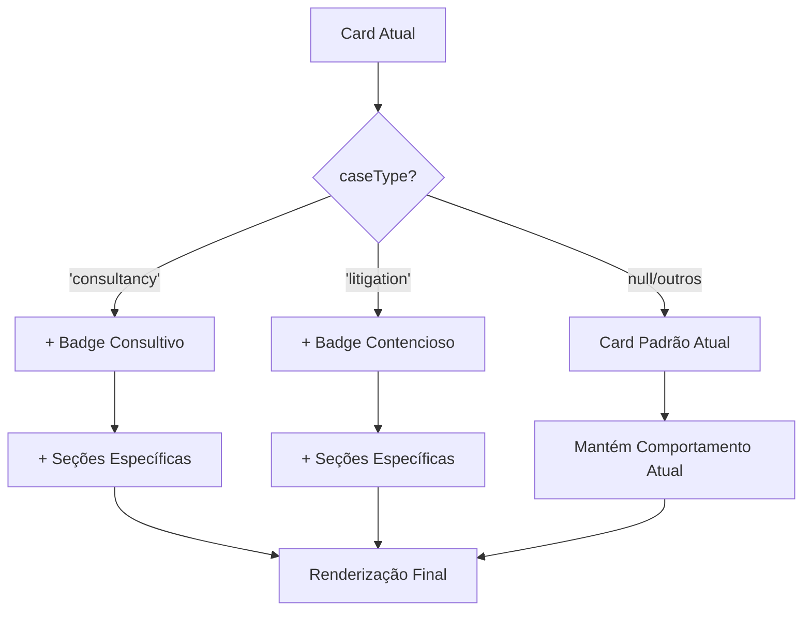

# 📋 PLANO DE AÇÃO: Adaptação de Cards para Consultivo vs Contencioso

**Versão 2.0 | Janeiro 2025**  
**Sistema LITIG-1 | Diferenciação Visual de Tipos de Caso**

---

## 🎯 **OBJETIVO ESTRATÉGICO**

Adaptar os **cards existentes de casos** (clientes e advogados) para diferenciação visual clara entre:

1. **Serviços de Consultoria** - Projetos, pareceres, análises preventivas
2. **Contencioso Tradicional** - Processos judiciais, litígios, representação

**Premissa**: Preservar 100% da implementação atual, fazendo apenas adaptações visuais e de conteúdo nos cards.

---

## 🔍 **ANÁLISE DA IMPLEMENTAÇÃO ATUAL**

### 📋 **Cards Existentes Identificados**

#### **1. CaseCard** (`/features/cases/presentation/widgets/case_card.dart`)
- Card principal usado por **clientes** (incluindo superassociados atuando como clientes)
- Inclui: título, status, advogado, pré-análise IA
- Seções: Corporate case firm recommendation, allocation type badges
- **Nota**: Superassociados visualizam como clientes quando contratam serviços de outros advogados

#### **2. LawyerCaseCard** (`/features/cases/presentation/widgets/lawyer_case_card.dart`)
- Card específico para **advogados** (excluindo superassociados)
- Inclui: nome do cliente, status, honorários, mensagens
- **Restrição**: Superassociados não podem alocar casos, portanto não acessam esta visualização

#### **3. CaseListCard** (`/features/cases/presentation/widgets/case_list_card.dart`)
- Variação para visualização em lista
- Layout similar ao CaseCard principal
- Usado por clientes e superassociados (quando atuam como clientes)

### 🎯 **Campo de Diferenciação Identificado**

#### **Entidade Case Atual**
```dart
class Case {
  final String? caseType;  // ✅ JÁ EXISTE!
  // Valores conhecidos:
  // - 'litigation' → Contencioso
  // - 'consultancy' → Consultivo  
  // - 'contract' → Contratos
}
```

### ❌ **Problemas Identificados**

#### **1. Ausência de Diferenciação Visual**
- **Cards idênticos**: Mesma interface para consultoria e contencioso
- **Linguagem processual**: "Em Andamento", "Pré-Análise da IA" para consultoria
- **Zero indicadores visuais**: Clientes não distinguem tipos de serviço

#### **2. Seções Inadequadas por Tipo**
- **Pré-Análise da IA**: Relevante para contencioso, menos para consultoria
- **Status genéricos**: Não refletem fluxo de consultoria (briefing, desenvolvimento, entrega)
- **Ausência de contexto**: Cards não comunicam natureza do trabalho

---

## 🏗️ **ESTRATÉGIA DE ADAPTAÇÃO**

### **Princípios de Design**
1. **Zero Regressão**: Cards atuais mantêm 100% da funcionalidade
2. **Adaptação Contextual**: Elementos visuais se adaptam ao `caseType`
3. **Implementação Mínima**: Mudanças apenas nos widgets de apresentação
4. **Compatibilidade Total**: Funciona com toda a infraestrutura existente

### **Abordagem de Implementação**


---

## 📊 **EXTENSÕES MÍNIMAS NECESSÁRIAS**

### **1. Extensões da Entidade Case** (Sem Alteração da Estrutura)

```dart
// Adicionar ao arquivo case.dart existente
extension CaseTypeHelpers on Case {
  // Identificadores de tipo
  bool get isConsultivo => caseType == 'consultancy';
  bool get isContencioso => caseType == 'litigation';
  bool get isContrato => caseType == 'contract';
  
  // Configurações visuais (usando AppColors existente)
  Color get typeColor {
    switch (caseType) {
      case 'consultancy': return AppColors.info;
      case 'litigation': return AppColors.error;
      case 'contract': return AppColors.success;
      default: return AppColors.primaryBlue;
    }
  }
  
  IconData get typeIcon {
    switch (caseType) {
      case 'consultancy': return LucideIcons.lightbulb;
      case 'litigation': return LucideIcons.gavel;
      case 'contract': return LucideIcons.fileText;
      default: return LucideIcons.briefcase;
    }
  }
  
  String get typeDisplayName {
    switch (caseType) {
      case 'consultancy': return 'Consultivo';
      case 'litigation': return 'Contencioso';
      case 'contract': return 'Contratos';
      default: return 'Jurídico';
    }
  }
}
```

### **2. Constantes de Apoio**

```dart
// Criar arquivo: /shared/constants/case_type_constants.dart
class CaseTypeConstants {
  static const String consultancy = 'consultancy';
  static const String litigation = 'litigation';
  static const String contract = 'contract';
  
  // Status específicos para consultoria (mapeamento visual)
  static const Map<String, String> consultancyStatusMapping = {
    'OPEN': 'Briefing Inicial',
    'IN_PROGRESS': 'Em Desenvolvimento', 
    'WAITING_CLIENT': 'Aguardando Cliente',
    'REVIEW': 'Em Revisão',
    'DELIVERED': 'Entregue',
    'CLOSED': 'Concluído',
  };
  
  // Status específicos para contencioso (mantém atual)
  static const Map<String, String> litigationStatusMapping = {
    'OPEN': 'Em Andamento',
    'IN_PROGRESS': 'Em Andamento',
    'CLOSED': 'Concluído',
    // outros status atuais...
  };
}

---

## 🎨 **ADAPTAÇÕES DOS CARDS EXISTENTES**

### **1. CaseCard - Adaptações Mínimas**

```dart
// Adaptar o CaseCard existente em /features/cases/presentation/widgets/case_card.dart

// 1. ADICIONAR Badge de Tipo no Header Existente (seguindo padrão _buildAllocationBadge)
Widget _buildTypeHeader() {
  if (caseData?.caseType == null) return const SizedBox.shrink();
  
  return Container(
    margin: const EdgeInsets.only(bottom: 8),
    child: Row(
      children: [
        Container(
          padding: const EdgeInsets.symmetric(horizontal: 8, vertical: 4),
          decoration: BoxDecoration(
            color: caseData!.typeColor.withOpacity(0.1),
            borderRadius: BorderRadius.circular(8), // Seguindo padrão existente
          ),
          child: Row(
            mainAxisSize: MainAxisSize.min,
            children: [
              Icon(
                caseData!.typeIcon,
                size: 14,
                color: caseData!.typeColor,
              ),
              const SizedBox(width: 4),
              Text(
                caseData!.typeDisplayName,
                style: TextStyle(
                  fontSize: 12,
                  fontWeight: FontWeight.w500,
                  color: caseData!.typeColor,
                ),
              ),
            ],
          ),
        ),
        const Spacer(),
        // Mantém elementos existentes do header (urgência, etc.)
      ],
    ),
  );
}

// 2. ADAPTAR Status Display Baseado no Tipo (usando AppStatusColors)
Widget _buildAdaptiveStatus() {
  final statusText = _getStatusDisplayText();
  final statusColor = AppStatusColors.getStatusColor(caseData?.status ?? '');
  
  return Container(
    padding: const EdgeInsets.symmetric(horizontal: 8, vertical: 4),
    decoration: BoxDecoration(
      color: statusColor.withOpacity(0.1),
      borderRadius: BorderRadius.circular(8), // Consistente com badges
    ),
    child: Text(
      statusText,
      style: TextStyle(
        fontSize: 12,
        fontWeight: FontWeight.w500,
        color: statusColor,
      ),
    ),
  );
}

String _getStatusDisplayText() {
  if (caseData?.isConsultivo == true) {
    return CaseTypeConstants.consultancyStatusMapping[caseData?.status] ?? 
           caseData?.status ?? 'Status não definido';
  }
  // Mantém mapeamento atual para contencioso
  return caseData?.status ?? 'Status não definido';
}

// 3. SEÇÕES CONDICIONAIS (Adicionar aos widgets existentes)
Widget _buildContextualSections() {
  return Column(
    children: [
      // Mantém todas as seções atuais
      ...existingSections,
      
      // Adiciona seções específicas por tipo
      if (caseData?.isConsultivo == true) ...[
        _buildConsultancySpecificSection(),
      ],
      
      if (caseData?.isContencioso == true) ...[
        _buildLitigationSpecificSection(),
      ],
    ],
  );
}

Widget _buildConsultancySpecificSection() {
  return Container(
    margin: const EdgeInsets.only(top: 16), // Seguindo padrão de espaçamento
    padding: const EdgeInsets.all(16), // Padrão do card existente
    decoration: BoxDecoration(
      color: AppColors.infoLight, // Usando cor do design system
      borderRadius: BorderRadius.circular(12),
      border: Border.all(
        color: AppColors.info.withOpacity(0.2),
        width: 1,
      ),
    ),
    child: Column(
      crossAxisAlignment: CrossAxisAlignment.start,
      children: [
        Row(
          children: [
            Icon(
              LucideIcons.target,
              size: 16,
              color: AppColors.info, // Usando cor do sistema
            ),
            const SizedBox(width: 8),
            Text(
              'Entregáveis do Projeto',
              style: Theme.of(context).textTheme.titleMedium?.copyWith(
                fontWeight: FontWeight.w600,
              ),
            ),
          ],
        ),
        const SizedBox(height: 8),
        Text(
          'Acompanhe o progresso das entregas previstas para este projeto de consultoria.',
          style: Theme.of(context).textTheme.bodySmall?.copyWith(
            color: AppColors.lightText2,
          ),
        ),
      ],
    ),
  );
}

Widget _buildLitigationSpecificSection() {
  // Mantém seção de Pré-Análise IA apenas para contencioso
  // (seção já existe, apenas condicionar)
  if (shouldShowPreAnalysis()) {
    return _buildExistingPreAnalysisSection();
  }
  return const SizedBox.shrink();
```

### **2. LawyerCaseCard - Adaptações Mínimas**

```dart
// Adaptar o LawyerCaseCard existente em /features/cases/presentation/widgets/lawyer_case_card.dart

// 1. ADICIONAR Badge de Tipo (seguindo padrão compacto para advogados)
Widget _buildLawyerTypeHeader() {
  if (case?.caseType == null) return const SizedBox.shrink();
  
  return Container(
    margin: const EdgeInsets.only(bottom: 8),
    child: Container(
      padding: const EdgeInsets.symmetric(horizontal: 6, vertical: 3),
      decoration: BoxDecoration(
        color: case!.typeColor.withOpacity(0.1),
        borderRadius: BorderRadius.circular(8),
      ),
      child: Row(
        mainAxisSize: MainAxisSize.min,
        children: [
          Icon(case!.typeIcon, size: 12, color: case!.typeColor),
          const SizedBox(width: 4),
          Text(
            case!.typeDisplayName,
            style: TextStyle(
              fontSize: 10,
              fontWeight: FontWeight.w500,
              color: case!.typeColor,
            ),
          ),
        ],
      ),
    ),
  );
}

// 2. ADAPTAR Exibição de Status para Advogados
Widget _buildAdaptiveLawyerStatus() {
  final statusText = case?.isConsultivo == true 
    ? CaseTypeConstants.consultancyStatusMapping[case?.status] ?? case?.status
    : case?.status; // Mantém status atual para contencioso
    
  return Container(
    padding: const EdgeInsets.symmetric(horizontal: 6, vertical: 3),
    decoration: BoxDecoration(
      color: _getStatusColor().withOpacity(0.1),
      borderRadius: BorderRadius.circular(3),
    ),
    child: Text(
      statusText ?? 'Status não definido',
      style: TextStyle(
        fontSize: 11,
        fontWeight: FontWeight.w500,
        color: _getStatusColor(),
      ),
    ),
  );
}

// 3. SEÇÃO ESPECÍFICA PARA ADVOGADOS (usando cores do sistema)
Widget _buildLawyerContextualInfo() {
  if (case?.isConsultivo == true) {
    return Container(
      margin: const EdgeInsets.only(top: 8),
      padding: const EdgeInsets.all(8),
      decoration: BoxDecoration(
        color: AppColors.infoLight,
        borderRadius: BorderRadius.circular(8),
        border: Border.all(
          color: AppColors.info.withOpacity(0.2),
          width: 1,
        ),
      ),
      child: Row(
        children: [
          Icon(LucideIcons.target, size: 12, color: AppColors.info),
          const SizedBox(width: 6),
          Expanded(
            child: Text(
              'Projeto de Consultoria - Foque nas entregas',
              style: TextStyle(
                fontSize: 10,
                fontWeight: FontWeight.w500,
                color: AppColors.lightText,
              ),
            ),
          ),
        ],
      ),
    );
  }
  
  // Para contencioso, mantém informações atuais ou adiciona específicas
  return const SizedBox.shrink();
}
```

### **3. CaseListCard - Adaptações Mínimas**

```dart
// Adaptar o CaseListCard existente para incluir as mesmas diferenciações

// Aplicar as mesmas mudanças:
// 1. Badge de tipo no header
// 2. Status adaptativo
// 3. Seções condicionais reduzidas (formato lista)

Widget _buildListTypeIndicator() {
  if (caseData?.caseType == null) return const SizedBox.shrink();
  
  return Container(
    padding: const EdgeInsets.symmetric(horizontal: 6, vertical: 2),
    decoration: BoxDecoration(
      color: caseData!.typeColor.withOpacity(0.1),
      borderRadius: BorderRadius.circular(8), // Consistente com outros badges
    ),
    child: Row(
      mainAxisSize: MainAxisSize.min,
      children: [
        Icon(caseData!.typeIcon, size: 10, color: caseData!.typeColor),
        const SizedBox(width: 4),
        Text(
          caseData!.typeDisplayName,
          style: TextStyle(
            fontSize: 9,
            fontWeight: FontWeight.w500,
            color: caseData!.typeColor,
          ),
        ),
      ],
    ),
  );
}

```

---

## 🛠️ **IMPLEMENTAÇÃO SIMPLIFICADA**

### **Arquivos a Modificar**

#### **1. Case Extension** (novo arquivo)
```
/lib/src/features/cases/domain/entities/case_extensions.dart
```

#### **2. Case Type Constants** (novo arquivo)
```
/lib/src/shared/constants/case_type_constants.dart
```

#### **3. Cards Existentes** (modificar seguindo padrões existentes)
```
/lib/src/features/cases/presentation/widgets/case_card.dart
/lib/src/features/cases/presentation/widgets/lawyer_case_card.dart  
/lib/src/features/cases/presentation/widgets/case_list_card.dart
```

#### **4. Imports Necessários** (adicionar nos cards)
```dart
import 'package:meu_app/src/shared/utils/app_colors.dart';
import 'package:meu_app/src/shared/constants/case_type_constants.dart';
import 'package:meu_app/src/features/cases/domain/entities/case_extensions.dart';
```

### **🎨 Ajustes para Seguir Padrões Atuais**

#### **Design System Compliance:**
- ✅ **Cores**: Usar `AppColors.info`, `AppColors.error`, `AppColors.success` (não cores hardcoded)
- ✅ **Border Radius**: `BorderRadius.circular(8)` para badges (padrão existente)
- ✅ **Elevation/Shadow**: `elevation: 2, shadowColor: Colors.black26` (igual CaseCard atual)
- ✅ **Spacing**: `margin: 16px/8px`, `padding: 16px` (padrão existente)
- ✅ **Typography**: `Theme.of(context).textTheme` (não TextStyle hardcoded)
- ✅ **Status Colors**: `AppStatusColors.getStatusColor()` (sistema existente)

#### **Component Patterns:**
- ✅ **Badge Structure**: Identical to `_buildAllocationBadge()` pattern
- ✅ **Icon Sizes**: 14px (badges), 16px (actions), 12px (compact) - seguindo padrão
- ✅ **Container Decoration**: Background + border pattern como usado atualmente

### **Checklist de Implementação**

#### **Fase 1: Extensões Base (30 min)**
- [ ] Criar `case_extensions.dart` com helpers de tipo
- [ ] Criar `case_type_constants.dart` com mapeamentos
- [ ] Testar extensões com casos existentes

#### **Fase 2: Adaptação CaseCard (45 min)**
- [ ] Adicionar `_buildTypeHeader()` no header existente
- [ ] Implementar `_buildAdaptiveStatus()` 
- [ ] Criar `_buildConsultancySpecificSection()`
- [ ] Condicionar seção de Pré-Análise IA

#### **Fase 3: Adaptação LawyerCaseCard (30 min)**
- [ ] Adicionar badge de tipo compacto
- [ ] Implementar status adaptativo
- [ ] Adicionar seção contextual para advogados

#### **Fase 4: Adaptação CaseListCard (20 min)**
- [ ] Adicionar indicador de tipo compacto
- [ ] Aplicar status adaptativo
- [ ] Testar layout em listas

#### **Fase 5: Testes e Validação (15 min)**
- [ ] Testar com casos consultivos existentes
- [ ] Testar com casos contenciosos existentes
- [ ] Validar compatibilidade total com funcionalidades atuais

---

## 📊 **BENEFÍCIOS DA ADAPTAÇÃO**

### **Para Clientes**
- ✅ **Clareza Visual**: Identificação imediata do tipo de serviço
- ✅ **Linguagem Apropriada**: Status específicos para consultoria vs contencioso  
- ✅ **Contexto Relevante**: Seções adequadas ao tipo de trabalho
- ✅ **Zero Impacto**: Funcionalidades atuais preservadas 100%
- ✅ **Superassociados**: Interface adequada quando atuam como clientes (cadastro como usuário comum)

### **Para Advogados**
- ✅ **Gestão Otimizada**: Cards adaptados ao fluxo de trabalho específico
- ✅ **Foco Contextual**: Informações relevantes para cada tipo de caso
- ✅ **Eficiência**: Identificação rápida do tipo de trabalho
- ✅ **Produtividade**: Menos tempo procurando informações específicas
- **Nota**: Superassociados não acessam cards de advogado, apenas de cliente quando contratam serviços

### **Para o Sistema**  
- ✅ **Diferenciação**: Interface mais profissional e especializada
- ✅ **Escalabilidade**: Base para futuras expansões de tipos
- ✅ **Manutenibilidade**: Mudanças mínimas, máxima compatibilidade
- ✅ **User Experience**: Melhoria significativa sem complexidade adicional

---

## 🎯 **CONCLUSÃO**

### **Resumo da Adaptação**
A proposta de **adaptação dos cards existentes** para diferenciar consultivo vs contencioso é:

1. **Mínima**: Apenas mudanças visuais nos widgets de apresentação
2. **Compatível**: 100% de compatibilidade com funcionalidades atuais  
3. **Escalável**: Base sólida para futuras expansões de tipos
4. **Rápida**: Implementação em ~2.5 horas de desenvolvimento

### **Investimento vs Retorno**
- **Tempo**: 2.5 horas de desenvolvimento
- **Risco**: Mínimo (apenas mudanças visuais)
- **Benefício**: Experiência de usuário significativamente melhor
- **Impacto**: Zero regressão, máxima diferenciação

### **Próximos Passos**
1. ✅ Aprovação do plano simplificado
2. 🔧 Implementação das extensões de Case
3. 🎨 Adaptação dos 3 cards principais
4. 🧪 Testes com casos existentes
5. 🚀 Deploy gradual

---

**📝 Documento elaborado por: Sistema de Análise LITIG-1**  
**📅 Data: Janeiro 2025**  
**🔄 Versão: 2.0 (Focado em Cards)**  
**🎯 Status: Pronto para Implementação Imediata** 