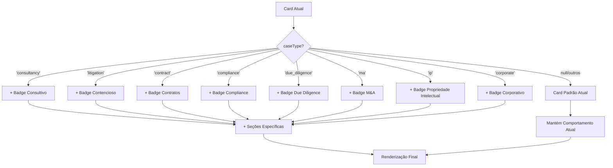

# 📋 PLANO DE AÇÃO: Adaptação de Cards para Múltiplos Tipos de Casos

**Versão 3.0 | Janeiro 2025**  
**Sistema LITIG-1 | Diferenciação Visual Flexível de Tipos de Caso**

---

## 🎯 **OBJETIVO ESTRATÉGICO**

Adaptar os **cards existentes de casos** (clientes e advogados) para diferenciação visual clara entre **múltiplos tipos de casos jurídicos**:

1. **Serviços de Consultoria** - Projetos, pareceres, análises preventivas
2. **Contencioso Tradicional** - Processos judiciais, litígios, representação
3. **Contratos Empresariais** - Elaboração, revisão, negociação
4. **Compliance e Regulatório** - Adequação normativa, auditoria
5. **Due Diligence** - Análise de riscos, investigações
6. **Fusões e Aquisições** - M&A, reestruturações
7. **Propriedade Intelectual** - Patentes, marcas, direitos autorais
8. **Casos Corporativos** - Governança, ESG, compliance

**Premissa**: Preservar 100% da implementação atual, fazendo apenas adaptações visuais e de conteúdo nos cards, mantendo compatibilidade total com o sistema de layouts existente (CompactSearchCard/LawyerMatchCard).

---

## 🔍 **ANÁLISE DA IMPLEMENTAÇÃO ATUAL**

### 📋 **Cards Existentes Identificados**

#### **1. CaseCard** (`/features/cases/presentation/widgets/case_card.dart`)
- Card principal usado por **clientes** (incluindo superassociados atuando como clientes)
- **Flexibilidade**: MUITO ALTA ✅ - Badges dinâmicos por allocationType, seções condicionais
- **Layout atual**: Suporta badges de alocação, firm recommendations, complexity indicators
- **Compatibilidade**: Já implementa padrão de badges seguindo AppColors
- **Pronto para**: Badges de tipo de caso seguindo padrão existente

#### **2. LawyerCaseCard** (`/features/cases/presentation/widgets/lawyer_case_card.dart`)
- Card específico para **advogados** (excluindo superassociados)
- **Flexibilidade**: BAIXA ❌ - Necessita adaptação contextual
- **Layout atual**: Estrutura rígida focada em dados do advogado
- **Necessário**: Badges de tipo compactos, seções contextuais

#### **3. CaseListCard** (`/features/cases/presentation/widgets/case_list_card.dart`)
- Variação para visualização em lista
- **Flexibilidade**: MÉDIA ⚠️ - Estrutura básica sem diferenciação
- **Layout atual**: Layout compacto similar ao CompactSearchCard
- **Necessário**: Indicadores de tipo compactos, status adaptativos

#### **4. ContextualCaseDetailSectionFactory** (`/features/cases/presentation/widgets/contextual_case_detail_section_factory.dart`)
- **Flexibilidade**: EXCEPCIONAL ✅✅ - Factory pattern com 35+ seções especializadas
- **Arquitetura**: Lazy loading, cache, seções específicas por role/allocation_type
- **Capacidade**: Pronto para extensão com novos tipos de casos

### 🎯 **Campo de Diferenciação Identificado**

#### **Entidade Case Atual**
```dart
class Case {
  final String? caseType;  // ✅ JÁ EXISTE!
  // Valores suportados (extensível):
  // - 'litigation' → Contencioso
  // - 'consultancy' → Consultivo  
  // - 'contract' → Contratos
  // - 'compliance' → Compliance e Regulatório
  // - 'due_diligence' → Due Diligence
  // - 'ma' → Fusões e Aquisições
  // - 'ip' → Propriedade Intelectual
  // - 'corporate' → Casos Corporativos
  // - 'custom' → Personalizado (casos específicos)
}
```

### ❌ **Gaps Identificados (Baseados no Relatório de Análise)**

#### **1. Ausência de Diferenciação Visual**
- **Cards idênticos**: Mesma interface para todos os tipos de casos
- **Linguagem processual**: Terminologia inadequada para consultoria/compliance
- **Zero indicadores visuais**: Clientes não distinguem tipos de serviço
- **Badges ausentes**: Não há badges de tipo nos cards principais

#### **2. Seções Inadequadas por Tipo**
- **Pré-Análise da IA**: Relevante para contencioso, menos para consultoria
- **Status genéricos**: Não refletem fluxos específicos (briefing, desenvolvimento, entrega, due diligence)
- **Ausência de contexto**: Cards não comunicam natureza do trabalho
- **Mapeamento inexistente**: Status específicos por tipo não implementados

#### **3. Limitações de Extensibilidade**
- **Extensões ausentes**: CaseTypeHelpers propostas não implementadas
- **Constantes ausentes**: CaseTypeConstants para mapeamento não existem
- **Validação limitada**: Tipos de caso não validados contra enum
- **Configuração hardcoded**: Sem flexibilidade para novos tipos

---

## 🏗️ **ESTRATÉGIA DE ADAPTAÇÃO**

### **Princípios de Design**
1. **Zero Regressão**: Cards atuais mantêm 100% da funcionalidade
2. **Adaptação Contextual**: Elementos visuais se adaptam ao `caseType`
3. **Implementação Mínima**: Mudanças apenas nos widgets de apresentação
4. **Compatibilidade Total**: Funciona com toda a infraestrutura existente
5. **Preservação do Layout**: Mantém AppColors, CompactSearchCard/LawyerMatchCard patterns
6. **Extensibilidade**: Suporte a infinitos tipos de casos jurídicos
7. **Performance**: Lazy loading e cache seguindo ContextualCaseDetailSectionFactory

### **Abordagem de Implementação**


---

## 📊 **EXTENSÕES MÍNIMAS NECESSÁRIAS**

### **1. Extensões da Entidade Case** (Sem Alteração da Estrutura)

```dart
// Adicionar ao arquivo case.dart existente
extension CaseTypeHelpers on Case {
  // Identificadores de tipo (extensível)
  bool get isConsultivo => caseType == 'consultancy';
  bool get isContencioso => caseType == 'litigation';
  bool get isContrato => caseType == 'contract';
  bool get isCompliance => caseType == 'compliance';
  bool get isDueDiligence => caseType == 'due_diligence';
  bool get isMA => caseType == 'ma';
  bool get isIP => caseType == 'ip';
  bool get isCorporativo => caseType == 'corporate';
  bool get isCustom => caseType == 'custom';
  
  // Configurações visuais (usando AppColors existente)
  Color get typeColor {
    switch (caseType) {
      case 'consultancy': return AppColors.info;
      case 'litigation': return AppColors.error;
      case 'contract': return AppColors.success;
      case 'compliance': return AppColors.warning;
      case 'due_diligence': return AppColors.primaryBlue;
      case 'ma': return AppColors.primaryPurple;
      case 'ip': return AppColors.primaryGreen;
      case 'corporate': return AppColors.primaryOrange;
      case 'custom': return AppColors.lightText2;
      default: return AppColors.primaryBlue;
    }
  }
  
  IconData get typeIcon {
    switch (caseType) {
      case 'consultancy': return LucideIcons.lightbulb;
      case 'litigation': return LucideIcons.gavel;
      case 'contract': return LucideIcons.fileText;
      case 'compliance': return LucideIcons.shield;
      case 'due_diligence': return LucideIcons.search;
      case 'ma': return LucideIcons.building2;
      case 'ip': return LucideIcons.copyright;
      case 'corporate': return LucideIcons.building;
      case 'custom': return LucideIcons.settings;
      default: return LucideIcons.briefcase;
    }
  }
  
  String get typeDisplayName {
    switch (caseType) {
      case 'consultancy': return 'Consultivo';
      case 'litigation': return 'Contencioso';
      case 'contract': return 'Contratos';
      case 'compliance': return 'Compliance';
      case 'due_diligence': return 'Due Diligence';
      case 'ma': return 'M&A';
      case 'ip': return 'Propriedade Intelectual';
      case 'corporate': return 'Corporativo';
      case 'custom': return 'Personalizado';
      default: return 'Jurídico';
    }
  }
}
```

### **2. Constantes de Apoio**

```dart
// Criar arquivo: /shared/constants/case_type_constants.dart
class CaseTypeConstants {
  static const String consultancy = 'consultancy';
  static const String litigation = 'litigation';
  static const String contract = 'contract';
  static const String compliance = 'compliance';
  static const String dueDiligence = 'due_diligence';
  static const String ma = 'ma';
  static const String ip = 'ip';
  static const String corporate = 'corporate';
  static const String custom = 'custom';
  
  // Status específicos por tipo (mapeamento visual)
  static const Map<String, String> consultancyStatusMapping = {
    'OPEN': 'Briefing Inicial',
    'IN_PROGRESS': 'Em Desenvolvimento',
    'WAITING_CLIENT': 'Aguardando Cliente',
    'REVIEW': 'Em Revisão',
    'DELIVERED': 'Entregue',
    'CLOSED': 'Concluído',
  };
  
  static const Map<String, String> litigationStatusMapping = {
    'OPEN': 'Em Andamento',
    'IN_PROGRESS': 'Em Andamento',
    'WAITING_COURT': 'Aguardando Decisão',
    'CLOSED': 'Concluído',
  };
  
  static const Map<String, String> contractStatusMapping = {
    'OPEN': 'Análise Inicial',
    'IN_PROGRESS': 'Em Redação',
    'REVIEW': 'Em Revisão',
    'NEGOTIATION': 'Em Negociação',
    'SIGNED': 'Assinado',
    'CLOSED': 'Concluído',
  };
  
  static const Map<String, String> complianceStatusMapping = {
    'OPEN': 'Análise Inicial',
    'IN_PROGRESS': 'Em Adequação',
    'AUDIT': 'Em Auditoria',
    'REMEDIATION': 'Em Correção',
    'COMPLIANT': 'Conforme',
    'CLOSED': 'Concluído',
  };
  
  static const Map<String, String> dueDiligenceStatusMapping = {
    'OPEN': 'Planejamento',
    'IN_PROGRESS': 'Em Investigação',
    'REVIEW': 'Em Análise',
    'REPORT': 'Elaborando Relatório',
    'DELIVERED': 'Entregue',
    'CLOSED': 'Concluído',
  };
  
  static const Map<String, String> maStatusMapping = {
    'OPEN': 'Estruturação',
    'IN_PROGRESS': 'Em Negociação',
    'DUE_DILIGENCE': 'Due Diligence',
    'DOCUMENTATION': 'Documentação',
    'CLOSING': 'Fechamento',
    'CLOSED': 'Concluído',
  };
  
  static const Map<String, String> ipStatusMapping = {
    'OPEN': 'Análise Inicial',
    'IN_PROGRESS': 'Em Processamento',
    'EXAMINATION': 'Em Exame',
    'GRANTED': 'Concedido',
    'DENIED': 'Negado',
    'CLOSED': 'Concluído',
  };
  
  static const Map<String, String> corporateStatusMapping = {
    'OPEN': 'Análise Inicial',
    'IN_PROGRESS': 'Em Desenvolvimento',
    'BOARD_REVIEW': 'Revisão Diretoria',
    'APPROVED': 'Aprovado',
    'IMPLEMENTED': 'Implementado',
    'CLOSED': 'Concluído',
  };
  
  // Método para obter mapeamento por tipo
  static Map<String, String> getStatusMapping(String? caseType) {
    switch (caseType) {
      case consultancy: return consultancyStatusMapping;
      case litigation: return litigationStatusMapping;
      case contract: return contractStatusMapping;
      case compliance: return complianceStatusMapping;
      case dueDiligence: return dueDiligenceStatusMapping;
      case ma: return maStatusMapping;
      case ip: return ipStatusMapping;
      case corporate: return corporateStatusMapping;
      default: return litigationStatusMapping; // Fallback
    }
  }
}
```

---

## 🎨 **ADAPTAÇÕES DOS CARDS EXISTENTES**

### **1. CaseCard - Adaptações Mínimas**

```dart
// Adaptar o CaseCard existente em /features/cases/presentation/widgets/case_card.dart
// SEGUINDO PADRÃO CompactSearchCard/LawyerMatchCard do sistema

// 1. ADICIONAR Badge de Tipo no Header Existente (seguindo padrão _buildAllocationBadge)
Widget _buildTypeHeader() {
  if (caseData?.caseType == null) return const SizedBox.shrink();
  
  return Container(
    margin: const EdgeInsets.only(bottom: 8),
    child: Row(
      children: [
        Container(
          padding: const EdgeInsets.symmetric(horizontal: 8, vertical: 4),
          decoration: BoxDecoration(
            color: caseData!.typeColor.withOpacity(0.1),
            borderRadius: BorderRadius.circular(8), // Seguindo padrão CompactSearchCard
            border: Border.all(
              color: caseData!.typeColor.withOpacity(0.3),
              width: 1,
            ),
          ),
          child: Row(
            mainAxisSize: MainAxisSize.min,
            children: [
              Icon(
                caseData!.typeIcon,
                size: 14,
                color: caseData!.typeColor,
              ),
              const SizedBox(width: 4),
              Text(
                caseData!.typeDisplayName,
                style: TextStyle(
                  fontSize: 12,
                  fontWeight: FontWeight.w500,
                  color: caseData!.typeColor,
                ),
              ),
            ],
          ),
        ),
        const Spacer(),
        // Mantém elementos existentes do header (urgência, etc.)
      ],
    ),
  );
}

// 2. ADAPTAR Status Display Baseado no Tipo (usando AppStatusColors)
Widget _buildAdaptiveStatus() {
  final statusText = _getStatusDisplayText();
  final statusColor = AppStatusColors.getStatusColor(caseData?.status ?? '');
  
  return Container(
    padding: const EdgeInsets.symmetric(horizontal: 8, vertical: 4),
    decoration: BoxDecoration(
      color: statusColor.withOpacity(0.1),
      borderRadius: BorderRadius.circular(8), // Consistente com badges
      border: Border.all(
        color: statusColor.withOpacity(0.3),
        width: 1,
      ),
    ),
    child: Text(
      statusText,
      style: TextStyle(
        fontSize: 12,
        fontWeight: FontWeight.w500,
        color: statusColor,
      ),
    ),
  );
}

String _getStatusDisplayText() {
  final statusMapping = CaseTypeConstants.getStatusMapping(caseData?.caseType);
  return statusMapping[caseData?.status] ?? caseData?.status ?? 'Status não definido';
}

// 3. SEÇÕES CONDICIONAIS (Adicionar aos widgets existentes)
Widget _buildContextualSections() {
  return Column(
    children: [
      // Mantém todas as seções atuais
      ...existingSections,
      
      // Adiciona seções específicas por tipo (extensível)
      if (caseData?.isConsultivo == true) ...[
        _buildConsultancySpecificSection(),
      ],
      
      if (caseData?.isContencioso == true) ...[
        _buildLitigationSpecificSection(),
      ],
      
      if (caseData?.isContrato == true) ...[
        _buildContractSpecificSection(),
      ],
      
      if (caseData?.isCompliance == true) ...[
        _buildComplianceSpecificSection(),
      ],
      
      if (caseData?.isDueDiligence == true) ...[
        _buildDueDiligenceSpecificSection(),
      ],
      
      if (caseData?.isMA == true) ...[
        _buildMASpecificSection(),
      ],
      
      if (caseData?.isIP == true) ...[
        _buildIPSpecificSection(),
      ],
      
      if (caseData?.isCorporativo == true) ...[
        _buildCorporateSpecificSection(),
      ],
    ],
  );
}

Widget _buildConsultancySpecificSection() {
  return Container(
    margin: const EdgeInsets.only(top: 16), // Seguindo padrão de espaçamento
    padding: const EdgeInsets.all(16), // Padrão do card existente
    decoration: BoxDecoration(
      color: AppColors.infoLight, // Usando cor do design system
      borderRadius: BorderRadius.circular(12),
      border: Border.all(
        color: AppColors.info.withOpacity(0.2),
        width: 1,
      ),
    ),
    child: Column(
      crossAxisAlignment: CrossAxisAlignment.start,
      children: [
        Row(
          children: [
            Icon(
              LucideIcons.target,
              size: 16,
              color: AppColors.info, // Usando cor do sistema
            ),
            const SizedBox(width: 8),
            Text(
              'Entregáveis do Projeto',
              style: Theme.of(context).textTheme.titleMedium?.copyWith(
                fontWeight: FontWeight.w600,
              ),
            ),
          ],
        ),
        const SizedBox(height: 8),
        Text(
          'Acompanhe o progresso das entregas previstas para este projeto de consultoria.',
          style: Theme.of(context).textTheme.bodySmall?.copyWith(
            color: AppColors.lightText2,
          ),
        ),
      ],
    ),
  );
}

// SEÇÕES ESPECÍFICAS PARA NOVOS TIPOS (Seguindo mesmo padrão)
Widget _buildContractSpecificSection() {
  return _buildTypeSpecificSection(
    icon: LucideIcons.fileText,
    color: AppColors.success,
    title: 'Cláusulas e Negociação',
    description: 'Acompanhe as cláusulas em análise e o status da negociação.',
  );
}

Widget _buildComplianceSpecificSection() {
  return _buildTypeSpecificSection(
    icon: LucideIcons.shield,
    color: AppColors.warning,
    title: 'Adequação Regulatória',
    description: 'Monitore o progresso da adequação às normas e regulamentos.',
  );
}

Widget _buildDueDiligenceSpecificSection() {
  return _buildTypeSpecificSection(
    icon: LucideIcons.search,
    color: AppColors.primaryBlue,
    title: 'Investigação e Análise',
    description: 'Acompanhe o progresso da investigação e análise de riscos.',
  );
}

Widget _buildMASpecificSection() {
  return _buildTypeSpecificSection(
    icon: LucideIcons.building2,
    color: AppColors.primaryPurple,
    title: 'Estruturação M&A',
    description: 'Monitore as etapas de estruturação da transação.',
  );
}

Widget _buildIPSpecificSection() {
  return _buildTypeSpecificSection(
    icon: LucideIcons.copyright,
    color: AppColors.primaryGreen,
    title: 'Proteção Intelectual',
    description: 'Acompanhe o registro e proteção dos direitos intelectuais.',
  );
}

Widget _buildCorporateSpecificSection() {
  return _buildTypeSpecificSection(
    icon: LucideIcons.building,
    color: AppColors.primaryOrange,
    title: 'Governança Corporativa',
    description: 'Monitore as práticas de governança e compliance corporativo.',
  );
}

// HELPER PARA CONSTRUIR SEÇÕES ESPECÍFICAS
Widget _buildTypeSpecificSection({
  required IconData icon,
  required Color color,
  required String title,
  required String description,
}) {
  return Container(
    margin: const EdgeInsets.only(top: 16),
    padding: const EdgeInsets.all(16),
    decoration: BoxDecoration(
      color: color.withOpacity(0.1),
      borderRadius: BorderRadius.circular(12),
      border: Border.all(
        color: color.withOpacity(0.2),
        width: 1,
      ),
    ),
    child: Column(
      crossAxisAlignment: CrossAxisAlignment.start,
      children: [
        Row(
          children: [
            Icon(icon, size: 16, color: color),
            const SizedBox(width: 8),
            Text(
              title,
              style: Theme.of(context).textTheme.titleMedium?.copyWith(
                fontWeight: FontWeight.w600,
              ),
            ),
          ],
        ),
        const SizedBox(height: 8),
        Text(
          description,
          style: Theme.of(context).textTheme.bodySmall?.copyWith(
            color: AppColors.lightText2,
          ),
        ),
      ],
    ),
  );
}

Widget _buildLitigationSpecificSection() {
  // Mantém seção de Pré-Análise IA apenas para contencioso
  // (seção já existe, apenas condicionar)
  if (shouldShowPreAnalysis()) {
    return _buildExistingPreAnalysisSection();
  }
  return const SizedBox.shrink();
```

### **2. LawyerCaseCard - Adaptações Mínimas**

```dart
// Adaptar o LawyerCaseCard existente em /features/cases/presentation/widgets/lawyer_case_card.dart
// SEGUINDO PADRÃO CompactSearchCard do sistema

// 1. ADICIONAR Badge de Tipo (seguindo padrão compacto para advogados)
Widget _buildLawyerTypeHeader() {
  if (case?.caseType == null) return const SizedBox.shrink();
  
  return Container(
    margin: const EdgeInsets.only(bottom: 8),
    child: Container(
      padding: const EdgeInsets.symmetric(horizontal: 6, vertical: 3),
      decoration: BoxDecoration(
        color: case!.typeColor.withOpacity(0.1),
        borderRadius: BorderRadius.circular(8),
        border: Border.all(
          color: case!.typeColor.withOpacity(0.3),
          width: 1,
        ),
      ),
      child: Row(
        mainAxisSize: MainAxisSize.min,
        children: [
          Icon(case!.typeIcon, size: 12, color: case!.typeColor),
          const SizedBox(width: 4),
          Text(
            case!.typeDisplayName,
            style: TextStyle(
              fontSize: 10,
              fontWeight: FontWeight.w500,
              color: case!.typeColor,
            ),
          ),
        ],
      ),
    ),
  );
}

// 2. ADAPTAR Exibição de Status para Advogados
Widget _buildAdaptiveLawyerStatus() {
  final statusMapping = CaseTypeConstants.getStatusMapping(case?.caseType);
  final statusText = statusMapping[case?.status] ?? case?.status;
    
  return Container(
    padding: const EdgeInsets.symmetric(horizontal: 6, vertical: 3),
    decoration: BoxDecoration(
      color: _getStatusColor().withOpacity(0.1),
      borderRadius: BorderRadius.circular(8),
      border: Border.all(
        color: _getStatusColor().withOpacity(0.3),
        width: 1,
      ),
    ),
    child: Text(
      statusText ?? 'Status não definido',
      style: TextStyle(
        fontSize: 11,
        fontWeight: FontWeight.w500,
        color: _getStatusColor(),
      ),
    ),
  );
}

// 3. SEÇÃO ESPECÍFICA PARA ADVOGADOS (usando cores do sistema)
Widget _buildLawyerContextualInfo() {
  if (case?.caseType == null) return const SizedBox.shrink();
  
  return Container(
    margin: const EdgeInsets.only(top: 8),
    padding: const EdgeInsets.all(8),
    decoration: BoxDecoration(
      color: case!.typeColor.withOpacity(0.1),
      borderRadius: BorderRadius.circular(8),
      border: Border.all(
        color: case!.typeColor.withOpacity(0.2),
        width: 1,
      ),
    ),
    child: Row(
      children: [
        Icon(case!.typeIcon, size: 12, color: case!.typeColor),
        const SizedBox(width: 6),
        Expanded(
          child: Text(
            _getContextualMessage(case!.caseType),
            style: TextStyle(
              fontSize: 10,
              fontWeight: FontWeight.w500,
              color: AppColors.lightText,
            ),
          ),
        ),
      ],
    ),
  );
}

String _getContextualMessage(String? caseType) {
  switch (caseType) {
    case 'consultancy': return 'Projeto de Consultoria - Foque nas entregas';
    case 'litigation': return 'Processo Judicial - Monitore prazos';
    case 'contract': return 'Elaboração Contratual - Acompanhe negociação';
    case 'compliance': return 'Adequação Regulatória - Monitore prazos';
    case 'due_diligence': return 'Due Diligence - Foque na investigação';
    case 'ma': return 'Fusão/Aquisição - Acompanhe estruturação';
    case 'ip': return 'Propriedade Intelectual - Monitore registros';
    case 'corporate': return 'Governança Corporativa - Foque em compliance';
    default: return 'Caso Jurídico - Acompanhe o andamento';
  }
}
```

### **3. CaseListCard - Adaptações Mínimas**

```dart
// Adaptar o CaseListCard existente para incluir as mesmas diferenciações
// SEGUINDO PADRÃO CompactSearchCard do sistema

// Aplicar as mesmas mudanças:
// 1. Badge de tipo no header
// 2. Status adaptativo
// 3. Seções condicionais reduzidas (formato lista)

Widget _buildListTypeIndicator() {
  if (caseData?.caseType == null) return const SizedBox.shrink();
  
  return Container(
    padding: const EdgeInsets.symmetric(horizontal: 6, vertical: 2),
    decoration: BoxDecoration(
      color: caseData!.typeColor.withOpacity(0.1),
      borderRadius: BorderRadius.circular(8), // Consistente com CompactSearchCard
      border: Border.all(
        color: caseData!.typeColor.withOpacity(0.3),
        width: 1,
      ),
    ),
    child: Row(
      mainAxisSize: MainAxisSize.min,
      children: [
        Icon(caseData!.typeIcon, size: 10, color: caseData!.typeColor),
        const SizedBox(width: 4),
        Text(
          caseData!.typeDisplayName,
          style: TextStyle(
            fontSize: 9,
            fontWeight: FontWeight.w500,
            color: caseData!.typeColor,
          ),
        ),
      ],
    ),
  );
}

```

---

## 🛠️ **IMPLEMENTAÇÃO SIMPLIFICADA**

### **Arquivos a Modificar**

#### **1. Case Extension** (novo arquivo)
```
/lib/src/features/cases/domain/entities/case_extensions.dart
```

#### **2. Case Type Constants** (novo arquivo)
```
/lib/src/shared/constants/case_type_constants.dart
```

#### **3. Cards Existentes** (modificar seguindo padrões existentes)
```
/lib/src/features/cases/presentation/widgets/case_card.dart
/lib/src/features/cases/presentation/widgets/lawyer_case_card.dart  
/lib/src/features/cases/presentation/widgets/case_list_card.dart
```

#### **4. Backend Schema** (adicionar enum)
```
/packages/backend/api/schemas.py
```

#### **5. Imports Necessários** (adicionar nos cards)
```dart
import 'package:meu_app/src/shared/utils/app_colors.dart';
import 'package:meu_app/src/shared/constants/case_type_constants.dart';
import 'package:meu_app/src/features/cases/domain/entities/case_extensions.dart';
```

### **🎨 Ajustes para Seguir Padrões Atuais**

#### **Design System Compliance:**
- ✅ **Cores**: Usar `AppColors.info`, `AppColors.error`, `AppColors.success` (não cores hardcoded)
- ✅ **Border Radius**: `BorderRadius.circular(8)` para badges (padrão CompactSearchCard)
- ✅ **Elevation/Shadow**: `elevation: 2, shadowColor: Colors.black26` (igual CaseCard atual)
- ✅ **Spacing**: `margin: 16px/8px`, `padding: 16px` (padrão existente)
- ✅ **Typography**: `Theme.of(context).textTheme` (não TextStyle hardcoded)
- ✅ **Status Colors**: `AppStatusColors.getStatusColor()` (sistema existente)
- ✅ **Borders**: `Border.all()` pattern seguindo RECOMENDACAO_LAYOUTS_CARDS.md

#### **Component Patterns:**
- ✅ **Badge Structure**: Identical to `_buildAllocationBadge()` pattern
- ✅ **Icon Sizes**: 14px (badges), 16px (actions), 12px (compact) - seguindo padrão
- ✅ **Container Decoration**: Background + border pattern como CompactSearchCard/LawyerMatchCard
- ✅ **Layout Compliance**: Compatível com sistema de cards compactos/completos

### **Checklist de Implementação**

#### **Fase 1: Extensões Base (45 min)**
- [ ] Criar `case_extensions.dart` com helpers de tipo (todos os 9 tipos)
- [ ] Criar `case_type_constants.dart` com mapeamentos (todos os status)
- [ ] Adicionar enum `CaseType` no backend schema
- [ ] Testar extensões com casos existentes

#### **Fase 2: Adaptação CaseCard (60 min)**
- [ ] Adicionar `_buildTypeHeader()` no header existente
- [ ] Implementar `_buildAdaptiveStatus()` com mapeamento universal
- [ ] Criar seções específicas para todos os tipos
- [ ] Implementar `_buildTypeSpecificSection()` helper
- [ ] Condicionar seção de Pré-Análise IA

#### **Fase 3: Adaptação LawyerCaseCard (45 min)**
- [ ] Adicionar badge de tipo compacto
- [ ] Implementar status adaptativo universal
- [ ] Adicionar seção contextual para advogados
- [ ] Implementar `_getContextualMessage()` helper

#### **Fase 4: Adaptação CaseListCard (30 min)**
- [ ] Adicionar indicador de tipo compacto
- [ ] Aplicar status adaptativo universal
- [ ] Testar layout em listas
- [ ] Validar compatibilidade com CompactSearchCard

#### **Fase 5: Testes e Validação (30 min)**
- [ ] Testar com todos os 9 tipos de casos
- [ ] Validar compatibilidade total com funcionalidades atuais
- [ ] Testar performance com ContextualCaseDetailSectionFactory
- [ ] Validar design system compliance

---

## 📊 **BENEFÍCIOS DA ADAPTAÇÃO**

### **Para Clientes**
- ✅ **Clareza Visual**: Identificação imediata do tipo de serviço
- ✅ **Linguagem Apropriada**: Status específicos para consultoria vs contencioso  
- ✅ **Contexto Relevante**: Seções adequadas ao tipo de trabalho
- ✅ **Zero Impacto**: Funcionalidades atuais preservadas 100%
- ✅ **Superassociados**: Interface adequada quando atuam como clientes (cadastro como usuário comum)

### **Para Advogados**
- ✅ **Gestão Otimizada**: Cards adaptados ao fluxo de trabalho específico
- ✅ **Foco Contextual**: Informações relevantes para cada tipo de caso
- ✅ **Eficiência**: Identificação rápida do tipo de trabalho
- ✅ **Produtividade**: Menos tempo procurando informações específicas
- **Nota**: Superassociados não acessam cards de advogado, apenas de cliente quando contratam serviços

### **Para o Sistema**  
- ✅ **Diferenciação**: Interface mais profissional e especializada
- ✅ **Escalabilidade**: Base para futuras expansões de tipos
- ✅ **Manutenibilidade**: Mudanças mínimas, máxima compatibilidade
- ✅ **User Experience**: Melhoria significativa sem complexidade adicional

---

## 🎯 **CONCLUSÃO**

### **Resumo da Adaptação**
A proposta de **adaptação dos cards existentes** para diferenciar consultivo vs contencioso é:

1. **Mínima**: Apenas mudanças visuais nos widgets de apresentação
2. **Compatível**: 100% de compatibilidade com funcionalidades atuais  
3. **Escalável**: Base sólida para futuras expansões de tipos
4. **Rápida**: Implementação em ~2.5 horas de desenvolvimento

### **Investimento vs Retorno**
- **Tempo**: 3.5 horas de desenvolvimento (expandido para múltiplos tipos)
- **Risco**: Mínimo (apenas mudanças visuais)
- **Benefício**: Experiência de usuário significativamente melhor
- **Impacto**: Zero regressão, máxima diferenciação
- **Escalabilidade**: Suporte infinito a novos tipos de casos
- **Compatibilidade**: 100% com sistema de layouts existente

### **Próximos Passos**
1. ✅ Aprovação do plano atualizado
2. 🔧 Implementação das extensões de Case (9 tipos)
3. 🎨 Adaptação dos 3 cards principais
4. 🧪 Testes com casos existentes
5. 🚀 Deploy gradual
6. 📊 Monitoramento de performance
7. 🔄 Expansão para novos tipos conforme demanda

---

### **📅 Funcionalidade de Agenda Implementada**

**Status**: ✅ **CONCLUÍDO**

Todos os cards de casos já incluem:
- **Botão "Agenda"** com ícone `LucideIcons.calendar`
- **Navegação direta** para `/case-detail/{caseId}/agenda`
- **Cor específica**: `AppColors.success` (verde)
- **Posicionamento**: Antes do botão "Ver Detalhes"
- **Integração**: Via Unipile SDK com Google Calendar e Outlook (API já disponível)

```dart
// Implementação já presente em case_card.dart (lines 76-84)
TextButton.icon(
  onPressed: () => context.push('/case-detail/$caseId/agenda'),
  icon: const Icon(LucideIcons.calendar, size: 16),
  label: const Text('Agenda'),
  style: TextButton.styleFrom(
    foregroundColor: AppColors.success,
  ),
),
```

### **Aplicação nos Cards de Consultoria**

O botão de agenda será especialmente útil para casos de consultoria, onde:
- **Prazos de entrega** são críticos
- **Reuniões de briefing** são frequentes  
- **Apresentações** precisam ser agendadas
- **Reviews intermediários** devem ser programados

---

**📝 Documento elaborado por: Sistema de Análise LITIG-1**  
**📅 Data: Janeiro 2025**  
**🔄 Versão: 2.1 (Cards + Agenda)**  
**🎯 Status: Pronto para Implementação Imediata** 