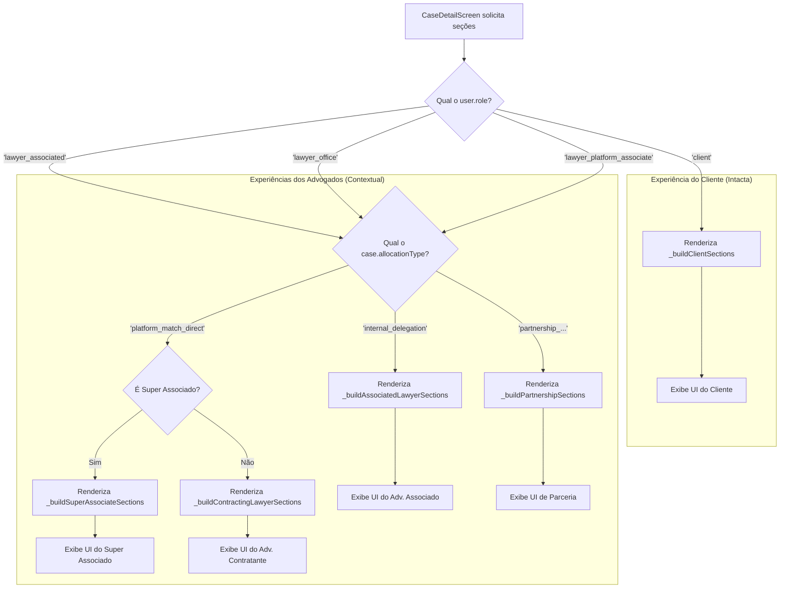

# 🎯 Plano de Ação Final: Ativação e Enriquecimento da Visão de Caso Contextual

**Versão:** 1.0
**Data:** $(date)
**Status:** Aprovado para Implementação

---

## 1. Resumo Executivo Atualizado

Após análise dos documentos de arquitetura (`ARQUITETURA_GERAL_DO_SISTEMA.md`, `PLANO_CONTEXTO_DUPLO_ADVOGADOS.md`, `DUAL_CONTEXT_IMPLEMENTATION_PLAN.md`), identificamos que a funcionalidade "Visão de Caso Contextual" deve ser implementada respeitando a estrutura de perfis já estabelecida e **mantendo a experiência atual do cliente como padrão de referência**.

A `case_detail_screen.dart` atual foi projetada para **clientes** e oferece uma experiência rica e detalhada. Nosso objetivo é **adaptar essa mesma qualidade de experiência** para os outros perfis, contextualizando as informações para suas necessidades específicas de trabalho.

### 🎯 **Estratégia Refinada**

**Base de Referência:** A atual `CaseDetailScreen` do cliente permanece **intacta** e serve como modelo de qualidade
**Adaptação Contextual:** Criar variações contextuais para os perfis de advogados, baseadas nas mesmas seções, mas com dados e KPIs específicos

---

## 2. Perfis de Usuário e Contextos (Baseado na Arquitetura)

### 👤 **Cliente (`client`)** - **MANTER COMO ESTÁ**
- **Experiência atual:** ✅ **Completa e adequada**
- **Seções existentes:** LawyerResponsibleSection, ConsultationInfoSection, PreAnalysisSection, NextStepsSection, DocumentsSection, ProcessStatusSection
- **Ação:** **Nenhuma alteração necessária** - manter como referência de qualidade

### ⚖️ **Advogado Associado (`lawyer_associated`)**
- **Contexto:** Casos recebidos por **delegação interna** do escritório
- **Foco:** Produtividade, execução, registro de horas
- **Allocation Types:** `internal_delegation`

### 🤝 **Advogado Contratante (`lawyer_individual`, `lawyer_office`)**
- **Contexto Duplo:**
  - **Como Contratante:** Casos recebidos via algoritmo/parcerias
  - **Como Cliente:** Casos que eles próprios criaram (via contexto duplo)
- **Foco:** Oportunidade de negócio, gestão de equipe, rentabilidade
- **Allocation Types:** `platform_match_direct`, `partnership_proactive_search`, `partnership_platform_suggestion`

### 🌟 **Super Associado (`lawyer_platform_associate`)**
- **Contexto:** Casos recebidos diretamente do algoritmo da plataforma
- **Foco:** Performance na plataforma, SLA, taxa de conversão
- **Allocation Types:** `platform_match_direct` (contexto específico de plataforma)

---

## 3. Matriz de Contextualização Refinada

### 📋 **Seções Base (Cliente) vs Adaptações Contextuais**

| **Seção do Cliente** | **👤 Cliente** | **⚖️ Adv. Associado** | **🤝 Adv. Contratante** | **🌟 Super Associado** |
|---------------------|----------------|----------------------|------------------------|------------------------|
| `LawyerResponsibleSection` | ✅ Manter | → `InternalTeamSection` | → `ClientContactSection` | → `PlatformOpportunitySection` |
| `ConsultationInfoSection` | ✅ Manter | → `CaseAssignmentSection` | → `BusinessOpportunitySection` | → `MatchExplanationSection` |
| `PreAnalysisSection` | ✅ Manter | → `TaskBreakdownSection` | → `CaseComplexitySection` | → `ClientExpectationSection` |
| `NextStepsSection` | ✅ Manter | → `InternalTasksSection` | → `TeamAllocationSection` | → `DeliveryFrameworkSection` |
| `DocumentsSection` | ✅ Manter | → `WorkDocumentsSection` | → `StrategicDocumentsSection` | → `PlatformDocumentsSection` |
| `ProcessStatusSection` | ✅ Manter | → `TimeTrackingSection` | → `ProfitabilitySection` | → `QualityControlSection` |
| - | - | + `EscalationSection` | + `CompetitorAnalysisSection` | + `NextOpportunitiesSection` |

---

## 4. Estratégia de Implementação Refinada

### 🏗️ **Arquitetura Técnica Baseada em Contexto**

#### **4.1. Factory Pattern Contextual**
```dart
class ContextualCaseDetailSectionFactory {
  static List<Widget> buildSectionsForUser(
    String userRole, 
    String allocationType, 
    CaseDetail caseDetail
  ) {
    // Para clientes: manter experiência atual
    if (userRole == 'client') {
      return _buildClientSections(caseDetail); // EXPERIÊNCIA ATUAL
    }
    
    // Para advogados: usar contexto + allocation_type
    return _buildLawyerSections(userRole, allocationType, caseDetail);
  }
  
  static List<Widget> _buildClientSections(CaseDetail caseDetail) {
    // MANTER A IMPLEMENTAÇÃO ATUAL DA CLIENT EXPERIENCE
    return [
      LawyerResponsibleSection(lawyer: caseDetail.assignedLawyer),
      ConsultationInfoSection(consultation: caseDetail.consultation),
      PreAnalysisSection(preAnalysis: caseDetail.preAnalysis),
      NextStepsSection(nextSteps: caseDetail.nextSteps),
      DocumentsSection(documents: caseDetail.documents, caseId: caseDetail.id),
      ProcessStatusSection(processStatus: caseDetail.processStatus, caseId: caseDetail.id),
    ];
  }
  
  static List<Widget> _buildLawyerSections(
    String userRole, 
    String allocationType, 
    CaseDetail caseDetail
  ) {
    switch (allocationType) {
      case 'internal_delegation':
        return _buildAssociatedLawyerSections(caseDetail);
      case 'platform_match_direct':
        if (userRole == 'lawyer_platform_associate') {
          return _buildSuperAssociateSections(caseDetail);
        } else {
          return _buildContractingLawyerSections(caseDetail);
        }
      case 'partnership_proactive_search':
      case 'partnership_platform_suggestion':
        return _buildPartnershipSections(caseDetail);
      default:
        return _buildDefaultLawyerSections(caseDetail);
    }
  }
}
```

#### **4.2. Reutilização Inteligente de Componentes**
```dart
// Exemplo: Reutilizar a lógica do DocumentsSection, mas com contexto
class WorkDocumentsSection extends StatelessWidget {
  final CaseDetail caseDetail;
  
  Widget build(BuildContext context) {
    return DocumentsSection(
      documents: caseDetail.documents,
      caseId: caseDetail.id,
      context: DocumentContext.work, // Contexto específico
      allowedActions: ['view', 'download', 'addWorkNotes'], // Ações específicas
      groupingStrategy: DocumentGrouping.byWorkPhase, // Agrupamento específico
    );
  }
}
```

#### **4.3. Herança e Especialização de Seções**
```dart
// Base class que herda comportamento do cliente
abstract class BaseInfoSection extends StatelessWidget {
  final CaseDetail caseDetail;
  const BaseInfoSection({required this.caseDetail, super.key});
  
  // Métodos base reutilizáveis da experiência do cliente
  Widget buildInfoRow(IconData icon, String label, String value) {
    // Implementação reutilizada do padrão cliente
  }
}

// Especialização para advogado associado
class CaseAssignmentSection extends BaseInfoSection {
  Widget build(BuildContext context) {
    return Card(
      child: Padding(
        padding: const EdgeInsets.all(20),
        child: Column(
          crossAxisAlignment: CrossAxisAlignment.start,
          children: [
            Text('Informações da Atribuição', style: _titleStyle),
            SizedBox(height: 16),
            buildInfoRow(Icons.person_outline, 'Delegado por', caseDetail.delegatedBy),
            buildInfoRow(Icons.calendar_today, 'Data da Atribuição', caseDetail.assignmentDate),
            buildInfoRow(Icons.timer, 'Prazo Interno', caseDetail.internalDeadline),
            buildInfoRow(Icons.attach_money, 'Valor/Hora', caseDetail.hourlyRate),
          ],
        ),
      ),
    );
  }
}
```

---

## 5. Plano de Implementação por Fases

### 🚀 **Fase 1: Infraestrutura (Semana 1)**
- [ ] Criar `ContextualCaseDetailSectionFactory`
- [ ] Refatorar `CaseDetailScreen` para usar factory **SEM alterar experiência do cliente**
- [ ] Adicionar campo `allocation_type` às entidades (se ainda não existir)
- [ ] **Teste:** Garantir que clientes continuam vendo a mesma experiência

### 🎨 **Fase 2: Seções Especializadas (Semana 2-3)**
- [ ] Implementar seções para **Advogado Associado** (delegation context)
- [ ] Implementar seções para **Advogado Contratante** (business context)
- [ ] Implementar seções para **Super Associado** (platform context)
- [ ] **Teste:** Cada perfil vê seções específicas para seu contexto

### 🔌 **Fase 3: Integração Backend (Semana 4)**
- [ ] Modificar API para retornar dados contextuais baseados no perfil
- [ ] Implementar lógica de `allocation_type` no backend
- [ ] Conectar seções aos dados reais
- [ ] **Teste:** Dados contextuais são carregados corretamente

### ✅ **Fase 4: Validação e Refinamento (Semana 5)**
- [ ] Testes de integração para todos os perfis
- [ ] Ajustes baseados em feedback
- [ ] Otimizações de performance
- [ ] Documentação final

---

## 6. Exemplos de Contextualização Prática

### 📊 **Transformação da PreAnalysisSection**

#### **👤 Cliente (Manter)**
```
[IA Badge] Análise Preliminar por IA
- Prazo Estimado: 15 dias úteis
- Nível de Urgência: 8/10
- Documentos Necessários: Contrato, Carta de Demissão...
- Estimativa de Custos: R$ 350 + R$ 2.500
```

#### **⚖️ Advogado Associado → TaskBreakdownSection**
```
[Escritório Badge] Breakdown de Tarefas
- Responsável: Dr. Silva (Sócio)
- Horas Orçadas: 40h
- Valor por Hora: R$ 150
- Tarefas: Análise Inicial (8h), Petição (16h), Acompanhamento (16h)
```

#### **🤝 Advogado Contratante → CaseComplexitySection**
```
[Negócio Badge] Análise de Complexidade
- Nível de Complexidade: 7/10
- Margem Estimada: R$ 1.200
- Especialização Necessária: Trabalhista + Tributário
- Risco do Cliente: Baixo
```

#### **🌟 Super Associado → ClientExpectationSection**
```
[Plataforma Badge] Expectativas do Cliente
- Score de Match: 94%
- SLA de Resposta: 2h
- Expectativa de Qualidade: Alta
- Budget Range: R$ 2.000 - R$ 3.500
```

---

## 7. Critérios de Sucesso Refinados

### ✅ **Critérios Técnicos**
- [ ] **Cliente:** Experiência **zero alteração** (regressão = 0%)
- [ ] **Advogado Associado:** Vê foco em produtividade e tarefas internas
- [ ] **Advogado Contratante:** Vê foco em oportunidade de negócio
- [ ] **Super Associado:** Vê foco em performance na plataforma
- [ ] **Performance:** Tempo de carregamento < 2s para qualquer perfil

### ✅ **Critérios de Experiência**
- [ ] **Consistência Visual:** Mesmo padrão de design para todos os perfis
- [ ] **Relevância:** Cada perfil vê apenas informações relevantes para seu contexto
- [ ] **Acionabilidade:** Cada seção oferece ações específicas para o perfil
- [ ] **Aprendizado:** Interface intuitiva sem necessidade de treinamento

---

## 8. Riscos e Mitigações Atualizados

### ⚠️ **Risco Alto: Regressão na Experiência do Cliente**
- **Mitigação:** Implementar factory pattern com preservação total da experiência atual
- **Validação:** Testes automatizados garantindo zero alteração

### ⚠️ **Risco Médio: Complexidade de Manutenção**
- **Mitigação:** Usar herança e composição para reutilizar lógica base
- **Validação:** Code review focado em DRY principles

### ⚠️ **Risco Baixo: Performance**
- **Mitigação:** Lazy loading de seções específicas por perfil
- **Validação:** Monitoramento de performance por perfil

--- 

## 9. 🏛️ Arquitetura Técnica Detalhada (Melhoria)

Esta seção detalha as especificações técnicas para a implementação, servindo como um guia para as equipes de frontend e backend.

### **9.1. Diagrama de Fluxo da Factory**

Este diagrama ilustra como a `ContextualCaseDetailSectionFactory` decidirá quais seções renderizar.



### **9.2. Modelo de Dados - Expansão da Entidade `CaseDetail`**

A entidade `CaseDetail` no domínio do Flutter (`/domain/entities/case_detail.dart`) e o DTO correspondente na API devem ser expandidos para incluir dados contextuais. Os campos podem ser nulos, pois só serão preenchidos quando o contexto for relevante.

```dart
class CaseDetail {
  // ... campos existentes (id, title, status, assignedLawyer, etc.)

  // --- Novos Campos Contextuais ---

  // Contexto Geral
  final String allocationType; // 'internal_delegation', 'platform_match_direct', etc.

  // Contexto: Delegação Interna (Adv. Associado)
  final String? delegatedBy;
  final DateTime? assignmentDate;
  final DateTime? internalDeadline;
  final double? hourlyRate;
  final List<InternalTask>? internalTasks;

  // Contexto: Oportunidade de Negócio (Adv. Contratante / Super Associado)
  final double? estimatedValue;
  final double? successProbability;
  final int? caseComplexity; // e.g., 1-10
  final String? matchExplanation; // Para Super Associado

  // Contexto: Parceria
  final PartnershipDetails? partnershipDetails;
  
  // ... construtor e métodos
}

// Sub-entidades
class InternalTask {
  final String description;
  final bool isCompleted;
}

class PartnershipDetails {
  final String partnerName;
  final String agreementType; // e.g., '70/30'
}
```

### **9.3. Contrato da API - Endpoint `/api/cases/{id}`**

A API deve retornar um payload que inclua os dados contextuais relevantes para o usuário autenticado que faz a requisição.

**Request:**
`GET /api/cases/uuid-123-abc`
`Authorization: Bearer <user_token>`

**Response (Exemplo para Advogado Associado):**
```json
{
  "id": "uuid-123-abc",
  "title": "Disputa Contratual",
  "status": "Em Andamento",
  "allocationType": "internal_delegation",
  "assignedLawyer": { "..."},
  "contextualData": {
    "delegatedBy": "Dr. Silva",
    "assignmentDate": "2024-07-20T10:00:00Z",
    "internalDeadline": "2024-08-20T18:00:00Z",
    "hourlyRate": 150.00,
    "internalTasks": [
      { "description": "Análise de documentos", "isCompleted": true },
      { "description": "Elaboração de petição", "isCompleted": false }
    ]
  }
}
```

**Response (Exemplo para Advogado Contratante):**
```json
{
  "id": "uuid-456-def",
  "title": "Defesa em Ação Trabalhista",
  "status": "Aguardando Aceite",
  "allocationType": "platform_match_direct",
  "clientProfile": { "..."},
  "contextualData": {
    "estimatedValue": 8500.00,
    "successProbability": 0.75,
    "caseComplexity": 7,
    "matchExplanation": "Alta compatibilidade em 'Direito Trabalhista' e proximidade geográfica."
  }
}
```

### **9.4. Estratégia de State Management (BLoC)**

O `CaseDetailBloc` precisará ser ajustado para lidar com o carregamento dos dados contextuais.

**`case_detail_event.dart`:**
O evento permanece o mesmo, mas o BLoC usará o token do usuário para a requisição.
```dart
class LoadCaseDetail extends CaseDetailEvent {
  final String caseId;
  LoadCaseDetail(this.caseId);
}
```

**`case_detail_state.dart`:**
O estado `CaseDetailLoaded` deve conter a entidade `CaseDetail` completa.
```dart
class CaseDetailState {
  final CaseDetail? caseDetail;
  final bool loading;
  final String? error;
  // ...
}
```

**`case_detail_bloc.dart`:**
O BLoC obterá o usuário autenticado para garantir que a API retorne o contexto correto.
```dart
class CaseDetailBloc extends Bloc<CaseDetailEvent, CaseDetailState> {
  final CaseRepository caseRepository;
  final AuthRepository authRepository; // Para obter o usuário logado

  on<LoadCaseDetail>((event, emit) async {
    emit(state.copyWith(loading: true));
    try {
      // O repository/API usará o token do usuário logado implicitamente
      final caseDetail = await caseRepository.getCaseDetails(event.caseId);
      emit(state.copyWith(loading: false, caseDetail: caseDetail));
    } catch (e) {
      // ...
    }
  });
}
```

--- 