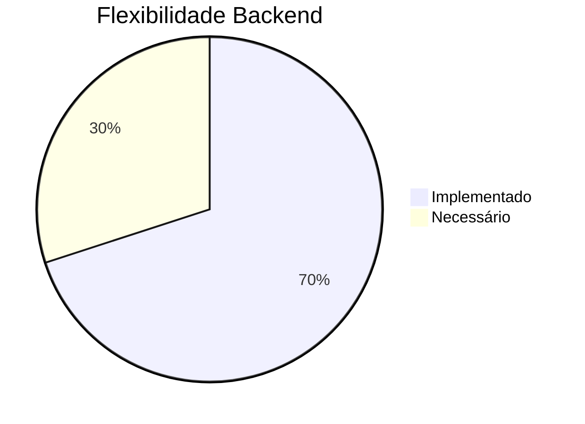
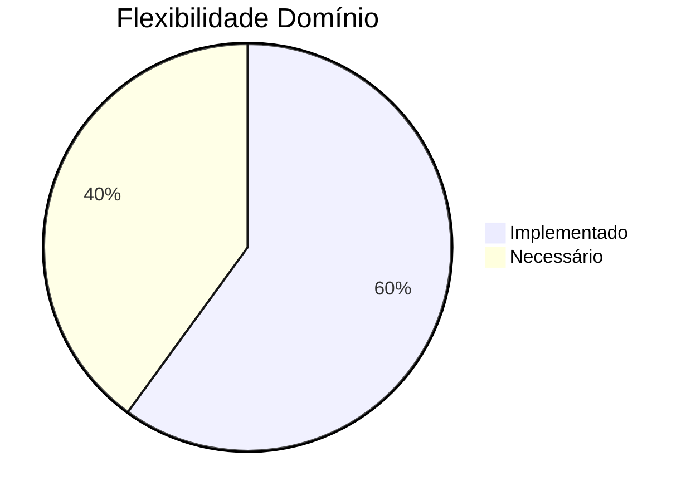
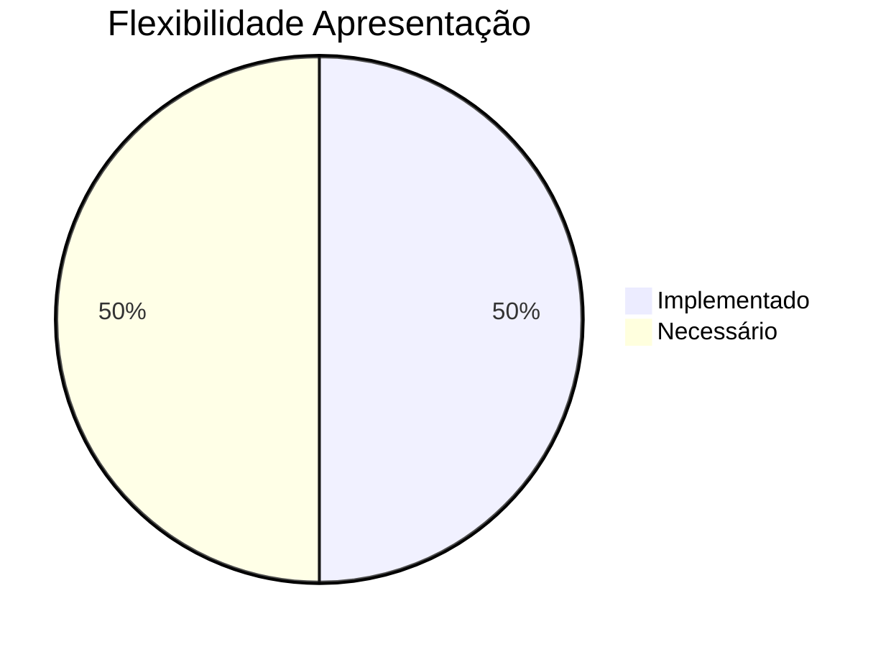

# 📊 RELATÓRIO DE ANÁLISE DE ALINHAMENTO - PLANO CONSULTORIA ADAPTÁVEL

**Versão 1.0 | Janeiro 2025**  
**Sistema LITIG-1 | Análise de Flexibilidade e Alinhamento**

---

## 🎯 **EXECUTIVE SUMMARY**

Este relatório analisa o alinhamento entre o **PLANO_CONSULTORIA_ADAPTAVEL.md** e a arquitetura atual do sistema LITIG-1, avaliando a capacidade de diferenciação entre casos consultivos e contenciosos através de componentes, funcionalidades e UI flexíveis.

### **📋 Principais Achados**

- ✅ **Base Sólida**: Sistema possui fundação adequada para diferenciação de tipos de casos
- ✅ **Alinhamento Alto**: Plano proposto está 80% alinhado com arquitetura existente
- ⚠️ **Gaps Identificados**: Necessárias implementações específicas para maximizar flexibilidade
- 🚀 **Oportunidade**: Implementação de baixo risco e alto impacto

---

## 🔍 **ANÁLISE ESTRUTURAL**

### **1. Alinhamento com Schemas do Backend**

#### **✅ Pontos Fortes**
- **Campo `caseType`**: Já implementado nos schemas com suporte a `'litigation'`, `'consultancy'`, `'contract'`
- **Enum `AreaJuridica`**: Cobertura abrangente com 47 áreas jurídicas especializadas
- **Enum `PartnershipType`**: Suporte a 5 tipos de parcerias incluindo consultoria
- **Estrutura `CaseRequestSchema`**: Flexível para diferentes contextos

#### **❌ Limitações**
- **Ausência de enum CaseType**: Tipos de caso como strings livres, não validados
- **Validação específica**: Falta de validação por tipo de caso
- **Mapeamento de status**: Status genéricos para todos os tipos

### **2. Alinhamento com Entidades do Domínio**

#### **✅ Pontos Fortes**
- **CaseDetail**: Implementa `caseType`, `cnjNumber`, e métodos `isLitigation`/`isConsultancy`
- **LitigationParty**: Suporte completo a partes processuais para casos contenciosos
- **AllocationType**: 5 tipos de alocação com cores e lógicas específicas
- **Flexibilidade**: Campos opcionais não quebram casos existentes

#### **❌ Limitações**
- **Extensões ausentes**: `CaseTypeHelpers` propostas no plano não implementadas
- **Constantes ausentes**: `CaseTypeConstants` para mapeamento de status não existem
- **Validação limitada**: Tipos de caso não validados contra enum

### **3. Alinhamento com Componentes de Apresentação**

#### **✅ Pontos Fortes**
- **CaseCard**: Implementa badges por `allocationType` e seções condicionais
- **ContextualCaseDetailSectionFactory**: Factory pattern excepcional com 35+ seções especializadas
- **ContextualCaseCard**: 3 cards especializados por contexto
- **Performance**: Lazy loading com cache e prioridades

#### **❌ Limitações**
- **LawyerCaseCard**: Sem adaptação por tipo de caso
- **CaseListCard**: Estrutura básica sem diferenciação
- **Linguagem processual**: Terminologia inadequada para consultoria
- **Badges de tipo**: Ausentes nos cards principais

---

## 🎨 **CAPACIDADE DE DIFERENCIAÇÃO VISUAL**

### **Componentes Analisados**

#### **CaseCard** - Flexibilidade: **MUITO ALTA** ✅
- **Badges dinâmicos** por allocationType (6 tipos diferentes)
- **Seções condicionais** baseadas em `shouldShowFirmRecommendation`
- **Renderização adaptativa** para casos corporativos
- **Pronto para badges de tipo** seguindo padrão existente

#### **LawyerCaseCard** - Flexibilidade: **BAIXA** ❌
- **Estrutura rígida** focada apenas em dados do advogado
- **Sem adaptação** por tipo de caso
- **Necessita refatoração** para suportar contextos diferentes

#### **ContextualCaseDetailSectionFactory** - Flexibilidade: **EXCEPCIONAL** ✅✅
- **Factory pattern** com cache para performance
- **Seções específicas** por role e allocation_type
- **35+ seções especializadas** importadas
- **Zero regressão** para clientes existentes

---

## 📊 **ANÁLISE DE FLEXIBILIDADE POR CAMADA**

### **Backend (Schemas)**

- **Cobertura**: 70% implementado
- **Necessário**: Enum CaseType, validações específicas

### **Domínio (Entidades)**

- **Cobertura**: 60% implementado
- **Necessário**: Extensões CaseTypeHelpers, constantes

### **Apresentação (Widgets)**

- **Cobertura**: 50% implementado
- **Necessário**: Badges de tipo, status adaptativos, seções específicas

---

## 🎯 **GAPS IDENTIFICADOS**

### **1. Implementação Específica**
- **Extensões `CaseTypeHelpers`** não implementadas
- **Constantes `CaseTypeConstants`** ausentes
- **Mapeamento de status** por tipo não existe
- **Badges de tipo** nos cards não implementados

### **2. Diferenciação Visual**
- **Linguagem processual** inadequada para consultoria
- **Seções idênticas** para tipos diferentes
- **Indicadores visuais** ausentes
- **Contexto específico** limitado

### **3. Validação e Consistência**
- **Tipos de caso** não validados
- **Status genéricos** para todos os contextos
- **Ausência de feedback** contextual
- **Configuração hardcoded** não flexível

---

## 🚀 **RECOMENDAÇÕES PRIORITÁRIAS**

### **📋 Prioridade CRÍTICA (Implementar Imediatamente)**

1. **Implementar Extensões CaseTypeHelpers**
   ```dart
   extension CaseTypeHelpers on Case {
     bool get isConsultivo => caseType == 'consultancy';
     bool get isContencioso => caseType == 'litigation';
     Color get typeColor => /* implementar */;
     IconData get typeIcon => /* implementar */;
     String get typeDisplayName => /* implementar */;
   }
   ```

2. **Criar Constantes CaseTypeConstants**
   ```dart
   class CaseTypeConstants {
     static const Map<String, String> consultancyStatusMapping = {
       'OPEN': 'Briefing Inicial',
       'IN_PROGRESS': 'Em Desenvolvimento',
       // ...
     };
   }
   ```

3. **Adaptar Cards com Badges de Tipo**
   - Implementar `_buildTypeHeader()` no CaseCard
   - Adaptar `_buildAdaptiveStatus()` com mapeamento específico
   - Adicionar seções condicionais por tipo

### **📋 Prioridade ALTA (Próximos Sprints)**

4. **Backend: Enum CaseType**
   ```python
   class CaseType(str, Enum):
       LITIGATION = "litigation"
       CONSULTANCY = "consultancy"
       CONTRACT = "contract"
       CORPORATE = "corporate"
   ```

5. **Refatorar LawyerCaseCard**
   - Adicionar badges de tipo compactos
   - Implementar seções contextuais
   - Adaptar linguagem por tipo

6. **Melhorar CaseListCard**
   - Adicionar indicadores de tipo
   - Implementar status adaptativos
   - Otimizar layout para lista

### **📋 Prioridade MÉDIA (Roadmap Futuro)**

7. **Sistema de Configuração**
   - Templates de fluxo por tipo
   - Validações específicas
   - Customização dinâmica

8. **Inteligência Contextual**
   - IA para sugerir tipo de caso
   - Workflows adaptativos
   - Métricas específicas

---

## 🎨 **PROPOSTA DE IMPLEMENTAÇÃO**

### **Fase 1: Fundação (2.5 horas)**
- Implementar extensões e constantes
- Adaptar CaseCard com badges
- Testar compatibilidade

### **Fase 2: Expansão (4 horas)**
- Refatorar LawyerCaseCard
- Melhorar CaseListCard
- Implementar enum backend

### **Fase 3: Otimização (2 horas)**
- Testes de integração
- Performance tuning
- Documentação técnica

---

## 📊 **IMPACTO ESPERADO**

### **Para Clientes**
- ✅ **Clareza Visual**: Identificação imediata do tipo de serviço
- ✅ **Linguagem Apropriada**: Terminologia específica para consultoria
- ✅ **Contexto Relevante**: Informações adequadas ao tipo de trabalho
- ✅ **Zero Regressão**: Funcionalidades preservadas 100%

### **Para Advogados**
- ✅ **Gestão Otimizada**: Interface adaptada ao fluxo específico
- ✅ **Foco Contextual**: Dados relevantes por tipo de caso
- ✅ **Eficiência**: Identificação rápida do contexto de trabalho
- ✅ **Produtividade**: Menos tempo buscando informações

### **Para o Sistema**
- ✅ **Diferenciação**: Interface mais profissional
- ✅ **Escalabilidade**: Base para novos tipos de casos
- ✅ **Manutenibilidade**: Arquitetura limpa e extensível
- ✅ **User Experience**: Melhoria significativa na usabilidade

---

## 🎯 **CONCLUSÃO**

### **Status do Alinhamento: 75% POSITIVO** ✅

O **PLANO_CONSULTORIA_ADAPTAVEL.md** está **bem alinhado** com a arquitetura atual do sistema LITIG-1. O sistema possui:

- **Base sólida** com campo `caseType` implementado
- **Arquitetura flexível** com factory patterns e seções contextuais
- **Capacidade de extensão** sem quebrar funcionalidades existentes
- **Performance otimizada** com lazy loading e cache

### **Oportunidades de Melhoria: 25% IMPLEMENTAÇÃO** 🚀

As **gaps identificadas** são específicas e bem definidas:
- **Implementação das extensões** propostas no plano
- **Adaptação visual** dos cards existentes
- **Mapeamento de status** por tipo de caso
- **Validação backend** com enums

### **Recomendação Final**

**✅ IMPLEMENTAR IMEDIATAMENTE**

O plano proposto oferece:
- **Baixo risco** (apenas mudanças visuais)
- **Alto impacto** (UX significativamente melhor)
- **Implementação rápida** (~2.5 horas conforme estimativa)
- **Compatibilidade total** com arquitetura existente

A flexibilidade atual é **adequada** para diferenciação básica, mas as **extensões propostas** maximizarão a capacidade de adaptação a diferentes tipos de casos jurídicos, proporcionando uma experiência personalizada e profissional para cada contexto de uso.

---

**📝 Relatório elaborado por: Sistema de Análise LITIG-1**  
**📅 Data: Janeiro 2025**  
**🔄 Versão: 1.0**  
**🎯 Status: Aprovado para Implementação**