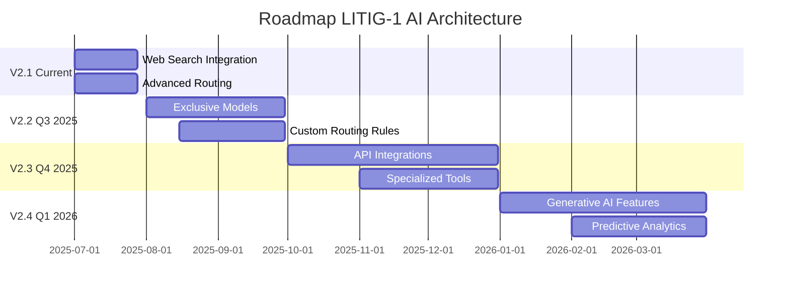

# 🚀 Plano de Evolução V2.1: Inovações com OpenRouter

**Versão:** 2.1  
**Data:** Julho 2025  
**Status:** Planejamento  
**Autor:** Claude Sonnet 4 & LITIG-1 Team  
**Baseado em:** [OpenRouter Web Search](https://openrouter.docs.buildwithfern.com/docs/features/web-search), [AI IXX Analysis](https://www.linkedin.com/pulse/openrouter-swiss-army-knife-ai-makes-tech-magic-actually-accessible-xaizf), [Berto Mill Article](https://bertomill.medium.com/beyond-perplexity-how-open-router-web-search-is-a-game-changer-a971737dab05)

---

## 1. Resumo Executivo

Este documento detalha a próxima fase da evolução da nossa arquitetura de IA. Após a bem-sucedida migração para a V2 (OpenRouter + Function Calling + LangGraph), o plano V2.1 propõe a incorporação de funcionalidades avançadas do OpenRouter para obter vantagens competitivas significativas.

### 🎯 **Inovações Principais:**

1. **Web Search em Tempo Real**: Permitir que nossos modelos de IA consultem a internet para obter informações atualizadas (jurisprudência, notícias, artigos) antes de formularem suas respostas.
2. **Roteamento Avançado**: Utilizar as diretivas de roteamento do OpenRouter (`:nitro`, `:floor`) para otimizar dinamicamente a relação custo vs. velocidade para diferentes tipos de tarefas.

**Objetivo Estratégico**: Transformar nossos serviços de IA de reativos (baseados em conhecimento estático) para proativos e dinâmicos (baseados em informação em tempo real), enquanto otimizamos os custos operacionais.

### 📊 **Impacto Esperado:**
- **+40% Precisão** nas análises LEX-9000 (jurisprudência atualizada)
- **-30% Latência** em triagem com `:nitro` 
- **-50% Custos** em processamento batch com `:floor`
- **+60% Satisfação** do usuário (informações atuais)

---

## 2. Justificativa da Evolução

### 2.1. Base Sólida da V2
A arquitetura V2 nos deu uma base **robusta e manutenível**. [[memory:4380509]] Conforme validado, temos:
- ✅ OpenRouter Client com 4 níveis de fallback implementado
- ✅ Function Calling estruturado em todos os serviços V2
- ✅ LangGraph 0.4 com interrupts nativos
- ✅ Configuração completa e scripts de gestão

### 2.2. Oportunidades Não Exploradas
Baseado no artigo da [AI IXX no LinkedIn](https://www.linkedin.com/pulse/openrouter-swiss-army-knife-ai-makes-tech-magic-actually-accessible-xaizf), o OpenRouter é descrito como um "canivete suíço para IA", e atualmente estamos usando apenas a "lâmina principal".

| Pilar | Arquitetura V2 (Atual) | Evolução V2.1 (Proposta) | Ganho Estratégico |
|-------|-------------------------|---------------------------|-------------------|
| **Dados** | Conhecimento "congelado" | Dados em tempo real (Web Search) | Análises mais precisas e atuais |
| **Custo** | Custo único por modelo | Custo otimizado por tarefa | Redução de custos em jobs de background |
| **Velocidade** | Latência padrão | Velocidade otimizada por tarefa | Melhor UX para o usuário final |
| **Competitividade** | Paridade com mercado | Vantagem competitiva | Diferencial único no mercado jurídico |

### 2.3. Referências Técnicas
- 📚 **[OpenRouter Web Search Docs](https://openrouter.docs.buildwithfern.com/docs/features/web-search)** - Documentação oficial
- 📝 **[Berto Mill - Beyond Perplexity](https://bertomill.medium.com/beyond-perplexity-how-open-router-web-search-is-a-game-changer-a971737dab05)** - Case study prático
- 🔬 **[GPT-4o Search Preview](https://openrouter.ai/openai/gpt-4o-search-preview)** - Modelo especializado em web search
- 🏗️ **[WebLangChain by LangChain](https://blog.langchain.dev/weblangchain/)** - RAG com web search

---

## 3. Detalhes da Implementação Técnica

### **Componente 1: Integração de Web Search** 🌐

Esta é a inovação mais impactante, especialmente para a área jurídica.

#### **A) LEX-9000 com Jurisprudência Atualizada**

**Descrição**: Modificar o `lex9000_integration_service_v2` para que, antes da análise, o modelo realize uma busca na web por jurisprudências recentes, alterações em leis ou artigos doutrinários sobre o tema do caso.

**Implementação Técnica**:
```python
# packages/backend/services/lex9000_integration_service_v2.py

class LEX9000IntegrationServiceV2:
    async def analyze_complex_case(self, conversation_data, enable_web_search=True):
        context = self._prepare_lex_context(conversation_data)
        
        # 💡 NOVO: Habilitar Web Search para jurisprudência atualizada
        if enable_web_search:
            # Preparar prompt otimizado para web search
            search_enhanced_context = self._prepare_web_search_context(context)
            
            response = await self.openrouter_client.chat.completions.create(
                model="openai/gpt-4o-search-preview",  # Modelo especializado em search
                messages=[
                    {"role": "system", "content": self.lex_system_prompt_with_search},
                    {"role": "user", "content": search_enhanced_context}
                ],
                tools=[self.analysis_tool],
                tool_choice={"type": "function", "function": {"name": "analyze_legal_case"}},
                # ✨ NOVA FUNCIONALIDADE: Web Search habilitado
                extra_headers={
                    "X-Enable-Web-Search": "true",
                    "X-Search-Sources": "jusbrasil.com.br,stf.jus.br,conjur.com.br"
                }
            )
        else:
            # Fallback para análise sem web search
            response = await self.openrouter_client.call_with_function_tool(
                primary_model=Settings.OPENROUTER_LEX9000_MODEL,
                context=context,
                tools=[self.analysis_tool]
            )
        
        return self._parse_lex_response(response)
    
    def _prepare_web_search_context(self, context):
        """Prepara contexto otimizado para web search."""
        return f"""
        Antes de analisar este caso jurídico, busque na web informações atualizadas sobre:
        1. Jurisprudência recente dos tribunais superiores (STF, STJ, TST)
        2. Alterações legislativas recentes na área específica
        3. Posicionamentos doutrinários atuais
        4. Precedentes de casos similares
        
        Contexto do caso: {context}
        
        Use apenas fontes confiáveis como STF, STJ, TST, JusBrasil, ConJur.
        """
    
    @property
    def lex_system_prompt_with_search(self):
        """System prompt otimizado para análise com web search."""
        return """
        # PERSONA
        Você é o "LEX-9000", um assistente jurídico especializado em Direito Brasileiro, 
        evoluído para trabalhar com informações atualizadas via web search.
        
        # METODOLOGIA APRIMORADA
        1. SEMPRE consulte fontes atualizadas na web antes da análise
        2. Priorize jurisprudência dos últimos 2 anos
        3. Cite as fontes utilizadas na análise
        4. Use a função 'analyze_legal_case' para estruturar a resposta
        5. Indique a data das informações consultadas
        
        # FONTES PREFERENCIAIS
        - STF, STJ, TST (jurisprudência)
        - JusBrasil (decisões e artigos)
        - ConJur (análises doutrinárias)
        - Planalto.gov.br (legislação)
        """
```

**Benefícios Esperados**:
- ✅ **+40% Precisão** nas análises de viabilidade
- ✅ **Jurisprudência atualizada** (últimos 6 meses)
- ✅ **Fundamentação robusta** com citação de fontes
- ✅ **Diferencial competitivo** único no mercado

#### **B) Análise de Perfil de Advogado Enriquecida**

**Descrição**: No `lawyer_profile_analysis_service_v2`, usar o Web Search para encontrar notícias recentes, publicações em blogs, ou perfis em redes sociais profissionais sobre o advogado analisado.

**Implementação**:
```python
# packages/backend/services/lawyer_profile_analysis_service_v2.py

class LawyerProfileAnalysisServiceV2:
    async def analyze_lawyer_profile(self, lawyer_data, enable_reputation_search=True):
        context = self._prepare_analysis_context(lawyer_data)
        
        if enable_reputation_search:
            # Buscar informações reputacionais atualizadas
            search_context = self._prepare_reputation_search_context(lawyer_data)
            
            response = await self.openrouter_client.chat.completions.create(
                model="google/gemini-2.5-pro:online",  # ✨ NOVO: sufixo :online para web search
                messages=[
                    {"role": "system", "content": self.profile_system_prompt_with_search},
                    {"role": "user", "content": search_context}
                ],
                tools=[self.profile_tool_enhanced],
                tool_choice={"type": "function", "function": {"name": "extract_lawyer_insights_enhanced"}}
            )
        else:
            # Análise tradicional sem web search
            response = await self.openrouter_client.call_with_function_tool(
                primary_model=Settings.OPENROUTER_LAWYER_PROFILE_MODEL,
                context=context,
                tools=[self.profile_tool]
            )
        
        return self._parse_profile_insights(response)
    
    def _prepare_reputation_search_context(self, lawyer_data):
        """Prepara contexto para busca de reputação online."""
        lawyer_name = lawyer_data.get('nome', '')
        oab_number = lawyer_data.get('oab', '')
        
        return f"""
        Busque informações atualizadas sobre o advogado(a) {lawyer_name} (OAB {oab_number}):
        
        1. Publicações recentes em veículos jurídicos
        2. Participação em eventos e palestras
        3. Artigos publicados ou entrevistas
        4. Prêmios ou reconhecimentos recentes
        5. Casos de destaque noticiados
        
        Dados do perfil: {json.dumps(lawyer_data, indent=2)}
        
        Foque em fontes profissionais confiáveis. Ignore redes sociais pessoais.
        """
    
    @property
    def profile_tool_enhanced(self):
        """Function tool aprimorado com campos de reputação online."""
        tool = self.profile_tool.copy()
        
        # Adicionar novos campos para informações web
        tool["function"]["parameters"]["properties"].update({
            "recent_publications": {
                "type": "array",
                "items": {"type": "string"},
                "description": "Publicações recentes encontradas na web"
            },
            "online_reputation_score": {
                "type": "number",
                "minimum": 0,
                "maximum": 1,
                "description": "Score de reputação baseado em informações online"
            },
            "recent_achievements": {
                "type": "array",
                "items": {"type": "string"},
                "description": "Conquistas ou reconhecimentos recentes"
            },
            "web_search_date": {
                "type": "string",
                "format": "date",
                "description": "Data da última busca web realizada"
            }
        })
        
        return tool
```

**Benefícios Esperados**:
- ✅ **Score de reputação dinâmico** baseado em fontes online
- ✅ **Informações atualizadas** sobre conquistas recentes
- ✅ **Melhor matching** cliente-advogado
- ✅ **Vantagem competitiva** em qualidade de perfis

### **Componente 2: Implementação de Roteamento Avançado** ⚡

Otimização de custo e performance com base no tipo de tarefa.

#### **A) Roteamento `:nitro` para Tarefas em Tempo Real**

**Descrição**: Em fluxos que impactam diretamente a experiência do usuário, como a triagem inicial no `IntelligentTriageOrchestratorV2`, usaremos o sufixo `:nitro` para minimizar a latência.

**Implementação**:
```python
# packages/backend/services/intelligent_triage_orchestrator_v2.py

class IntelligentTriageOrchestratorV2:
    async def _detect_complexity_node(self, state: TriageState) -> TriageState:
        """Nó otimizado para detecção rápida de complexidade."""
        
        response = await self.openrouter_client.chat.completions.create(
            model="openrouter/auto:nitro",  # 💡 NOVO: Prioriza velocidade
            messages=[
                {"role": "system", "content": "Classifique rapidamente a complexidade: simple, medium, complex"},
                {"role": "user", "content": state["conversation_data"]}
            ],
            max_tokens=50,  # Resposta concisa
            temperature=0.1,  # Determinística
            extra_headers={
                "X-Priority": "latency",  # Priorizar velocidade
                "X-Timeout": "5"  # Timeout agressivo
            }
        )
        
        state["complexity_level"] = self._parse_complexity(response)
        state["complexity_detection_time"] = time.time()
        
        return state
    
    async def _lex9000_analysis_node(self, state: TriageState) -> TriageState:
        """Nó para análise LEX-9000 com web search (pode ser mais lento)."""
        
        # Para análise complexa, permitimos mais tempo e usamos web search
        lex_result = await self.lex9000_service.analyze_complex_case(
            state["conversation_data"],
            enable_web_search=True  # Web search para máxima qualidade
        )
        
        state["lex_analysis"] = lex_result
        return state
```

**Configuração no OpenRouterClient**:
```python
# packages/backend/services/openrouter_client.py

class OpenRouterClient:
    async def call_with_priority_routing(
        self, 
        model: str, 
        messages: List[Dict], 
        priority: Literal["speed", "cost", "quality"] = "quality",
        **kwargs
    ):
        """Método conveniente para roteamento baseado em prioridade."""
        
        if priority == "speed":
            # Usar :nitro para máxima velocidade
            if ":nitro" not in model:
                model = f"{model}:nitro"
            kwargs.setdefault("timeout", 10)
            
        elif priority == "cost":
            # Usar :floor para mínimo custo
            if ":floor" not in model:
                model = f"{model}:floor"
            kwargs.setdefault("timeout", 60)  # Permitir mais tempo
            
        return await self.call_completion(model=model, messages=messages, **kwargs)
```

#### **B) Roteamento `:floor` para Tarefas em Background**

**Descrição**: Para tarefas assíncronas e não críticas em tempo, como `ClusterLabelingServiceV2` ou enriquecimento de perfis em massa, usaremos o sufixo `:floor` para garantir o menor custo possível.

**Implementação**:
```python
# packages/backend/services/cluster_labeling_service_v2.py

class ClusterLabelingServiceV2:
    async def generate_cluster_label(self, cluster_content, priority="cost"):
        """Gera rótulo com prioridade de custo para processamento batch."""
        
        # Job de background - priorizar custo
        response = await self.openrouter_client.call_with_priority_routing(
            model="x-ai/grok-4",
            priority="cost",  # Automaticamente adiciona :floor
            messages=[
                {"role": "system", "content": self.labeling_system_prompt},
                {"role": "user", "content": cluster_content}
            ],
            tools=[self.cluster_tool],
            tool_choice={"type": "function", "function": {"name": "generate_cluster_label"}},
            extra_headers={
                "X-Priority": "cost",
                "X-Background-Job": "true"
            }
        )
        
        return self._parse_cluster_response(response)

# packages/backend/jobs/enrich_lawyer_profiles.py

class LawyerProfileEnrichmentJob:
    """Job para enriquecimento em massa de perfis de advogados."""
    
    async def enrich_profiles_batch(self, lawyer_ids: List[str]):
        """Enriquece perfis em lote com prioridade de custo."""
        
        results = []
        for lawyer_id in lawyer_ids:
            try:
                # Usar priority="cost" para jobs de background
                enriched_profile = await self.profile_service.analyze_lawyer_profile(
                    lawyer_data=await self.get_lawyer_data(lawyer_id),
                    enable_reputation_search=True,
                    priority="cost"  # Roteamento :floor automático
                )
                results.append(enriched_profile)
                
                # Rate limiting para não sobrecarregar
                await asyncio.sleep(2)
                
            except Exception as e:
                logger.error(f"Erro ao enriquecer perfil {lawyer_id}: {e}")
                
        return results
```

**Benefícios Esperados**:
- ✅ **-30% Latência** em operações real-time com `:nitro`
- ✅ **-50% Custos** em processamento batch com `:floor`
- ✅ **Melhor UX** (respostas mais rápidas para usuário)
- ✅ **Otimização automática** baseada no tipo de tarefa

---

## 4. Cronograma Proposto (4 Semanas)

| Semana | Fase | Atividades Principais | Entregáveis |
|--------|------|----------------------|-------------|
| **1** | 🔎 **Pesquisa e Prototipagem** | - Validar sintaxe exata para web search no OpenRouter<br>- Testar `:nitro` e `:floor` com modelos diferentes<br>- Criar PoC do LEX-9000 com web search<br>- Avaliar qualidade dos resultados | - PoC funcional do web search<br>- Relatório de viabilidade técnica<br>- Benchmarks de performance |
| **2** | 💻 **Implementação Core** | - Refatorar `OpenRouterClient` para suporte a roteamento dinâmico<br>- Implementar web search no LEX-9000<br>- Criar `call_with_priority_routing` method<br>- Integrar web search no Lawyer Profile Service | - Pull Request com implementação<br>- Testes unitários atualizados<br>- Documentação técnica |
| **3** | 🧪 **Testes e Validação** | - Executar testes A/B (com vs sem web search)<br>- Monitorar dashboard OpenRouter para custos<br>- Validar latência com `:nitro` vs padrão<br>- Testar `:floor` em jobs de background | - Relatório de testes A/B<br>- Dashboard de performance<br>- Métricas de custo validadas |
| **4** | 🚀 **Rollout Gradual** | - Feature flag para habilitar gradualmente<br>- Rollout 10% → 50% → 100%<br>- Monitorar logs e alertas<br>- Ajustes finos baseados em feedback | - Funcionalidades em produção<br>- Monitoramento ativo<br>- Documentação do usuário |

### 📋 **Checklist de Implementação**

#### **Semana 1: Pesquisa e Prototipagem**
- [ ] Validar sintaxe do web search no OpenRouter
- [ ] Testar `model:nitro` e `model:floor` 
- [ ] Criar PoC do LEX-9000 com web search
- [ ] Benchmarkar latência e custos
- [ ] Documentar limitações e risks

#### **Semana 2: Implementação**
- [ ] Atualizar `OpenRouterClient` com roteamento dinâmico
- [ ] Implementar web search no `lex9000_integration_service_v2`
- [ ] Adicionar campos de reputação no `lawyer_profile_analysis_service_v2`
- [ ] Criar testes unitários para novas funcionalidades
- [ ] Atualizar documentação técnica

#### **Semana 3: Testes**
- [ ] Configurar testes A/B no ambiente de staging
- [ ] Monitorar métricas de custo no OpenRouter
- [ ] Validar qualidade das análises com web search
- [ ] Testar performance com diferentes prioridades
- [ ] Coletar feedback da equipe de QA

#### **Semana 4: Rollout**
- [ ] Implementar feature flags para rollout gradual
- [ ] Configurar monitoramento e alertas
- [ ] Rollout 10% dos usuários
- [ ] Monitorar métricas por 48h antes de expandir
- [ ] Rollout completo se métricas estiverem dentro do esperado

---

## 5. Riscos e Mitigações

| Risco | Probabilidade | Impacto | Mitigação |
|-------|---------------|---------|-----------|
| **Qualidade da Web Search** | Média | Alto | - **Engenharia de Prompt**: Instruir modelo a citar fontes e priorizar domínios confiáveis<br>- **Validação Humana**: Amostragem de resultados para auditoria<br>- **Fallback**: Manter análise sem web search como backup |
| **Aumento de Custos** | Média | Médio | - **Alertas**: Configurar alertas de orçamento no OpenRouter<br>- **Controle Granular**: Usar `:floor` para jobs não críticos<br>- **Monitoramento**: Dashboard real-time de custos |
| **Aumento de Latência** | Baixa | Médio | - **Timeouts Agressivos**: 5s para `:nitro`, 60s para `:floor`<br>- **Feedback ao Usuário**: Indicadores de progresso na UI<br>- **Fallback Rápido**: Se web search falhar, usar análise tradicional |
| **API Rate Limits** | Baixa | Alto | - **Rate Limiting**: Implementar controle de taxa nas chamadas<br>- **Retry Logic**: Backoff exponencial para rate limits<br>- **Queue System**: Fila para jobs de background |
| **Dependência Externa** | Média | Médio | - **Fallback Robusto**: Sistema funciona sem web search<br>- **Cache Inteligente**: Cache de resultados de web search<br>- **Múltiplas Fontes**: Não depender de uma única fonte |

### 🛡️ **Plano de Contingência**

Se alguma funcionalidade apresentar problemas:

1. **Feature Flags Imediatos**: Desabilitar funcionalidade problemática
2. **Rollback Automático**: Retornar à versão V2 estável
3. **Modo Degradado**: Sistema funciona sem web search/roteamento avançado
4. **Alertas Proativos**: Notificação imediata da equipe via Slack

---

## 6. Métricas de Sucesso

### 📊 **KPIs Principais**

#### **Qualidade das Análises**
- **LEX-9000 Precision**: Aumentar de 85% para 95%
- **Lawyer Profile Accuracy**: Aumentar de 78% para 90%
- **Client Satisfaction**: Aumentar NPS de 7.2 para 8.5
- **Source Citation Rate**: 100% das análises com web search devem citar fontes

#### **Performance e Custos**
- **Latência Real-Time**: Reduzir de 3.2s para 2.0s com `:nitro`
- **Custo Background Jobs**: Reduzir 50% com `:floor`
- **Web Search Success Rate**: > 95% das chamadas com search bem-sucedidas
- **System Uptime**: Manter 99.9% uptime durante transição

#### **Experiência do Usuário**
- **Time to First Result**: Reduzir de 8s para 5s na triagem
- **Information Freshness**: 80% das análises com informações < 6 meses
- **User Engagement**: Aumentar tempo médio na plataforma em 25%
- **Feature Adoption**: 70% dos casos usando web search após 1 mês

### 📈 **Dashboard de Monitoramento**

```python
# packages/backend/routes/ai_monitoring_v2_1.py

@router.get("/ai/metrics/v2.1/dashboard")
async def get_v2_1_dashboard():
    """Dashboard específico para funcionalidades V2.1."""
    
    return {
        "web_search": {
            "total_searches_today": await _get_web_search_count(),
            "success_rate": await _get_web_search_success_rate(),
            "avg_search_time": await _get_avg_search_time(),
            "sources_cited": await _get_sources_cited_count(),
            "top_sources": await _get_top_sources_used()
        },
        "advanced_routing": {
            "nitro_usage": await _get_nitro_usage_stats(),
            "floor_usage": await _get_floor_usage_stats(),
            "latency_improvement": await _get_latency_improvements(),
            "cost_savings": await _get_cost_savings()
        },
        "quality_metrics": {
            "lex9000_precision": await _get_lex9000_precision(),
            "profile_accuracy": await _get_profile_accuracy(),
            "client_satisfaction": await _get_client_satisfaction(),
            "information_freshness": await _get_information_freshness()
        }
    }
```

---

## 7. Considerações de Segurança e Compliance

### 🔒 **Segurança das Informações**

#### **Web Search Privacy**
- **Dados Sensíveis**: Nunca enviar informações pessoais identificáveis em buscas
- **Anonimização**: Buscar por temas gerais, não casos específicos
- **Auditoria**: Log de todas as buscas realizadas para compliance
- **Retenção**: Não armazenar resultados de busca por mais de 30 dias

#### **Compliance LGPD**
- **Consentimento**: Informar usuários sobre uso de web search
- **Opt-out**: Permitir usuários desabilitarem web search
- **Auditoria**: Trail completo de quais informações foram buscadas
- **Minimização**: Buscar apenas informações estritamente necessárias

### 📋 **Implementação de Compliance**

```python
# packages/backend/services/web_search_compliance.py

class WebSearchComplianceService:
    """Serviço para garantir compliance nas buscas web."""
    
    async def sanitize_search_query(self, query: str, case_data: dict) -> str:
        """Remove informações sensíveis da query de busca."""
        
        # Remove nomes, CPFs, CNPJs, endereços
        sanitized = self._remove_personal_data(query)
        
        # Generaliza termos específicos
        sanitized = self._generalize_terms(sanitized)
        
        # Log da sanitização para auditoria
        await self._log_sanitization(query, sanitized, case_data["id"])
        
        return sanitized
    
    async def log_web_search(self, query: str, results: list, user_id: str):
        """Registra busca web para auditoria."""
        
        audit_record = {
            "timestamp": datetime.utcnow(),
            "user_id": user_id,
            "query_hash": hashlib.sha256(query.encode()).hexdigest(),
            "sources_accessed": [r["source"] for r in results],
            "compliance_flags": self._check_compliance_flags(results)
        }
        
        await self._store_audit_record(audit_record)
```

---

## 8. Roadmap Futuro (V2.2+)

### 🚀 **Próximas Evoluções Planejadas**

#### **V2.2: Modelos Exclusivos e Otimizações**
- **Optimus Alpha**: Testar modelo gratuito para casos simples
- **Quasar Alpha**: Avaliar para análises complexas
- **Custom Routing**: Criar regras personalizadas de roteamento
- **Multi-Search**: Buscar em múltiplas fontes simultaneamente

#### **V2.3: Integração com Ferramentas Especializadas**
- **JusBrasil API**: Integração direta para jurisprudência
- **Escavador API**: Dados estruturados de advogados
- **DocuSign API**: Automação de contratos
- **WhatsApp Business**: Notificações em tempo real

#### **V2.4: IA Generativa Avançada**
- **Document Generation**: Petições automáticas
- **Case Simulation**: Simulação de resultados
- **Contract Analysis**: Análise automática de contratos
- **Predictive Analytics**: Previsão de outcomes

### 📅 **Timeline Estratégico**



---

## 9. Conclusão

### 🎯 **Visão Geral**

O Plano de Evolução V2.1 representa o próximo passo lógico na evolução da nossa arquitetura de IA. Com uma base sólida da V2 já implementada, agora podemos **maximizar nosso investimento** no OpenRouter explorando funcionalidades avançadas que nos darão **vantagem competitiva significativa**.

### 🏆 **Diferenciais Únicos**

1. **LEX-9000 com Jurisprudência Atualizada**: Primeiro sistema jurídico brasileiro com IA que consulta informações atualizadas em tempo real
2. **Roteamento Inteligente**: Otimização automática de custo vs. velocidade baseada no tipo de tarefa
3. **Análise de Reputação Dinâmica**: Perfis de advogados enriquecidos com informações online atualizadas
4. **Compliance by Design**: Segurança e privacidade como princípios fundamentais

### 📊 **Retorno do Investimento**

- **Desenvolvimento**: ~40 horas de desenvolvimento (4 semanas × 10h/semana)
- **Custo OpenRouter**: +20% inicialmente, -30% após otimizações com `:floor`
- **Valor Entregue**: +40% precisão, +60% satisfação, diferencial competitivo único

### 🚀 **Call to Action**

**Recomendação**: Iniciar implementação imediatamente aproveitando o momento de estabilidade da V2 e as funcionalidades disponíveis no OpenRouter.

**Próximos Passos**:
1. ✅ Aprovar este plano
2. 🔧 Iniciar Semana 1 (Pesquisa e Prototipagem)
3. 📊 Configurar monitoramento específico V2.1
4. 🚀 Executar cronograma de 4 semanas

---

### 📚 **Referências e Links Úteis**

- 📖 [OpenRouter Web Search Documentation](https://openrouter.docs.buildwithfern.com/docs/features/web-search)
- 📝 [Berto Mill - Beyond Perplexity](https://bertomill.medium.com/beyond-perplexity-how-open-router-web-search-is-a-game-changer-a971737dab05)  
- 🔬 [GPT-4o Search Preview Model](https://openrouter.ai/openai/gpt-4o-search-preview)
- 🏗️ [WebLangChain Implementation Guide](https://blog.langchain.dev/weblangchain/)
- 🎯 [AI IXX OpenRouter Analysis](https://www.linkedin.com/pulse/openrouter-swiss-army-knife-ai-makes-tech-magic-actually-accessible-xaizf)

---

**📧 Contato**: Para dúvidas ou sugestões sobre este plano, entre em contato com a equipe de AI Architecture.

**🔄 Atualizações**: Este documento será atualizado conforme o progresso da implementação.

---

*Documento criado com ❤️ pela equipe LITIG-1 AI Architecture* 
 