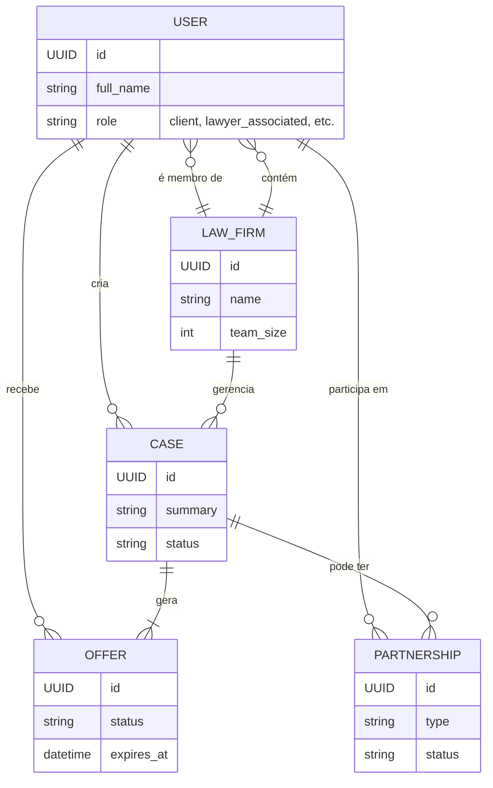
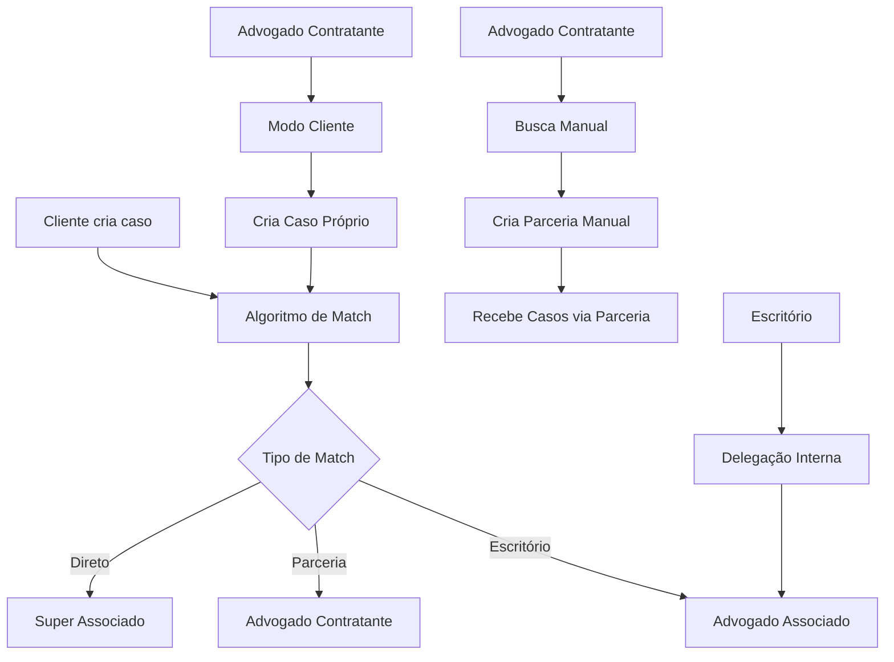

# 🏛️ ARQUITETURA GERAL DO SISTEMA LITIG

**Versão 1.0**

## 1. 🚀 Visão Geral e Filosofia

Este documento é a **fonte única da verdade** para a arquitetura fundamental da plataforma LITIG, com foco na estrutura de perfis de usuário, navegação e na interação entre as principais funcionalidades do sistema.

A filosofia de design é baseada em:
- **Arquitetura Limpa (Clean Architecture)**: Para separação de responsabilidades.
- **Gerenciamento de Estado com BLoC**: Para um fluxo de dados previsível.
- **Navegação Dinâmica e Contextual**: Para uma experiência de usuário otimizada para cada perfil.
- **Componentização e Reutilização**: Para um desenvolvimento escalável e consistente.

Este documento serve como a fundação para todos os outros planos de implementação de features (`Busca`, `Ofertas`, `B2B`, `Parcerias`).

---

## 2. 🧬 Diagrama de Entidades do Sistema

Este diagrama ilustra a relação entre as principais entidades do sistema.



---

## 3. 🎭 Perfis de Usuário (Roles)

O sistema opera com 4 perfis de usuário principais, cada um com um conjunto distinto de permissões, funcionalidades e fluxos de trabalho.

### 3.1. 👤 **Cliente (`client`)**
**Foco**: Contratação de serviços jurídicos e acompanhamento de casos.
A experiência do cliente é otimizada para a busca e seleção de profissionais e para a comunicação transparente sobre seus casos.

### 3.2. ⚖️ **Advogado Associado (`lawyer_associated`)**
**Foco**: Gestão operacional e execução de casos.
Este perfil trabalha vinculado a um escritório e sua navegação é projetada para maximizar a produtividade no fluxo de trabalho diário. Recebe casos por delegação interna.

### 3.3. 🤝 **Advogado Contratante (`lawyer_individual` ou `lawyer_office`)**
**Foco**: Captação de novos casos, formação de parcerias e crescimento do negócio.
Este perfil representa um profissional autônomo ou um escritório que busca ativamente expandir sua base de clientes e rede de colaboradores.

### 3.4. 🌟 **Super Associado (`lawyer_platform_associate`)**
**Foco**: Captação direta de casos como representante do escritório titular da plataforma.
Um perfil híbrido que combina a captação de casos (similar ao contratante) com um vínculo formal ao escritório LITIG, recebendo ofertas diretamente do algoritmo de match.

---

### 🏛️ **Evolução Arquitetural: De Perfis a Permissões**

Para aumentar a flexibilidade e manutenibilidade do sistema, a arquitetura de autorização evoluirá de uma verificação estrita de `Roles` (Perfis) para um sistema granular de `Permissions` (Permissões/Capacidades). A construção da navegação no frontend também será refatorada para uma abordagem de "Fábrica de Navegação" (Navigation Factory), eliminando a repetição de código.

Esta mudança permitirá a criação de novos perfis e a alteração de acessos sem a necessidade de modificar o código-fonte da aplicação, apenas ajustando as permissões no backend.

**[➡️ Consulte aqui o Plano de Refatoração de Navegação e Permissões para detalhes técnicos da implementação](NAVIGATION_AND_PERMISSIONS_REFACTOR_PLAN.md)**

---

## 4. 🗺️ Matriz de Navegação Completa

Esta matriz define a estrutura de navegação principal (menu/abas) para cada perfil de usuário. A implementação técnica seguirá o padrão de "Fábrica de Navegação" descrito no plano de refatoração.

| Rota | Descrição da Tela | 👤 Cliente | ⚖️ Adv. Associado | 🤝 Adv. Contratante | 🌟 Super Associado |
| :--- | :--- | :---: | :---: | :---: | :---: |
| `/client-home` | Início | ✅ | | | |
| `/client-cases`| Meus Casos | ✅ | | | |
| `/find-lawyers`| Advogados | ✅ | | | |
| `/client-messages`| Mensagens | ✅ | | | |
| `/client-services`| Serviços | ✅ | | | |
| `/client-profile`| Perfil | ✅ | | | |
| `/dashboard`   | Painel | | ✅ | | |
| `/cases`       | Casos | | ✅ | ✅ | ✅ |
| `/agenda`      | Agenda | | ✅ | | |
| `/offers`      | Ofertas | | ✅ | | ✅ |
| `/messages`    | Mensagens | | ✅ | | ✅ |
| `/profile`     | Perfil | | ✅ | | ✅ |
| `/home`        | Início | | | ✅ | ✅ |
| `/contractor-offers`| Ofertas | | | ✅ | |
| `/partners`    | Parceiros | | | ✅ | |
| `/partnerships`| Parcerias | | | ✅ | |
| `/contractor-messages`| Mensagens | | | ✅ | |
| `/contractor-profile`| Perfil | | | ✅ | |

---

## 5. ⚙️ Interação entre Funcionalidades e Perfis

Esta seção detalha como cada uma das 4 principais funcionalidades do sistema se manifesta para cada perfil.

### 5.1. 🌐 **Busca (Sistema de Busca Avançada)**
- **Disponível para**: 👤 `Cliente` e 🤝 `Advogado Contratante`.
- **Para o Cliente (`/find-lawyers`)**:
    - **Objetivo**: Encontrar e contratar advogados ou escritórios.
    - **Presets**: `balanced`, `economic`, `expert`.
    - **Interface**: Seletor de "estilo de busca" amigável.
- **Para o Advogado Contratante (`/partners`)**:
    - **Objetivo**: Encontrar e formar parcerias com outros advogados ou escritórios.
    - **Presets**: `correspondent`, `expert_opinion`.
    - **Interface**: Ferramentas de precisão (localização, foco da busca).

### 5.2. 📥 **Ofertas (Sistema Unificado de Ofertas)**
- **Disponível para**: ⚖️ `Advogado Associado`, 🤝 `Advogado Contratante`, 🌟 `Super Associado`.
- **Para o Advogado Associado (`/offers`)**:
    - **Tipo**: **Delegação Interna**. Recebe casos ou tarefas do escritório ao qual pertence.
    - **Fluxo**: `Escritório delega → Oferta interna → Aceitar/Rejeitar`.
- **Para o Advogado Contratante (`/contractor-offers`)**:
    - **Tipo**: **Captação Ativa**. Visualiza casos publicados por clientes e faz propostas competitivas.
    - **Fluxo**: `Cliente publica → Visualiza oportunidade → Fazer proposta`.
- **Para o Super Associado (`/offers`)**:
    - **Tipo**: **Captação Direta**. Recebe ofertas direcionadas pelo algoritmo de match da plataforma.
    - **Fluxo**: `Algoritmo de match → Oferta direta → Aceitar/Rejeitar`.

### 5.3. 🏢 **B2B (Funcionalidades de Escritórios)**
- **Disponível para**: Todos os perfis, mas com interações diferentes.
- **Para o Cliente**:
    - **Interação**: Pode buscar, filtrar, comparar e contratar escritórios inteiros, não apenas advogados individuais.
- **Para o Advogado Contratante**:
    - **Interação**: Pode buscar escritórios para formar parcerias estratégicas (B2B).
- **Para o Advogado Associado**:
    - **Interação**: Seu perfil é vinculado a um escritório, e seu dashboard reflete os KPIs e a identidade visual da firma.
- **Para o Super Associado**:
    - **Interação**: Atua como representante do escritório titular da plataforma, recebendo ofertas corporativas.

### 5.4. 🤝 **Parcerias (Sistema de Parcerias Jurídicas)**
- **Disponível principalmente para**: 🤝 `Advogado Contratante`.
- **Para o Advogado Contratante**:
    - **Criação (`/partners`)**: Usa a busca avançada para encontrar parceiros ideais.
    - **Gestão (`/partnerships`)**: Gerencia parcerias ativas, negocia termos e acompanha o status.
    - **Contratos**: A plataforma facilita a geração e assinatura de contratos de parceria.
- **Para outros perfis**: Podem ser convidados para parcerias, mas a iniciativa parte do contratante.

---

## 6. 🎯 **Problema Crítico Identificado: Contextualização de "Meus Casos"**

### 6.1. **Problema**
Durante a análise da arquitetura, identificamos que todos os perfis de advogados (Associado, Contratante, Super Associado) compartilham a mesma rota `/cases` para "Meus Casos", mas **não há diferenciação na implementação** baseada em como cada caso foi adquirido. Isso resulta em uma experiência de usuário genérica que não reflete o contexto específico de cada perfil.

### 6.2. **Solução: Sistema de "Contextual Case View"**

#### 6.2.1. **Estrutura de Dados**
Adicionar campo `allocation_type` na tabela `cases` com os seguintes valores:

```sql
-- Tipos de alocação de casos
CREATE TYPE allocation_type AS ENUM (
    'platform_match_direct',         -- Algoritmo → Advogado (Super Associado)
    'platform_match_partnership',    -- Algoritmo → Parceria → Advogado
    'partnership_proactive_search',  -- Parceria criada por busca manual
    'partnership_platform_suggestion', -- Parceria sugerida por IA
    'internal_delegation'            -- Escritório → Advogado Associado
);
```

#### 6.2.2. **Diferenciação por Contexto**

**🌟 Super Associado:**
- **Casos `platform_match_direct`**: 
  - KPI: Taxa de conversão de matches
  - UI: Badge "Match Direto", histórico de score de compatibilidade
  - Ações: Feedback sobre qualidade do match

**🤝 Advogado Contratante:**
- **Casos `platform_match_partnership`**: 
  - KPI: Performance em parcerias algorítmicas
  - UI: Badge "Parceria IA", detalhes do parceiro
- **Casos `partnership_manual`**: 
  - KPI: ROI de parcerias manuais
  - UI: Badge "Parceria Manual", histórico de negociação

**⚖️ Advogado Associado:**
- **Casos `internal_delegation`**: 
  - KPI: Produtividade e qualidade de entrega
  - UI: Badge "Delegação Interna", hierarquia de responsabilidade

#### 6.2.3. **Fábrica de Componentes Contextuais**

O sistema utilizará uma **Fábrica de Componentes** para renderizar dinamicamente os cards de caso baseados no contexto específico. Esta abordagem elimina a necessidade de uma tela monolítica e cria uma experiência verdadeiramente contextual.

##### **A. Componentes Especializados**

```dart
// Fábrica principal de componentes
class ContextualCaseCard extends StatelessWidget {
  final Case case;
  final UserRole currentUserRole;
  
  Widget build(BuildContext context) {
    switch (case.allocationType) {
      case AllocationType.platformMatchDirect:
        return _buildDirectMatchCard(case, currentUserRole);
      case AllocationType.platformMatchPartnership:
        return PartnershipMatchCaseCard(case: case);
      case AllocationType.partnershipManual:
        return ManualPartnershipCaseCard(case: case);
      case AllocationType.internalDelegation:
        return InternalDelegationCaseCard(case: case);
    }
  }
  
  Widget _buildDirectMatchCard(Case case, UserRole role) {
    if (role == UserRole.lawyerPlatformAssociate) {
      return PlatformAssociateCaseCard(case: case);
    } else {
      return DirectMatchCaseCard(case: case);
    }
  }
}
```

##### **B. Cards Especializados por Contexto**

**1. `DelegatedCaseCard` (Advogado Associado)**
- **Foco**: Métricas internas, prazo, responsável
- **Ação Principal**: "Registrar Horas" ou "Atualizar Status"

**2. `CapturedCaseCard` (Advogado Contratante)**
- **Foco**: Nome do cliente, valor dos honorários, comunicação
- **Ação Principal**: "Contatar Cliente"

**3. `PlatformCaseCard` (Super Associado)**
- **Foco**: Score de match, SLA de resposta, métricas de conversão
- **Ação Principal**: "Aceitar Caso"

##### **C. Headers/KPIs Contextuais Detalhados**

O header do `ContextualCaseCard` é uma **central de informações estratégicas** que muda drasticamente baseada no contexto:

```dart
Widget buildHeaderKPIs(Case case, User user) {
  switch (case.allocation_type) {
    case CaseAllocationType.platformMatchDirect:
      if (user.role == UserRole.lawyerPlatformAssociate) {
        return _buildPlatformAssociateKPIs(case);
      } else {
        return _buildDirectMatchKPIs(case);
      }
    
    case CaseAllocationType.internalDelegation:
      return _buildDelegationKPIs(case);
    
    case CaseAllocationType.partnershipProactiveSearch:
      return _buildProactivePartnershipKPIs(case, user);
    
    case CaseAllocationType.partnershipPlatformSuggestion:
      return _buildAISuggestedPartnershipKPIs(case);
    
    default:
      return _buildDefaultKPIs(case);
  }
}
```

##### **D. Exemplos de Headers Contextuais**

**Para `platform_match_direct` (Advogado Individual/Escritório):**
```
┌─────────────────────────────────────────────────┐
│ 🎯 Match Score: 94% | 📍 12km | 💰 R$ 8.500    │
│ ⏱️ Responder até: 2h 15min | 🏆 Taxa: 89%      │
└─────────────────────────────────────────────────┘
```

**Para `platform_match_direct` (Super Associado):**
```
┌─────────────────────────────────────────────────┐
│ 🎯 Prioridade: ALTA | 📊 Complexidade: 7/10    │
│ ⏱️ SLA: 1h 30min | 🎖️ Conversão: 94%          │
└─────────────────────────────────────────────────┘
```

**Para `internal_delegation` (Advogado Associado):**
```
┌─────────────────────────────────────────────────┐
│ 👨‍💼 Delegado por: Dr. Silva | ⏰ Prazo: 15 dias │
│ 📈 Horas Orçadas: 40h | 💼 Valor/h: R$ 150    │
└─────────────────────────────────────────────────┘
```

**Para `partnership_proactive_search` (Iniciador da busca):**
```
┌─────────────────────────────────────────────────┐
│ 🤝 Parceiro: Dra. Santos | 📋 Divisão: 70/30%  │
│ 📊 Especialização: Trabalhista | ⭐ Rating: 4.8 │
└─────────────────────────────────────────────────┘
```

**Para `partnership_proactive_search` (Convidado):**
```
┌─────────────────────────────────────────────────┐
│ 📧 Convite de: Dr. Lima | 💰 Sua parte: 30%     │
│ 🎯 Área: Trabalhista | 📅 Prazo: 3 dias       │
└─────────────────────────────────────────────────┘
```

**Para `partnership_platform_suggestion` (Ambos):**
```
┌─────────────────────────────────────────────────┐
│ 🤖 IA Sugeriu: Dr. Costa | 🎯 Fit Score: 96%   │
│ 💡 Motivo: Especialista Civil | 📊 Sucesso: 92% │
└─────────────────────────────────────────────────┘
```

##### **E. Implementação do KPI Item**

```dart
Widget _buildKPIItem(String icon, String label, String value) {
  return Column(
    children: [
      Text(icon, style: TextStyle(fontSize: 16)),
      Text(label, style: TextStyle(fontSize: 10, color: Colors.grey)),
      Text(value, style: TextStyle(fontSize: 12, fontWeight: FontWeight.bold)),
    ],
  );
}

Widget _buildDirectMatchKPIs(Case case) {
  return Container(
    padding: EdgeInsets.all(12),
    decoration: BoxDecoration(
      color: Colors.blue.shade50,
      borderRadius: BorderRadius.circular(8),
    ),
    child: Row(
      mainAxisAlignment: MainAxisAlignment.spaceBetween,
      children: [
        _buildKPIItem("🎯", "Match Score", "${case.matchScore}%"),
        _buildKPIItem("📍", "Distância", "${case.distance}km"),
        _buildKPIItem("💰", "Valor", "R\$ ${case.estimatedValue}"),
        _buildKPIItem("⏱️", "SLA", "${case.responseTimeLeft}"),
      ],
    ),
  );
}
```

##### **F. Lógica de Renderização Contextual**

Cada `allocation_type` + `user.role` deve renderizar não apenas KPIs diferentes, mas também **botões de ação específicos** e **destaques contextuais**:

```dart
Widget buildContextualActions(Case case, User user) {
  switch (case.allocation_type) {
    case CaseAllocationType.platformMatchDirect:
      if (user.role == UserRole.lawyerPlatformAssociate) {
        return _buildPlatformAssociateActions(case); // "Aceitar Caso", "Ver SLA"
      } else {
        return _buildDirectMatchActions(case); // "Aceitar Caso", "Ver Perfil do Cliente"
      }
    
    case CaseAllocationType.internalDelegation:
      return _buildDelegationActions(case); // "Registrar Horas", "Atualizar Status"
    
    case CaseAllocationType.partnershipProactiveSearch:
      return _buildProactivePartnershipActions(case, user); // Diferente para iniciador/convidado
    
    case CaseAllocationType.partnershipPlatformSuggestion:
      return _buildAISuggestedActions(case); // "Analisar Perfil", "Aceitar Parceria"
  }
}

// Exemplo de implementação específica
Widget _buildProactivePartnershipActions(Case case, User user) {
  if (case.partnership?.initiatedBy == user.id) {
    // Para quem INICIOU a busca
    return Row(
      children: [
        ElevatedButton(
          onPressed: () => _alignStrategy(case),
          child: Text("Alinhar Estratégia"),
        ),
        TextButton(
          onPressed: () => _viewPartnershipContract(case),
          child: Text("Ver Contrato"),
        ),
      ],
    );
  } else {
    // Para quem foi CONVIDADO
    return Row(
      children: [
        ElevatedButton(
          onPressed: () => _acceptPartnership(case),
          child: Text("Aceitar Parceria"),
        ),
        TextButton(
          onPressed: () => _declinePartnership(case),
          child: Text("Recusar"),
        ),
      ],
    );
  }
}
```

##### **G. Destaques Contextuais**

Cada card deve ter um **destaque visual** que comunica instantaneamente o contexto:

```dart
Widget buildContextualHighlight(Case case, User user) {
  switch (case.allocation_type) {
    case CaseAllocationType.platformMatchDirect:
      return _buildHighlight("🎯 Match direto para você", Colors.blue);
    
    case CaseAllocationType.internalDelegation:
      return _buildHighlight("👨‍💼 Delegado por ${case.delegatedBy}", Colors.orange);
    
    case CaseAllocationType.partnershipProactiveSearch:
      if (case.partnership?.initiatedBy == user.id) {
        return _buildHighlight("🤝 Parceria iniciada com ${case.partnerName}", Colors.green);
      } else {
        return _buildHighlight("📧 Convite de parceria de ${case.initiatorName}", Colors.purple);
      }
    
    case CaseAllocationType.partnershipPlatformSuggestion:
      return _buildHighlight("🤖 Parceria sugerida pela IA com ${case.partnerName}", Colors.teal);
  }
}

Widget _buildHighlight(String text, Color color) {
  return Container(
    padding: EdgeInsets.symmetric(horizontal: 12, vertical: 6),
    decoration: BoxDecoration(
      color: color.withOpacity(0.1),
      borderRadius: BorderRadius.circular(16),
      border: Border.all(color: color.withOpacity(0.3)),
    ),
    child: Text(
      text,
      style: TextStyle(
        color: color,
        fontWeight: FontWeight.w600,
        fontSize: 12,
      ),
    ),
  );
}
```

##### **H. Implementação Completa do buildHeaderKPIs**

```dart
Widget _buildProactivePartnershipKPIs(Case case, User user) {
  if (case.partnership?.initiatedBy == user.id) {
    // Para quem INICIOU a busca
    return Container(
      padding: EdgeInsets.all(12),
      decoration: BoxDecoration(
        color: Colors.green.shade50,
        borderRadius: BorderRadius.circular(8),
      ),
      child: Row(
        mainAxisAlignment: MainAxisAlignment.spaceBetween,
        children: [
          _buildKPIItem("🤝", "Parceiro", case.partnerName),
          _buildKPIItem("📋", "Divisão", "${case.yourShare}/${case.partnerShare}%"),
          _buildKPIItem("📊", "Especialização", case.partnerSpecialization),
          _buildKPIItem("⭐", "Rating", "${case.partnerRating}"),
        ],
      ),
    );
  } else {
    // Para quem foi CONVIDADO
    return Container(
      padding: EdgeInsets.all(12),
      decoration: BoxDecoration(
        color: Colors.purple.shade50,
        borderRadius: BorderRadius.circular(8),
      ),
      child: Row(
        mainAxisAlignment: MainAxisAlignment.spaceBetween,
        children: [
          _buildKPIItem("📧", "Convite de", case.initiatorName),
          _buildKPIItem("💰", "Sua parte", "${case.yourShare}%"),
          _buildKPIItem("🎯", "Área", case.collaborationArea),
          _buildKPIItem("📅", "Prazo", "${case.responseDeadline}"),
        ],
      ),
    );
  }
}
```

##### **I. Benefícios da Abordagem Completa**

1. **Contexto Imediato**: O advogado vê instantaneamente as informações mais relevantes
2. **Tomada de Decisão Rápida**: Métricas específicas aceleram a avaliação do caso
3. **Transparência**: Cada perfil vê exatamente o que precisa para seu fluxo
4. **Ações Contextuais**: Botões específicos para cada situação
5. **Escalabilidade**: Fácil adicionar novos KPIs para novos tipos de alocação
6. **Manutenibilidade**: Componentes especializados são mais fáceis de manter
7. **Inteligência Contextual**: UI verdadeiramente inteligente que guia decisões

### 6.3. **Refinamentos Baseados em Feedback**

**Esclarecimentos importantes:**
1. **Todos os tipos de advogados** (escritório, super associado, autônomo) podem receber matches do algoritmo
2. **Parcerias podem ser criadas** tanto por algoritmo quanto manualmente
3. **Contexto duplo** para advogados contratantes: podem atuar como clientes criando casos próprios

#### 6.3.1. **Fluxos de Aquisição de Casos**



### 6.4. **Implementação Técnica**

#### 6.4.1. **Prioridade de Implementação**
1. **Fase 1**: Migração do campo `allocation_type` no banco
2. **Fase 2**: Atualização da API para incluir contexto
3. **Fase 3**: Refatoração dos componentes de UI
4. **Fase 4**: Implementação de KPIs contextuais
5. **Fase 5**: Testes e rollout gradual

#### 6.4.2. **Impacto nos Outros Sistemas**
- **Busca**: Deve registrar o contexto de origem do match
- **Ofertas**: Deve diferenciar ofertas por tipo de alocação
- **B2B**: Casos de escritórios devem ser marcados adequadamente
- **Parcerias**: Deve distinguir parcerias algorítmicas de manuais

---

## 7. 🔄 **Próximos Passos e Dependências**

### 7.1. **Ordem de Implementação Recomendada**
1. **[NAVIGATION_AND_PERMISSIONS_REFACTOR_PLAN.md](NAVIGATION_AND_PERMISSIONS_REFACTOR_PLAN.md)** - Sistema de permissões (base)
2. **Contextual Case View** - Diferenciação de casos (este documento)
3. **[B2B_IMPLEMENTATION_PLAN.md](B2B_IMPLEMENTATION_PLAN.md)** - Funcionalidades de escritórios
4. **[PLANO_SISTEMA_BUSCA_AVANCADA.md](PLANO_SISTEMA_BUSCA_AVANCADA.md)** - Busca avançada
5. **[PLANO_SISTEMA_OFERTAS.md](PLANO_SISTEMA_OFERTAS.md)** - Sistema de ofertas
6. **[FLUTTER_PARTNERSHIPS_PLAN.md](FLUTTER_PARTNERSHIPS_PLAN.md)** - Sistema de parcerias

### 7.2. **Monitoramento e Métricas**
- **KPIs por contexto**: Cada tipo de alocação deve ter métricas específicas
- **A/B Testing**: Testar diferentes abordagens de contextualização
- **Feedback Loop**: Coleta contínua de feedback dos usuários sobre a experiência contextual

---

**📋 Status da Documentação**: ✅ **Completo e Atualizado**  
**🔄 Última Atualização**: Janeiro 2025  
**👥 Stakeholders**: Equipe de Desenvolvimento, Product Owner, UX Team 