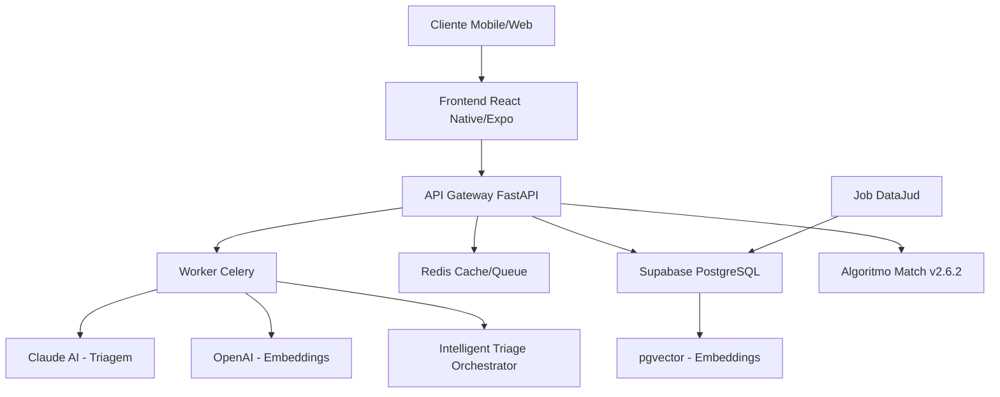
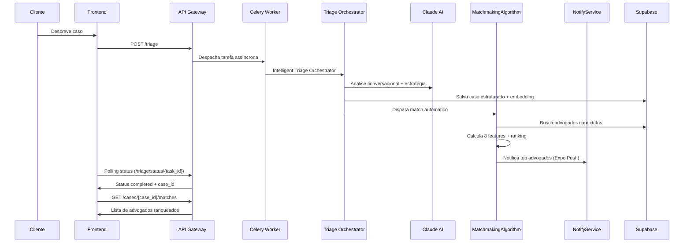
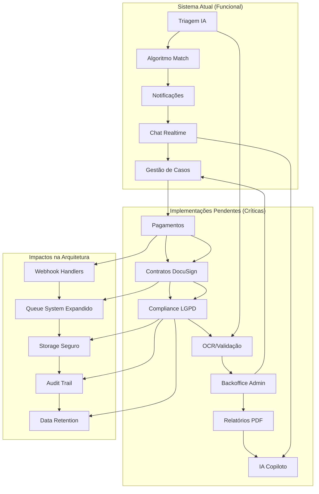

# 📚 Documentação Completa - LITGO5

## 🎯 Visão Geral do Projeto

O **LITGO5** é um sistema de match jurídico inteligente que conecta clientes a advogados especializados através de algoritmos de IA e análise semântica. O sistema utiliza processamento de linguagem natural (LLM) para triagem de casos e um algoritmo proprietário de ranking (versão 2.6.2) com 8 features para correspondência otimizada.

### 🏗️ Arquitetura do Sistema



---

## 🚀 Stack Tecnológica

### Backend
- **Framework**: FastAPI 0.104+
- **Linguagem**: Python 3.10+
- **Banco de Dados**: PostgreSQL (Supabase) com extensão pgvector
- **Cache/Filas**: Redis 7.0+
- **Processamento Assíncrono**: Celery
- **IA/LLM**: Anthropic Claude 3.5 Sonnet, OpenAI GPT-3.5/4
- **Autenticação**: JWT via Supabase Auth
- **Algoritmo de Match**: Versão 2.6.2 com 8 features

### Frontend
- **Framework**: React Native com Expo
- **Linguagem**: TypeScript
- **Navegação**: Expo Router
- **Estado**: Context API + Hooks
- **UI**: NativeWind (Tailwind CSS)

### DevOps
- **Containerização**: Docker + Docker Compose
- **CI/CD**: GitHub Actions (configuração futura)
- **Monitoramento**: Logs estruturados JSON
- **Deploy**: Render/Railway (backend), Expo EAS (mobile)

---

## 🔧 Configuração do Ambiente

### Pré-requisitos

```bash
# Ferramentas necessárias
- Node.js 18+ LTS
- Python 3.10+
- Docker & Docker Compose
- Git
- Expo CLI
```

### 1. Clonagem e Setup Inicial

```bash
# Clonar repositório
git clone <repository-url>
cd LITGO5

# Instalar dependências do frontend
npm install

# Configurar backend
cd backend
python -m venv venv
source venv/bin/activate  # Linux/Mac
# venv\Scripts\activate   # Windows
pip install -r requirements.txt
```

### 2. Configuração de Variáveis de Ambiente

Criar arquivo `.env` na raiz do projeto:

```env
# === SUPABASE ===
SUPABASE_URL=https://your-project.supabase.co
SUPABASE_SERVICE_KEY=your-service-role-key
EXPO_PUBLIC_SUPABASE_ANON_KEY=your-anon-public-key

# === AI SERVICES ===
ANTHROPIC_API_KEY=sk-ant-your-claude-key
OPENAI_API_KEY=sk-your-openai-key

# === REDIS ===
REDIS_URL=redis://localhost:6379/0

# === API ===
EXPO_PUBLIC_API_URL=http://127.0.0.1:8000/api

# === AMBIENTE ===
ENVIRONMENT=development
TESTING=false
```

### 3. Configuração do Banco de Dados

```sql
-- Aplicar migração pgvector
-- Executar no SQL Editor do Supabase
CREATE EXTENSION IF NOT EXISTS vector;

-- Aplicar migrações existentes
-- Ver: supabase/migrations/20250719000000_enable_pgvector.sql
```

---

## 🏃‍♂️ Executando o Projeto

### Desenvolvimento Local com Docker (Recomendado)

```bash
# Na raiz do projeto
docker-compose up --build

# Serviços disponíveis:
# - API: http://localhost:8000
# - Redis: localhost:6379
# - Worker Celery: logs no terminal
```

### Desenvolvimento Manual

```bash
# Terminal 1: Redis
docker run -d -p 6379:6379 redis:alpine

# Terminal 2: API
cd backend
uvicorn backend.main:app --reload --host 0.0.0.0 --port 8000

# Terminal 3: Worker Celery
cd backend
celery -A backend.celery_app worker --loglevel=info

# Terminal 4: Frontend
cd ..
npx expo start
```

### Executando Testes

```bash
# Backend (após correções)
cd backend
TESTING=true python -m pytest tests/ -v

# Frontend
npm run lint
npm run test  # Se configurado
```

---

## 📡 Documentação da API

### Endpoints Principais

#### 1. Triagem Inteligente Assíncrona
```http
POST /api/triage
Authorization: Bearer <jwt_token>
Content-Type: application/json

{
  "texto_cliente": "Fui demitido sem justa causa e não recebi as verbas rescisórias",
  "coords": [-23.5505, -46.6333]
}
```

**Resposta:**
```json
{
  "task_id": "abc123-def456",
  "status": "accepted",
  "message": "A triagem do seu caso foi iniciada..."
}
```

#### 1.1. Triagem Conversacional (Alternativa)
```http
POST /api/intelligent-triage/start
Authorization: Bearer <jwt_token>
Content-Type: application/json

{
  "user_id": "user-123"
}
```

**Resposta:**
```json
{
  "case_id": "case-789",
  "message": "Olá! Vou te ajudar a entender melhor seu caso. Pode me contar o que aconteceu?",
  "status": "interviewing"
}
```

#### 2. Status da Triagem
```http
GET /api/triage/status/{task_id}
Authorization: Bearer <jwt_token>
```

**Resposta (Concluída):**
```json
{
  "status": "completed",
  "result": {
    "case_id": "case-789",
    "area": "Trabalhista",
    "subarea": "Rescisão",
    "urgency_h": 48,
    "embedding": [0.1, 0.2, ...]
  }
}
```

#### 3. Match de Advogados (Automático após Triagem)
```http
POST /api/match
Authorization: Bearer <jwt_token>
Content-Type: application/json

{
  "case_id": "case-789",
  "k": 5,
  "preset": "balanced",
  "radius_km": 50,
  "exclude_ids": ["lawyer-123"]
}
```

**Resposta:**
```json
{
  "case_id": "case-789",
  "matches": [
    {
      "lawyer_id": "lw-001",
      "nome": "Dr. João Silva",
      "fair": 0.95,
      "equity": 0.8,
      "features": {
        "A": 1.0,
        "S": 0.9,
        "T": 0.85,
        "G": 0.7,
        "Q": 0.8,
        "U": 0.9,
        "R": 0.88,
        "C": 0.75
      },
      "breakdown": {
        "area_match": "Especialista em Direito Trabalhista",
        "similarity": "95% de casos similares resolvidos com sucesso",
        "geo_score": "Escritório a 2.5km de distância"
      },
      "weights_used": {
        "A": 0.30, "S": 0.25, "T": 0.15, "G": 0.10,
        "Q": 0.10, "U": 0.05, "R": 0.05, "C": 0.03
      },
      "preset_used": "balanced",
      "avatar_url": "https://...",
      "is_available": true,
      "primary_area": "Trabalhista",
      "rating": 4.8,
      "distance_km": 2.5
    }
  ]
}
```

#### 4. Explicação de Matches
```http
POST /api/explain
Authorization: Bearer <jwt_token>
Content-Type: application/json

{
  "case_id": "case-789",
  "lawyer_ids": ["lw-001", "lw-002"]
}
```

**Resposta:**
```json
{
  "explanations": {
    "lw-001": "Dr. João Silva é uma excelente opção! Com 95% de compatibilidade e alta taxa de sucesso em casos trabalhistas similares, ele está bem preparado para te ajudar. Além disso, seu escritório fica próximo a você.",
    "lw-002": "Dra. Maria Santos também é uma ótima escolha..."
  }
}
```

---

## 📋 Endpoints de Gestão de Casos

### 5. Meus Casos
```http
GET /api/cases/my-cases
Authorization: Bearer <jwt_token>
```

**Resposta:**
```json
{
  "cases": [
    {
      "id": "case-789",
      "title": "Rescisão Indireta por Assédio Moral",
      "area": "Trabalhista",
      "subarea": "Rescisão",
      "status": "in_progress",
      "lawyer_id": "lw-001",
      "lawyer_name": "Dr. João Silva",
      "created_at": "2024-01-15T10:00:00Z",
      "updated_at": "2024-01-20T14:30:00Z",
      "estimated_cost": 15000.0,
      "progress": 75,
      "next_deadline": {
        "date": "2024-01-25T17:00:00Z",
        "description": "Entrega de documentos"
      },
      "stats": {
        "messages_count": 12,
        "documents_count": 5,
        "events_count": 8
      }
    }
  ]
}
```

### 6. Detalhes de Caso Específico
```http
GET /api/cases/{case_id}
Authorization: Bearer <jwt_token>
```

**Resposta:**
```json
{
  "id": "case-789",
  "title": "Rescisão Indireta por Assédio Moral",
  "description": "Cliente sofreu assédio moral sistemático...",
  "area": "Trabalhista",
  "subarea": "Rescisão",
  "status": "in_progress",
  "client_id": "cli-456",
  "client_name": "Maria Santos",
  "lawyer_id": "lw-001",
  "lawyer_name": "Dr. João Silva",
  "contract_id": "ct-789",
  "created_at": "2024-01-15T10:00:00Z",
  "updated_at": "2024-01-20T14:30:00Z",
  "estimated_cost": 15000.0,
  "final_fee": null,
  "progress": 75,
  "service_scope": {
    "description": "Processo trabalhista com foco em rescisão indireta",
    "tasks": ["Análise de evidências", "Petição inicial", "Audiência"]
  },
  "timeline": {
    "created": "2024-01-15T10:00:00Z",
    "lawyer_assigned": "2024-01-15T14:30:00Z",
    "contract_signed": "2024-01-16T09:00:00Z",
    "in_progress": "2024-01-16T10:00:00Z"
  }
}
```

### 7. Atualização de Status
```http
PATCH /api/cases/{case_id}/status
Authorization: Bearer <jwt_token>
Content-Type: application/json

{
  "new_status": "completed",
  "notes": "Caso finalizado com sucesso"
}
```

---

## 📄 Endpoints de Documentos

### 8. Upload de Documento
```http
POST /api/documents/upload/{case_id}
Authorization: Bearer <jwt_token>
Content-Type: multipart/form-data

file: [arquivo binário]
```

**Resposta:**
```json
{
  "id": "doc-123",
  "case_id": "case-789",
  "uploaded_by": "cli-456",
  "file_name": "contrato_trabalho.pdf",
  "file_size": 2048576,
  "file_type": "application/pdf",
  "file_url": "https://storage.supabase.co/v1/object/public/documents/doc-123",
  "storage_path": "cases/case-789/documents/doc-123",
  "created_at": "2024-01-20T16:45:00Z",
  "updated_at": "2024-01-20T16:45:00Z"
}
```

### 9. Listar Documentos do Caso
```http
GET /api/documents/case/{case_id}
Authorization: Bearer <jwt_token>
```

**Resposta:**
```json
{
  "documents": [
    {
      "id": "doc-123",
      "case_id": "case-789",
      "uploaded_by": "cli-456",
      "file_name": "contrato_trabalho.pdf",
      "file_size": 2048576,
      "file_type": "application/pdf",
      "file_url": "https://storage.supabase.co/v1/object/public/documents/doc-123",
      "created_at": "2024-01-20T16:45:00Z"
    }
  ]
}
```

### 10. Download de Documento
```http
GET /api/documents/{document_id}/download
Authorization: Bearer <jwt_token>
```

**Resposta:** Arquivo binário com headers apropriados

---

## 💬 Endpoints de Mensagens/Chat

### 11. Buscar Mensagens do Caso
```http
GET /api/cases/{case_id}/messages
Authorization: Bearer <jwt_token>
```

**Resposta:**
```json
{
  "messages": [
    {
      "id": "msg-001",
      "case_id": "case-789",
      "sender_id": "cli-456",
      "sender_name": "Maria Santos",
      "sender_type": "client",
      "message": "Olá, Dr. João! Gostaria de saber sobre o andamento do processo.",
      "created_at": "2024-01-20T15:30:00Z",
      "read_at": "2024-01-20T15:45:00Z"
    },
    {
      "id": "msg-002",
      "case_id": "case-789",
      "sender_id": "lw-001",
      "sender_name": "Dr. João Silva",
      "sender_type": "lawyer",
      "message": "Olá, Maria! O processo está andando bem. Já protocolamos a petição inicial.",
      "created_at": "2024-01-20T16:00:00Z",
      "read_at": null
    }
  ]
}
```

### 12. Enviar Mensagem
```http
POST /api/cases/{case_id}/messages
Authorization: Bearer <jwt_token>
Content-Type: application/json

{
  "message": "Obrigada pela atualização! Preciso enviar mais documentos?",
  "attachments": ["doc-124", "doc-125"]
}
```

**Resposta:**
```json
{
  "id": "msg-003",
  "case_id": "case-789",
  "sender_id": "cli-456",
  "sender_name": "Maria Santos",
  "sender_type": "client",
  "message": "Obrigada pela atualização! Preciso enviar mais documentos?",
  "attachments": [
    {
      "id": "doc-124",
      "file_name": "documento_adicional.pdf"
    }
  ],
  "created_at": "2024-01-20T16:30:00Z",
  "read_at": null
}
```

---

## ⏰ Endpoints de Controle de Tempo

### 13. Registrar Tempo Trabalhado
```http
POST /api/cases/{case_id}/time_entries
Authorization: Bearer <jwt_token>
Content-Type: application/json

{
  "description": "Análise de documentos e redação de parecer",
  "start_time": "2024-01-20T09:00:00Z",
  "end_time": "2024-01-20T12:00:00Z",
  "billable_hours": 3.0,
  "hourly_rate": 200.0,
  "category": "legal_analysis"
}
```

**Resposta:**
```json
{
  "id": "time-001",
  "case_id": "case-789",
  "lawyer_id": "lw-001",
  "description": "Análise de documentos e redação de parecer",
  "start_time": "2024-01-20T09:00:00Z",
  "end_time": "2024-01-20T12:00:00Z",
  "billable_hours": 3.0,
  "hourly_rate": 200.0,
  "total_amount": 600.0,
  "category": "legal_analysis",
  "created_at": "2024-01-20T12:05:00Z",
  "approved": false
}
```

### 14. Listar Entradas de Tempo
```http
GET /api/cases/{case_id}/time_entries
Authorization: Bearer <jwt_token>
```

**Resposta:**
```json
{
  "time_entries": [
    {
      "id": "time-001",
      "case_id": "case-789",
      "lawyer_id": "lw-001",
      "description": "Análise de documentos e redação de parecer",
      "start_time": "2024-01-20T09:00:00Z",
      "end_time": "2024-01-20T12:00:00Z",
      "billable_hours": 3.0,
      "hourly_rate": 200.0,
      "total_amount": 600.0,
      "category": "legal_analysis",
      "created_at": "2024-01-20T12:05:00Z",
      "approved": false
    }
  ],
  "summary": {
    "total_hours": 15.5,
    "total_amount": 3100.0,
    "approved_hours": 12.0,
    "pending_approval": 3.5
  }
}
```

### 15. Ajustar Honorários
```http
PATCH /api/cases/{case_id}/fees
Authorization: Bearer <jwt_token>
Content-Type: application/json

{
  "fee_type": "success", // "success", "fixed", "hourly"
  "percentage": 20.0,    // Para success fee
  "fixed_amount": null,  // Para honorários fixos
  "hourly_rate": null,   // Para cobrança por hora
  "adjustments": [
    {
      "description": "Desconto por complexidade reduzida",
      "amount": -500.0
    }
  ]
}
```

---

## 🧠 Algoritmo de Match

### Núcleo: `algoritmo_match.py` (Versão 2.6.2)

O algoritmo utiliza 8 features principais com pesos específicos:

```python
WEIGHTS = {
    "A": 0.30,  # Area Match - Compatibilidade de área
    "S": 0.25,  # Similarity - Similaridade de casos
    "T": 0.15,  # Taxa de sucesso
    "G": 0.10,  # Geolocalização
    "Q": 0.10,  # Qualificação (experiência + títulos)
    "U": 0.05,  # Urgência vs capacidade de resposta
    "R": 0.05,  # Rating/avaliações
    "C": 0.03,  # Soft Skills - Habilidades interpessoais
}
```

### Fluxo do Algoritmo

1.  **Cálculo Raw Score**: Soma ponderada das 8 features
2.  **Epsilon Clustering**: Agrupa advogados com score similar (±5%)
3.  **Aplicação de Equidade**: Favorece advogados com menor carga de trabalho
4.  **Boost de Diversidade**: Aplica boost para grupos sub-representados
5.  **Ranking Final**: Ordena por score justo + desempate por timestamp

### Exemplo de Uso

```python
from backend.algoritmo_match import MatchmakingAlgorithm

# Criar instância do algoritmo
matcher = MatchmakingAlgorithm()

# Executar ranking com parâmetros completos
top_lawyers = matcher.rank(
    case=case_data,
    candidates=lawyer_list,
    top_n=5,
    preset="balanced",
    equity_weight=0.3,
    radius_km=case_data.radius_km
)
```

---

## 🎨 Componentes Frontend

### Estrutura de Telas (Conforme @PLANO_DE_SPRINTS.md)

A estrutura de navegação foi redesenhada para acomodar as novas funcionalidades, com abas dedicadas e uma organização mais clara para cada perfil de usuário.

```
app/
├── (auth)/                 # Autenticação (Login, Registro)
│   ├── index.tsx
│   ├── register-client.tsx
│   └── register-lawyer.tsx
│
├── (tabs)/                 # Navegação principal pós-login
│   │
│   ├── _layout.tsx         # Define as abas principais para cada perfil (cliente/advogado)
│   │
│   ├── index.tsx           # Tela Home (Dashboard dinâmico)
│   │
│   ├── cases/              # Meus Casos (Comum para ambos)
│   │
│   ├── advogados/          # Hub de Advogados (Busca Geral - Visível para Clientes)
│   │   └── index.tsx       # Tela de Busca Geral
│   │
│   ├── recomendacoes.tsx   # ABA PRINCIPAL: Matches (Recomendações)
│   │
│   ├── financeiro/         # NOVA (Visível para Clientes)
│   │   ├── index.tsx
│   │   └── ...
│   │
│   ├── ofertas/            # NOVA (Visível para Advogados)
│   │   ├── index.tsx
│   │   └── ...
│   │
│   └── profile/            # Perfil (Comum para ambos, com telas internas diferentes)
│
└── (modals)/
    └── SubmitReview.tsx    # Modal para avaliação de advogado
```

### Componentes Principais

#### LawyerMatchCard
```tsx
// Exibe advogado com botão de explicação
<LawyerMatchCard 
  lawyer={lawyer} 
  onSelect={() => selectLawyer(lawyer.id)}
  caseId={caseId}
/>
```

#### useTaskPolling Hook
```tsx
// Hook para polling de status de tarefas
const { taskResult, isLoading, error } = useTaskPolling(taskId);

useEffect(() => {
  if (taskResult?.status === 'completed') {
    // Navegar para próxima tela
  }
}, [taskResult]);
```

---

## 🌊 Fluxos de Usuário Detalhados

Esta seção detalha os principais fluxos de interação do usuário com o aplicativo, explicando a lógica de negócio, os componentes envolvidos e as integrações com o backend.

### 1. Cadastro de Advogado (`app/(auth)/register-lawyer.tsx`)

Este é o ponto de entrada para advogados na plataforma. O processo é estruturado como um formulário de 5 etapas para garantir uma coleta de dados completa e organizada.

**Visão Geral do Componente:**
- **Localização:** `app/(auth)/register-lawyer.tsx`
- **Propósito:** Coletar dados pessoais, profissionais, documentos e informações de diversidade de novos advogados.
- **Frameworks/Libs:** React Native, Expo Router, Supabase, Lucide Icons.

**Funcionalidades por Etapa:**

1.  **Etapa 1: Informações Pessoais**
    - Coleta de dados básicos: `Nome Completo`, `CPF`, `Telefone`, `E-mail` e `Senha`.
    - Possui um controle para visibilidade da senha.

2.  **Etapa 2: Dados Profissionais e Endereço**
    - Coleta de informações essenciais para o match: `Nº da OAB`, `Áreas de atuação` (separadas por vírgula), e `Nº máximo de casos simultâneos`.
    - O endereço é coletado de forma estruturada (`CEP`, `Rua`, `Número`, `Bairro`, `Cidade`, `UF`) para posterior geocodificação.

3.  **Etapa 3: Documentos**
    - **Upload de Currículo (Opcional, com IA):**
        - O advogado pode enviar seu CV nos formatos PDF ou TXT.
        - **Lógica de IA:**
            1.  O texto do arquivo é extraído usando `extractTextFromFile`.
            2.  O texto é enviado para a função `analyzeLawyerCV`, que utiliza um modelo de linguagem (LLM) para analisar o conteúdo.
            3.  A IA identifica e extrai informações como nome, contato, número da OAB, anos de experiência e áreas de prática.
            4.  Os campos do formulário são pré-preenchidos com os dados extraídos, agilizando o cadastro. O usuário é notificado e pode revisar as informações.
    - **Upload de Documentos Obrigatórios:**
        - Cópia da OAB (imagem).
        - Comprovante de residência (imagem).
        - Utiliza `expo-image-picker` e `expo-document-picker`.

4.  **Etapa 4: Informações de Diversidade (Opcional)**
    - Coleta dados como `Gênero`, `Etnia`, `Orientação Sexual`, e se o profissional se identifica como `PCD` ou `LGBTQIA+`.
    - Um texto informativo explica que os dados são usados para promover equidade na distribuição de casos através do algoritmo de match.

5.  **Etapa 5: Termos e Contrato**
    - Exibe um texto final onde o usuário concorda com os Termos de Parceria e a Política de Privacidade ao finalizar o cadastro.

**Lógica de Submissão (`handleNext` na última etapa):**

O processo de finalização é uma transação com várias etapas críticas:

1.  **Geocodificação:** O endereço completo é enviado ao `locationService.geocodeAddress` para obter as coordenadas `latitude` e `longitude`. Se a geocodificação falhar, o processo é interrompido.
2.  **Criação de Usuário (Supabase Auth):** É feita uma chamada a `supabase.auth.signUp`. O `user_type` é definido como `LAWYER` e o `role` inicial como `lawyer_pending_approval`. As coordenadas geográficas são salvas nos metadados do usuário.
3.  **Upload de Arquivos (Supabase Storage):** Os documentos (CV, OAB, comprovante) são enviados para um bucket de armazenamento seguro. O caminho do arquivo inclui o `user.id` para garantir a associação correta.
    - **Tratamento de Erro:** Se o upload falhar, o sistema tenta deletar o usuário recém-criado (`supabase.auth.admin.deleteUser`) para evitar perfis incompletos e órfãos no sistema.
4.  **Atualização de Metadados:** As informações de diversidade são salvas nos metadados do usuário através de `supabase.auth.updateUser`.
5.  **Criação do Perfil (`lawyers`):** Um novo registro é inserido na tabela `lawyers` do banco de dados, contendo todas as informações profissionais, as URLs dos documentos e as coordenadas geográficas.
6.  **Persistência da Análise de CV:** Se o CV foi analisado, os resultados estruturados da IA são salvos em uma tabela associada, vinculada ao `user.id` e à `cvUrl`.

Após a conclusão bem-sucedida, o usuário recebe um alerta de confirmação e é redirecionado para a tela de login.

```mermaid
flowchart TD
    subgraph "Frontend: Cadastro de Advogado (Multi-Etapas)"
        A[Inicia em '/register-lawyer'] --> B["Etapa 1: Infos Pessoais"];
        B --> C["Etapa 2: Dados Profissionais e Endereço"];
        C --> D["Etapa 3: Documentos (CV, OAB, etc.)"];
        D --> E["Etapa 4: Diversidade (Opcional)"];
        E --> F["Etapa 5: Termos e Contrato"];
        F --> G{Finalizar Cadastro};
    end

    subgraph "Backend: Orquestração do Cadastro"
        H["1. Geocodificar Endereço"];
        I["2. Criar Usuário no Supabase Auth<br/>(role: lawyer_pending_approval)"];
        J["3. Upload dos Documentos para Storage"];
        K["4. Inserir Perfil na Tabela 'lawyers'"];
        L["5. Salvar Análise do CV (se houver)"];
    end

    subgraph "Usuário"
        M["Alerta: 'Cadastro enviado para análise'"];
        N[Redirecionado para a tela de Login];
    end

    G -- "Clica" --> H;
    H -- "Sucesso" --> I;
    H -- "Falha" --> O[Exibe erro de endereço];
    
    I -- "Sucesso" --> J;
    I -- "Falha" --> P["Exibe erro<br/>(E-mail já existe)"];

    J -- "Sucesso" --> K;
    J -- "Falha" --> Q["Deleta usuário do Auth (rollback)<br/>Exibe erro de upload"];

    K -- "Sucesso" --> L;
    L -- "Sucesso" --> M;
    M --> N;
end
```

---

### 2. Cadastro de Cliente (`app/(auth)/register-client.tsx`)

O fluxo de cadastro de cliente é a porta de entrada para usuários que buscam assessoria jurídica. A tela foi projetada para ser flexível, atendendo tanto pessoas físicas (PF) quanto jurídicas (PJ).

**Visão Geral do Componente:**
- **Localização:** `app/(auth)/register-client.tsx`
- **Propósito:** Coletar os dados necessários para criar uma conta de cliente, com validação e formatação em tempo real.
- **Frameworks/Libs:** React Native, Expo Router, Supabase.

**Funcionalidades Principais:**

1.  **Seletor de Tipo de Usuário:**
    -   O usuário começa escolhendo entre "Pessoa Física" ou "Pessoa Jurídica".
    -   Essa escolha altera dinamicamente os campos do formulário para solicitar os documentos e nomes corretos.

2.  **Formulário Adaptativo:**
    -   **Para Pessoa Física (PF):** São solicitados `Nome Completo` e `CPF`.
    -   **Para Pessoa Jurídica (PJ):** São solicitados `Razão Social` e `CNPJ`.
    -   **Campos Comuns:** `E-mail`, `Telefone` e `Senha` são requeridos para ambos os tipos.

3.  **Validação e Formatação em Tempo Real:**
    -   Os campos de `CPF`, `CNPJ` e `Telefone` possuem máscaras que formatam a entrada do usuário automaticamente, melhorando a experiência e garantindo a consistência dos dados.
    -   Validações robustas verificam o formato do e-mail, a força da senha e o preenchimento correto de todos os campos obrigatórios antes de permitir o envio.

**Lógica de Submissão (`handleRegister`):**

1.  **Criação de Usuário (Supabase Auth):** Após a validação do formulário, a função `supabase.auth.signUp` é chamada.
2.  **Armazenamento de Metadados:** As informações do cliente, como nome/razão social, CPF/CNPJ, telefone e o tipo de usuário (`PF` ou `PJ`), são salvas diretamente no campo `options.data` do Supabase. A `role` é definida como `client`.
3.  **Confirmação por E-mail:** O Supabase envia automaticamente um e-mail de confirmação para o endereço fornecido. A conta só se torna ativa após o clique no link de verificação.
4.  **Redirecionamento:** Após a submissão bem-sucedida, o usuário é notificado sobre o e-mail de confirmação e é redirecionado para a tela de login.

```mermaid
flowchart TD
    subgraph "Frontend (app/auth/index.tsx e /role-selection)"
        A[Acessa a tela inicial] --> B{Visualiza Welcome View};
        B -- "Clica em 'Criar Nova Conta'" --> C[Tela de Seleção de Perfil];
        C -- "Escolhe 'Sou Cliente'" --> D["Redireciona para '/register-client'"];
        D --> E{Escolhe tipo: PF ou PJ?};
        E -- "Pessoa Física" --> F1[Preenche: Nome, CPF, Email, Tel, Senha];
        E -- "Pessoa Jurídica" --> F2[Preenche: Razão Social, CNPJ, Email, Tel, Senha];
        F1 --> G["Clica em 'Criar Conta'"];
        F2 --> G;
        G --> H{Formulário Válido?};
        B -- "Clica em 'Já tenho uma conta'" --> I[Visualiza LoginView];
    end

    subgraph "Backend (Supabase)"
        J[supabase.auth.signUp] --> K[Cria usuário com status pendente];
        K --> L[Envia e-mail de confirmação];
    end

    subgraph "Usuário"
        M["Recebe Alerta de Sucesso<br/>'Verifique seu e-mail'"];
        N[Redirecionado para Login];
        O[Abre e-mail e clica no link];
        P[Conta é ativada];
    end

    H -- "Sim" --> J;
    H -- "Não" --> Q[Exibe erros de validação na tela];
    J -- "Sucesso" --> M;
    J -- "Erro" --> R["Exibe erro<br/>'E-mail já existe', etc."];
    M --> N;
    L --> O --> P;
end
```

---

## 🎨 Interfaces de Usuário (Dashboards Principais)

A tela inicial (`app/(tabs)/index.tsx`) do aplicativo é dinâmica e exibe um dashboard específico para cada tipo de usuário (`client` ou `lawyer`), determinado pelo `role` obtido através do hook `useAuth`.

### 1. Dashboard do Cliente (`components/organisms/ClientDashboard.tsx`)

A interface do cliente é focada em guiá-lo para a ação principal: iniciar uma consulta jurídica com a inteligência artificial.

**Componentes e Funcionalidades:**

-   **Cabeçalho:** Exibe uma saudação personalizada com o nome do cliente e um botão de `logout`.
-   **Título Principal:** "Seu Problema Jurídico, Resolvido com Inteligência".
-   **Subtítulo:** Explica o benefício principal da plataforma: "Use nossa IA para uma pré-análise gratuita e seja conectado ao advogado certo para o seu caso."
-   **Botão de Ação Principal (CTA):**
    -   **Texto:** "Iniciar Consulta com IA".
    -   **Ação:** Ao ser pressionado, redireciona o usuário para a tela de chat de triagem (`/chat-triagem`), onde ele poderá descrever seu caso para o assistente de IA.

O design é limpo e direto, com um único e claro ponto de partida para o usuário, garantindo uma experiência intuitiva.

### 2. Dashboard do Advogado (`components/organisms/LawyerDashboard.tsx`)

A interface do advogado é um painel de controle mais denso, projetado para fornecer uma visão geral rápida de sua atividade e acesso rápido às principais ferramentas da plataforma.

**Componentes e Funcionalidades:**

-   **Cabeçalho:** Apresenta uma saudação de boas-vindas com o nome do advogado e um botão de `logout`.
-   **Cartões de Estatísticas (`StatCard`):**
    -   Exibem métricas importantes em tempo real, como `Casos Ativos`, `Novos Leads` e `Alertas`.
    -   Permitem que o advogado avalie rapidamente sua carga de trabalho e oportunidades.
-   **Grade de Ações (`ActionButton`):**
    -   Oferece acesso rápido às seções mais importantes do aplicativo:
        -   **Meus Casos:** Leva à lista de casos sob sua responsabilidade.
        -   **Mensagens:** Abre a área de chat para comunicação com clientes.
        -   **Agenda:** Acessa o calendário de compromissos.
        -   **Notificações:** Exibe alertas e atualizações importantes.
-   **Acesso Rápido:**
    -   Links diretos para áreas de gestão de perfil:
        -   **Editar Perfil Público:** Permite ao advogado atualizar suas informações que são visíveis para os clientes.
        -   **Análise de Performance:** Leva a uma tela com métricas detalhadas sobre seu desempenho na plataforma (taxa de aceitação de casos, avaliações, etc.).

Esta tela funciona como um centro de comando para o advogado, otimizando seu fluxo de trabalho e permitindo que ele gerencie suas atividades de forma eficiente.

---

## 🧠 Fluxo de Match de Advogados (End-to-End)

Este é o fluxo mais crítico do sistema. Ele conecta um caso de cliente aos advogados mais adequados, utilizando uma combinação de busca, filtragem e um algoritmo de ranking proprietário.

### 1. Ponto de Partida (Frontend)

-   **Gatilho:** O fluxo geralmente começa após o cliente concluir a triagem de um caso com a IA. A tela de resultados da triagem (`app/triage-result.tsx`) oferece um botão para "Encontrar Advogados".
-   **Navegação:** Ao clicar, o cliente é levado para a tela de matches (`app/(tabs)/matches.tsx`), passando o `case_id` como parâmetro.

### 2. Chamada da API (Frontend → Backend)

-   A tela `matches.tsx` faz uma chamada para o endpoint do backend: `POST /api/match`.
-   **Payload (`MatchRequestSchema`):**
    -   `case_id`: O ID do caso a ser analisado.
    -   `top_n`: Quantos advogados retornar (ex: 5).
    -   `preset`: Um preset de pesos para o algoritmo (ex: "balanced", "expert"), permitindo flexibilidade na lógica de negócio.
    -   `exclude_ids` (opcional): Lista de IDs de advogados a serem ignorados, útil para funcionalidades como "ver outras opções".
    -   `radius_km` (opcional): Permite ao usuário ajustar o raio de busca geográfica.

### 3. Orquestração (Backend - `match_service.py`)

O `match_service` recebe a requisição e orquestra uma sequência de operações:

1.  **Cache Check:** Verifica no Redis se já existe um resultado de match para a mesma requisição, retornando-o imediatamente se encontrado.
2.  **Carregamento de Dados:**
    -   Busca os detalhes do `Case` (área, subárea, embedding do resumo, etc.) no banco de dados.
    -   Executa uma busca por advogados (`Lawyer`) candidatos, usando um procedimento otimizado (`find_nearby_lawyers`) que filtra por área e proximidade geográfica.
3.  **Execução do Algoritmo:** Invoca `algo.rank()`, passando o `Case`, a lista de advogados `candidates` e os parâmetros da requisição.

### 4. O Coração do Match (`algoritmo_match.py`)

O `MatchmakingAlgorithm` executa a lógica principal:

1.  **Carregamento de Pesos:** Carrega um conjunto de pesos para as features, que pode ser o padrão, um `preset` específico ou até mesmo um modelo experimental para testes A/B.
2.  **Filtro de Disponibilidade:** Em uma única chamada otimizada (`get_lawyers_availability_status`), verifica quais advogados estão disponíveis para receber casos, operando em modo degradado (fail-open) se o serviço de disponibilidade falhar.
3.  **Cálculo de Features:** Para cada advogado disponível, o `FeatureCalculator` calcula um score normalizado (0-1) para 8 dimensões:
    -   **A - Area Match:** Compatibilidade da área de atuação.
    -   **S - Similarity:** Similaridade semântica entre o resumo do caso e os casos históricos do advogado, usando `cosine_similarity` nos embeddings.
    -   **T - Taxa de Sucesso:** Taxa de sucesso do advogado, com foco na subárea do caso e ajustada por um multiplicador de status (verificado, pendente, etc).
    -   **G - Geolocalização:** Proximidade do advogado em relação ao cliente, normalizada pelo raio de busca.
    -   **Q - Qualificação:** Score composto que avalia anos de experiência, títulos acadêmicos, publicações e outras métricas de reputação.
    -   **U - Urgência vs. Capacidade:** Compatibilidade entre a urgência do caso e o tempo médio de resposta do advogado.
    -   **R - Review Score:** Média das avaliações, com um fator de confiança que aumenta com o número de reviews válidos.
    -   **C - Soft Skills:** Score de habilidades interpessoais, calculado a partir da análise de sentimento dos textos de reviews.
4.  **Cálculo do Score Bruto (LTR):** O score final de cada advogado é uma soma ponderada de todas as 8 features. `score_ltr = Σ(feature * peso)`, onde os pesos são definidos conforme a versão 2.6.2 do algoritmo.
5.  **ε-Clustering e Equidade:**
    -   Um "ε-cluster" é criado, selecionando um grupo de elite de advogados com scores próximos ao mais alto.
    -   Dentro deste cluster, um `equity_weight` é calculado para cada advogado, favorecendo aqueles com menor carga de trabalho atual (`active_cases`).
    -   Um score final "justo" (`fair_base`) é calculado, combinando o score bruto com o fator de equidade.
6.  **Boost de Diversidade:** O algoritmo aplica um "boost" sequencial no score dos advogados pertencentes a grupos sub-representados (gênero, etnia, etc.), promovendo ativamente a diversidade.
7.  **Ranking Final:** Os advogados são ordenados pelo score justo final. O critério de desempate é o `last_offered_at`, garantindo que advogados que não recebem ofertas há mais tempo tenham prioridade.

### 5. Pós-Processamento e Resposta (Backend)

1.  **Persistência:** Os resultados do match são salvos na tabela `case_matches` para auditoria e análise.
2.  **Criação de Ofertas:** Para os advogados no topo do ranking, são criados registros na tabela `offers`, formalizando o convite para o caso.
3.  **Notificações:** O `notify_service` envia notificações (push, e-mail) para os advogados selecionados.
4.  **Formatação da Resposta:** O `match_service` formata os dados dos advogados ranqueados em um `MatchResponseSchema` e os envia de volta para o frontend.

### 6. Exibição dos Resultados (Frontend)

-   A tela `matches.tsx` recebe a lista de advogados e a renderiza usando componentes como `LawyerMatchCard`.
-   O usuário pode ver os advogados recomendados, seus scores, distância e outras informações relevantes, e então iniciar o contato.

---

## 📁 Tela Meus Casos (Visão Cliente e Advogado)

Esta tela (`app/(tabs)/cases/`) é um hub central para o gerenciamento de todos os casos de um usuário, mas sua apresentação e funcionalidades mudam drasticamente dependendo do perfil (cliente ou advogado).

### Arquitetura do Componente

A lógica é centralizada no componente `ImprovedCaseList.tsx`, que funciona como um motor de renderização. Ele é alimentado por diferentes "telas-container":
-   `ClientCasesScreen.tsx`: Carrega os dados (`getUserCases`) e as estatísticas (`getCaseStats`) para o cliente logado.
-   `LawyerCasesScreen.tsx`: Carrega os dados (`getLawyerCases`) para o advogado e injeta um componente de `header` customizado com um dashboard de KPIs.

### Componentes Chave

-   **`CaseHeader.tsx`:** Exibido no topo, mostra um resumo estatístico dos casos, com contagens por status (Ex: "Em Triagem", "Atribuído", "Finalizado").
-   **Filtros Visuais:** Uma barra de filtros com badges permite que o usuário alterne rapidamente a visualização dos casos por status (`Todos`, `Ativos`, `Pendentes`, `Concluídos`, etc.).
-   **`DetailedCaseCard.tsx` (Visão do Cliente):** Um card rico em informações que exibe:
    -   Dados do advogado associado (nome, avatar, especialidade).
    -   Status atual do caso (com `ProgressBar`), custo estimado e nível de risco.
    -   Próxima etapa clara e acionável.
    -   Botões de ação rápida: `Ver Resumo da IA`, `Chat`, `Documentos`, `Contatar Advogado`.
-   **`LawyerCaseCard.tsx` (Visão do Advogado):** Uma versão mais focada para o advogado, mostrando:
    -   Nome do cliente.
    -   Status do caso e área do direito.
    -   Valor dos honorários.
    -   Um badge de notificação para mensagens não lidas, incentivando a comunicação rápida.
-   **`FabNewCase.tsx`:** Um "Floating Action Button" que permite ao cliente iniciar um novo processo de triagem a qualquer momento.

### Funcionalidades por Perfil

#### Visão do Cliente

-   **Foco:** Clareza, transparência e comunicação.
-   **Dashboard:** O cabeçalho foca em mostrar em que etapa do funil cada caso se encontra.
-   **Ações:** O cliente pode facilmente:
    1.  Ver um resumo detalhado do seu caso.
    2.  Conversar com o advogado via chat.
    3.  Acessar e gerenciar documentos.
    4.  Acompanhar o progresso através de uma timeline visual (`CaseProgress.tsx`).
-   **Pré-Análise:** Um card especial (`PreAnalysisCard`) é exibido para casos que acabaram de passar pela triagem da IA, oferecendo uma visão imediata dos pontos-chave, custo estimado e nível de risco antes mesmo de um advogado ser designado.

#### Visão do Advogado

-   **Foco:** Eficiência, gestão de carga de trabalho e finanças.
-   **Dashboard:** O `headerComponent` injetado na lista exibe KPIs financeiros e operacionais: `Casos Ativos`, `Aguardando Resposta`, `Faturado (mês)`.
-   **Ações:** O advogado tem uma visão focada em:
    1.  Identificar rapidamente quais casos precisam de sua atenção (mensagens não lidas).
    2.  Acessar os detalhes do caso para trabalhar nele.
    3.  A lista é otimizada para que ele possa gerenciar múltiplos clientes de forma eficiente.

## 🔄 Fluxo de Dados

### 1. Triagem de Caso



### 2. Sistema de Filas e Processamento Assíncrono

```python
# Configuração Celery
# backend/celery_app.py
from celery import Celery

celery_app = Celery(
    "worker",
    broker="redis://localhost:6379/0",
    backend="redis://localhost:6379/0",
    include=["backend.tasks.triage_tasks"]
)

# Tarefa principal de triagem
@celery_app.task(name="tasks.run_full_triage_flow_task")
def run_full_triage_flow_task(texto_cliente: str, user_id: str):
    """
    Fluxo completo: triagem → match → notificação
    """
    # 1. Roteamento inteligente
    strategy = triage_router_service.classify_complexity(texto_cliente)
    
    # 2. Triagem com IA
    triage_result = await triage_service.run_triage(texto_cliente, strategy)
    
    # 3. Salvar caso no banco
    case_id = await save_case_to_database(triage_result, user_id)
    
    # 4. Executar match automático
    match_request = MatchRequest(case_id=case_id, k=5, preset="balanced")
    await find_and_notify_matches(match_request)
    
    return {"case_id": case_id, "status": "completed"}
```

### 3. Arquitetura de Triagem Inteligente

```python
# backend/services/intelligent_triage_orchestrator.py
class IntelligentTriageOrchestrator:
    """
    Orquestrador principal que gerencia estratégias adaptativas:
    - simple: Casos diretos (multa, cobrança)
    - failover: Casos médios (contratos, trabalhista)
    - ensemble: Casos complexos (recuperação judicial)
    """
    
    async def start_intelligent_triage(self, user_id: str) -> Dict[str, Any]:
        case_id, first_message = await self.interviewer.start_conversation(user_id)
        
        orchestration_state = {
            "user_id": user_id,
            "status": "interviewing",
            "flow_type": "unknown",
            "started_at": time.time()
        }
        
        await self.state_manager.save_orchestration_state(case_id, orchestration_state)
        return {"case_id": case_id, "message": first_message, "status": "interviewing"}
```

---

## 🔐 Segurança

### Autenticação JWT

```python
# backend/auth.py
async def get_current_user(token: str = Depends(oauth2_scheme)):
    user_response = supabase.auth.get_user(token)
    if not user_response.user:
        raise HTTPException(401, "Token inválido")
    return user_response.user
```

### Rate Limiting

```python
# backend/main.py
limiter = Limiter(key_func=get_remote_address)
app.state.limiter = limiter

# Aplicado nas rotas críticas
@limiter.limit("30/minute")  # Triagem limitada
@router.post("/triage")
async def http_triage_case(...):
    pass

@limiter.limit("60/minute")  # Match mais permissivo
@router.post("/match")
async def http_find_matches(...):
    pass
```

### Notificações Seguras

```python
# backend/services/notify_service.py
async def send_notifications_to_lawyers(lawyer_ids: List[str], payload: Dict[str, Any]):
    """
    Envia notificações Expo Push com cooldown de 5 minutos
    para evitar spam e melhorar experiência do advogado.
    """
    # Filtrar advogados em cooldown
    eligible_lawyers = []
    for lawyer_id in lawyer_ids:
        cache_key = f"notification_cooldown:{lawyer_id}"
        if not await cache_service.get(cache_key):
            eligible_lawyers.append(lawyer_id)
    
    # Enviar via Expo Push Notifications
    for lawyer in eligible_lawyers:
        await send_expo_push_notification(lawyer, payload)
        
    # Marcar cooldown de 5 minutos
    for lawyer_id in eligible_lawyers:
        await cache_service.set(f"notification_cooldown:{lawyer_id}", True, ttl=300)
```

---

## 🔄 Fluxo Completo do Sistema (Cliente ↔ Advogado)

Este diagrama mostra o fluxo end-to-end real do sistema LITGO5, baseado na implementação atual:

```mermaid
flowchart TD
  %% Cliente subflow
  subgraph Cliente
    C1[Descreve caso via chat triagem] 
    C2[Recebe confirmação de triagem]
    C3[Consulta status e timeline do caso] 
    C4[Envia documentos complementares] 
    C5[Envia mensagem no chat]
  end

  %% Backend core
  subgraph Backend
    B1[API Gateway<br>/triage (POST)] 
    B1a[Celery Worker<br>Triagem Assíncrona]
    B1b[Intelligent Triage<br>Orchestrator]
    B2[Auth/RLS<br>validação JWT] 
    B3[Grava em<br>supabase.cases] 
    B4[MatchmakingAlgorithm.rank()] 
    B5[RedisCache<br>get/set static_feats] 
    B6[AvailabilityService<br>circuit breaker] 
    B7[Cálculo de features & fairness] 
    B8[Retorna top-N advogados] 
    B9[Automatic Assignment<br>via Match Score]
    B10[Grava em<br>case_assignments] 
    B11[TaskService<br>cria prazos/tarefas] 
    B12[Notification Service<br>Expo Push + E-mail] 
    B13[API Gateway<br>/cases/{id} (GET)] 
    B14[Supabase Storage<br>+ Realtime Chat]
  end

  %% Advogado subflow
  subgraph Advogado
    A1[Recebe notificação Expo Push]
    A2[Abrir aba "Meus Casos"]
    A3[Visualiza lista e filtros]
    A4[Seleciona caso e abre detalhe]
    A5[Trabalha no caso: upload doc, chat, marca tarefa, lança horas]
    A6[Marca caso como concluído]
  end

  %% Ligações Cliente → Backend
  C1 --> B1 
  B1 --> B2 --> B1a --> B1b --> B3 
  B3 --> C2 
  B3 --> B4 
  B4 --> B5 --> B6 --> B7 --> B8
  B8 --> B9 --> B10 --> B11 --> B12 --> A1

  C3 --> B13 --> C3
  C4 --> B14 --> B12 --> A1
  C5 --> B14 --> B12 --> A1

  %% Ligações Advogado → Backend
  A1 --> A2
  A2 --> B13 --> A3
  A3 --> A4
  A4 --> B13 --> A4
  A5 --> B14 --> B12 --> C3
  A6 --> B13 --> B12 --> C3

  %% Notificações para o Cliente
  B12 --> C3
```

### Explicação Detalhada do Fluxo

#### 1. **Cliente Inicia Triagem**
- **C1→B1**: Cliente descreve caso via `/triage (POST)` (não existe endpoint direto `/cases`)
- **B1→B2→B1a**: API valida JWT/RLS e despacha tarefa assíncrona para Celery Worker
- **B1a→B1b**: Worker executa `Intelligent Triage Orchestrator` com estratégias adaptativas
- **B1b→B3**: Após análise completa, grava caso estruturado em `supabase.cases`
- **B3→C2**: Cliente recebe confirmação via polling de status

#### 2. **Match Automático de Advogados**
- **B3→B4**: Dispara automaticamente `MatchmakingAlgorithm.rank()` (v2.6.2 com 8 features)
- **B4→B5→B6→B7→B8**: 
  - Usa Redis Cache para features estáticas
  - AvailabilityService com circuit breaker para verificar disponibilidade
  - Calcula features, aplica fairness/diversity e ranking final
- **B8→B9→B10**: Atribuição automática baseada no score (não manual)
- **B10→B11→B12→A1**: Cria tarefas via TaskService e notifica advogados via Expo Push

#### 3. **Acompanhamento pelo Cliente**
- **C3→B13→C3**: Cliente consulta status via `GET /cases/{id}`
- **C4/C5→B14→B12→A1**: Upload de docs/chat vai para Supabase Storage + Realtime
- **B12→C3**: Cliente recebe notificações de atualizações

#### 4. **Trabalho do Advogado**
- **A1→A2→A3**: Advogado recebe Expo Push, abre "Meus Casos", visualiza com filtros
- **A4→B13→A4**: Seleciona caso e carrega detalhes atualizados
- **A5→B14→B12→C3**: Trabalha no caso (docs, chat, tarefas) e cliente é notificado
- **A6→B13→B12→C3**: Marca conclusão e notifica cliente

---

## ⚠️ Implementações Pendentes para Produção

### 🎯 Visão Geral do Status de Desenvolvimento

O LITGO5 possui um núcleo sólido implementado, mas ainda há componentes críticos que precisam ser desenvolvidos para tornar o sistema 100% funcional em produção. Esta seção detalha as pendências organizadas por prioridade e impacto no negócio.

### 📊 Resumo Executivo

| Área | Status | Impacto no Negócio | Prioridade |
|------|--------|-------------------|-----------|
| **Pagamentos e Monetização** | ⛔ Não implementado | **CRÍTICO** - Sem receita | 🔴 Alta |
| **OCR/Validação de Documentos** | 🟡 Parcial | **ALTO** - Automação e compliance | 🟡 Média |
| **Assinatura de Contratos** | ⛔ Não implementado | **ALTO** - Formalização jurídica | 🟡 Média |
| **Relatórios PDF e IA Copiloto** | ⛔ Não implementado | **MÉDIO** - Experiência do usuário | 🟡 Média |
| **Avaliações e NPS** | 🟡 Parcial | **MÉDIO** - Melhoria contínua | 🟡 Média |
| **Backoffice e Admin Dashboard** | ⛔ Não documentado | **ALTO** - Operações e suporte | 🟡 Média |
| **Compliance (LGPD/Consentimento)** | 📝 Backlog | **CRÍTICO** - Conformidade legal | 🔴 Alta |
| **Tests & QA** | Básico | **ALTO** - Confiabilidade | 🟡 Média |

---

## 🔴 Prioridade Alta - Bloqueadores de Produção

### 1. 💳 Pagamentos e Monetização

**Status:** ⛔ Não implementado  
**Impacto:** Sem sistema de pagamentos, não há receita nem formalização de contratos de serviço.

#### O que precisa ser implementado:

**Backend:**
```python
# Estrutura de tabelas necessárias
"""
transactions (
    id UUID PRIMARY KEY,
    case_id UUID REFERENCES cases(id),
    client_id UUID REFERENCES auth.users(id),
    lawyer_id UUID REFERENCES auth.users(id),
    amount DECIMAL(10,2),
    fee_percentage DECIMAL(5,2),
    payment_method VARCHAR(50), -- 'stripe', 'pix', 'credit_card'
    status VARCHAR(20), -- 'pending', 'completed', 'failed', 'refunded'
    stripe_payment_intent_id VARCHAR(100),
    pix_qr_code TEXT,
    created_at TIMESTAMP,
    paid_at TIMESTAMP,
    metadata JSONB
);

payment_plans (
    id UUID PRIMARY KEY,
    case_id UUID REFERENCES cases(id),
    plan_type VARCHAR(20), -- 'hourly', 'fixed', 'success_fee'
    base_amount DECIMAL(10,2),
    success_percentage DECIMAL(5,2),
    installments INTEGER,
    terms TEXT,
    created_at TIMESTAMP
);
"""

# Endpoints necessários
@router.post("/api/payments/create-intent")
async def create_payment_intent(payment_data: PaymentRequest):
    """Cria intenção de pagamento no Stripe"""
    pass

@router.post("/api/payments/pix")
async def create_pix_payment(payment_data: PixPaymentRequest):
    """Gera QR Code PIX para pagamento"""
    pass

@router.post("/api/payments/webhook")
async def handle_payment_webhook(request: Request):
    """Processa webhooks de confirmação de pagamento"""
    pass
```

**Frontend:**
```tsx
// Componentes necessários
export const PaymentModal = ({ caseId, amount, onSuccess }) => {
  // Integração com Stripe Elements
  // Geração de QR Code PIX
  // Seleção de método de pagamento
};

export const PaymentPlansScreen = () => {
  // Tela para configurar planos de pagamento
  // Honorários por hora, fixo ou success fee
};
```

**Integrações necessárias:**
- **Stripe:** Para cartões de crédito/débito internacionais
- **Pagar.me ou Mercado Pago:** Para PIX e cartões nacionais
- **Webhook handler:** Para processar confirmações assíncronas

### 2. 🔐 Compliance (LGPD/Consentimento)

**Status:** 📝 Backlog  
**Impacto:** Não conformidade com LGPD pode resultar em multas e problemas legais.

#### O que precisa ser implementado:

**Backend:**
```python
# Estrutura de tabelas necessárias
"""
user_consents (
    id UUID PRIMARY KEY,
    user_id UUID REFERENCES auth.users(id),
    consent_type VARCHAR(50), -- 'terms', 'privacy', 'data_processing'
    consent_text_hash VARCHAR(64), -- SHA256 do texto aceito
    ip_address INET,
    user_agent TEXT,
    granted_at TIMESTAMP,
    revoked_at TIMESTAMP,
    version VARCHAR(10)
);

data_retention_policy (
    id UUID PRIMARY KEY,
    table_name VARCHAR(50),
    retention_days INTEGER,
    anonymization_fields JSONB,
    created_at TIMESTAMP
);
"""

# Serviços necessários
class LGPDComplianceService:
    async def record_consent(self, user_id: str, consent_type: str, ip: str, user_agent: str):
        """Registra consentimento com hash e metadados"""
        pass
    
    async def anonymize_old_data(self, cutoff_date: datetime):
        """Pseudonimiza dados antigos conforme LGPD"""
        pass
    
    async def generate_data_export(self, user_id: str):
        """Gera exportação de dados pessoais (Art. 15 LGPD)"""
        pass
```

**Jobs automáticos:**
```python
# Celery task para limpeza automática
@celery_app.task
def daily_data_retention_cleanup():
    """Executa diariamente para pseudonimizar dados antigos"""
    pass
```

---

## 🟡 Prioridade Média - Funcionalidades Essenciais

### 3. 📄 OCR/Validação de Documentos

**Status:** 🟡 Parcial  
**Impacto:** Automação de processos e redução de trabalho manual.

#### O que precisa ser implementado:

**Backend:**
```python
# Serviço de OCR
class OCRService:
    async def extract_text_from_document(self, file_path: str) -> Dict[str, Any]:
        """Extrai texto usando Tesseract ou AWS Textract"""
        pass
    
    async def validate_oab_document(self, text: str) -> Dict[str, Any]:
        """Valida documento da OAB extraído"""
        pass
    
    async def extract_cpf_from_document(self, text: str) -> str:
        """Extrai CPF de documento de identidade"""
        pass
```

**Integrações necessárias:**
- **Tesseract OCR:** Para processamento local
- **AWS Textract:** Para maior precisão (alternativa)
- **API Serpro:** Para validação de CPF/CNPJ
- **API OAB:** Para validação de inscrição

### 4. ✍️ Assinatura de Contratos (DocuSign)

**Status:** ⛔ Não implementado  
**Impacto:** Formalização jurídica dos contratos de prestação de serviços.

#### O que precisa ser implementado:

**Backend:**
```python
# Serviço de assinatura digital
class DocuSignService:
    async def create_contract_envelope(self, case_id: str, client_id: str, lawyer_id: str):
        """Cria envelope de contrato no DocuSign"""
        pass
    
    async def send_for_signature(self, envelope_id: str):
        """Envia contrato para assinatura"""
        pass
    
    async def handle_webhook(self, webhook_data: dict):
        """Processa webhook de assinatura concluída"""
        pass
```

**Templates de contrato:**
- Template HTML/PDF para contratos de prestação de serviços
- Campos dinâmicos para dados do caso, cliente e advogado
- Cláusulas padrão e personalizáveis

### 5. 📊 Relatórios PDF e IA Copiloto

**Status:** ⛔ Não implementado  
**Impacto:** Entrega de valor agregado e diferenciação competitiva.

#### O que precisa ser implementado:

**Backend:**
```python
# Gerador de relatórios
class ReportGenerator:
    async def generate_case_report(self, case_id: str) -> bytes:
        """Gera relatório completo do caso em PDF"""
        pass
    
    async def generate_ai_analysis_report(self, case_id: str) -> bytes:
        """Gera relatório da análise de IA"""
        pass

# IA Copiloto para chat
class AICopilotService:
    async def get_suggested_response(self, case_id: str, message_history: List[Dict]):
        """Sugere resposta baseada no histórico"""
        pass
    
    async def analyze_sentiment(self, message: str) -> Dict[str, Any]:
        """Analisa sentimento da mensagem"""
        pass
```

**Frontend:**
```tsx
// Componente de IA Copiloto
export const AICopilotPanel = ({ caseId, isLawyer }) => {
  // Sugestões de resposta
  // Análise de sentimento
  // Resumo da conversa
};
```

### 6. ⭐ Avaliações e NPS

**Status:** 🟡 Parcial  
**Impacto:** Melhoria contínua e qualidade do serviço.

#### O que precisa ser implementado:

**Backend:**
```python
# Endpoint de avaliações
@router.post("/api/ratings")
async def create_rating(rating_data: RatingRequest):
    """Cria avaliação de advogado"""
    pass

# Trigger no Supabase
"""
CREATE OR REPLACE FUNCTION update_lawyer_rating()
RETURNS TRIGGER AS $$
BEGIN
    UPDATE lawyers 
    SET average_rating = (
        SELECT AVG(rating) 
        FROM ratings 
        WHERE lawyer_id = NEW.lawyer_id
    )
    WHERE id = NEW.lawyer_id;
    RETURN NEW;
END;
$$ LANGUAGE plpgsql;

CREATE TRIGGER rating_update_trigger
    AFTER INSERT ON ratings
    FOR EACH ROW
    EXECUTE FUNCTION update_lawyer_rating();
"""
```

### 7. 🖥️ Backoffice e Admin Dashboard

**Status:** ⛔ Não documentado  
**Impacto:** Operações, suporte e monitoramento da plataforma.

#### O que precisa ser implementado:

**Funcionalidades necessárias:**
- Dashboard de métricas operacionais
- Gestão de advogados (aprovação, suspensão)
- Monitoramento de casos em tempo real
- Central de suporte para resolução de problemas
- Relatórios gerenciais e KPIs

**Estrutura sugerida:**
```
admin/
├── dashboard/
│   ├── metrics.tsx          # KPIs gerais
│   ├── lawyers.tsx          # Gestão de advogados
│   └── cases.tsx            # Monitoramento de casos
├── support/
│   ├── tickets.tsx          # Central de suporte
│   └── user-management.tsx  # Gestão de usuários
└── reports/
    ├── financial.tsx        # Relatórios financeiros
    └── performance.tsx      # Performance dos advogados
```

### 8. 🧪 Tests & QA

**Status:** Básico  
**Impacto:** Confiabilidade e qualidade do sistema.

#### O que precisa ser expandido:

**Testes Backend:**
```python
# Estrutura de testes necessária
tests/
├── unit/
│   ├── test_algoritmo_match.py      # Testes do algoritmo
│   ├── test_triage_service.py       # Testes de triagem
│   └── test_payment_service.py      # Testes de pagamento
├── integration/
│   ├── test_api_endpoints.py        # Testes de API
│   ├── test_database_operations.py  # Testes de banco
│   └── test_external_services.py    # Testes de integrações
└── e2e/
    ├── test_full_user_flow.py       # Fluxo completo
    └── test_match_algorithm.py      # Teste end-to-end do match
```

**Testes Frontend:**
```typescript
// Estrutura de testes necessária
__tests__/
├── components/
│   ├── LawyerCard.test.tsx
│   ├── CaseDetail.test.tsx
│   └── PaymentModal.test.tsx
├── screens/
│   ├── TriagePage.test.tsx
│   ├── MatchesPage.test.tsx
│   └── MyCases.test.tsx
├── services/
│   ├── api.test.ts
│   └── auth.test.ts
└── e2e/
    ├── user-registration.spec.ts
    ├── case-triage.spec.ts
    └── payment-flow.spec.ts
```

**Cobertura de testes objetivo:**
- **Backend:** Mínimo 80% de cobertura
- **Frontend:** Mínimo 70% de cobertura
- **Testes E2E:** Cobertura dos fluxos principais

---

## 📋 Cronograma Sugerido de Implementação

### Sprint 1-2 (Prioridade Crítica)
- [ ] Sistema de pagamentos básico (Stripe + PIX)
- [ ] Estrutura de compliance LGPD
- [ ] Testes unitários do algoritmo de match

### Sprint 3-4 (Funcionalidades Essenciais)
- [ ] OCR para documentos
- [ ] Endpoint de avaliações
- [ ] Backoffice básico

### Sprint 5-6 (Melhorias e Polimento)
- [ ] Assinatura digital de contratos
- [ ] Relatórios PDF
- [ ] IA Copiloto básico

### Sprint 7-8 (Qualidade e Monitoramento)
- [ ] Expansão dos testes automatizados
- [ ] Dashboard administrativo completo
- [ ] Otimizações de performance

---

## 🛠️ Considerações Técnicas para Implementação

### Infraestrutura Necessária
- **CDN:** Para servir relatórios PDF e documentos
- **Queue System:** Expansão do Redis para jobs de pagamento
- **Monitoring:** Sentry para error tracking, Datadog para métricas
- **Backup:** Estratégia de backup automático do banco

### Segurança
- **PCI DSS:** Para dados de cartão de crédito
- **Criptografia:** AES-256 para documentos sensíveis
- **Audit Trail:** Log completo de operações críticas
- **Rate Limiting:** Proteção contra ataques DDoS

### Escalabilidade
- **Database Sharding:** Para suportar milhares de casos
- **Caching Strategy:** Redis para queries frequentes
- **Load Balancing:** Para distribuir carga entre instâncias

---

## 🔄 Impacto das Implementações Pendentes na Arquitetura

### Interdependências Críticas

As implementações pendentes não são isoladas - elas possuem interdependências que impactam a arquitetura e o fluxo de dados do sistema:



### Análise de Impacto por Componente

#### 1. **Pagamentos → Ecosystem Completo**
```python
# Fluxo de dependências do sistema de pagamentos
"""
Pagamentos impactam:
├── Algoritmo Match (considera histórico de pagamentos)
├── Notificações (confirmações de pagamento)
├── Contratos (assinatura após pagamento)
├── Relatórios (relatórios financeiros)
├── Backoffice (reconciliação e disputas)
└── Compliance (retenção de dados financeiros)
"""
```

**Mudanças necessárias na arquitetura:**
- **Webhook Handlers:** Novos endpoints para Stripe/PIX
- **Queue System:** Filas separadas para processamento de pagamentos
- **Database:** Novas tabelas com relacionamentos complexos
- **Security:** PCI DSS compliance para dados de cartão

#### 2. **Compliance LGPD → Arquitetura de Dados**
```python
# Impacto na arquitetura de dados
"""
LGPD impacta:
├── Todas as tabelas (campos de auditoria)
├── Storage (criptografia AES-256)
├── Backup (retenção limitada)
├── APIs (endpoints de consentimento)
├── Jobs (pseudonimização automática)
└── Logs (audit trail completo)
"""
```

**Mudanças necessárias:**
- **Row Level Security (RLS):** Políticas mais restritivas
- **Encryption at Rest:** Para dados sensíveis
- **Data Lifecycle:** Jobs automáticos de limpeza
- **Consent Management:** Sistema de consentimento granular

#### 3. **OCR/Validação → Pipeline de Onboarding**
```python
# Impacto no fluxo de cadastro
"""
OCR impacta:
├── Registro de Advogados (validação automática)
├── Algoritmo Match (score de qualificação)
├── Compliance (validação de documentos)
├── Backoffice (aprovação automática)
└── Relatórios (métricas de aprovação)
"""
```

**Mudanças necessárias:**
- **Processing Pipeline:** Filas para processamento de documentos
- **External APIs:** Integração com Serpro/OAB
- **Storage:** Armazenamento seguro de documentos
- **Validation Logic:** Regras de negócio complexas

#### 4. **Backoffice → Monitoramento e Controle**
```python
# Impacto operacional
"""
Backoffice impacta:
├── Todas as funcionalidades (monitoramento)
├── Algoritmo Match (ajustes manuais)
├── Notificações (gestão de templates)
├── Pagamentos (reconciliação manual)
└── Compliance (auditoria e relatórios)
"""
```

**Mudanças necessárias:**
- **Admin Routes:** Endpoints protegidos por RBAC
- **Real-time Dashboards:** WebSocket para métricas em tempo real
- **Bulk Operations:** Operações em lote para gestão
- **Advanced Analytics:** Agregações e métricas customizadas

### Estratégia de Implementação Sequencial

#### Fase 1: Fundação (Sprints 1-2)
```
Pagamentos → Compliance → Testes Básicos
```
**Justificativa:** Sem pagamentos, não há negócio. Sem compliance, há risco legal.

#### Fase 2: Automação (Sprints 3-4)
```
OCR → Avaliações → Backoffice Básico
```
**Justificativa:** Reduz trabalho manual e melhora operações.

#### Fase 3: Diferenciação (Sprints 5-6)
```
DocuSign → Relatórios → IA Copiloto
```
**Justificativa:** Adiciona valor competitivo e melhora experiência.

#### Fase 4: Excelência (Sprints 7-8)
```
Testes Avançados → Monitoramento → Performance
```
**Justificativa:** Garante qualidade e escalabilidade.

### Riscos e Mitigações

#### Risco 1: Dependência Circular
**Problema:** Pagamentos precisam de contratos, contratos precisam de aprovação, aprovação precisa de OCR.
**Solução:** Implementar fluxo manual temporário para quebrar dependências.

#### Risco 2: Compliance Retroativo
**Problema:** Dados existentes podem não estar em conformidade com LGPD.
**Solução:** Script de migração para aplicar compliance em dados históricos.

#### Risco 3: Performance Degradada
**Problema:** Novas funcionalidades podem impactar performance do algoritmo.
**Solução:** Implementar cache agressivo e otimizações de query.

### Métricas de Sucesso

#### Métricas Técnicas
- **Uptime:** 99.9% após implementações
- **Response Time:** < 200ms para APIs críticas
- **Error Rate:** < 0.1% para fluxos de pagamento
- **Test Coverage:** > 80% backend, > 70% frontend

#### Métricas de Negócio
- **Conversion Rate:** % de casos que geram pagamento
- **Time to Match:** Tempo médio para encontrar advogado
- **Customer Satisfaction:** NPS > 70
- **Revenue per Case:** Valor médio por caso concluído

### 🎯 Próximos Passos Organizados

Para uma implementação eficiente, as tarefas foram organizadas em um sistema TODO estruturado que considera:

1. **Dependências técnicas:** Algumas implementações dependem de outras para funcionar corretamente
2. **Impacto no negócio:** Priorizando funcionalidades que desbloqueiam receita e reduzem riscos
3. **Complexidade de implementação:** Balanceando valor entregue vs. esforço necessário

#### Tasks Prioritárias (Sem Dependências):
- ✅ **Sistema de Pagamentos:** Foundação para monetização
- ✅ **Compliance LGPD:** Redução de riscos legais
- ✅ **Sistema de Avaliações:** Melhoria contínua da qualidade

#### Tasks com Dependências:
- 🔄 **OCR/Validação:** Depende da estrutura de compliance
- 🔄 **DocuSign:** Depende do sistema de pagamentos
- 🔄 **Relatórios PDF:** Depende do sistema de avaliações
- 🔄 **IA Copiloto:** Depende dos relatórios
- 🔄 **Dashboard Admin:** Depende do sistema de avaliações

#### Tasks de Infraestrutura:
- 🔧 **Testes Automatizados:** Depende de pagamentos e compliance
- 🔧 **Segurança Avançada:** Depende da estrutura de compliance

> **Nota:** Este roadmap foi estruturado para permitir desenvolvimento paralelo sempre que possível, minimizando bloqueios e maximizando a entrega de valor.

### 🔍 Importância da Visão Holística

Esta análise completa das implementações pendentes demonstra que o LITGO5 não é apenas uma coleção de funcionalidades isoladas, mas sim um **ecossistema integrado** onde cada componente impacta e depende dos demais.

#### Exemplos de Interdependências Críticas:

**Algoritmo de Match ↔ Sistema de Pagamentos:**
- O algoritmo considera histórico de pagamentos para calcular confiabilidade
- Pagamentos geram dados para melhorar o score de qualificação dos advogados

**Compliance LGPD ↔ Todas as Funcionalidades:**
- Todas as tabelas precisam de campos de auditoria
- Todos os endpoints precisam de logs de acesso
- Todos os dados precisam de políticas de retenção

**OCR/Validação ↔ Algoritmo de Match:**
- Documentos validados automaticamente melhoram o score de qualificação
- Dados extraídos pelo OCR alimentam as features do algoritmo

**IA Copiloto ↔ Relatórios ↔ Avaliações:**
- Relatórios usam dados de avaliações para análise de qualidade
- IA Copiloto usa relatórios para sugerir melhorias
- Avaliações se beneficiam das sugestões da IA

#### Conclusão

Para que o LITGO5 atinja seu potencial máximo como plataforma de matchmaking jurídico, é essencial:

1. **Manter documentação atualizada** sobre como cada componente se relaciona
2. **Fazer análises de impacto** antes de cada implementação
3. **Considerar as interdependências** ao planejar sprints e releases
4. **Testar integrações** entre componentes, não apenas funcionalidades isoladas

Este documento serve como um guia vivo que deve ser atualizado conforme o sistema evolui, garantindo que a **visão holística** seja mantida em todas as fases do desenvolvimento.

---

## 🤖 Fluxo de Triagem Inteligente de Casos

A triagem é um processo assíncrono e sofisticado que utiliza uma IA conversacional para analisar o caso do cliente, determinar sua complexidade e extrair dados estruturados para o match.

### 1. Ponto de Partida (Frontend - `app/triagem.tsx`)

-   **Gatilho:** O cliente descreve seu problema em uma caixa de texto inicial e avança para a tela de triagem.
-   **Interação:** A tela simula uma análise de IA e apresenta ao cliente um questionário dinâmico para coletar mais informações.
-   **Chamada de API:** Ao finalizar o questionário, a função `startTriage` é chamada, enviando o relato inicial do cliente para o backend.

### 2. Despacho da Tarefa (Backend - `/api/triage`)

-   O endpoint recebe a requisição e, em vez de processá-la diretamente, despacha uma tarefa assíncrona para uma fila do Celery.
-   **Resposta Imediata:** Ele responde imediatamente ao frontend com um `task_id`. Isso libera o cliente para aguardar, enquanto o processamento pesado ocorre no backend.

### 3. Polling de Status (Frontend)

-   O `app/triagem.tsx` utiliza o custom hook `useTaskPolling`, que fica verificando o endpoint de status da tarefa (`/api/triage/status/{task_id}`) a cada poucos segundos, aguardando a conclusão.

### 4. Orquestração da Triagem (Backend - `intelligent_triage_orchestrator.py`)

Este é o cérebro do processo no backend.

1.  **Início da Conversa:** O orquestrador usa um `intelligent_interviewer_service` para iniciar uma "conversa" com a IA.
2.  **Determinação da Estratégia:** A IA analisa o texto do cliente e, com base em heurísticas (palavras-chave, tamanho do texto), classifica o caso em uma de três categorias de complexidade, definindo a estratégia a ser usada:
    -   **`simple`:** Para casos diretos (ex: multa de trânsito, cobrança indevida).
    -   **`failover`:** A estratégia padrão para casos de complexidade média.
    -   **`ensemble`:** Para casos de alta complexidade que exigem múltiplas análises (ex: recuperação judicial, propriedade intelectual).
3.  **Processamento por Estratégia:**
    -   **Fluxo `simple`:** A própria IA entrevistadora já extrai os dados necessários. O sistema pode, opcionalmente, enriquecer esses dados com um serviço secundário (`LEX-9000`) para validação.
    -   **Fluxo `failover`:** O orquestrador otimiza o texto do cliente com os dados já extraídos e o envia para uma análise mais aprofundada no `triage_service`.
    -   **Fluxo `ensemble`:** O texto é enriquecido com ainda mais detalhes (entidades, fatores de complexidade) e passa por múltiplas camadas de análise, incluindo o `triage_service`, uma análise detalhada complementar e, se disponível, o `LEX-9000`.
4.  **Extração de Dados Estruturados:** Independentemente do fluxo, o objetivo final é obter um `TriageResult`, um objeto com dados estruturados como: `área`, `subárea`, `urgência`, `resumo`, `palavras-chave`, `sentimento` e, crucialmente, um `summary_embedding` (vetor de embedding gerado a partir do resumo).
5.  **Persistência:** O resultado da triagem e os dados do caso são salvos no banco de dados.

### 5. Conclusão e Navegação (Frontend)

-   O hook `useTaskPolling` finalmente recebe o status `completed` e o `case_id` do caso recém-criado.
-   Com o `case_id` em mãos, o frontend chama a função `getMatches` para buscar os advogados recomendados.
-   Por fim, o cliente é redirecionado para a tela `MatchesPage`, onde os resultados do match são exibidos.

---

## 🗺️ Mapeamento de Funcionalidades (Real vs. Planejado)

Esta seção oferece uma visão detalhada da aderência do sistema ao fluxo de negócio planejado, destacando o que já está implementado e quais são os próximos passos no roadmap de desenvolvimento.

> **Legenda de Status:**
> - `[IMPLEMENTADO ✅]` - Funcionalidade implementada e funcional.
> - `[PARCIAL 🟡]` - Funcionalidade parcialmente implementada; backend ou frontend pendente.
> - `[EM BACKLOG 📝]` - Funcionalidade planejada e priorizada, aguardando desenvolvimento.
> - `[NÃO IMPLEMENTADO ⛔]` - Funcionalidade crítica não iniciada.

### Fases do Atendimento ao Cliente

| #  | Fase / Momento           | Ações do **Sistema**                                         | Status              | Observações de Conformidade                                                                    |
|----|--------------------------|--------------------------------------------------------------|---------------------|------------------------------------------------------------------------------------------------|
| 0  | **Cadastro & KYC**       | Validação CPF/CNPJ, armazenamento de consentimento, OCR.     | `[PARCIAL 🟡]`      | Upload de docs existe. **Pendências:** Integração Serpro/Receita, hash de consentimentos e OCR. |
| 1  | **Entrada da dúvida**    | Endpoint `/api/triage` para análise de IA.                   | `[IMPLEMENTADO ✅]` | Coberto pelo fluxo de triagem inteligente.                                                     |
| 2  | **Triagem e Síntese**    | IA gera perguntas dinâmicas e resumo (JSON + Markdown).      | `[IMPLEMENTADO ✅]` | `IntelligentTriageOrchestrator` e `cases.summary_ai` implementados.                            |
| 3  | **Busca e Escolha**      | Filtros, busca geo (`lawyers_nearby`), e atribuição de caso. | `[PARCIAL 🟡]`      | **Pendências:** Mapa interativo no frontend e documentação da escolha manual pelo cliente.     |
| 4  | **Plano & Pagamento**      | Integração com Stripe/PIX, webhooks, tabela de transações.   | `[NÃO IMPLEMENTADO ⛔]` | Funcionalidade crítica de monetização a ser desenvolvida.                                      |
| 5  | **Atendimento**          | Chat (Realtime), Vídeo (Daily), IA Copiloto.                 | `[PARCIAL 🟡]`      | Chat implementado. **Pendências:** Integração Daily.co e IA Copiloto.                          |
| 6  | **Relatório Pós-Consulta** | Geração de PDF do relatório da IA.                           | `[NÃO IMPLEMENTADO ⛔]` | Task Celery para geração de PDF (reportlab/WeasyPrint) pendente.                                 |
| 7  | **Avaliação & NPS**      | Endpoint para salvar ratings e trigger para recálculo.       | `[PARCIAL 🟡]`      | Algoritmo usa ratings, mas endpoint `/api/ratings` e trigger de recálculo precisam ser criados. |
| 8  | **Execução Prolongada**  | Criação de subcasos (Hora/Êxito).                            | `[NÃO IMPLEMENTADO ⛔]` | Modelo de dados e lógica para subcasos não especificados.                                      |
| 9  | **Faturamento & Repasse**  | Job Cron para liquidação e repasse automático.               | `[NÃO IMPLEMENTADO ⛔]` | Requer integração com sistema de pagamento (Stripe Connect/Pix).                               |
| 10 | **Encerramento Admin**   | Retenção de dados por 5 anos e pseudonimização.              | `[EM BACKLOG 📝]`   | Script de conformidade com LGPD a ser desenvolvido.                                            |

### Funil de Habilitação de Advogados

| Etapa                   | Passos do **Sistema**                           | Status              | Observações de Conformidade                                                       |
|-------------------------|-------------------------------------------------|---------------------|-----------------------------------------------------------------------------------|
| **Pré-cadastro**        | Fluxo de autenticação inicial.                  | `[IMPLEMENTADO ✅]` | Coberto pelo `Supabase Auth` e tela de registro.                                  |
| **Dados & Validação**   | Validação automática de OAB/CNA.                | `[PARCIAL 🟡]`      | Rota de validação existe, mas a automação completa na pipeline não.               |
| **Documentos & OCR**    | Upload de documentos e extração de dados.       | `[PARCIAL 🟡]`      | Upload implementado. **Pendência:** Integração de serviço de OCR.                 |
| **Questionário & Score**| Cálculo de `risk-score` com base em respostas.  | `[NÃO IMPLEMENTADO ⛔]` | Funcionalidade pendente.                                                          |
| **Contrato (DocuSign)** | Assinatura digital do contrato de associação.   | `[NÃO IMPLEMENTADO ⛔]` | Integração com DocuSign ou similar pendente.                                      |
| **Revisão Interna**     | Aprovação manual para `lawyer_pending_approval`.| `[IMPLEMENTADO ✅]` | Fluxo de aprovação existe, mas precisa ser integrado ao final da esteira completa. |

### Plano de Ação e Recomendações Técnicas

Para atingir a conformidade total com o fluxo de negócio, as seguintes ações são recomendadas:

1.  **KYC/Compliance:**
    -   Integrar APIs de validação (Serpro para CPF/CNPJ, CNA para OAB).
    -   Criar tabela `user_consents` para armazenar o hash e timestamp de consentimentos (LGPD/Termos).

2.  **OCR & Storage Seguro:**
    -   Adicionar um serviço de OCR (ex: Tesseract, AWS Textract) à pipeline de upload de documentos.
    -   Ativar a criptografia `AES256` no bucket de documentos do Supabase.

3.  **Notificações Simétricas:**
    -   Garantir que o `NotifyService` envie uma notificação ao cliente assim que a síntese do caso for gerada (etapa 2-C).

4.  **Pagamentos:**
    -   Definir e integrar um provedor de pagamento (Stripe, Pagar.me).
    -   Criar tabela `transactions` e um webhook handler para processar confirmações de pagamento.

5.  **Relatórios e IA Copiloto:**
    -   Desenvolver uma task Celery para gerar PDFs de relatórios.
    -   Planejar a arquitetura do IA Copiloto para o chat de atendimento.

6.  **Avaliações e Ranking:**
    -   Implementar o endpoint `POST /api/ratings`.
    -   Criar um trigger no Supabase para recalcular a nota média do advogado (`lawyers.average_rating`) após uma nova avaliação.

7.  **Faturamento e Repasse:**
    -   Criar um job agendado (Celery Beat) para verificar transações liquidadas e iniciar o processo de repasse.

8.  **Conformidade LGPD:**
    -   Desenvolver um script de pseudonimização para ser executado periodicamente em dados antigos.

9.  **Funil de Habilitação:**
    -   Implementar uma máquina de estados (ex: na tabela `lawyer_applicants`) para gerenciar a transição do candidato por todas as fases, integrando as pendências (OCR, DocuSign, risk-score).

---