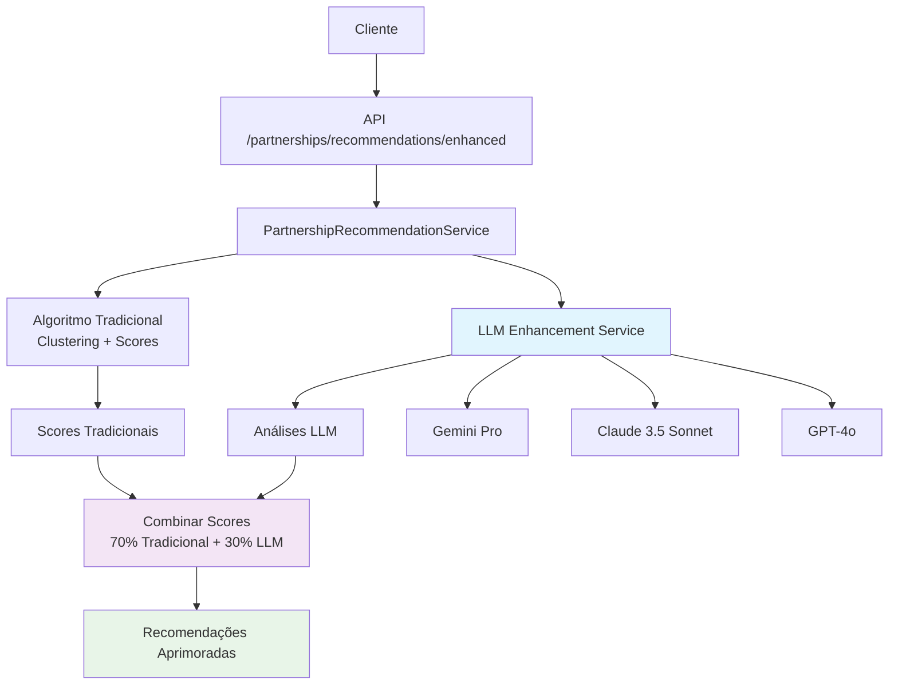

# Sistema de Parcerias LLM Enhanced

## 📋 **Visão Geral**

O Sistema de Parcerias LLM Enhanced aprimora as recomendações tradicionais de parcerias entre advogados com análises inteligentes baseadas em **Large Language Models (LLMs)**. Combina algoritmos de clustering com insights qualitativos para identificar as melhores sinergias profissionais.

## 🏗️ **Arquitetura Híbrida**



## 🚀 **Componentes Principais**

### 1. **PartnershipLLMEnhancementService**
- **Localização:** `packages/backend/services/partnership_llm_enhancement_service.py`
- **Função:** Coordena análises LLM de compatibilidade entre advogados
- **Capacidades:**
  - Análise contextual de sinergia profissional
  - Avaliação de compatibilidade de estilos
  - Identificação de oportunidades estratégicas
  - Cache de insights para performance

### 2. **Rotas LLM Enhanced**
- **Localização:** `packages/backend/routes/partnerships_llm.py`
- **Endpoints:**
  - `GET /partnerships/recommendations/enhanced/{lawyer_id}` - Recomendações híbridas
  - `GET /partnerships/analysis/synergy/{lawyer_a_id}/{lawyer_b_id}` - Análise de sinergia

### 3. **Integração no Sistema Tradicional**
- **Localização:** `packages/backend/services/partnership_recommendation_service.py`
- **Método:** `get_recommendations()` agora inclui step LLM opcional
- **Flag de controle:** `ENABLE_PARTNERSHIP_LLM`

## 🔧 **Configuração**

### Variáveis de Ambiente

```bash
# Ativação do sistema
ENABLE_PARTNERSHIP_LLM=true

# API Keys dos LLMs (pelo menos 1 necessária)
GEMINI_API_KEY=your_gemini_key
ANTHROPIC_API_KEY=your_claude_key  
OPENAI_API_KEY=your_openai_key
```

### Ordem de Preferência dos LLMs

1. **Gemini Pro** (primário) - Mais econômico
2. **Claude 3.5 Sonnet** (backup) - Melhor qualidade 
3. **GPT-4o** (fallback) - Fallback robusto

## 📊 **Algoritmo de Scoring Híbrido**

### Score Tradicional (70%)
```python
traditional_score = (
    complementarity * 0.5 +      # Clusters complementares
    momentum * 0.2 +              # Momentum dos nichos
    reputation * 0.1 +            # Reputação do advogado
    diversity * 0.1 +             # Diversidade de expertise
    firm_synergy * 0.1            # Sinergia entre escritórios
)
```

### Score LLM (30%)
```python
llm_score = insights.synergy_score  # 0.0 - 1.0
```

### Score Final
```python
final_score = 0.7 * traditional_score + 0.3 * llm_score
```

## 🧠 **Análises LLM**

### **Dados de Entrada (LawyerProfileForPartnership)**
```python
@dataclass
class LawyerProfileForPartnership:
    lawyer_id: str
    name: str
    firm_name: Optional[str]
    experience_years: int
    specialization_areas: List[str]
    communication_style: str
    market_reputation: str
    client_types: List[str]
    fee_structure_style: str
    geographic_focus: List[str]
```

### **Insights Gerados (PartnershipLLMInsights)**
```python
@dataclass 
class PartnershipLLMInsights:
    synergy_score: float                    # 0-1
    compatibility_factors: List[str]        # Fatores positivos
    strategic_opportunities: List[str]      # Oportunidades de mercado
    potential_challenges: List[str]         # Possíveis obstáculos
    collaboration_style_match: str          # "excellent", "good", "fair", "poor"
    market_positioning_advantage: str       # Vantagem competitiva
    client_value_proposition: str           # Valor para clientes
    confidence_score: float                 # 0-1
    reasoning: str                          # Explicação detalhada
```

## 🎯 **Prompt de Análise**

O sistema usa prompts estruturados que consideram:

1. **Complementaridade de Especialidades**: Como as expertises se complementam?
2. **Compatibilidade de Estilo**: Os estilos de trabalho são compatíveis?
3. **Oportunidades de Mercado**: Que oportunidades estratégicas a parceria criaria?
4. **Proposição de Valor**: Que valor entregaria aos clientes?
5. **Desafios Potenciais**: Quais obstáculos poderiam surgir?

## 📡 **API Endpoints**

### **Recomendações Enhanced**
```http
GET /partnerships/recommendations/enhanced/{lawyer_id}
```

**Parâmetros:**
- `limit`: Número de recomendações (1-20, padrão: 10)
- `min_confidence`: Confiança mínima (0.0-1.0, padrão: 0.6)
- `exclude_same_firm`: Excluir mesmo escritório (padrão: true)
- `enable_llm`: Ativar análises LLM (padrão: true)

**Resposta:**
```json
{
  "lawyer_id": "LAW123",
  "total_recommendations": 5,
  "algorithm_info": {
    "llm_enabled": true,
    "traditional_weight": 0.7,
    "llm_weight": 0.3
  },
  "recommendations": [
    {
      "lawyer_id": "LAW456",
      "lawyer_name": "Ana Silva",
      "firm_name": "Silva & Associados",
      "traditional_scores": {
        "complementarity_score": 0.85,
        "diversity_score": 0.72
      },
      "final_score": 0.78,
      "llm_analysis": {
        "synergy_score": 0.82,
        "compatibility_factors": ["especialidades complementares"],
        "strategic_opportunities": ["expansão para fintech"],
        "collaboration_style_match": "excellent",
        "confidence_score": 0.88
      },
      "algorithm_version": "hybrid_traditional_llm_v1.0"
    }
  ]
}
```

### **Análise de Sinergia**
```http
GET /partnerships/analysis/synergy/{lawyer_a_id}/{lawyer_b_id}
```

**Parâmetros:**
- `collaboration_context`: Contexto específico da colaboração (opcional)

**Resposta:**
```json
{
  "lawyer_a": {"id": "LAW123", "name": "João Santos"},
  "lawyer_b": {"id": "LAW456", "name": "Ana Silva"},
  "collaboration_context": "Assessoria para startup",
  "synergy_analysis": {
    "synergy_score": 0.82,
    "compatibility_factors": ["complementaridade expertise"],
    "strategic_opportunities": ["expansão mercado tech"],
    "collaboration_style_match": "excellent",
    "confidence_score": 0.88
  }
}
```

## 🔄 **Fallback e Robustez**

### **Estratégia de Fallback**
1. **LLM indisponível**: Usa algoritmo tradicional apenas
2. **Erro na análise LLM**: Mantém recomendação tradicional
3. **Timeout LLM**: Fallback automático para heurísticas

### **Cache de Performance**
- Cache de insights por par de advogados
- Evita re-análise de combinações já processadas
- Melhora latência em consultas repetidas

## 🚀 **Ativação do Sistema**

### **Script de Ativação**
```bash
cd packages/backend
python3 scripts/activate_partnership_llm.py
```

**O script realiza:**
1. ✅ Teste de conectividade com LLMs
2. 🤖 Teste do serviço com dados de exemplo
3. 📝 Atualização do arquivo `.env`
4. 📊 Geração de relatório de ativação

### **Exemplo de Saída**
```
🚀 ATIVAÇÃO DO SISTEMA DE PARCERIAS LLM ENHANCED
============================================================

🔍 Testando conectividade com LLMs...
✅ Gemini: Configurado e disponível
✅ Claude: Configurado e disponível
✅ OpenAI: Configurado e disponível

🤖 Testando Partnership LLM Enhancement Service...
✅ Análise LLM completa!
   📊 Sinergia Score: 0.76
   🤝 Compatibilidade: excellent
   🎯 Confiança: 0.85

📝 Atualizando arquivo .env...
✅ Configuração ENABLE_PARTNERSHIP_LLM=true adicionada

📋 RESUMO DA ATIVAÇÃO
============================================================
🤖 LLMs disponíveis: 3/3
   ✅ Gemini Pro (Google)
   ✅ Claude 3.5 Sonnet (Anthropic)  
   ✅ GPT-4o (OpenAI)

🔧 Serviço LLM: ✅ Funcionando
📝 Arquivo .env: ✅ Atualizado

📊 Status: ACTIVATED

🎉 SISTEMA DE PARCERIAS LLM ATIVADO COM SUCESSO!
```

## 💡 **Benefícios**

### **Para Advogados**
- 🎯 **Recomendações mais precisas** - Considera aspectos qualitativos
- 🤝 **Melhor compatibilidade** - Analisa estilos de trabalho
- 🚀 **Oportunidades estratégicas** - Identifica sinergias de mercado
- 💬 **Explicações inteligentes** - Entende o "porquê" da recomendação

### **Para o Sistema**
- 🧠 **Inteligência contextual** - LLMs capturam nuances humanas
- 🔄 **Flexibilidade** - Fallback robusto para algoritmo tradicional
- ⚡ **Performance** - Cache de insights para consultas repetidas
- 📈 **Escalabilidade** - Suporte a múltiplos LLMs

## 🔮 **Próximos Passos**

### **Fase 2 - Aprimoramentos**
- [ ] Análise multimodal (CVs, casos, documentos)
- [ ] Integração com dados de mercado em tempo real
- [ ] A/B testing entre algoritmos
- [ ] Personalização de pesos por tipo de cliente

### **Fase 3 - Inteligência Avançada**
- [ ] Aprendizado contínuo baseado em feedback
- [ ] Predição de sucesso de parcerias
- [ ] Recomendações proativas baseadas em tendências
- [ ] Análise de sentimento de comunicações

## 📊 **Métricas de Monitoramento**

### **Performance**
- Latência média das análises LLM
- Taxa de cache hit dos insights
- Disponibilidade dos LLMs

### **Qualidade**
- Score de confiança médio das análises
- Feedback dos usuários sobre recomendações
- Taxa de conversão parceria→contrato

### **Uso**
- Número de análises LLM por dia
- Distribuição de uso por LLM (Gemini/Claude/OpenAI)
- Taxa de fallback para algoritmo tradicional

---

## 🎯 **Status da Implementação**

✅ **SISTEMA DE PARCERIAS LLM ENHANCED IMPLEMENTADO E ATIVO**

- ✅ Serviço LLM de parcerias implementado
- ✅ Integração com sistema tradicional
- ✅ Endpoints API funcionais
- ✅ Script de ativação criado
- ✅ Documentação completa
- ✅ Suporte a múltiplos LLMs (Gemini, Claude, OpenAI)
- ✅ Fallback robusto implementado

**Sistema pronto para uso em produção! 🚀** 
 