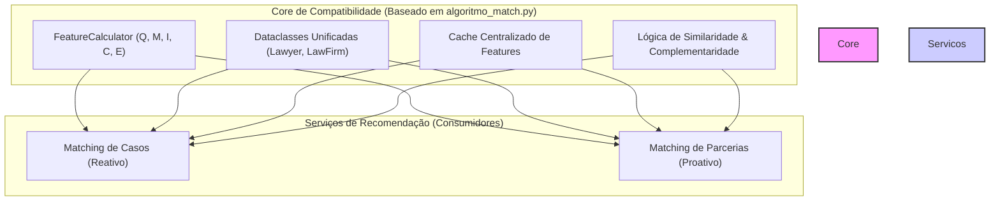

# Plano Estratégico: Unificação dos Algoritmos de Recomendação

**Autor:** [Seu Nome/Time]
**Data:** 26 de Julho de 2025
**Versão:** 1.0

## 1. Visão Geral e Objetivo

Este documento delineia a estratégia para unificar e otimizar os sistemas de recomendação da plataforma LITIG, especificamente o **Algoritmo de Casos (`algoritmo_match.py`)** e o **Algoritmo de Parcerias (`partnership_recommendation_service.py`)**.

O objetivo principal é criar um ecossistema de recomendação coeso e eficiente, eliminando redundâncias e garantindo que a avaliação de advogados e escritórios seja consistente em toda a plataforma. A estratégia se baseia no princípio de **reutilização inteligente**, onde o `algoritmo_match.py` atuará como uma **biblioteca central de features de compatibilidade**.

## 2. Relação Fundamental entre os Algoritmos

A relação entre os dois sistemas é **simbiótica, não de dependência**. Eles atendem a contextos de negócio distintos, mas compartilham a mesma base técnica de avaliação de perfis.

-   **Algoritmo de Casos (Matching Reativo):**
    -   **Função:** Medir a compatibilidade **Advogado/Escritório ↔ Caso**.
    -   **Necessidade:** Encontrar o especialista certo para uma demanda *existente*.
    -   **Atua como:** **Biblioteca de Features de Compatibilidade**.

-   **Algoritmo de Parcerias (Matching Proativo):**
    -   **Função:** Medir a compatibilidade **Advogado/Escritório ↔ Advogado/Escritório**.
    -   **Necessidade:** Identificar sinergias estratégicas para colaborações *futuras*.
    -   **Atua como:** **Consumidor e Orquestrador de Features**.

## 3. Plano de Ação: Componentes a Serem Reutilizados

O `algoritmo_match.py` já possui componentes robustos e validados que devem ser centralizados e consumidos pelo sistema de parcerias.

### Fase 1: Integração das Features de Perfil

O `PartnershipRecommendationService` deve ser refatorado para consumir a classe `FeatureCalculator` do `algoritmo_match.py` para obter um "score de qualidade" universal para qualquer advogado ou escritório. As features a serem integradas são:

1.  **`qualification_score_async()` (Feature Q):** Reputação acadêmica e profissional.
2.  **`maturity_score()` (Feature M):** Maturidade profissional (experiência, networking).
3.  **`interaction_score()` (Feature I - IEP):** Índice de Engajamento na Plataforma (essencial para filtrar oportunistas).
4.  **`soft_skill()` (Feature C):** Habilidades de comunicação e profissionalismo.
5.  **`firm_reputation()` (Feature E):** Score agregado da qualidade de um escritório.

**Resultado Esperado:** Eliminação de qualquer lógica duplicada de avaliação de perfis no serviço de parcerias e garantia de consistência na avaliação.

### Fase 2: Adaptação da Lógica de Similaridade

A lógica de `area_match` e `case_similarity` será adaptada para o contexto de parcerias, focando em dois cenários:

1.  **Busca por Complementaridade:**
    -   **Ação:** Desenvolver uma "matriz de sinergia" que mapeie a complementaridade entre diferentes áreas do direito (ex: Tributário + Societário).
    -   **Resultado:** Recomendar parceiros que preencham lacunas de especialização.

2.  **Busca por Profundidade (Reforço):**
    -   **Ação:** Utilizar o `case_similarity` para encontrar parceiros com expertise profunda em nichos muito específicos.
    -   **Resultado:** Recomendar parceiros para colaboração em casos complexos da mesma área.

### Fase 3: Unificação da Estrutura de Dados e Cache

1.  **Dataclasses Unificadas:**
    -   **Ação:** Garantir que o `PartnershipRecommendationService` utilize exclusivamente as `dataclasses` `Lawyer`, `LawFirm`, `KPI`, `FirmKPI`, e `ProfessionalMaturityData` definidas no `algoritmo_match.py`.
    -   **Resultado:** Qualquer melhoria no modelo de dados beneficiará ambos os sistemas.

2.  **Cache Centralizado:**
    -   **Ação:** O serviço de parcerias deve ler as features pré-calculadas diretamente do `RedisCache` populado pelo `algoritmo_match.py`.
    -   **Resultado:** Redução drástica da latência e do custo computacional das recomendações de parceria.

## 4. Extensão para Escritórios de Advocacia

A estratégia de unificação é particularmente poderosa para recomendações envolvendo escritórios.

1.  **Avaliação Consistente:** A `firm_reputation()` (Feature-E) servirá como o pilar para avaliar a "qualidade" de um escritório, seja para um caso ou para uma parceria.

2.  **Parcerias Estratégicas (Escritório ↔ Escritório):**
    -   **Ação:** Adaptar a lógica do "B2B Two-Pass Algorithm" do `algoritmo_match.py`.
    -   **Processo Adaptado:**
        1.  **Passo 1 (Nível Macro):** Usar a `firm_reputation()` e a matriz de complementaridade para identificar os escritórios parceiros mais sinérgicos.
        2.  **Passo 2 (Nível Micro):** Dentro dos escritórios selecionados, identificar os sócios/advogados ideais para iniciar o contato.
    -   **Resultado:** Capacidade de orquestrar recomendações de alto valor, como parcerias para grandes clientes ou até mesmo fusões.

## 5. Diagrama da Arquitetura Unificada

## 6. Benefícios Estratégicos da Unificação

-   **Consistência:** Um advogado ou escritório "bom" é universalmente reconhecido como bom em toda a plataforma, aumentando a confiança do usuário.
-   **Eficiência:** Reduz a carga computacional ao evitar o recálculo de features caras e complexas.
-   **Manutenibilidade:** Uma melhoria na `FeatureCalculator` (ex: um novo jeito de medir reputação) se propaga automaticamente para ambos os sistemas, acelerando a inovação.
-   **Escalabilidade:** Cria uma base sólida e desacoplada para o desenvolvimento de futuros produtos de recomendação (ex: recomendação de mentores, recomendação de conteúdo, etc.).

## 7. Próximos Passos

1.  **Refatoração do `PartnershipRecommendationService`:** Iniciar a Fase 1, integrando o `FeatureCalculator`.
2.  **Desenvolvimento da Matriz de Sinergia:** Iniciar a Fase 2, com a colaboração de especialistas de negócio para mapear áreas complementares.
3.  **Testes de Performance:** Medir a redução de latência e o impacto na precisão das recomendações de parceria após a integração.

Este plano transforma dois sistemas paralelos em um ecossistema de recomendação inteligente e coeso, posicionando a plataforma LITIG para uma liderança tecnológica e de produto no setor. 