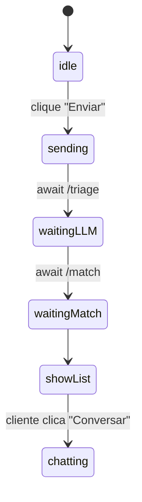

### ☑️ Dá para rodar **toda a lógica em Python no back-end** – e o React só faz chamadas HTTPS

A arquitetura fica assim:

```
React  ➜  /api/triage            (back-end Python, usa Claude)
       ➜  /api/embed             (back-end Python, gera vetor)
       ➜  /api/match             (back-end Python, calcula ranking)

Back-end Python  ←→  Supabase Postgres (advogados, casos, vetores)
                  ←→  API DataJud CNJ   (taxa de êxito oficial)
```

---

## 1. Por que Python?

| Vantagem                                                                                                                      | Como esconde                                                                       |
| ----------------------------------------------------------------------------------------------------------------------------- | ---------------------------------------------------------------------------------- |
| **LLM & NLP** – SDKs Claude, OpenAI, Hugging Face já vêm prontos.                                                             | O serviço roda em nuvem (Render, Railway, Cloud Run). Front-end nunca vê o código. |
| **Vetores & math** – `numpy`, `scikit-learn` para coseno & clustering.                                                        | Você expõe **só** endpoints REST (`/triage`, `/match`).                            |
| **DataJud** – exemplos oficiais em Python; fácil bater nas rotas REST públicas e parsear JSON. ([datajud-wiki.cnj.jus.br][1]) |                                                                                    |
| **Supabase** tem client **oficial** em Python desde ago/2024. ([supabase.com][2])                                             | Use chave **Service Role** no container; não sai para o browser.                   |

---

## 2. Esqueleto mínimo do serviço (FastAPI)

```bash
mkdir backend && cd backend
python -m venv .venv && source .venv/bin/activate
pip install fastapi uvicorn supabase db-dtypes anthropic openai numpy scikit-learn
```

```python
# main.py
from fastapi import FastAPI, HTTPException
from supabase import create_client
import anthropic, openai, numpy as np
from sklearn.metrics.pairwise import cosine_similarity
import os, requests

app = FastAPI()
supabase = create_client(os.getenv("SUPABASE_URL"), os.getenv("SERVICE_KEY"))
claude   = anthropic.Anthropic(api_key=os.getenv("CLAUDE_KEY"))
openai.api_key = os.getenv("OPENAI_KEY")

# ---------- 1. TRIAGEM ----------
@app.post("/api/triage")
def triage(payload: dict):
    txt = payload["texto_cliente"]
    msg = claude.messages.create(
        model="claude-3-5-sonnet-20240620",
        max_tokens=256,
        tools=[{
            "name": "triage",
            "parameters": {
              "type":"object",
              "properties":{
                 "area": {"type":"string"},
                 "urgency_hours": {"type":"integer"},
                 "summary":{"type":"string"}
              },
              "required":["area","urgency_hours","summary"]
            }
        }],
        messages=[{"role":"user","content":txt}]
    )
    tri = msg.tools[0].output
    row = supabase.table("cases").insert({**tri, "texto_cliente": txt}).execute().data[0]
    return row                        # devolve id do caso + meta

# ---------- 2. EMBEDDING ----------
@app.post("/api/embed")
def embed(payload: dict):
    text = payload["text"]
    emb  = openai.Embedding.create(model="text-embedding-3-small", input=text)["data"][0]["embedding"]
    return emb                        # array[384]

# ---------- 3. MATCH ----------
@app.post("/api/match")
def match(payload: dict):
    case_id = payload["case_id"]; k = payload.get("k",5)
    case = supabase.table("cases").select("*").eq("id", case_id).single().execute().data
    lawyers = supabase.table("lawyers").select("*").contains("tags_expertise",[case["area"]]).execute().data

    v_case = np.array(case["embed_vec"]).reshape(1,-1)
    scored = []
    best = -1
    for lw in lawyers:
        v_lw = np.array(lw["embed_vec"]).reshape(1,-1)
        A = float(cosine_similarity(v_case, v_lw)[0][0])
        S = 0.8
        T = lw["taxa_sucesso"]
        G = 1
        Q = 0.9
        U = 1
        R = lw["avaliacao_media"]/5
        raw = 0.30*A + 0.25*S + 0.15*T + 0.10*G + 0.10*Q + 0.05*U + 0.05*R
        best = max(best, raw); lw["_raw"]=raw
        scored.append(lw)

    ε, β = 0.05, 0.3
    cluster = []
    for lw in scored:
        if lw["_raw"] >= best - ε:
            equity = 1 - lw["casos_30d"]/lw["capacidade_mensal"]
            lw["fair"] = (1-β)*lw["_raw"] + β*equity
            cluster.append(lw)

    cluster.sort(key=lambda x: x["fair"], reverse=True)
    return cluster[:k]
```

**Como esconder:**

* O back-end roda atrás de um domínio privado (ex.: `https://api.legaltech.com`).
* Você só expõe os três endpoints acima.
* Variáveis de ambiente (`SERVICE_KEY`, `CLAUDE_KEY`) ficam salvas como **secrets** no provedor (Render, Railway, Google Cloud Run).
* O React chama `fetch("/api/triage")` etc.; não precisa conhecer chaves.

---

## 3. Taxa de êxito via DataJud no *cron* Python

```python
import requests, os, datetime, psycopg2, json

def update_success(oab):
    url = f"https://dados.cnj.jus.br/api-publica/processos?advogadoOab={oab}"
    data = requests.get(url, timeout=30).json()
    victories = sum(1 for p in data if p["resultado"] == "PROCEDENTE")
    defeat    = sum(1 for p in data if p["resultado"] == "IMPROCEDENTE")
    total = victories + defeat
    rate = victories/total if total else 0
    supabase.table("lawyers").update({"taxa_sucesso": rate}) \
            .eq("oab", oab).execute()
```

Agende com **GitHub Actions** ou **Cloud Scheduler** uma vez por noite.

---

## 4. Deploy & proteção

| Passo                                            | Provedor sugerido                                                                                                    |
| ------------------------------------------------ | -------------------------------------------------------------------------------------------------------------------- |
| **Dockerize** (`Dockerfile`, `uvicorn main:app`) | Render, Railway ou Cloud Run (1-click)                                                                               |
| **JWT**                                          | Ative “Verify JWT” middleware (FastAPI) usando `auth.verify(jwt)` da `supabase-py` para só aceitar tokens da sua app |
| **CORS**                                         | Permita apenas `https://meuapp.com` no backend                                                                       |
| **HTTPS**                                        | automático no Render/Cloud Run                                                                                       |

Front-end continua igual, trocando:

```ts
const API = "https://api.legaltech.com"
fetch(`${API}/api/triage`, { … })
```

---

### 🏁 Resumo

* **Sim, envolve Python** — mas 100 % no servidor.
* Você usa **FastAPI** + `supabase-py` + SDKs LLM; o React nem vê o código.
* Dados oficiais vêm via **API DataJud** (70 %) e autodeclaração verificada (30 %).
* Tudo fica **escondido atrás de três endpoints** simples, protegidos por JWT e secrets no provider.

Com isso você mantém o front-end enxuto e toda a inteligência, segredos e chaves rodando em um back-end Python seguro e invisível ao usuário.

### 🖥️ O que fica **no front-end React**

A parte em React faz **duas coisas bem simples**:

1. **Coletar o relato do cliente** (texto / áudio)
2. **Exibir a lista ordenada de advogados** devolvida pelo back-end

> Todo cálculo pesado (LLM, embeddings, ranking, taxa de êxito) já acontece no servidor Python, então o front-end só dispara chamadas HTTP e mostra o resultado.

---

## 1. Componentes principais

| Componente                   | Função                                                              |
| ---------------------------- | ------------------------------------------------------------------- |
| **`CaseForm`**               | Caixa de texto (ou gravador de voz) + botão **Enviar**              |
| **`LoadingSpinner`**         | Feedback visual enquanto espera o back-end                          |
| **`MatchList`**              | Recebe um array `matches[]` e renderiza cartões de advogado         |
| **`LawyerCard`**             | Foto, nome, score, taxa de êxito e botão “Conversar”                |
| *(opcional)* **`ChatModal`** | Abrir chat/vídeo (via Stream/Daily) quando cliente escolhe advogado |

---

## 2. Fluxo de estados (React Hooks)



---

## 3. Exemplo mínimo em código

```tsx
// src/App.tsx
import { useState } from "react"
const API = import.meta.env.VITE_API_URL        // ex.: https://api.legaltech.com

function App() {
  const [texto, setTexto] = useState("")
  const [loading, setLoading] = useState(false)
  const [lista, setLista] = useState<any[]>([])

  const handleEnviar = async () => {
    setLoading(true)

    // 1. Triagem (LLM) --------------- //
    const triage = await fetch(`${API}/api/triage`, {
      method: "POST",
      headers: { "Content-Type": "application/json" },
      body: JSON.stringify({ texto_cliente: texto })
    }).then(r => r.json())

    // 2. Embedding ------------------- //
    const vec = await fetch(`${API}/api/embed`, {
      method: "POST",
      headers: { "Content-Type": "application/json" },
      body: JSON.stringify({ text: triage.summary })
    }).then(r => r.json())

    // 3. Salva vetor no Supabase ---- //
    await fetch(`${API}/api/case/embed`, {     // pequena rota opcional
      method: "POST",
      headers: { "Content-Type": "application/json" },
      body: JSON.stringify({ case_id: triage.id, embed_vec: vec })
    })

    // 4. Match (ranking) ------------- //
    const matches = await fetch(`${API}/api/match`, {
      method: "POST",
      headers: { "Content-Type": "application/json" },
      body: JSON.stringify({ case_id: triage.id })
    }).then(r => r.json())

    setLista(matches)
    setLoading(false)
  }

  return (
    <main className="p-8 max-w-xl mx-auto">
      <h1 className="text-2xl font-bold mb-4">Descreva seu caso</h1>

      <textarea
        className="w-full h-40 p-3 border rounded"
        placeholder="Digite aqui..."
        value={texto}
        onChange={e => setTexto(e.target.value)}
      />

      <button
        onClick={handleEnviar}
        disabled={loading || !texto}
        className="mt-3 px-4 py-2 bg-blue-600 text-white rounded"
      >
        {loading ? "Processando..." : "Enviar"}
      </button>

      {lista.length > 0 && <MatchList data={lista} />}
    </main>
  )
}

// ---------- LISTA DE ADVOGADOS ------------
function MatchList({ data }: { data: any[] }) {
  return (
    <section className="mt-6 space-y-4">
      {data.map(l => (
        <LawyerCard key={l.id} lw={l} />
      ))}
    </section>
  )
}

function LawyerCard({ lw }: { lw: any }) {
  return (
    <div className="border p-4 rounded shadow">
      <div className="flex items-center gap-3">
        
        <div>
          <h3 className="font-semibold">{lw.nome}</h3>
          <p className="text-sm text-gray-500">
            Score {(lw.fair * 100).toFixed(0)} % • Êxito {(lw.taxa_sucesso * 100).toFixed(0)} %
          </p>
        </div>
      </div>

      <p className="mt-2 text-sm italic">{lw.explain}</p>

      <button className="mt-3 px-3 py-1 bg-green-600 text-white rounded">
        Conversar
      </button>
    </div>
  )
}

export default App
```

> **Observações rápidas**
>
> * **Sem Supabase SDK no front-end:** todo acesso ao banco é pelo back-end Python; o React só usa `fetch`.
> * **Segurança:** configure CORS no servidor para aceitar apenas `https://seuapp.com`.
> * **Áudio opcional:** use a Web Speech API (`navigator.mediaDevices.getUserMedia`) para gravar, depois envie texto transcrito igual ao campo de texto.

---

## 4. Arquivos auxiliares

```
/src
 ├─ App.tsx                (página principal)
 ├─ MatchList.tsx          (lista de advogados)
 ├─ LawyerCard.tsx         (cartão individual)
 ├─ services/api.ts        (funções fetch padrão)
 └─ styles/index.css       (Tailwind ou CSS simples)
```

> Se já usa **Tailwind**, basta ter `@tailwind base; @tailwind components; @tailwind utilities;` em `index.css`.

---

## 5. Como “colar” no seu projeto

1. **Crie** uma rota “Nova Consulta” no seu React Router.
2. **Copie** o código do `CaseForm` (ou `App.tsx` acima) para essa página.
3. **Configure** `.env` do front-end:

   ```
   VITE_API_URL=https://api.legaltech.com
   ```
4. **Build & deploy** (`npm run build`) no mesmo domínio ou em um subdomínio (`app.seudominio.com`).

---

### 🎯 Resumindo

* **Frontend só faz I/O**: coleta relato, mostra lista.
* **Todos os segredos** (chaves Claude, Service Key Supabase, scrapers DataJud) ficam no back-end Python.
* **Leve de manter**: você pode trocar o ranking no servidor e o React continua igual.

Pronto — agora você tem um app React enxuto que conversa com um back-end Python “invisível” onde roda todo o algoritmo jurídico inteligente. Se precisar de algo mais visual (Figma ou Tailwind refinado), é só pedir!


### 🖥️ O que fica **no front-end React**

A parte em React faz **duas coisas bem simples**:

1. **Coletar o relato do cliente** (texto / áudio)
2. **Exibir a lista ordenada de advogados** devolvida pelo back-end

> Todo cálculo pesado (LLM, embeddings, ranking, taxa de êxito) já acontece no servidor Python, então o front-end só dispara chamadas HTTP e mostra o resultado.

---

## 1. Componentes principais

| Componente                   | Função                                                              |
| ---------------------------- | ------------------------------------------------------------------- |
| **`CaseForm`**               | Caixa de texto (ou gravador de voz) + botão **Enviar**              |
| **`LoadingSpinner`**         | Feedback visual enquanto espera o back-end                          |
| **`MatchList`**              | Recebe um array `matches[]` e renderiza cartões de advogado         |
| **`LawyerCard`**             | Foto, nome, score, taxa de êxito e botão “Conversar”                |
| *(opcional)* **`ChatModal`** | Abrir chat/vídeo (via Stream/Daily) quando cliente escolhe advogado |

---

## 2. Fluxo de estados (React Hooks)


---

## 3. Exemplo mínimo em código

```tsx
// src/App.tsx
import { useState } from "react"
const API = import.meta.env.VITE_API_URL        // ex.: https://api.legaltech.com

function App() {
  const [texto, setTexto] = useState("")
  const [loading, setLoading] = useState(false)
  const [lista, setLista] = useState<any[]>([])

  const handleEnviar = async () => {
    setLoading(true)

    // 1. Triagem (LLM) --------------- //
    const triage = await fetch(`${API}/api/triage`, {
      method: "POST",
      headers: { "Content-Type": "application/json" },
      body: JSON.stringify({ texto_cliente: texto })
    }).then(r => r.json())

    // 2. Embedding ------------------- //
    const vec = await fetch(`${API}/api/embed`, {
      method: "POST",
      headers: { "Content-Type": "application/json" },
      body: JSON.stringify({ text: triage.summary })
    }).then(r => r.json())

    // 3. Salva vetor no Supabase ---- //
    await fetch(`${API}/api/case/embed`, {     // pequena rota opcional
      method: "POST",
      headers: { "Content-Type": "application/json" },
      body: JSON.stringify({ case_id: triage.id, embed_vec: vec })
    })

    // 4. Match (ranking) ------------- //
    const matches = await fetch(`${API}/api/match`, {
      method: "POST",
      headers: { "Content-Type": "application/json" },
      body: JSON.stringify({ case_id: triage.id })
    }).then(r => r.json())

    setLista(matches)
    setLoading(false)
  }

  return (
    <main className="p-8 max-w-xl mx-auto">
      <h1 className="text-2xl font-bold mb-4">Descreva seu caso</h1>

      <textarea
        className="w-full h-40 p-3 border rounded"
        placeholder="Digite aqui..."
        value={texto}
        onChange={e => setTexto(e.target.value)}
      />

      <button
        onClick={handleEnviar}
        disabled={loading || !texto}
        className="mt-3 px-4 py-2 bg-blue-600 text-white rounded"
      >
        {loading ? "Processando..." : "Enviar"}
      </button>

      {lista.length > 0 && <MatchList data={lista} />}
    </main>
  )
}

// ---------- LISTA DE ADVOGADOS ------------
function MatchList({ data }: { data: any[] }) {
  return (
    <section className="mt-6 space-y-4">
      {data.map(l => (
        <LawyerCard key={l.id} lw={l} />
      ))}
    </section>
  )
}

function LawyerCard({ lw }: { lw: any }) {
  return (
    <div className="border p-4 rounded shadow">
      <div className="flex items-center gap-3">
        
        <div>
          <h3 className="font-semibold">{lw.nome}</h3>
          <p className="text-sm text-gray-500">
            Score {(lw.fair * 100).toFixed(0)} % • Êxito {(lw.taxa_sucesso * 100).toFixed(0)} %
          </p>
        </div>
      </div>

      <p className="mt-2 text-sm italic">{lw.explain}</p>

      <button className="mt-3 px-3 py-1 bg-green-600 text-white rounded">
        Conversar
      </button>
    </div>
  )
}

export default App
```

> **Observações rápidas**
>
> * **Sem Supabase SDK no front-end:** todo acesso ao banco é pelo back-end Python; o React só usa `fetch`.
> * **Segurança:** configure CORS no servidor para aceitar apenas `https://seuapp.com`.
> * **Áudio opcional:** use a Web Speech API (`navigator.mediaDevices.getUserMedia`) para gravar, depois envie texto transcrito igual ao campo de texto.

---

## 4. Arquivos auxiliares

```
/src
 ├─ App.tsx                (página principal)
 ├─ MatchList.tsx          (lista de advogados)
 ├─ LawyerCard.tsx         (cartão individual)
 ├─ services/api.ts        (funções fetch padrão)
 └─ styles/index.css       (Tailwind ou CSS simples)
```

> Se já usa **Tailwind**, basta ter `@tailwind base; @tailwind components; @tailwind utilities;` em `index.css`.

---

## 5. Como “colar” no seu projeto

1. **Crie** uma rota “Nova Consulta” no seu React Router.
2. **Copie** o código do `CaseForm` (ou `App.tsx` acima) para essa página.
3. **Configure** `.env` do front-end:

   ```
   VITE_API_URL=https://api.legaltech.com
   ```
4. **Build & deploy** (`npm run build`) no mesmo domínio ou em um subdomínio (`app.seudominio.com`).

---

### 🎯 Resumindo

* **Frontend só faz I/O**: coleta relato, mostra lista.
* **Todos os segredos** (chaves Claude, Service Key Supabase, scrapers DataJud) ficam no back-end Python.
* **Leve de manter**: você pode trocar o ranking no servidor e o React continua igual.

Pronto — agora você tem um app React enxuto que conversa com um back-end Python “invisível” onde roda todo o algoritmo jurídico inteligente. Se precisar de algo mais visual (Figma ou Tailwind refinado), é só pedir!
