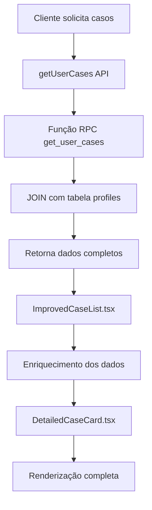

# Implementação Completa do DetailedCaseCard

## 📋 Resumo

Este documento detalha a implementação completa da integração entre o componente `DetailedCaseCard.tsx` e o backend, incluindo a estrutura do banco de dados, APIs e fluxo de dados.

## 🎯 Objetivo

Garantir que todos os campos exibidos no componente `DetailedCaseCard.tsx` sejam alimentados por dados reais do banco de dados, eliminando a dependência de dados mock.

## 🔧 Implementação

### 1. Migração do Banco de Dados

**Arquivo:** `supabase/migrations/20250103000001_add_detailed_case_fields.sql`

#### Novos Campos Adicionados à Tabela `cases`:

| Campo | Tipo | Descrição | Padrão |
|-------|------|-----------|---------|
| `title` | TEXT | Título do caso jurídico | - |
| `description` | TEXT | Descrição detalhada do caso | - |
| `subarea` | TEXT | Subárea específica do direito | - |
| `priority` | TEXT | Prioridade: low, medium, high | 'medium' |
| `urgency_hours` | INTEGER | Horas até deadline crítico | 72 |
| `risk_level` | TEXT | Nível de risco: low, medium, high | 'medium' |
| `confidence_score` | INTEGER | Score de confiança da IA (0-100) | 0 |
| `estimated_cost` | DECIMAL(10,2) | Custo estimado total | 0.00 |
| `updated_at` | TIMESTAMP | Data da última atualização | now() |
| `next_step` | TEXT | Próximo passo no processo | - |

#### Recursos Implementados:

- ✅ **Constraints de validação** para priority e risk_level
- ✅ **Índices** para melhor performance (priority, risk_level, updated_at)
- ✅ **Trigger automático** para atualizar updated_at
- ✅ **Migração de dados** existentes do campo `summary_ai`
- ✅ **Comentários** para documentação dos campos

### 2. Função RPC Atualizada

**Função:** `get_user_cases(p_user_id uuid)`

#### Campos Retornados:

**Dados Básicos do Caso:**
- `id`, `created_at`, `updated_at`
- `client_id`, `lawyer_id`, `status`
- `area`, `subarea`, `title`, `description`
- `priority`, `urgency_hours`, `risk_level`
- `confidence_score`, `estimated_cost`, `next_step`
- `ai_analysis` (JSONB original)

**Dados do Cliente:**
- `client_name`, `client_type`

**Dados Completos do Advogado:**
- `lawyer_name`, `lawyer_specialty`, `lawyer_avatar`
- `lawyer_oab`, `lawyer_rating`, `lawyer_experience_years`
- `lawyer_success_rate`, `lawyer_phone`, `lawyer_email`, `lawyer_location`

**Métricas:**
- `unread_messages` (calculado dinamicamente)

### 3. Interface TypeScript Atualizada

**Arquivo:** `lib/services/cases.ts`

#### Interface `CaseData` Expandida:

```typescript
export interface CaseData {
  // Campos básicos
  id: string;
  status: 'pending_assignment' | 'assigned' | 'in_progress' | 'closed' | 'cancelled';
  created_at: string;
  updated_at: string;
  
  // Dados do caso
  title: string;
  description: string;
  area: string;
  subarea: string;
  priority: 'high' | 'medium' | 'low';
  urgency_hours: number;
  risk_level: 'high' | 'medium' | 'low';
  confidence_score: number;
  estimated_cost: number;
  next_step: string;
  
  // Dados do cliente
  client_name?: string;
  client_type?: 'PF' | 'PJ';
  
  // Dados detalhados do advogado
  lawyer_name?: string;
  lawyer_specialty?: string;
  lawyer_avatar?: string;
  lawyer_oab?: string;
  lawyer_rating?: number;
  lawyer_experience_years?: number;
  lawyer_success_rate?: number;
  lawyer_phone?: string;
  lawyer_email?: string;
  lawyer_location?: string;
  
  // Objetos para compatibilidade
  lawyer?: LawyerInfo;
  client?: ClientInfo;
  
  // Métricas
  unread_messages?: number;
  ai_analysis?: any;
}
```

### 4. Componente Frontend Atualizado

**Arquivo:** `components/organisms/ImprovedCaseList.tsx`

#### Melhorias Implementadas:

- ✅ **Eliminação de dados mock** para casos reais
- ✅ **Mapeamento automático** dos campos do banco para o componente
- ✅ **Construção do objeto lawyer** a partir dos campos individuais
- ✅ **Fallbacks seguros** para campos opcionais
- ✅ **Type safety** com assertions apropriadas

## 🔄 Fluxo de Dados



## 📊 Comparação: Antes vs Depois

### Antes da Implementação:
- ❌ Dados mock hardcoded
- ❌ Campos faltando no banco
- ❌ Função RPC incompleta
- ❌ Interface TypeScript limitada
- ❌ Componente não funcional

### Depois da Implementação:
- ✅ Dados reais do banco de dados
- ✅ Estrutura completa na tabela cases
- ✅ Função RPC com todos os campos
- ✅ Interface TypeScript completa
- ✅ Componente totalmente funcional

## 🚀 Como Executar

### 1. Aplicar a Migração:

```bash
# Usando o script automatizado
./run_migration.sh

# Ou manualmente
supabase db push
```

### 2. Verificar a Implementação:

```bash
# Instalar dependências se necessário
npm install

# Executar o projeto
npm start
```

### 3. Testar o Componente:

1. Acesse a tela "Meus Casos"
2. Verifique se os cards exibem informações reais
3. Confirme que todos os campos estão sendo preenchidos
4. Teste a funcionalidade de expansão dos cards

## 🔍 Validação

### Campos Obrigatórios Validados:
- ✅ `title` - Título do caso
- ✅ `description` - Descrição detalhada
- ✅ `area` - Área do direito
- ✅ `subarea` - Subárea específica
- ✅ `priority` - Prioridade do caso
- ✅ `urgency_hours` - Horas de urgência
- ✅ `risk_level` - Nível de risco
- ✅ `confidence_score` - Score da IA
- ✅ `estimated_cost` - Custo estimado
- ✅ `next_step` - Próximo passo

### Dados do Advogado Validados:
- ✅ `lawyer_name` - Nome do advogado
- ✅ `lawyer_specialty` - Especialidade
- ✅ `lawyer_oab` - Número da OAB
- ✅ `lawyer_rating` - Avaliação
- ✅ `lawyer_experience_years` - Anos de experiência
- ✅ `lawyer_success_rate` - Taxa de sucesso

## 📝 Próximos Passos

1. **Testes Automatizados**: Criar testes para validar a integração
2. **Documentos**: Implementar a tabela de documentos relacionados
3. **Notificações**: Integrar sistema de notificações push
4. **Analytics**: Adicionar métricas de uso do componente
5. **Performance**: Otimizar queries para grandes volumes de dados

## 🐛 Troubleshooting

### Problemas Comuns:

1. **Migração falha**: Verifique se o Supabase CLI está instalado e configurado
2. **Campos vazios**: Confirme se os dados foram migrados corretamente
3. **Erros de TypeScript**: Verifique se a interface CaseData está atualizada
4. **Componente não renderiza**: Confirme se os dados estão chegando do backend

### Comandos de Diagnóstico:

```bash
# Verificar status do banco
supabase status

# Ver logs em tempo real
supabase logs

# Testar a função RPC
supabase sql --db-url [URL] --file test_get_user_cases.sql
```

## 📚 Referências

- [Supabase RPC Functions](https://supabase.com/docs/guides/database/functions)
- [PostgreSQL JSON Functions](https://www.postgresql.org/docs/current/functions-json.html)
- [React Native TypeScript](https://reactnative.dev/docs/typescript)

---

**Status**: ✅ Implementação Completa  
**Data**: Janeiro 2025  
**Versão**: 1.0.0 