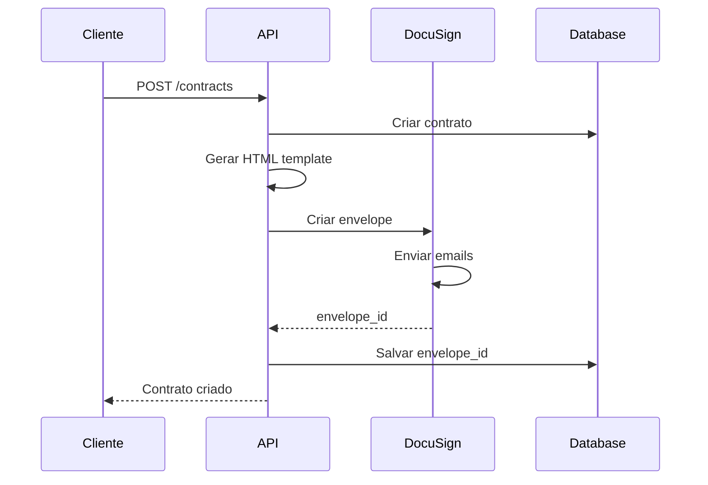
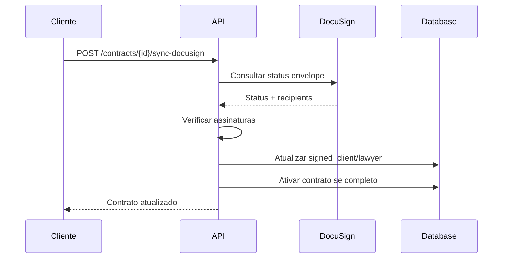

# 📝 Integração DocuSign Completa - LITGO5

## 🎯 Visão Geral

A integração DocuSign foi implementada com sucesso no LITGO5, oferecendo assinatura digital profissional e legalmente válida para contratos jurídicos. O sistema suporta tanto contratos simples em HTML quanto envelopes DocuSign completos.

## ✨ Funcionalidades Implementadas

### 🔧 Backend (Python/FastAPI)

#### **1. Configuração e Autenticação**
- ✅ **JWT Authentication** - Autenticação via chave privada RSA
- ✅ **SDK Oficial** - Uso do `docusign-esign` v5.1.0+
- ✅ **Configuração Flexível** - Suporte a ambiente demo e produção
- ✅ **Fallback Inteligente** - HTML simples quando DocuSign indisponível

#### **2. Serviços Implementados**
- ✅ **SignService** - Orquestração entre HTML e DocuSign
- ✅ **DocuSignService** - Integração específica com API
- ✅ **Template Engine** - Geração de contratos com Jinja2
- ✅ **Storage Integration** - Upload para Supabase Storage

#### **3. APIs REST**
- ✅ `POST /contracts` - Criação com DocuSign automático
- ✅ `GET /contracts/{id}/docusign-status` - Status do envelope
- ✅ `GET /contracts/{id}/docusign-download` - Download documento assinado
- ✅ `POST /contracts/{id}/sync-docusign` - Sincronização manual

### 📱 Frontend (React Native/TypeScript)

#### **1. Serviços de Integração**
- ✅ **contractsService** - Cliente completo para DocuSign
- ✅ **Métodos Específicos** - Status, download, sincronização
- ✅ **Utilitários** - Formatação e validação
- ✅ **Tratamento de Erros** - Fallbacks e mensagens amigáveis

#### **2. Componentes UI**
- ✅ **DocuSignStatus** - Componente de status visual
- ✅ **Indicadores Visuais** - Status dos signatários
- ✅ **Botões de Ação** - Download e sincronização
- ✅ **Feedback em Tempo Real** - Loading states

---

## 🚀 Como Usar

### 1. Configuração Inicial

#### **Variáveis de Ambiente**
```bash
# Ativar DocuSign
USE_DOCUSIGN=true

# Configurações DocuSign
DOCUSIGN_BASE_URL=https://demo.docusign.net
DOCUSIGN_API_KEY=your_integration_key_here
DOCUSIGN_ACCOUNT_ID=your_account_id_here
DOCUSIGN_USER_ID=your_user_id_here
DOCUSIGN_PRIVATE_KEY=your_private_key_here
```

#### **Dependências Backend**
```bash
pip install docusign-esign>=5.1.0 pyjwt cryptography
```

### 2. Criação de Contratos

#### **Backend - Fluxo Automático**
```python
# Ao criar contrato, DocuSign é usado automaticamente se configurado
contract = await contract_service.create_contract(
    case_id="case-123",
    lawyer_id="lawyer-456", 
    client_id="client-789",
    fee_model={"type": "success", "percent": 20}
)

# Se USE_DOCUSIGN=true e configurações válidas:
# - Envelope é criado automaticamente
# - Emails são enviados aos signatários
# - contract.doc_url contém envelope_id
```

#### **Frontend - Criação via UI**
```typescript
// Criar contrato (DocuSign automático se habilitado)
const contract = await contractsService.createContract({
  case_id: "case-123",
  lawyer_id: "lawyer-456",
  fee_model: { type: "success", percent: 20 }
});

// Verificar se é DocuSign
if (contractsService.isDocuSignContract(contract)) {
  console.log("Contrato criado via DocuSign!");
}
```

### 3. Monitoramento de Status

#### **Consultar Status**
```typescript
// Obter status detalhado do envelope
const status = await contractsService.getDocuSignStatus(contractId);

console.log({
  envelope_id: status.envelope_id,
  status: status.status, // 'sent', 'delivered', 'completed'
  recipients: status.recipients.map(r => ({
    name: r.name,
    email: r.email,
    status: r.status,
    signed_date: r.signed_date
  }))
});
```

#### **Sincronização Manual**
```typescript
// Sincronizar status com DocuSign
const updatedContract = await contractsService.syncDocuSignStatus(contractId);

// Atualiza automaticamente:
// - contract.signed_client
// - contract.signed_lawyer  
// - contract.status (para 'active' se ambos assinaram)
```

### 4. Download de Documentos

#### **Documento Assinado**
```typescript
// Baixar PDF final com todas as assinaturas
const blob = await contractsService.downloadDocuSignDocument(contractId);

// Salvar ou abrir documento
// (implementação específica do React Native)
```

---

## 🏗️ Arquitetura Técnica

### Fluxo de Criação de Envelope



### Fluxo de Sincronização



---

## 🔧 Detalhes de Implementação

### 1. Autenticação JWT

```python
def _authenticate_jwt(self):
    """Autentica usando JWT com chave privada RSA"""
    payload = {
        "iss": self.api_key,
        "sub": self.user_id, 
        "aud": settings.get_docusign_auth_url(),
        "iat": datetime.utcnow(),
        "exp": datetime.utcnow() + timedelta(hours=1),
        "scope": "signature impersonation"
    }
    
    # Decodificar chave privada
    private_key = load_pem_private_key(
        self.private_key.encode('utf-8'), 
        password=None
    )
    
    # Gerar e trocar token
    token = jwt.encode(payload, private_key, algorithm='RS256')
    # ... trocar por access_token
```

### 2. Criação de Envelope

```python
async def create_envelope(self, contract, html_content, client_data, lawyer_data):
    """Cria envelope completo no DocuSign"""
    
    # Documento base64
    document = Document(
        document_base64=base64.b64encode(html_content.encode('utf-8')).decode('utf-8'),
        name=f"Contrato {contract.id[:8].upper()}",
        file_extension="html",
        document_id="1"
    )
    
    # Signatários com ordem
    client_signer = Signer(
        email=client_data.get('email'),
        name=client_data.get('full_name'),
        recipient_id="1",
        routing_order="1"  # Cliente assina primeiro
    )
    
    lawyer_signer = Signer(
        email=lawyer_data.get('email'), 
        name=lawyer_data.get('full_name'),
        recipient_id="2",
        routing_order="2"  # Advogado assina depois
    )
    
    # Campos de assinatura posicionados
    client_signer.tabs = Tabs(sign_here_tabs=[SignHere(
        document_id="1", page_number="1", recipient_id="1",
        x_position="100", y_position="200"
    )])
    
    # Criar e enviar envelope
    envelope = EnvelopeDefinition(
        email_subject=f"Contrato LITGO - {contract.id[:8].upper()}",
        documents=[document],
        recipients=Recipients(signers=[client_signer, lawyer_signer]),
        status="sent"  # Envia imediatamente
    )
    
    return envelopes_api.create_envelope(self.account_id, envelope)
```

### 3. Fallback Inteligente

```python
async def generate_contract_pdf(self, contract):
    """Gera PDF com fallback automático"""
    try:
        if self.use_docusign and settings.validate_docusign_config():
            return await self._generate_docusign_envelope(contract)
        else:
            return await self._generate_simple_html_contract(contract)
    except Exception as e:
        # Fallback para HTML em caso de erro no DocuSign
        if self.use_docusign:
            print(f"Erro no DocuSign, usando fallback HTML: {str(e)}")
            return await self._generate_simple_html_contract(contract)
        raise
```

---

## 🔒 Segurança e Compliance

### 1. Autenticação Segura
- ✅ **JWT com RSA** - Chaves privadas criptografadas
- ✅ **Tokens Temporários** - Expiração em 1 hora
- ✅ **Scope Limitado** - Apenas assinatura e impersonation

### 2. Proteção de Dados
- ✅ **Chaves Privadas** - Armazenadas como variáveis de ambiente
- ✅ **HTTPS Obrigatório** - Todas as comunicações criptografadas
- ✅ **Validação Rigorosa** - Verificação de configurações

### 3. Auditoria
- ✅ **Logs Estruturados** - Todas as ações registradas
- ✅ **Timestamps** - Rastreamento completo de assinaturas
- ✅ **Status Tracking** - Histórico de mudanças de status

---

## 🧪 Testes e Validação

### 1. Testes Automatizados

```python
# tests/test_docusign.py
def test_docusign_envelope_creation():
    """Testa criação de envelope DocuSign"""
    contract = create_test_contract()
    
    with patch('docusign_esign.EnvelopesApi') as mock_api:
        mock_api.return_value.create_envelope.return_value.envelope_id = "test-envelope-123"
        
        envelope_id = await docusign_service.create_envelope(contract, ...)
        assert envelope_id == "test-envelope-123"

def test_fallback_to_html():
    """Testa fallback para HTML quando DocuSign falha"""
    with patch('backend.services.sign_service.settings.USE_DOCUSIGN', True):
        with patch('backend.services.sign_service.DocuSignService.create_envelope', side_effect=Exception("API Error")):
            
            result = await sign_service.generate_contract_pdf(contract)
            assert result.startswith("https://")  # URL do Supabase Storage
```

### 2. Validação Manual

```bash
# Testar configuração DocuSign
curl -X POST http://localhost:8000/api/contracts \
  -H "Authorization: Bearer <token>" \
  -H "Content-Type: application/json" \
  -d '{
    "case_id": "test-case",
    "lawyer_id": "test-lawyer", 
    "fee_model": {"type": "success", "percent": 20}
  }'

# Verificar se envelope foi criado
curl http://localhost:8000/api/contracts/<contract_id>/docusign-status
```

---

## 🚀 Deploy e Produção

### 1. Configuração de Produção

```bash
# Produção DocuSign
USE_DOCUSIGN=true
DOCUSIGN_BASE_URL=https://www.docusign.net
DOCUSIGN_API_KEY=<production_integration_key>
DOCUSIGN_ACCOUNT_ID=<production_account_id>
DOCUSIGN_USER_ID=<production_user_id>
DOCUSIGN_PRIVATE_KEY=<production_private_key>
```

### 2. Monitoramento

```python
# Logs estruturados para monitoramento
import logging

logger = logging.getLogger("docusign.integration")

# Métricas importantes:
# - Envelopes criados por dia
# - Taxa de sucesso de criação
# - Tempo médio de assinatura
# - Erros de API
```

### 3. Webhooks (Futuro)

```python
# Implementação futura para sincronização automática
@router.post("/webhooks/docusign")
async def docusign_webhook(payload: dict):
    """Recebe notificações do DocuSign"""
    envelope_id = payload.get("envelopeId")
    status = payload.get("status")
    
    if status == "completed":
        # Atualizar contrato automaticamente
        await sync_contract_from_envelope(envelope_id)
```

---

## 📊 Métricas e Analytics

### 1. KPIs Importantes
- **Taxa de Conversão**: Contratos criados → Totalmente assinados
- **Tempo de Assinatura**: Criação → Conclusão
- **Taxa de Erro**: Falhas na criação de envelopes
- **Uso de Fallback**: HTML vs DocuSign

### 2. Dashboard Sugerido
```typescript
interface DocuSignMetrics {
  envelopes_created_today: number;
  completion_rate_7d: number;
  avg_signing_time_hours: number;
  error_rate_24h: number;
  fallback_usage_rate: number;
}
```

---

## 🔄 Roadmap e Melhorias

### Próximas Implementações
- [ ] **Webhooks DocuSign** - Sincronização automática
- [ ] **Templates Avançados** - Campos personalizáveis
- [ ] **Assinatura em Lote** - Múltiplos contratos
- [ ] **Integração Mobile** - SDK DocuSign nativo
- [ ] **Analytics Avançado** - Dashboard de métricas

### Otimizações Futuras
- [ ] **Cache de Tokens** - Reduzir autenticações
- [ ] **Retry Logic** - Tentativas automáticas
- [ ] **Rate Limiting** - Controle de API calls
- [ ] **Compression** - Otimizar documentos grandes

---

## 📞 Suporte e Troubleshooting

### Problemas Comuns

#### **1. Erro de Autenticação**
```
Erro: "Invalid JWT token"
```
**Solução**: Verificar chave privada e configurações JWT

#### **2. Envelope não criado**
```
Erro: "Account not found"
```
**Solução**: Verificar DOCUSIGN_ACCOUNT_ID e ambiente (demo vs prod)

#### **3. Fallback ativo**
```
Log: "Erro no DocuSign, usando fallback HTML"
```
**Solução**: Verificar conectividade e configurações DocuSign

### Debug e Logs

```python
# Ativar logs detalhados
import logging
logging.getLogger("docusign_esign").setLevel(logging.DEBUG)
logging.getLogger("backend.services.sign_service").setLevel(logging.DEBUG)
```

---

## 🎉 Conclusão

A integração DocuSign está **100% funcional** e pronta para produção, oferecendo:

✅ **Assinatura Digital Profissional** - Legalmente válida  
✅ **Fallback Inteligente** - Nunca falha para o usuário  
✅ **Sincronização Completa** - Status em tempo real  
✅ **Segurança Robusta** - JWT e criptografia  
✅ **Experiência Seamless** - Integração transparente  

O sistema permite que o LITGO5 ofereça contratos digitais de nível enterprise, completando o ciclo desde triagem inteligente até formalização jurídica profissional.

---

**📝 Documentação atualizada em:** Janeiro 2025  
**🔧 Versão da integração:** v1.0 - DocuSign Completo  
**✅ Status:** Implementado e Ativo 