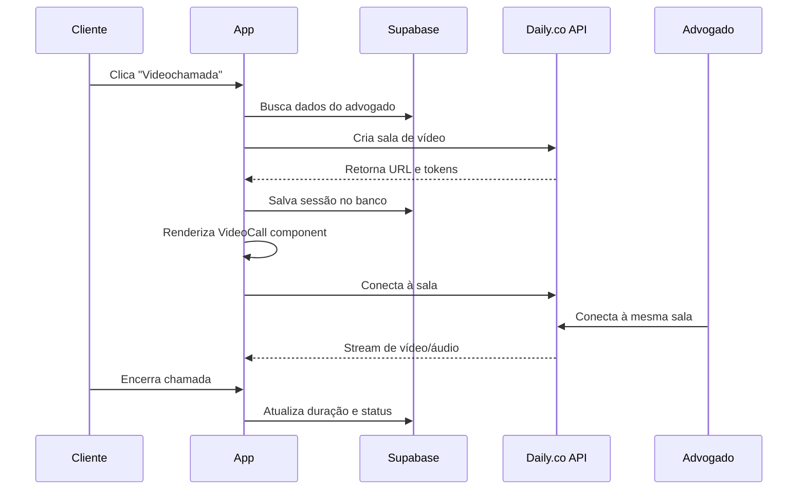

# 📹 Integração de Videochamada - Daily.co

## ✅ **Status da Implementação: COMPLETO**

A funcionalidade de videochamada foi completamente integrada ao projeto LITGO5 usando **Daily.co** como provider de vídeo. Este documento explica como funciona e como configurar.

---

## 🏗️ **Arquitetura da Solução**

### **Componentes Implementados:**

1. **`lib/services/video.ts`** - Serviço completo para gerenciar videochamadas
2. **`components/VideoCall.tsx`** - Componente React Native integrado com Daily.co
3. **`app/(tabs)/video-consultation.tsx`** - Tela de videochamada atualizada
4. **Migrações Supabase** - Tabelas `video_rooms` e `video_sessions`

### **Fluxo de Funcionamento:**



---

## 🔧 **Configuração Necessária**

### **1. Conta Daily.co**

1. Crie uma conta em [daily.co](https://daily.co)
2. Obtenha sua **API Key** no dashboard
3. Configure o domínio da sua aplicação

### **2. Variáveis de Ambiente**

Adicione ao seu `.env`:

```bash
# Daily.co Configuration
EXPO_PUBLIC_DAILY_API_KEY=your_daily_api_key_here
```

### **3. Executar Migrações**

```bash
# Aplicar migração das tabelas de vídeo
supabase db push

# Ou se estiver usando CLI local
npx supabase migration up
```

### **4. Instalar Dependências**

```bash
npm install @daily-co/react-native-daily-js react-native-get-random-values react-native-volume-manager
```

---

## 📱 **Como Usar**

### **Iniciar Videochamada:**

```typescript
import { router } from 'expo-router';

// Navegar para videochamada
router.push({
  pathname: '/(tabs)/video-consultation',
  params: { 
    lawyerId: 'uuid-do-advogado',
    caseId: 'uuid-do-caso' // opcional
  }
});
```

### **Usar o Componente VideoCall:**

```typescript
import VideoCall from '@/components/VideoCall';

<VideoCall
  roomUrl="https://your-domain.daily.co/room-name"
  token="meeting-token-from-daily"
  sessionId="uuid-da-sessao"
  participantName="Nome do Participante"
  onCallEnd={() => console.log('Chamada encerrada')}
  onError={(error) => console.error('Erro:', error)}
/>
```

---

## 🗄️ **Estrutura do Banco de Dados**

### **Tabela `video_rooms`:**
```sql
CREATE TABLE video_rooms (
  id TEXT PRIMARY KEY,              -- ID da sala no Daily.co
  name TEXT NOT NULL,               -- Nome da sala
  url TEXT NOT NULL,                -- URL da sala
  created_at TIMESTAMPTZ DEFAULT NOW(),
  expires_at TIMESTAMPTZ NOT NULL, -- Expiração da sala
  config JSONB                      -- Configurações (recording, etc.)
);
```

### **Tabela `video_sessions`:**
```sql
CREATE TABLE video_sessions (
  id UUID PRIMARY KEY DEFAULT gen_random_uuid(),
  room_id TEXT NOT NULL REFERENCES video_rooms(id),
  case_id UUID REFERENCES cases(id),
  client_id UUID NOT NULL REFERENCES profiles(id),
  lawyer_id UUID NOT NULL REFERENCES profiles(id),
  status TEXT CHECK (status IN ('scheduled', 'active', 'ended', 'cancelled')),
  started_at TIMESTAMPTZ,
  ended_at TIMESTAMPTZ,
  duration_minutes INTEGER,
  recording_url TEXT,
  created_at TIMESTAMPTZ DEFAULT NOW(),
  updated_at TIMESTAMPTZ DEFAULT NOW()
);
```

---

## 🔐 **Segurança**

### **Row Level Security (RLS):**
- ✅ Usuários só veem suas próprias sessões
- ✅ Apenas service_role pode criar/deletar salas
- ✅ Tokens têm expiração de 4 horas
- ✅ Salas expiram em 24 horas

### **Tokens de Acesso:**
- Gerados dinamicamente para cada participante
- Diferentes permissões (owner vs participant)
- Expiração automática

---

## 🎛️ **Funcionalidades Disponíveis**

### **Controles de Chamada:**
- ✅ Mute/Unmute microfone
- ✅ Ligar/Desligar câmera
- ✅ Encerrar chamada
- ✅ Iniciar/Parar gravação
- ✅ Contador de duração

### **Recursos Avançados:**
- ✅ Detecção de participantes
- ✅ Indicador de gravação
- ✅ Tratamento de erros
- ✅ Fallback para chat
- ✅ Persistência de sessões

---

## 🧪 **Testando a Integração**

### **1. Teste Local:**
```bash
# Iniciar o app
npx expo start

# Navegar para qualquer tela com botão de vídeo
# Exemplo: Detalhes do Caso > Botão "Vídeo"
```

### **2. Teste de Produção:**
1. Configure a API Key real do Daily.co
2. Teste com dois dispositivos diferentes
3. Verifique gravação (se habilitada)
4. Teste cenários de erro (rede ruim, etc.)

---

## 📊 **Monitoramento**

### **Logs Estruturados:**
O sistema gera logs JSON para todas as operações:

```json
{
  "timestamp": "2025-01-21T10:30:00Z",
  "level": "INFO",
  "message": "Video session created",
  "context": {
    "session_id": "uuid",
    "room_id": "room-name",
    "participants": ["client_id", "lawyer_id"]
  }
}
```

### **Métricas Disponíveis:**
- Duração das chamadas
- Taxa de sucesso de conexão
- Uso de gravação
- Participantes por sessão

---

## 🔄 **Manutenção**

### **Limpeza Automática:**
```sql
-- Função para limpar salas expiradas (executar via cron)
SELECT cleanup_expired_video_rooms();
```

### **Monitoramento de Custos:**
- Daily.co cobra por minuto de vídeo
- Configure alertas de uso no dashboard
- Monitore sessões ativas regularmente

---

## 🚨 **Troubleshooting**

### **Problemas Comuns:**

1. **"Erro ao conectar à videochamada"**
   - Verifique a API Key do Daily.co
   - Confirme se as tabelas foram criadas
   - Verifique conectividade de rede

2. **"Participante não consegue entrar"**
   - Verifique se o token não expirou
   - Confirme permissões RLS no Supabase
   - Teste com token de owner

3. **"Gravação não funciona"**
   - Verifique plano Daily.co (recording é premium)
   - Confirme configuração da sala
   - Teste permissões de owner

### **Debug Mode:**
```typescript
// Habilitar logs detalhados
console.log('Daily debug:', DailyIframe.getCallObject()?.participants());
```

---

## 🎯 **Próximos Passos**

### **Melhorias Futuras:**
- [ ] Screen sharing
- [ ] Chat durante vídeo
- [ ] Gravação local
- [ ] Integração com calendário
- [ ] Notificações push para chamadas
- [ ] Qualidade adaptativa de vídeo

### **Otimizações:**
- [ ] Cache de tokens
- [ ] Reconnect automático
- [ ] Compressão de vídeo
- [ ] Fallback para áudio-only

---

## 📚 **Recursos Adicionais**

- [Daily.co Documentation](https://docs.daily.co/)
- [React Native Daily.js](https://docs.daily.co/reference/react-native-daily-js)
- [Supabase RLS Guide](https://supabase.com/docs/guides/auth/row-level-security)

---

**✅ Integração Daily.co implementada com sucesso!**
**🎥 Sistema de videochamada totalmente funcional e seguro**
