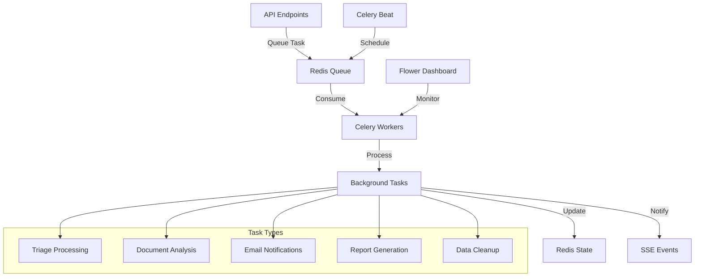

# 🚀 Sprint 3 - Background Processing e Queue Management

## 📋 Objetivos do Sprint

### 1. **Processamento Assíncrono com Celery**
- Migrar operações pesadas para background tasks
- Implementar filas com priorização
- Adicionar retry logic para falhas
- Monitoramento de tarefas em execução

### 2. **Queue Management Inteligente**
- Filas separadas por tipo de tarefa
- Priorização baseada em urgência
- Rate limiting para APIs externas
- Dead letter queue para tarefas falhadas

### 3. **Task Monitoring e Observabilidade**
- Dashboard de status de tarefas
- Métricas de performance
- Alertas para falhas
- Logs estruturados

### 4. **Batch Processing**
- Processamento em lotes para eficiência
- Agendamento de tarefas periódicas
- Cleanup automático de dados antigos

## 🏗️ Arquitetura Proposta

## 📦 Componentes a Implementar

### 1. **CeleryTaskService** (`backend/services/celery_task_service.py`)
- Wrapper para criação de tarefas
- Gestão de prioridades
- Tracking de status
- Retry configuration

### 2. **Background Tasks** (`backend/tasks/`)
- `triage_tasks.py`: Processamento assíncrono de triagem
- `notification_tasks.py`: Envio de emails/notificações
- `analytics_tasks.py`: Geração de relatórios
- `maintenance_tasks.py`: Limpeza e manutenção

### 3. **Task Status Manager** (`backend/services/task_status_manager.py`)
- Armazenamento de status no Redis
- Histórico de execuções
- Métricas de performance
- Interface para consulta

### 4. **Queue Configuration** (`backend/celery_config.py`)
- Configuração de filas
- Roteamento de tarefas
- Políticas de retry
- Rate limiting

### 5. **Monitoring Endpoints** (`backend/routes/tasks_routes.py`)
- GET `/api/tasks/{task_id}`: Status de tarefa
- GET `/api/tasks/stats`: Estatísticas gerais
- POST `/api/tasks/retry/{task_id}`: Retry manual
- GET `/api/tasks/queue/{queue_name}`: Status da fila

## 🔧 Tarefas de Implementação

### Fase 1: Setup e Configuração Base
1. [ ] Configurar Celery com Redis broker
2. [ ] Implementar CeleryTaskService
3. [ ] Criar estrutura base de tasks
4. [ ] Configurar logging estruturado

### Fase 2: Migração de Operações Pesadas
1. [ ] Migrar processamento de triagem
2. [ ] Implementar task de análise de documentos
3. [ ] Adicionar notificações assíncronas
4. [ ] Criar tasks de geração de relatórios

### Fase 3: Queue Management
1. [ ] Implementar filas prioritárias
2. [ ] Adicionar rate limiting
3. [ ] Configurar dead letter queue
4. [ ] Implementar circuit breaker

### Fase 4: Monitoring e Observabilidade
1. [ ] Criar endpoints de monitoramento
2. [ ] Implementar métricas Prometheus
3. [ ] Adicionar dashboard Flower
4. [ ] Configurar alertas

### Fase 5: Batch Processing
1. [ ] Implementar processamento em lotes
2. [ ] Configurar tarefas agendadas
3. [ ] Adicionar cleanup automático
4. [ ] Otimizar performance

## 📊 Métricas de Sucesso

### Performance
- ✅ Latência de enfileiramento < 100ms
- ✅ Throughput > 1000 tasks/min
- ✅ Taxa de sucesso > 99%
- ✅ Tempo de retry < 5min

### Confiabilidade
- ✅ Zero perda de tarefas
- ✅ Recovery automático
- ✅ Idempotência garantida
- ✅ Audit trail completo

### Escalabilidade
- ✅ Horizontal scaling de workers
- ✅ Auto-scaling baseado em carga
- ✅ Distribuição eficiente
- ✅ Resource optimization

## 🧪 Estratégia de Testes

### 1. **Testes Unitários**
- Lógica de tasks isolada
- Serialização/deserialização
- Retry logic
- Error handling

### 2. **Testes de Integração**
- Fluxo completo de tarefas
- Integração com Redis
- Notificações SSE
- Estado persistente

### 3. **Testes de Carga**
- Stress testing com múltiplas tarefas
- Comportamento sob falhas
- Recovery testing
- Performance benchmarks

### 4. **Testes E2E**
- Fluxo completo do usuário
- Monitoramento em tempo real
- Retry manual
- Observabilidade

## 🔐 Considerações de Segurança

1. **Isolamento de Tarefas**
   - Sandboxing de execução
   - Timeouts configuráveis
   - Resource limits

2. **Autenticação e Autorização**
   - Validação de permissões
   - Audit logging
   - Rate limiting por usuário

3. **Proteção de Dados**
   - Encriptação em trânsito
   - Sanitização de logs
   - GDPR compliance

## 📈 Benefícios Esperados

### Para o Usuário
- ✅ Resposta instantânea da API
- ✅ Processamento confiável
- ✅ Visibilidade do progresso
- ✅ Retry automático

### Para o Sistema
- ✅ Melhor utilização de recursos
- ✅ Escalabilidade horizontal
- ✅ Resiliência a falhas
- ✅ Observabilidade completa

### Para o Desenvolvimento
- ✅ Código mais limpo
- ✅ Separação de responsabilidades
- ✅ Facilidade de manutenção
- ✅ Debugging melhorado

## 🚀 Cronograma Estimado

- **Fase 1**: 2 horas (Setup base)
- **Fase 2**: 3 horas (Migração de operações)
- **Fase 3**: 2 horas (Queue management)
- **Fase 4**: 2 horas (Monitoring)
- **Fase 5**: 1 hora (Batch processing)

**Total estimado**: 10 horas de implementação

## 📝 Próximos Passos

1. Começar com a implementação do CeleryTaskService
2. Criar primeira task assíncrona (triagem)
3. Implementar monitoramento básico
4. Adicionar testes de integração
5. Expandir para outras operações

---

**🎯 Objetivo Final**: Sistema de processamento em background robusto, escalável e observável que melhora significativamente a performance e confiabilidade da aplicação. 