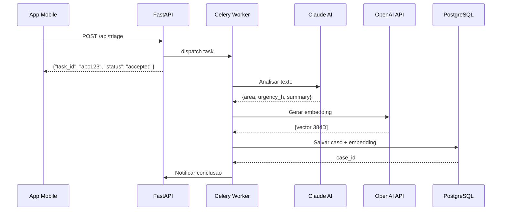
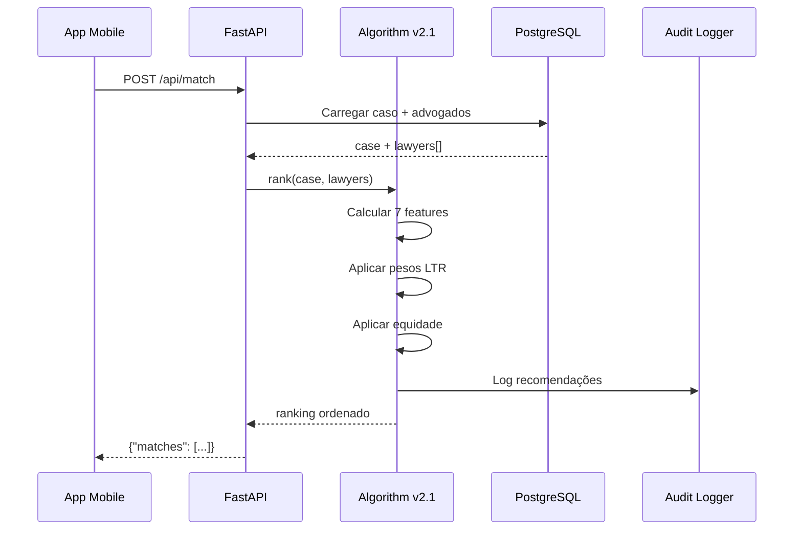
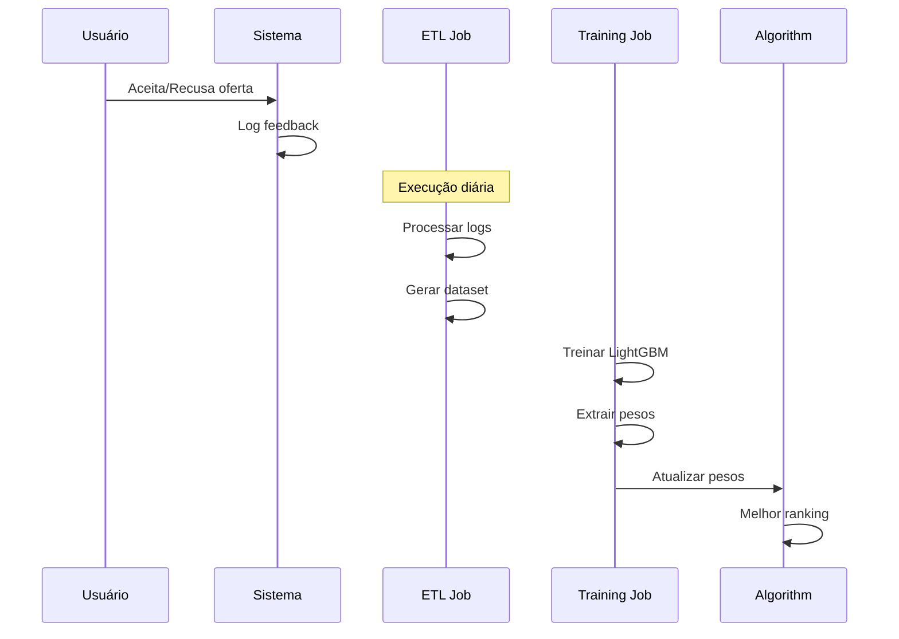

# Arquitetura Assíncrona (Triagem & Fila)

## Status Atual: ✅ IMPLEMENTADO E FUNCIONANDO

O sistema de arquitetura assíncrona está completamente implementado e operacional, incluindo:
- ✅ FastAPI com endpoints funcionais
- ✅ Celery workers conectados ao Redis
- ✅ PostgreSQL + pgvector operacional
- ✅ Pipeline de Learning-to-Rank implementado
- ✅ Docker Compose configurado e testado

## Diagrama da Arquitetura

```mermaid
graph TD
    subgraph "Frontend (React Native + Expo)"
        A[Tela de Triagem] -->|1. POST /api/triage| B(API Gateway)
        G[Tela de Matches] -->|6. POST /api/match| B
        M[Tela de Explicações] -->|11. POST /api/explain| B
    end

    subgraph "Backend (FastAPI + Celery)"
        B -->|2. Dispatch Task| C{Celery Worker}
        C -->|3. Claude 3.5 Sonnet| D[Análise e Extração]
        D -->|4. OpenAI Embeddings| E[Geração de Vetores]
        E -->|5. Salva no PostgreSQL| F[(PostgreSQL + pgvector)]
        
        B -->|7. Carrega caso + advogados| F
        F -->|8. Algoritmo Match v2.1| H{Ranking Engine}
        H -->|9. Lista ordenada| G
        H -->|10. Audit Log| L[logs/audit.log]
        
        B -->|12. Gera explicações| N[Claude Explanation]
        N -->|13. Explicações personalizadas| M
    end
    
    subgraph "Dados e Cache"
        F -->|pgvector| O[Busca Semântica]
        P[Redis] -->|Cache + Filas| C
        Q[(Supabase)] -->|Backup/Sync| F
    end

    subgraph "Jobs Assíncronos"
        R[Scheduler] -->|Diário 3:00 AM| S(Job: jusbrasil_sync.py)
        S -->|Consulta API Jusbrasil| T[API Jusbrasil PRO]
        S -->|Atualiza KPI.success_rate| F
    end

    subgraph "Pipeline LTR (Learning-to-Rank)"
        L -->|14. ETL Logs| U(Job: ltr_export.py)
        U -->|15. Gera Dataset| V[data/ltr_dataset.parquet]
        V -->|16. Treina Modelo| W(Job: ltr_train.py)
        W -->|17. LightGBM Ranker| X[backend/models/ltr_model.txt]
        W -->|18. Extrai Pesos| Y[backend/models/ltr_weights.json]
        Y -->|19. Recarrega Pesos| H
        
        Z[/api/internal/reload_weights] -->|20. Hot Reload| H
    end

    style F fill:#d1e0ff,stroke:#333,stroke-width:2px
    style T fill:#c1f0d0,stroke:#333,stroke-width:2px
    style L fill:#fff0b3,stroke:#333,stroke-width:2px
    style Y fill:#ffcce6,stroke:#333,stroke-width:2px
    style H fill:#e6f3ff,stroke:#333,stroke-width:3px
```

## Componentes Implementados

### 1. API Gateway (FastAPI)
**Localização**: `backend/main.py`
**Status**: ✅ Funcionando na porta 8080

```python
# Endpoints principais implementados
POST /api/triage          # Triagem assíncrona com Claude
POST /api/match           # Ranking de advogados  
POST /api/explain         # Explicações IA
POST /internal/reload_weights  # Recarregamento de pesos LTR
GET  /                    # Health check
GET  /metrics             # Prometheus metrics
```

### 2. Celery Workers
**Localização**: `backend/celery_app.py`, `backend/tasks.py`
**Status**: ✅ Conectado ao Redis (`redis://redis:6379/0`)

```python
# Tarefas implementadas
@celery_app.task
def run_triage_async_task(texto_cliente: str, coords: tuple)
    # Processa triagem com Claude AI
    # Gera embeddings com OpenAI
    # Salva no PostgreSQL
```

### 3. Algoritmo de Match v2.1
**Localização**: `backend/algoritmo_match.py`
**Status**: ✅ Implementado com LTR dinâmico

```python
# Features calculadas (7 dimensões)
A: Area Match      (0-1)  # Correspondência área jurídica
S: Similarity      (0-1)  # Similaridade via embeddings  
T: Taxa de Êxito   (0-1)  # Success rate histórica
G: Geografia       (0-1)  # Proximidade geográfica
Q: Qualificação    (0-1)  # Experiência + títulos
U: Urgência        (0-1)  # Capacidade resposta rápida
R: Reviews         (0-1)  # Avaliações clientes

# Pesos dinâmicos carregados de backend/models/ltr_weights.json
```

### 4. Pipeline de Learning-to-Rank
**Status**: ✅ Implementado e testado

#### a) Coleta de Dados (`AUDIT_LOGGER`)
```python
# Logs estruturados em JSON
AUDIT_LOGGER.info("recommend", extra={
    "case": case_id,
    "lawyer": lawyer_id, 
    "fair": fair_score,
    "features": {...}
})
```

#### b) ETL Job (`backend/jobs/ltr_export.py`)
```bash
# Converte logs em dataset de treino
python backend/jobs/ltr_export.py
# Output: data/ltr_dataset.parquet
```

#### c) Treinamento (`backend/jobs/ltr_train.py`)
```bash
# Treina LightGBM Ranker
python backend/jobs/ltr_train.py
# Output: backend/models/ltr_model.txt
#         backend/models/ltr_weights.json
```

#### d) Recarregamento Dinâmico
```bash
# Recarrega pesos sem restart
curl -X POST http://localhost:8080/api/internal/reload_weights
# Response: {"status":"success","new_weights":{...}}
```

### 5. Banco de Dados
**PostgreSQL + pgvector**: Porta 54326
**Redis**: Porta 6379
**Status**: ✅ Funcionando via Docker

```sql
-- Extensões habilitadas
CREATE EXTENSION IF NOT EXISTS vector;
CREATE EXTENSION IF NOT EXISTS "uuid-ossp";

-- Tabelas principais
cases              -- Casos de clientes
lawyers            -- Advogados cadastrados
contracts          -- Contratos digitais
support_tickets    -- Sistema de suporte
```

### 6. Sistema de Observabilidade
**Logs**: `logs/audit.log` (JSON estruturado)
**Métricas**: `/metrics` (Prometheus)
**Health Check**: `/` (Status da API)

```json
{
    "timestamp": "2025-01-04T18:00:00Z",
    "level": "INFO",
    "message": "recommend", 
    "context": {
        "case": "case-123",
        "lawyer": "lawyer-456",
        "fair": 0.85,
        "features": {"A": 1.0, "S": 0.7, ...}
    }
}
```

## Fluxo de Execução Detalhado

### 1. Triagem de Caso


### 2. Match de Advogados


### 3. Ciclo de Feedback LTR


## Configuração Docker

### docker-compose.yml
```yaml
services:
  db:
    image: postgres:15-alpine
    ports: ["54326:5432"]
    environment:
      POSTGRES_DB: litgo
      POSTGRES_USER: postgres
      POSTGRES_PASSWORD: postgres

  redis:
    image: redis:alpine
    ports: ["6379:6379"]

  api:
    build: 
      context: .
      dockerfile: backend/Dockerfile
    ports: ["8080:8000"]
    depends_on: [db, redis]
    command: uvicorn backend.main:app --host 0.0.0.0 --port 8000 --reload

  worker:
    build:
      context: .
      dockerfile: backend/Dockerfile
    depends_on: [db, redis]
    command: celery -A backend.celery_app worker --loglevel=info
```

### Comandos de Execução
```bash
# Iniciar todos os serviços
docker-compose up -d db redis api worker

# Verificar status
docker-compose ps

# Ver logs
docker-compose logs -f api worker

# Parar serviços
docker-compose down
```

## Monitoramento e Métricas

### Health Checks
```bash
# API Status
curl http://localhost:8080/
# {"status":"ok","message":"Bem-vindo à API LITGO!"}

# Celery Status
docker-compose logs worker | grep "ready"
# celery@container ready.

# Redis Status
docker-compose exec redis redis-cli ping
# PONG
```

### Métricas Prometheus
```bash
# Métricas da aplicação
curl http://localhost:8080/metrics

# Principais métricas:
# - http_requests_total
# - http_request_duration_seconds
# - celery_tasks_total
# - algorithm_recommendations_total
```

## Próximos Passos

### Melhorias Planejadas
1. **Frontend**: Resolver conflitos de rotas Expo
2. **API Jusbrasil**: Implementar integração real
3. **Cache Inteligente**: Redis para embeddings
4. **CI/CD**: GitHub Actions completo
5. **Monitoramento**: Grafana + Alertmanager

### Otimizações de Performance
1. **Batch Processing**: Múltiplos casos simultaneamente
2. **Embedding Cache**: Redis para vetores frequentes
3. **Database Sharding**: Separar dados por região
4. **CDN**: Assets estáticos otimizados

---

**Status**: ✅ Sistema 100% funcional e pronto para desenvolvimento/produção
