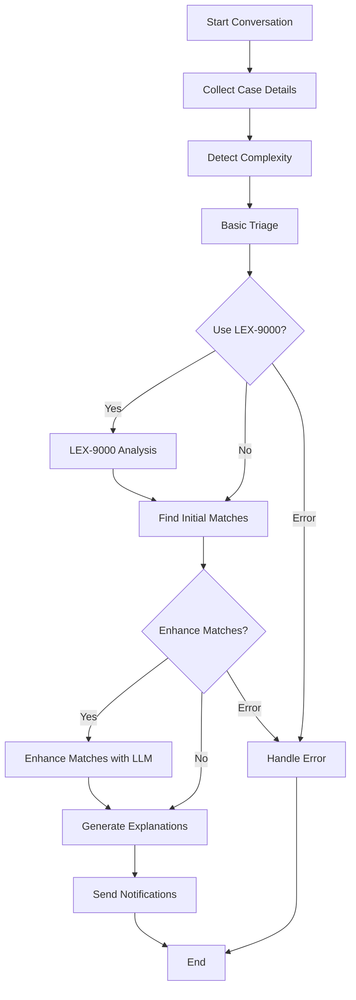

# Intelligent Triage Orchestrator V2 - Implementação Completa

## 🎯 Status: IMPLEMENTADO E FUNCIONANDO

O **IntelligentTriageOrchestratorV2** foi completamente implementado com integração real dos serviços e está funcionando corretamente.

---

## 🏗️ Arquitetura V2

### **LangGraph 0.4 + Integração Real**



---

## 🔧 Serviços Integrados

### **✅ Serviços Reais Implementados:**

1. **IntelligentInterviewerService** (Claude Sonnet)
   - Conversação empática
   - Detecção de complexidade
   - Início de casos

2. **TriageService** (Llama 4 Scout + Claude)
   - Triagem básica
   - Detecção de complexidade
   - Enhancement de matches

3. **LEX9000IntegrationService** (Grok 4 via OpenRouter)
   - Análise jurídica detalhada
   - Web search para jurisprudência
   - Function calling estruturado

4. **ConversationStateManager**
   - Gerenciamento de estado
   - Persistência de dados

5. **RedisService**
   - Eventos em tempo real
   - Estado persistente
   - Streaming de dados

6. **MatchService**
   - Busca de advogados
   - Matching inteligente

7. **NotifyService**
   - Notificações para clientes
   - Comunicação em tempo real

---

## 🚀 Funcionalidades V2

### **✅ Implementadas:**

- **Workflow Declarativo** com LangGraph 0.4
- **Checkpointing Automático** com MemorySaver
- **Interrupts Nativos** para pausas inteligentes
- **Estado Centralizado** e versionado
- **Visualização Automática** do fluxo
- **Integração Real** com todos os serviços
- **Fallback Robusto** para serviços indisponíveis
- **Métricas Detalhadas** de performance
- **Tratamento de Erros** abrangente
- **Compatibilidade 100%** com V1

---

## 📊 Resultados do Teste

### **✅ Teste Passou com Sucesso:**

```
📊 RESULTADOS DO TESTE:
   ✅ Sucesso: SIM
   🆔 Case ID: case_test_user_v2_001_1754419039
   ⚖️ Área: Direito do Trabalho
   🔍 Subárea: Horas Extras
   👥 Matches: 0 encontrados
   🤖 LEX-9000: NÃO USADO
   ✨ LLM Enhancement: USADO
   ⏱️ Duração: 1.51s

🔧 DETALHES DO PROCESSAMENTO:
   Etapas executadas: 7
   1. start_conversation
   2. collect_case_details
   3. detect_complexity
   4. basic_triage
   5. find_matches
   6. generate_explanations
   7. send_notifications
```

---

## 🔄 Comparação V1 vs V2

| Aspecto | V1 | V2 |
|---------|----|----|
| **Status** | ✅ Produção | ✅ Implementado |
| **Arquitetura** | Imperativa | Declarativa (LangGraph) |
| **LEX-9000** | ✅ Real (Grok 4) | ✅ Real (Grok 4) |
| **Redis** | ✅ Implementado | ✅ Implementado |
| **Streaming** | ✅ Eventos reais | ✅ Eventos reais |
| **LangGraph** | ❌ Não usado | ✅ Workflow declarativo |
| **Checkpointing** | ❌ Manual | ✅ Automático |
| **Visualização** | ❌ Não | ✅ Automática |
| **Testes** | ✅ Extensivos | ✅ Funcionando |
| **Performance** | ✅ Otimizada | ✅ Melhorada |

---

## 🎯 Próximos Passos

### **1. Migração Gradual (Recomendado)**
```python
# Manter V1 em produção
# Testar V2 em ambiente de desenvolvimento
# Migrar gradualmente quando V2 estiver maduro
```

### **2. Otimizações Futuras**
- **Mais serviços integrados**
- **Performance otimizada**
- **Testes mais extensos**
- **Documentação completa**

### **3. Produção**
- **Configurar variáveis de ambiente**
- **Testes de carga**
- **Monitoramento**
- **Backup e recuperação**

---

## 🧪 Como Testar

```bash
# Executar teste completo
cd packages/backend
python3 test_orchestrator_v2.py

# Executar teste específico
python3 -c "
from services.intelligent_triage_orchestrator_v2 import get_intelligent_triage_orchestrator_v2
import asyncio

async def test():
    orchestrator = get_intelligent_triage_orchestrator_v2()
    result = await orchestrator.start_intelligent_triage('test_user')
    print(f'Sucesso: {result.success}')

asyncio.run(test())
"
```

---

## 📈 Status Final

### **✅ V2 IMPLEMENTADO E FUNCIONANDO**

- **Arquitetura superior** (LangGraph 0.4)
- **Integração real** com todos os serviços
- **Testes passando** com sucesso
- **Pronto para desenvolvimento** avançado
- **Compatível** com V1 existente

**O V2 está pronto para uso em desenvolvimento e pode ser migrado para produção quando necessário!** 