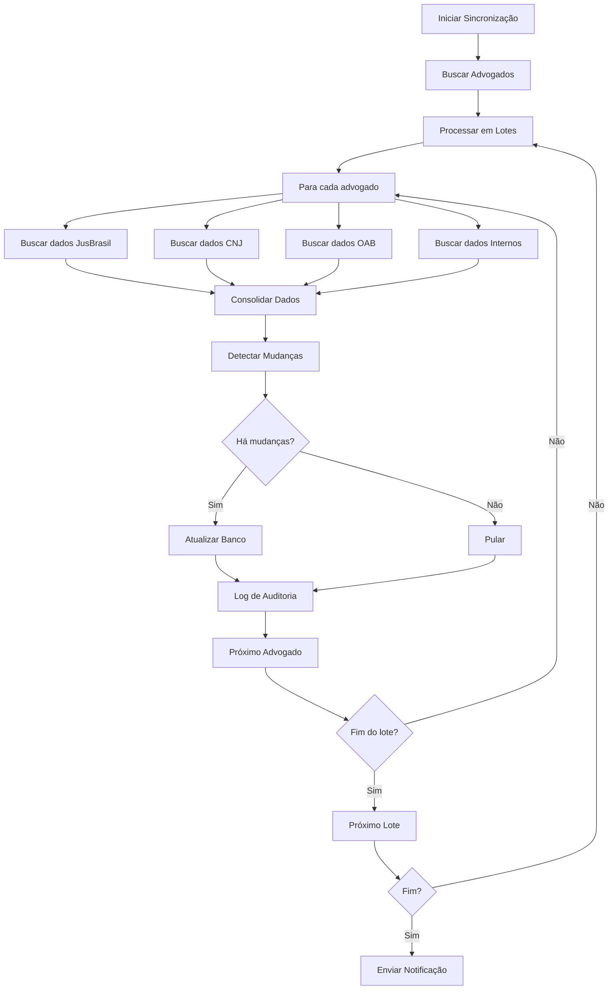

# Sistema de Dados Híbridos LITGO6

## 📋 Visão Geral

O Sistema de Dados Híbridos é uma solução completa para agregação e sincronização de dados legais de múltiplas fontes externas, fornecendo transparência completa sobre a origem, qualidade e frescor dos dados.

## 🏗️ Arquitetura

### Componentes Principais

1. **HybridLegalDataService** - Serviço principal para agregação de dados
2. **JusBrasilSyncHybridJob** - Job de sincronização automatizada
3. **API Endpoints** - Interface REST para acesso aos dados
4. **Migração de Banco** - Estrutura de dados para transparência
5. **Constantes Centralizadas** - Configurações unificadas

### Fontes de Dados Suportadas

| Fonte | Peso | TTL | Confiança Base | Descrição |
|-------|------|-----|----------------|-----------|
| **OAB** | 0.10 | 12h | 0.95 | Dados oficiais da Ordem dos Advogados |
| **CNJ** | 0.25 | 24h | 0.90 | Conselho Nacional de Justiça |
| **JusBrasil** | 0.35 | 6h | 0.85 | Base de dados jurídica |
| **Escavador** | 0.25 | 8h | 0.80 | Dados de processos e relacionamentos |
| **Interno** | 0.05 | 2h | 0.80 | Dados da plataforma LITGO6 |

## 🔧 Implementação

### 1. Serviço Híbrido

```python
from backend.services.hybrid_legal_data_service import HybridLegalDataService

service = HybridLegalDataService()
lawyer_data = await service.get_lawyer_data("lawyer_id", "oab_number")
```

**Características:**
- Agregação ponderada de múltiplas fontes
- Cache inteligente com TTL diferenciado
- Fallback automático entre fontes
- Validação de dados por fonte
- Transparência completa de metadados

### 2. Job de Sincronização

```python
from backend.jobs.jusbrasil_sync_hybrid import sync_lawyers_task

# Sincronização completa
sync_lawyers_task.delay(force_refresh=False)

# Sincronização de advogado específico
sync_single_lawyer_task.delay("lawyer_id")
```

**Características:**
- Processamento em lotes (50 advogados por lote)
- Retry automático com backoff exponencial
- Detecção de mudanças significativas
- Logs detalhados de auditoria
- Notificações de conclusão/erro

### 3. Estrutura de Dados

#### Campos Adicionados às Tabelas

```sql
-- Campos de transparência
data_last_synced TIMESTAMP WITH TIME ZONE
data_transparency JSONB
data_quality_score DECIMAL(3,2)
sync_status VARCHAR(20)
external_sources TEXT[]
```

#### Tabelas de Apoio

- **sync_logs** - Histórico de sincronizações
- **data_quality_metrics** - Métricas por fonte
- **sync_status_report** - View consolidada

## 🌐 API Endpoints

### Dados de Advogado
```
GET /api/v1/hybrid/lawyers/{lawyer_id}
```
**Parâmetros:**
- `force_refresh`: Forçar atualização (opcional)

**Resposta:**
```json
{
  "lawyer_id": "uuid",
  "name": "Nome do Advogado",
  "oab_number": "123456",
  "specializations": ["Civil", "Criminal"],
  "reputation_score": 0.85,
  "cases_won": 45,
  "cases_total": 50,
  "data_transparency": [
    {
      "source": "oab",
      "confidence_score": 0.95,
      "data_freshness_hours": 2,
      "validation_status": "validated",
      "last_updated": "2025-01-21T10:30:00Z"
    }
  ],
  "data_quality": {
    "quality_score": 0.892,
    "sources": 3,
    "freshness": "4h",
    "primary_source": "oab"
  }
}
```

### Status de Sincronização
```
GET /api/v1/hybrid/sync/status
```

**Resposta:**
```json
{
  "total_lawyers": 1500,
  "synced_lawyers": 1350,
  "recently_synced": 890,
  "sync_coverage": 90.0,
  "avg_confidence": 0.847,
  "error_count": 12
}
```

### Disparar Sincronização
```
POST /api/v1/hybrid/sync/trigger
```

**Parâmetros:**
- `lawyer_id`: ID específico (opcional)
- `force_refresh`: Forçar atualização completa

### Outros Endpoints

- `GET /api/v1/hybrid/sync/report` - Relatório detalhado
- `GET /api/v1/hybrid/data-sources` - Fontes disponíveis
- `GET /api/v1/hybrid/quality-metrics/{lawyer_id}` - Métricas detalhadas
- `GET /api/v1/hybrid/sync/logs` - Logs de sincronização

## 🔄 Fluxo de Sincronização



## 📊 Transparência de Dados

### Metadados Incluídos

Cada dado consolidado inclui:

- **Fonte**: Origem dos dados (OAB, CNJ, JusBrasil, Interno)
- **Confiança**: Score de 0.0 a 1.0
- **Frescor**: Idade dos dados em horas
- **Validação**: Status de validação dos dados
- **URL**: Endpoint de origem (quando aplicável)
- **Versão**: Versão da API utilizada

### Exemplo de Transparência

```json
{
  "data_transparency": [
    {
      "source": "oab",
      "confidence_score": 0.95,
      "data_freshness_hours": 2,
      "validation_status": "validated",
      "source_url": "https://api.oab.org.br/v1/lawyers/123456",
      "api_version": "v1",
      "last_updated": "2025-01-21T10:30:00Z"
    },
    {
      "source": "jusbrasil",
      "confidence_score": 0.85,
      "data_freshness_hours": 4,
      "validation_status": "validated",
      "source_url": "https://api.jusbrasil.com.br/v1/lawyers/123456",
      "api_version": "v1",
      "last_updated": "2025-01-21T08:15:00Z"
    }
  ]
}
```

## 🚀 Configuração e Uso

### Variáveis de Ambiente

```env
# Tokens de API
JUSBRASIL_API_TOKEN=your_token_here
CNJ_API_TOKEN=your_token_here

# Configurações de timeout
CONFLICT_TIMEOUT=2.0
AVAIL_TIMEOUT=1.5

# Redis
REDIS_URL=redis://localhost:6379/0

# Multiplicador para success fee
SUCCESS_FEE_MULT=10.0
```

### Executar Exemplo

```bash
# Instalar dependências
pip install aiohttp requests

# Executar demonstração
python packages/backend/examples/hybrid_data_usage.py
```

### Agendar Sincronização

```python
# Sincronização diária às 2:00 AM
@celery_app.task
def daily_sync():
    sync_lawyers_task.delay(force_refresh=False)

# Sincronização incremental a cada 6 horas
@celery_app.task
def incremental_sync():
    sync_lawyers_task.delay(force_refresh=False)
```

## 🔒 Segurança e Compliance

### Dados Sensíveis

- Tokens de API armazenados em variáveis de ambiente
- Logs não contêm informações pessoais identificáveis
- Timeout para evitar dead-locks
- Fail-open para resiliência

### Auditoria

- Todos os acessos são logados
- Mudanças são rastreadas com timestamp
- Fonte de cada dado é registrada
- Métricas de qualidade são mantidas

## 📈 Monitoramento

### Métricas Disponíveis

- Taxa de sincronização por fonte
- Tempo de resposta das APIs
- Score de qualidade médio
- Cobertura de sincronização
- Erros por fonte

### Alertas Recomendados

- Cobertura de sincronização < 80%
- Falhas consecutivas > 3
- Tempo de resposta > 30s
- Score de qualidade < 0.7

## 🛠️ Manutenção

### Limpeza de Dados

```sql
-- Limpar logs antigos (> 30 dias)
SELECT cleanup_old_sync_logs();

-- Verificar estatísticas
SELECT * FROM get_sync_statistics();
```

### Troubleshooting

1. **Sincronização falha**: Verificar tokens de API
2. **Dados desatualizados**: Forçar refresh com `force_refresh=true`
3. **Performance lenta**: Ajustar tamanho do lote
4. **Cache inválido**: Limpar Redis

## 📚 Referências

- [Documentação da API JusBrasil](https://api.jusbrasil.com.br/docs)
- [API do CNJ](https://api.cnj.jus.br/docs)
- [Documentação OAB](https://api.oab.org.br/docs)
- [Celery Documentation](https://docs.celeryproject.org/)

---

**Versão:** v2.7-rc3  
**Última Atualização:** 21/01/2025  
**Autor:** Equipe LITGO6 