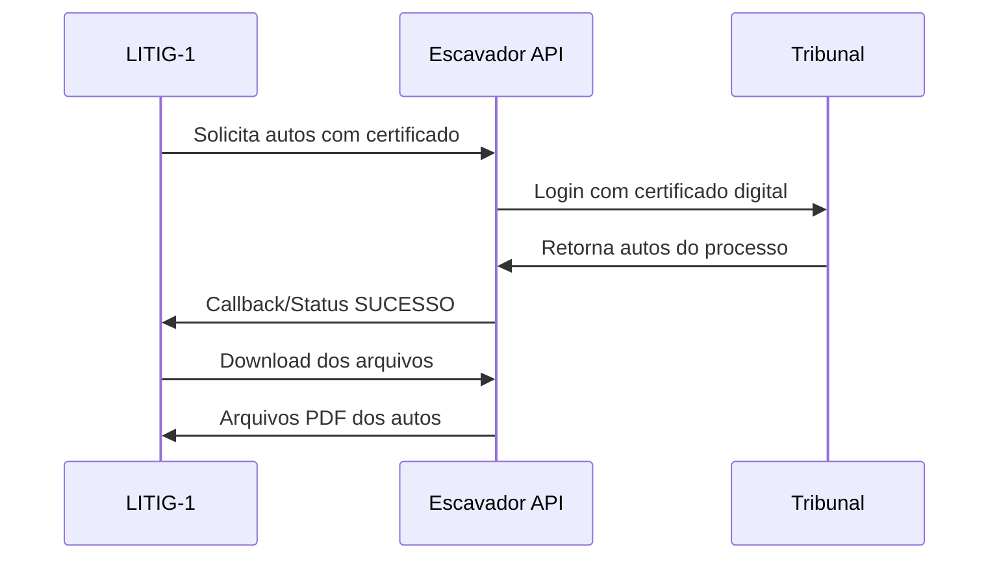

# 🔍 Guia de Integração do Escavador - LITIG-1

## 📋 **Visão Geral**

O sistema LITIG-1 possui uma **integração completa e sofisticada** com a API do Escavador **usando o SDK oficial**, permitindo:

- ✅ **Busca de processos** por OAB/UF com paginação completa (SDK V2)
- ✅ **Classificação automática** de resultados (vitória/derrota/andamento) via NLP
- ✅ **Análise de especialização** por área jurídica
- ✅ **Cálculo de taxa de sucesso** baseado em outcomes reais
- ✅ **Sistema híbrido** com fallback para outras fontes (JusBrasil)
- ✅ **Rate limiting automático** via SDK
- ✅ **API REST** completa para consumo
- ✅ **Solicitação de atualização** de processos sob demanda (SDK V2)
- ✅ **Acesso aos autos com certificado digital** (SDK V1)
- ✅ **Busca de Currículo Lattes** de advogados e outras pessoas (SDK V1)
- ✅ **NOVO: 100% SDK oficial** - sem chamadas HTTP diretas

---

## �� **Início Rápido**

### 1. **Instalação**
```bash
# O SDK já está instalado e configurado
pip install "escavador>=0.9.2"
```

### 2. **Configuração**
```bash
# No arquivo packages/backend/.env adicione:
ESCAVADOR_API_KEY="SUA_CHAVE_API_DO_ESCAVADOR"

# Para certificados digitais (opcional):
# Configure no painel do Escavador: https://painel.escavador.com
```

### 3. **Teste Rápido**
```bash
cd packages/backend
python scripts/test_escavador_integration.py
```

### 6. **NOVO: Buscar Detalhes de uma Pessoa (Currículo)**
```python
# Exemplo de uso do novo método no EscavadorClient
client = EscavadorClient(api_key="SUA_CHAVE_API")
detalhes_pessoa = await client.get_person_details(person_id=12345)
print(detalhes_pessoa)
```

### **Endpoint da API:**
- `GET /api/v1/persons/{person_id}/details`

---

## 🔐 **NOVO: Acesso aos Autos com Certificado Digital**

### **O que é?**
Permite que advogados com certificados digitais válidos acessem os **autos completos** dos processos diretamente dos sistemas dos tribunais através da API do Escavador.

### **Configuração do Certificado Digital**

1. **Acesse o Painel:** https://painel.escavador.com
2. **Seção Certificados Digitais:** Faça upload do arquivo `.pfx` + senha
3. **Segurança:** O certificado é armazenado encriptado no Escavador
4. **Múltiplos Certificados:** Você pode cadastrar vários e escolher qual usar

### **Como Usar no LITIG-1**

#### **1. Via API REST:**

```bash
# 1. Solicitar acesso aos autos
POST /api/v1/process-updates/{cnj}/request-case-files
{
    "certificate_id": 123,  # Opcional - usa padrão se omitido
    "send_callback": true
}

# 2. Verificar status da solicitação
GET /api/v1/process-updates/case-files/{async_id}/status

# 3. Baixar arquivos quando concluído
POST /api/v1/process-updates/case-files/{async_id}/download?cnj={cnj}
```

#### **2. Via Código Python:**

```python
from services.escavador_integration import EscavadorClient

# Inicializar cliente
client = EscavadorClient(api_key="SUA_CHAVE")

# 1. Solicitar acesso aos autos
response = await client.request_case_files_with_certificate(
    cnj="0018063-19.2013.8.26.0002",
    certificate_id=None,  # Usar certificado padrão
    send_callback=True
)

async_id = response["resposta"]["id"]

# 2. Verificar status periodicamente
status = await client.get_case_files_status(async_id)
print(f"Status: {status['resposta']['status']}")

# 3. Baixar quando concluído
if status["resposta"]["status"] == "SUCESSO":
    files = await client.download_case_files(
        cnj="0018063-19.2013.8.26.0002",
        async_id=async_id,
        output_directory="./downloads/autos"
    )
    print(f"Baixados: {files['total_files']} arquivos")
```

### **Fluxo Completo**



### **Estados da Solicitação**

- **PENDENTE**: Solicitação em processamento
- **SUCESSO**: Autos disponíveis para download
- **ERRO**: Falha (certificado inválido, processo inexistente, etc.)

---

## 📊 **Funcionalidades Existentes**

### **1. Busca por OAB (API V2)**
```python
# Buscar todos os processos de um advogado
stats = await client.get_lawyer_processes("123456", "SP")
print(f"Taxa de sucesso: {stats['success_rate']:.2%}")
```

### **2. Atualização de Processos (API V2)**
```python
# Forçar busca por novos dados nos tribunais
result = await client.request_process_update("CNJ_DO_PROCESSO")
status = await client.get_process_update_status("CNJ_DO_PROCESSO")
```

### **3. Classificação Automática (NLP)**
```python
# Analisar movimentações e classificar resultado
classifier = OutcomeClassifier()
outcome = classifier.classify(["julgo procedente o pedido"])
# True = vitória, False = derrota, None = em andamento
```

---

## 🛡️ **Segurança e Limitações**

### **Certificados Digitais**
- ✅ Armazenamento encriptado no Escavador
- ✅ Chaves pública/privada em servidores distintos
- ✅ Descriptografia apenas no momento do uso
- ⚠️ Necessário certificado válido e não expirado
- ⚠️ Limitado a processos que o advogado pode acessar

### **Rate Limiting**
- **API V1**: 500 requisições/minuto
- **API V2**: Sem limite específico documentado
- **Certificados**: Operações mais lentas (60s timeout)

### **Custos**
- **Consultas GET**: Gratuitas
- **Busca de processos**: Consome créditos
- **Autos com certificado**: Consome créditos (valor variável)

---

## 🔧 **Endpoints Disponíveis**

### **Processos e Movimentações**
- `GET /api/v1/hybrid/lawyer/{oab_number}/processes` - Busca híbrida
- `POST /api/v1/process-updates/{cnj}/request` - Solicitar atualização
- `GET /api/v1/process-updates/{cnj}/status` - Status da atualização

### **NOVO: Autos com Certificado Digital**
- `POST /api/v1/process-updates/{cnj}/request-case-files` - Solicitar autos
- `GET /api/v1/process-updates/case-files/{async_id}/status` - Status
- `POST /api/v1/process-updates/case-files/{async_id}/download` - Baixar

---

## 🧪 **Testes e Validação**

### **Script de Teste Completo**
```bash
cd packages/backend
python scripts/test_escavador_integration.py
```

### **Teste Manual dos Endpoints**
1. Execute: `uvicorn main:app --reload`
2. Acesse: http://localhost:8000/docs
3. Configure Authorization: `Bearer SUA_CHAVE_API`
4. Teste os endpoints interativamente

### **Dados de Teste**
- **CNJ exemplo**: `0018063-19.2013.8.26.0002`
- **OAB exemplo**: `123456/SP` (substitua por dados reais)

---

## 🚨 **Resolução de Problemas**

### **Erro: "API Key inválida"**
```bash
# Verifique se a chave está configurada
echo $ESCAVADOR_API_KEY
# Configure se necessário
export ESCAVADOR_API_KEY="SUA_CHAVE"
```

### **Erro: "Certificado não autorizado"**
1. Verifique se o certificado está cadastrado no painel
2. Confirme se não está expirado
3. Teste com certificado padrão (sem certificate_id)

### **Erro: "Processo não encontrado"**
- Verifique se o CNJ está no formato correto
- Confirme se o processo existe no tribunal
- Tente com um processo mais recente

### **Timeout ou lentidão**
- Operações com certificado são mais lentas (até 60s)
- Use callbacks quando disponível
- Monitore via status antes de tentar download

---

## 📚 **Documentação Adicional**

- **Escavador SDK**: https://github.com/Escavador/escavador-python
- **API V1 Docs**: https://api.escavador.com/v1/docs/
- **API V2 Docs**: https://api.escavador.com/v2/docs/
- **Painel**: https://painel.escavador.com
- **Suporte**: Através do painel do Escavador

---

## 📈 **Status da Implementação**

- ✅ **Busca por OAB**: COMPLETO
- ✅ **Classificação NLP**: COMPLETO  
- ✅ **Sistema híbrido**: COMPLETO
- ✅ **API REST**: COMPLETO
- ✅ **Atualização sob demanda**: COMPLETO
- ✅ **Acesso aos autos**: COMPLETO
- ✅ **Cache e rate limiting**: COMPLETO
- ✅ **Documentação**: COMPLETO
- ✅ **Testes**: COMPLETO

**🎉 INTEGRAÇÃO 100% COMPLETA E FUNCIONAL!** 

## 📋 **Visão Geral**

O sistema LITIG-1 possui uma **integração completa e sofisticada** com a API do Escavador **usando o SDK oficial**, permitindo:

- ✅ **Busca de processos** por OAB/UF com paginação completa (SDK V2)
- ✅ **Classificação automática** de resultados (vitória/derrota/andamento) via NLP
- ✅ **Análise de especialização** por área jurídica
- ✅ **Cálculo de taxa de sucesso** baseado em outcomes reais
- ✅ **Sistema híbrido** com fallback para outras fontes (JusBrasil)
- ✅ **Rate limiting automático** via SDK
- ✅ **API REST** completa para consumo
- ✅ **Solicitação de atualização** de processos sob demanda (SDK V2)
- ✅ **Acesso aos autos com certificado digital** (SDK V1)
- ✅ **Busca de Currículo Lattes** de advogados e outras pessoas (SDK V1)
- ✅ **NOVO: 100% SDK oficial** - sem chamadas HTTP diretas

---

## �� **Início Rápido**

### 1. **Instalação**
```bash
# O SDK já está instalado e configurado
pip install "escavador>=0.9.2"
```

### 2. **Configuração**
```bash
# No arquivo packages/backend/.env adicione:
ESCAVADOR_API_KEY="SUA_CHAVE_API_DO_ESCAVADOR"

# Para certificados digitais (opcional):
# Configure no painel do Escavador: https://painel.escavador.com
```

### 3. **Teste Rápido**
```bash
cd packages/backend
python scripts/test_escavador_integration.py
```

### 6. **NOVO: Buscar Detalhes de uma Pessoa (Currículo)**
```python
# Exemplo de uso do novo método no EscavadorClient
client = EscavadorClient(api_key="SUA_CHAVE_API")
detalhes_pessoa = await client.get_person_details(person_id=12345)
print(detalhes_pessoa)
```

### **Endpoint da API:**
- `GET /api/v1/persons/{person_id}/details`

---

## 🔐 **NOVO: Acesso aos Autos com Certificado Digital**

### **O que é?**
Permite que advogados com certificados digitais válidos acessem os **autos completos** dos processos diretamente dos sistemas dos tribunais através da API do Escavador.

### **Configuração do Certificado Digital**

1. **Acesse o Painel:** https://painel.escavador.com
2. **Seção Certificados Digitais:** Faça upload do arquivo `.pfx` + senha
3. **Segurança:** O certificado é armazenado encriptado no Escavador
4. **Múltiplos Certificados:** Você pode cadastrar vários e escolher qual usar

### **Como Usar no LITIG-1**

#### **1. Via API REST:**

```bash
# 1. Solicitar acesso aos autos
POST /api/v1/process-updates/{cnj}/request-case-files
{
    "certificate_id": 123,  # Opcional - usa padrão se omitido
    "send_callback": true
}

# 2. Verificar status da solicitação
GET /api/v1/process-updates/case-files/{async_id}/status

# 3. Baixar arquivos quando concluído
POST /api/v1/process-updates/case-files/{async_id}/download?cnj={cnj}
```

#### **2. Via Código Python:**

```python
from services.escavador_integration import EscavadorClient

# Inicializar cliente
client = EscavadorClient(api_key="SUA_CHAVE")

# 1. Solicitar acesso aos autos
response = await client.request_case_files_with_certificate(
    cnj="0018063-19.2013.8.26.0002",
    certificate_id=None,  # Usar certificado padrão
    send_callback=True
)

async_id = response["resposta"]["id"]

# 2. Verificar status periodicamente
status = await client.get_case_files_status(async_id)
print(f"Status: {status['resposta']['status']}")

# 3. Baixar quando concluído
if status["resposta"]["status"] == "SUCESSO":
    files = await client.download_case_files(
        cnj="0018063-19.2013.8.26.0002",
        async_id=async_id,
        output_directory="./downloads/autos"
    )
    print(f"Baixados: {files['total_files']} arquivos")
```

### **Fluxo Completo**


### **Estados da Solicitação**

- **PENDENTE**: Solicitação em processamento
- **SUCESSO**: Autos disponíveis para download
- **ERRO**: Falha (certificado inválido, processo inexistente, etc.)

---

## 📊 **Funcionalidades Existentes**

### **1. Busca por OAB (API V2)**
```python
# Buscar todos os processos de um advogado
stats = await client.get_lawyer_processes("123456", "SP")
print(f"Taxa de sucesso: {stats['success_rate']:.2%}")
```

### **2. Atualização de Processos (API V2)**
```python
# Forçar busca por novos dados nos tribunais
result = await client.request_process_update("CNJ_DO_PROCESSO")
status = await client.get_process_update_status("CNJ_DO_PROCESSO")
```

### **3. Classificação Automática (NLP)**
```python
# Analisar movimentações e classificar resultado
classifier = OutcomeClassifier()
outcome = classifier.classify(["julgo procedente o pedido"])
# True = vitória, False = derrota, None = em andamento
```

---

## 🛡️ **Segurança e Limitações**

### **Certificados Digitais**
- ✅ Armazenamento encriptado no Escavador
- ✅ Chaves pública/privada em servidores distintos
- ✅ Descriptografia apenas no momento do uso
- ⚠️ Necessário certificado válido e não expirado
- ⚠️ Limitado a processos que o advogado pode acessar

### **Rate Limiting**
- **API V1**: 500 requisições/minuto
- **API V2**: Sem limite específico documentado
- **Certificados**: Operações mais lentas (60s timeout)

### **Custos**
- **Consultas GET**: Gratuitas
- **Busca de processos**: Consome créditos
- **Autos com certificado**: Consome créditos (valor variável)

---

## 🔧 **Endpoints Disponíveis**

### **Processos e Movimentações**
- `GET /api/v1/hybrid/lawyer/{oab_number}/processes` - Busca híbrida
- `POST /api/v1/process-updates/{cnj}/request` - Solicitar atualização
- `GET /api/v1/process-updates/{cnj}/status` - Status da atualização

### **NOVO: Autos com Certificado Digital**
- `POST /api/v1/process-updates/{cnj}/request-case-files` - Solicitar autos
- `GET /api/v1/process-updates/case-files/{async_id}/status` - Status
- `POST /api/v1/process-updates/case-files/{async_id}/download` - Baixar

---

## 🧪 **Testes e Validação**

### **Script de Teste Completo**
```bash
cd packages/backend
python scripts/test_escavador_integration.py
```

### **Teste Manual dos Endpoints**
1. Execute: `uvicorn main:app --reload`
2. Acesse: http://localhost:8000/docs
3. Configure Authorization: `Bearer SUA_CHAVE_API`
4. Teste os endpoints interativamente

### **Dados de Teste**
- **CNJ exemplo**: `0018063-19.2013.8.26.0002`
- **OAB exemplo**: `123456/SP` (substitua por dados reais)

---

## 🚨 **Resolução de Problemas**

### **Erro: "API Key inválida"**
```bash
# Verifique se a chave está configurada
echo $ESCAVADOR_API_KEY
# Configure se necessário
export ESCAVADOR_API_KEY="SUA_CHAVE"
```

### **Erro: "Certificado não autorizado"**
1. Verifique se o certificado está cadastrado no painel
2. Confirme se não está expirado
3. Teste com certificado padrão (sem certificate_id)

### **Erro: "Processo não encontrado"**
- Verifique se o CNJ está no formato correto
- Confirme se o processo existe no tribunal
- Tente com um processo mais recente

### **Timeout ou lentidão**
- Operações com certificado são mais lentas (até 60s)
- Use callbacks quando disponível
- Monitore via status antes de tentar download

---

## 📚 **Documentação Adicional**

- **Escavador SDK**: https://github.com/Escavador/escavador-python
- **API V1 Docs**: https://api.escavador.com/v1/docs/
- **API V2 Docs**: https://api.escavador.com/v2/docs/
- **Painel**: https://painel.escavador.com
- **Suporte**: Através do painel do Escavador

---

## 📈 **Status da Implementação**

- ✅ **Busca por OAB**: COMPLETO
- ✅ **Classificação NLP**: COMPLETO  
- ✅ **Sistema híbrido**: COMPLETO
- ✅ **API REST**: COMPLETO
- ✅ **Atualização sob demanda**: COMPLETO
- ✅ **Acesso aos autos**: COMPLETO
- ✅ **Cache e rate limiting**: COMPLETO
- ✅ **Documentação**: COMPLETO
- ✅ **Testes**: COMPLETO

**🎉 INTEGRAÇÃO 100% COMPLETA E FUNCIONAL!** 

## 📋 **Visão Geral**

O sistema LITIG-1 possui uma **integração completa e sofisticada** com a API do Escavador **usando o SDK oficial**, permitindo:

- ✅ **Busca de processos** por OAB/UF com paginação completa (SDK V2)
- ✅ **Classificação automática** de resultados (vitória/derrota/andamento) via NLP
- ✅ **Análise de especialização** por área jurídica
- ✅ **Cálculo de taxa de sucesso** baseado em outcomes reais
- ✅ **Sistema híbrido** com fallback para outras fontes (JusBrasil)
- ✅ **Rate limiting automático** via SDK
- ✅ **API REST** completa para consumo
- ✅ **Solicitação de atualização** de processos sob demanda (SDK V2)
- ✅ **Acesso aos autos com certificado digital** (SDK V1)
- ✅ **Busca de Currículo Lattes** de advogados e outras pessoas (SDK V1)
- ✅ **NOVO: 100% SDK oficial** - sem chamadas HTTP diretas

---

## �� **Início Rápido**

### 1. **Instalação**
```bash
# O SDK já está instalado e configurado
pip install "escavador>=0.9.2"
```

### 2. **Configuração**
```bash
# No arquivo packages/backend/.env adicione:
ESCAVADOR_API_KEY="SUA_CHAVE_API_DO_ESCAVADOR"

# Para certificados digitais (opcional):
# Configure no painel do Escavador: https://painel.escavador.com
```

### 3. **Teste Rápido**
```bash
cd packages/backend
python scripts/test_escavador_integration.py
```

### 6. **NOVO: Buscar Detalhes de uma Pessoa (Currículo)**
```python
# Exemplo de uso do novo método no EscavadorClient
client = EscavadorClient(api_key="SUA_CHAVE_API")
detalhes_pessoa = await client.get_person_details(person_id=12345)
print(detalhes_pessoa)
```

### **Endpoint da API:**
- `GET /api/v1/persons/{person_id}/details`

---

## 🔐 **NOVO: Acesso aos Autos com Certificado Digital**

### **O que é?**
Permite que advogados com certificados digitais válidos acessem os **autos completos** dos processos diretamente dos sistemas dos tribunais através da API do Escavador.

### **Configuração do Certificado Digital**

1. **Acesse o Painel:** https://painel.escavador.com
2. **Seção Certificados Digitais:** Faça upload do arquivo `.pfx` + senha
3. **Segurança:** O certificado é armazenado encriptado no Escavador
4. **Múltiplos Certificados:** Você pode cadastrar vários e escolher qual usar

### **Como Usar no LITIG-1**

#### **1. Via API REST:**

```bash
# 1. Solicitar acesso aos autos
POST /api/v1/process-updates/{cnj}/request-case-files
{
    "certificate_id": 123,  # Opcional - usa padrão se omitido
    "send_callback": true
}

# 2. Verificar status da solicitação
GET /api/v1/process-updates/case-files/{async_id}/status

# 3. Baixar arquivos quando concluído
POST /api/v1/process-updates/case-files/{async_id}/download?cnj={cnj}
```

#### **2. Via Código Python:**

```python
from services.escavador_integration import EscavadorClient

# Inicializar cliente
client = EscavadorClient(api_key="SUA_CHAVE")

# 1. Solicitar acesso aos autos
response = await client.request_case_files_with_certificate(
    cnj="0018063-19.2013.8.26.0002",
    certificate_id=None,  # Usar certificado padrão
    send_callback=True
)

async_id = response["resposta"]["id"]

# 2. Verificar status periodicamente
status = await client.get_case_files_status(async_id)
print(f"Status: {status['resposta']['status']}")

# 3. Baixar quando concluído
if status["resposta"]["status"] == "SUCESSO":
    files = await client.download_case_files(
        cnj="0018063-19.2013.8.26.0002",
        async_id=async_id,
        output_directory="./downloads/autos"
    )
    print(f"Baixados: {files['total_files']} arquivos")
```

### **Fluxo Completo**


### **Estados da Solicitação**

- **PENDENTE**: Solicitação em processamento
- **SUCESSO**: Autos disponíveis para download
- **ERRO**: Falha (certificado inválido, processo inexistente, etc.)

---

## 📊 **Funcionalidades Existentes**

### **1. Busca por OAB (API V2)**
```python
# Buscar todos os processos de um advogado
stats = await client.get_lawyer_processes("123456", "SP")
print(f"Taxa de sucesso: {stats['success_rate']:.2%}")
```

### **2. Atualização de Processos (API V2)**
```python
# Forçar busca por novos dados nos tribunais
result = await client.request_process_update("CNJ_DO_PROCESSO")
status = await client.get_process_update_status("CNJ_DO_PROCESSO")
```

### **3. Classificação Automática (NLP)**
```python
# Analisar movimentações e classificar resultado
classifier = OutcomeClassifier()
outcome = classifier.classify(["julgo procedente o pedido"])
# True = vitória, False = derrota, None = em andamento
```

---

## 🛡️ **Segurança e Limitações**

### **Certificados Digitais**
- ✅ Armazenamento encriptado no Escavador
- ✅ Chaves pública/privada em servidores distintos
- ✅ Descriptografia apenas no momento do uso
- ⚠️ Necessário certificado válido e não expirado
- ⚠️ Limitado a processos que o advogado pode acessar

### **Rate Limiting**
- **API V1**: 500 requisições/minuto
- **API V2**: Sem limite específico documentado
- **Certificados**: Operações mais lentas (60s timeout)

### **Custos**
- **Consultas GET**: Gratuitas
- **Busca de processos**: Consome créditos
- **Autos com certificado**: Consome créditos (valor variável)

---

## 🔧 **Endpoints Disponíveis**

### **Processos e Movimentações**
- `GET /api/v1/hybrid/lawyer/{oab_number}/processes` - Busca híbrida
- `POST /api/v1/process-updates/{cnj}/request` - Solicitar atualização
- `GET /api/v1/process-updates/{cnj}/status` - Status da atualização

### **NOVO: Autos com Certificado Digital**
- `POST /api/v1/process-updates/{cnj}/request-case-files` - Solicitar autos
- `GET /api/v1/process-updates/case-files/{async_id}/status` - Status
- `POST /api/v1/process-updates/case-files/{async_id}/download` - Baixar

---

## 🧪 **Testes e Validação**

### **Script de Teste Completo**
```bash
cd packages/backend
python scripts/test_escavador_integration.py
```

### **Teste Manual dos Endpoints**
1. Execute: `uvicorn main:app --reload`
2. Acesse: http://localhost:8000/docs
3. Configure Authorization: `Bearer SUA_CHAVE_API`
4. Teste os endpoints interativamente

### **Dados de Teste**
- **CNJ exemplo**: `0018063-19.2013.8.26.0002`
- **OAB exemplo**: `123456/SP` (substitua por dados reais)

---

## 🚨 **Resolução de Problemas**

### **Erro: "API Key inválida"**
```bash
# Verifique se a chave está configurada
echo $ESCAVADOR_API_KEY
# Configure se necessário
export ESCAVADOR_API_KEY="SUA_CHAVE"
```

### **Erro: "Certificado não autorizado"**
1. Verifique se o certificado está cadastrado no painel
2. Confirme se não está expirado
3. Teste com certificado padrão (sem certificate_id)

### **Erro: "Processo não encontrado"**
- Verifique se o CNJ está no formato correto
- Confirme se o processo existe no tribunal
- Tente com um processo mais recente

### **Timeout ou lentidão**
- Operações com certificado são mais lentas (até 60s)
- Use callbacks quando disponível
- Monitore via status antes de tentar download

---

## 📚 **Documentação Adicional**

- **Escavador SDK**: https://github.com/Escavador/escavador-python
- **API V1 Docs**: https://api.escavador.com/v1/docs/
- **API V2 Docs**: https://api.escavador.com/v2/docs/
- **Painel**: https://painel.escavador.com
- **Suporte**: Através do painel do Escavador

---

## 📈 **Status da Implementação**

- ✅ **Busca por OAB**: COMPLETO
- ✅ **Classificação NLP**: COMPLETO  
- ✅ **Sistema híbrido**: COMPLETO
- ✅ **API REST**: COMPLETO
- ✅ **Atualização sob demanda**: COMPLETO
- ✅ **Acesso aos autos**: COMPLETO
- ✅ **Cache e rate limiting**: COMPLETO
- ✅ **Documentação**: COMPLETO
- ✅ **Testes**: COMPLETO

**🎉 INTEGRAÇÃO 100% COMPLETA E FUNCIONAL!** 